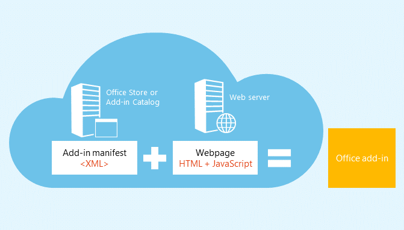
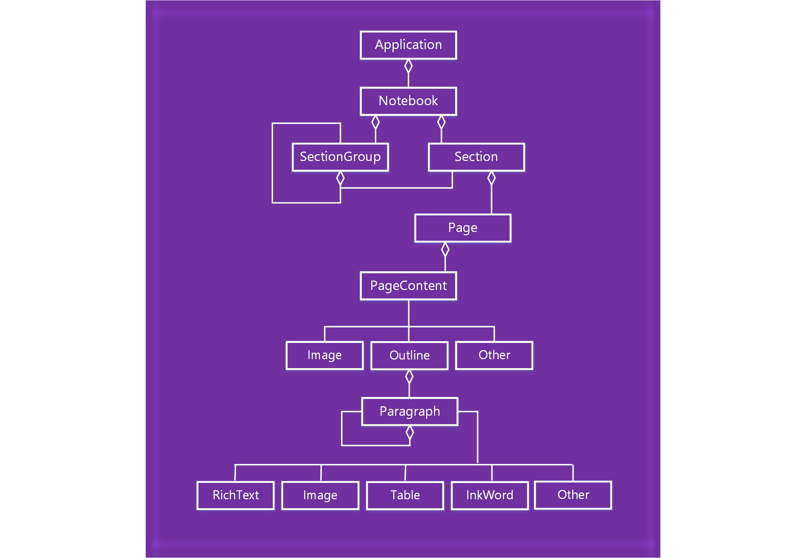

# OneNote JavaScript API programming overview

Transform how users work with their digital notebooks. OneNote add-ins let you create interactive experiences that help people capture ideas, organize information, and collaborate more effectively—all using familiar web technologies like HTML, CSS, and JavaScript.

[!INCLUDE [publish policies note](../includes/note-publish-policies.md)]

## What can you build?

OneNote add-ins open up exciting possibilities for enhancing digital note-taking:

- **Smart content creators**: Build add-ins that generate interactive forms, checklists, or templates that adapt to user needs
- **Research assistants**: Pull in data from external sources and organize it beautifully on OneNote pages
- **Collaboration tools**: Enable real-time feedback, annotations, or project tracking within notebooks
- **Educational aids**: Create grading tools, study guides, or interactive learning materials for students and teachers
- **Business solutions**: Connect with CRM systems, project management tools, or reporting dashboards

The [Rubric Grader sample](https://github.com/OfficeDev/OneNote-Add-in-Rubric-Grader) shows how teachers can streamline grading with interactive rubrics—a perfect example of how add-ins solve real-world problems.

## How OneNote add-ins work

Like all Office Add-ins, OneNote add-ins consist of two main parts that work together seamlessly:

### Your web application

This is where your creativity shines. Build your user interface with HTML, CSS, and JavaScript—just like any web app. Your code runs in a secure browser environment within OneNote, giving you access to powerful APIs for reading and manipulating notebook content.

### The add-in manifest

This configuration file tells OneNote about your add-in—where to find it, what permissions it needs, and how it should appear to users. Think of it as your add-in's business card.



## Working with the OneNote JavaScript API

The OneNote JavaScript API gives you two powerful ways to interact with notebooks:

### Application-specific API: Your gateway to OneNote content

Access OneNote objects like notebooks, sections, and pages through the `Application` object. This API uses an efficient batch processing system:

1. **Get the application context** - Start by accessing the OneNote application
2. **Create proxies** - Set up lightweight representatives of the OneNote objects you want to work with
3. **Queue your operations** - Add commands to read data, make changes, or perform calculations
4. **Execute with context.sync()** - Run all your queued commands efficiently in a single batch

Here's how you might grab all pages from the current section:

```javascript
async function getPagesInSection() {
    await OneNote.run(async (context) => {
        // Get the pages in the current section
        const pages = context.application.getActiveSection().pages;

        // Tell OneNote which properties you need
        pages.load('id,title');

        // Execute the request
        await context.sync();
        
        // Now you can work with the data
        pages.items.forEach(page => {
            console.log(`Page: ${page.title} (ID: ${page.id})`);
        });
    });
}
```

### Common API: Shared functionality across Office

Use familiar Office APIs for basic operations like getting selected text or inserting content. These work the same way across Word, Excel, PowerPoint, and OneNote.

```javascript
function getSelectedText() {
    Office.context.document.getSelectedDataAsync(
        Office.CoercionType.Text,
        function (result) {
            if (result.status === Office.AsyncResultStatus.Succeeded) {
                console.log('Selected text: ' + result.value);
            }
        }
    );
}
```

OneNote add-ins support the most useful Common APIs for text and content manipulation:

| API | What it does |
|:------|:------|
| [getSelectedDataAsync](/javascript/api/office/office.document#office-office-document-getselecteddataasync-member(1)) | Get text or data that users have selected on the page |
| [setSelectedDataAsync](/javascript/api/office/office.document#office-office-document-setselecteddataasync-member(1)) | Insert text, images, or HTML at the current selection |
| [Settings APIs](/javascript/api/office/office.settings) | Store and retrieve add-in preferences (content add-ins only) |
| [Selection events](/javascript/api/office/office.documentselectionchangedeventargs) | Respond when users select different content |

For more details about these shared APIs, see [Common JavaScript API object model](../develop/office-javascript-api-object-model.md).

## API requirement sets

Requirement sets help ensure your add-in works reliably across different versions of OneNote. Specify which OneNote JavaScript API features your add-in needs in your manifest, or check at runtime whether specific APIs are available.

For the complete list of what's supported in each version, see [OneNote JavaScript API requirement sets](/javascript/api/requirement-sets/onenote/onenote-api-requirement-sets).

## OneNote object model

Here's what you can access through the OneNote JavaScript API:

The following diagram represents what's currently available in the OneNote JavaScript API.

  

## Next steps

Ready to start building? Here are your next steps:

- **[Build your first OneNote add-in](../quickstarts/onenote-quickstart.md)** - Get hands-on with a working example
- **[Explore the Rubric Grader sample](https://github.com/OfficeDev/OneNote-Add-in-Rubric-Grader)** - See a real-world add-in in action
- **[Dive into the API reference](../reference/overview/onenote-add-ins-javascript-reference.md)** - Discover all available OneNote objects and methods
- **[Learn about page content](onenote-add-ins-page-content.md)** - Understand how to work with HTML and page structure

## See also

- [Office Add-ins platform overview](../overview/office-add-ins.md)
- [Developing Office Add-ins](../develop/develop-overview.md)
