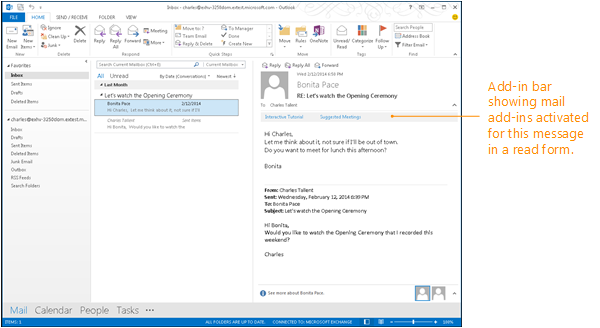

# Activation rules for contextual Outlook add-ins

Outlook activates some types of add-ins if the message or appointment that the user is reading or composing satisfies the activation rules of the add-in. This is true for all add-ins that use the 1.1 manifest schema. The user can then choose the add-in from the Outlook UI to start it for the current item.

[!include[Rule features not supported with JSON manifest](../includes/rules-not-supported-json-note.md)]

The following figure shows Outlook add-ins activated in the add-in bar for the message in the Reading Pane.



## Specify activation rules in a manifest

To have Outlook activate an add-in for specific conditions, specify activation rules in the add-in manifest by using one of the following `Rule` elements.

- [Rule element (MailApp complexType)](/javascript/api/manifest/rule) - Specifies an individual rule.
- [Rule element (RuleCollection complexType)](/javascript/api/manifest/rule#rulecollection) - Combines multiple rules using logical operations.

 > [!NOTE]
 > The `Rule` element that you use to specify an individual rule is of the abstract [Rule](/javascript/api/manifest/rule) complex type. Each of the following types of rules extends this abstract `Rule` complex type. So when you specify an individual rule in a manifest, you must use the [xsi:type](https://www.w3.org/TR/xmlschema-1/) attribute to further define one of the following types of rules.
 >
 > For example, the following rule defines an [ItemIs](/javascript/api/manifest/rule#itemis-rule) rule.
 > `<Rule xsi:type="ItemIs" ItemType="Message" />`
 >
 > The `FormType` attribute applies to activation rules in the manifest v1.1 but is not defined in `VersionOverrides` v1.0. So it can't be used when [ItemIs](/javascript/api/manifest/rule#itemis-rule) is used in the `VersionOverrides` node.

The following table lists the types of rules that are available. You can find more information following the table and in the specified articles under [Create Outlook add-ins for read forms](read-scenario.md).

|**Rule name**|**Applicable forms**|**Description**|
|:-----|:-----|:-----|
|[ItemIs](#itemis-rule)|Read, Compose|Checks to see whether the current item is of the specified type (message or appointment). Can also check the item class and form type.and optionally, item message class.|
|[ItemHasAttachment](#itemhasattachment-rule)|Read|Checks to see whether the selected item contains an attachment.|
|[ItemHasKnownEntity](#itemhasknownentity-rule)|Read|Checks to see whether the selected item contains one or more well-known entities. More information: [Match strings in an Outlook item as well-known entities](match-strings-in-an-item-as-well-known-entities.md).|
|[ItemHasRegularExpressionMatch](#itemhasregularexpressionmatch-rule)|Read|Checks to see whether the sender's email address, the subject, and/or the body of the selected item contains a match to a regular expression.More information: [Use regular expression activation rules to show an Outlook add-in](use-regular-expressions-to-show-an-outlook-add-in.md).|
|[RuleCollection](#rulecollection-rule)|Read, Compose|Combines a set of rules so that you can form more complex rules.|

## ItemIs rule

The `ItemIs` complex type defines a rule that evaluates to `true` if the current item matches the item type, and optionally the item message class if it's stated in the rule.

Specify one of the following item types in the `ItemType` attribute of an `ItemIs` rule. You can specify more than one `ItemIs` rule in a manifest. The ItemType simpleType defines the types of Outlook items that support Outlook add-ins.

|**Value**|**Description**|
|:-----|:-----|
|**Appointment**|Specifies an item in an Outlook calendar. This includes a meeting item that has been responded to and has an organizer and attendees, or an appointment that does not have an organizer or attendee and is simply an item on the calendar. This corresponds to the IPM.Appointment message class in Outlook.|
|**Message**|Specifies one of the following items received in typically the Inbox. <ul><li><p>An email message. This corresponds to the IPM.Note message class in Outlook.</p></li><li><p>A meeting request, response, or cancellation. This corresponds to the following message classes in Outlook.</p><p>IPM.Schedule.Meeting.Request</p><p>IPM.Schedule.Meeting.Neg</p><p>IPM.Schedule.Meeting.Pos</p><p>IPM.Schedule.Meeting.Tent</p><p>IPM.Schedule.Meeting.Canceled</p></li></ul>|

The `FormType` attribute is used to specify the mode (read or compose) in which the add-in should activate.

 > [!NOTE]
 > The ItemIs `FormType` attribute is defined in schema v1.1 and later but not in `VersionOverrides` v1.0. Do not include the `FormType` attribute when defining add-in commands.

After an add-in is activated, you can use the [mailbox.item](/javascript/api/requirement-sets/outlook/preview-requirement-set/office.context.mailbox.item) property to obtain the currently selected item in Outlook, and the [item.itemType](/javascript/api/requirement-sets/outlook/preview-requirement-set/office.context.mailbox.item#properties) property to obtain the type of the current item.

You can optionally use the `ItemClass` attribute to specify the message class of the item, and the `IncludeSubClasses` attribute to specify whether the rule should be `true` when the item is a subclass of the specified class.

For more information about message classes, see [Item Types and Message Classes](/office/vba/outlook/Concepts/Forms/item-types-and-message-classes).

The following example is an `ItemIs` rule that lets users see the add-in in the Outlook add-in bar when the user is reading a message.

```xml
<Rule xsi:type="ItemIs" ItemType="Message" FormType="Read" />
```

The following example is an `ItemIs` rule that lets users see the add-in in the Outlook add-in bar when the user is reading a message or appointment.

```xml
<Rule xsi:type="RuleCollection" Mode="Or">
  <Rule xsi:type="ItemIs" ItemType="Message" FormType="Read" />
  <Rule xsi:type="ItemIs" ItemType="Appointment" FormType="Read" />
</Rule>
```

## ItemHasAttachment rule

The `ItemHasAttachment` complex type defines a rule that checks if the selected item contains an attachment.

```xml
<Rule xsi:type="ItemHasAttachment" />
```

## ItemHasKnownEntity rule

Before an item is made available to an add-in, the server examines it to determine whether the subject and body contain any text that is likely to be one of the known entities. If any of these entities are found, it is placed in a collection of known entities that you access by using the `getEntities` or `getEntitiesByType` method of that item.

You can specify a rule by using `ItemHasKnownEntity` that shows your add-in when an entity of the specified type is present in the item. You can specify the following known entities in the `EntityType` attribute of an `ItemHasKnownEntity` rule.

- Address
- Contact
- EmailAddress
- MeetingSuggestion
- PhoneNumber
- TaskSuggestion
- URL

You can optionally include a regular expression in the `RegularExpression` attribute so that your add-in is only shown when an entity that matches the regular expression in present. To obtain matches to regular expressions specified in `ItemHasKnownEntity` rules, you can use the `getRegExMatches` or `getFilteredEntitiesByName` method for the currently selected Outlook item.

The following example shows a collection of `Rule` elements that show the add-in when one of the specified well-known entities is present in the message.

```xml
<Rule xsi:type="RuleCollection" Mode="Or">
    <Rule xsi:type="ItemHasKnownEntity" EntityType="Address" />
    <Rule xsi:type="ItemHasKnownEntity" EntityType="MeetingSuggestion" />
    <Rule xsi:type="ItemHasKnownEntity" EntityType="TaskSuggestion" />
</Rule>
```

The following example shows an `ItemHasKnownEntity` rule with a `RegularExpression` attribute that activates the add-in when a URL that contains the word "contoso" is present in a message.

```xml
<Rule xsi:type="ItemHasKnownEntity" EntityType="Url" RegularExpression="contoso" />
```

For more information about entities in activation rules, see [Match strings in an Outlook item as well-known entities](match-strings-in-an-item-as-well-known-entities.md).

## ItemHasRegularExpressionMatch rule

The `ItemHasRegularExpressionMatch` complex type defines a rule that uses a regular expression to match the contents of the specified property of an item. If text that matches the regular expression is found in the specified property of the item, Outlook activates the add-in bar and displays the add-in. You can use the `getRegExMatches` or `getRegExMatchesByName` method of the object that represents the currently selected item to obtain matches for the specified regular expression.

The following example shows an `ItemHasRegularExpressionMatch` that activates the add-in when the body of the selected item contains "apple", "banana", or "coconut", ignoring case.

```xml
<Rule xsi:type="ItemHasRegularExpressionMatch" RegExName="fruits" RegExValue="apple|banana|coconut" PropertyName="BodyAsPlaintext" IgnoreCase="true" />
```

For more information about using the `ItemHasRegularExpressionMatch` rule, see [Use regular expression activation rules to show an Outlook add-in](use-regular-expressions-to-show-an-outlook-add-in.md).

## RuleCollection rule

The `RuleCollection` complex type combines multiple rules into a single rule. You can specify whether the rules in the collection should be combined with a logical OR or a logical AND by using the `Mode` attribute.

When a logical AND is specified, an item must match all the specified rules in the collection to show the add-in. When a logical OR is specified, an item that matches any of the specified rules in the collection will show the add-in.

You can combine `RuleCollection` rules to form complex rules. The following example activates the add-in when the user is viewing an appointment or message item and the subject or body of the item contains an address.

```xml
<Rule xsi:type="RuleCollection" Mode="And">
  <Rule xsi:type="RuleCollection" Mode="Or">
    <Rule xsi:type="ItemIs" ItemType="Message" FormType="Read" />
    <Rule xsi:type="ItemIs" ItemType="Appointment" FormType="Read"/>
  </Rule>
  <Rule xsi:type="ItemHasKnownEntity" EntityType="Address" />
</Rule>
```

The following example activates the add-in when the user is composing a message, or when the user is viewing an appointment and the subject or body of the appointment contains an address.

```xml
<Rule xsi:type="RuleCollection" Mode="Or"> 
  <Rule xsi:type="ItemIs" ItemType="Message" FormType="Edit" /> 
  <Rule xsi:type="RuleCollection" Mode="And">
    <Rule xsi:type="ItemIs" ItemType="Appointment" FormType="Read" />
    <Rule xsi:type="ItemHasKnownEntity" EntityType="Address" />
  </Rule> 
</Rule>
```

## Limits for rules and regular expressions

To provide a satisfactory experience with Outlook add-ins, you should adhere to the activation and API usage guidelines. The following table shows general limits for regular expressions and rules but there are specific rules for different applications. For more information, see [Limits for activation and JavaScript API for Outlook add-ins](limits-for-activation-and-javascript-api-for-outlook-add-ins.md) and [Troubleshoot Outlook add-in activation](troubleshoot-outlook-add-in-activation.md).

|**Add-in element**|**Guidelines**|
|:-----|:-----|
|Manifest Size|No larger than 256 KB.|
|Rules|No more than 15 rules.|
|ItemHasKnownEntity|An Outlook rich client will apply the rule against the first 1 MB of the body, and not to the rest of the body.|
|Regular Expressions|For ItemHasKnownEntity or ItemHasRegularExpressionMatch rules for all Outlook applications:<br><ul><li>Specify no more than 5 regular expressions in activation rules for an Outlook add-in. You cannot install an add-in if you exceed that limit.</li><li>Specify regular expressions whose anticipated results are returned by the <b>getRegExMatches</b> method call within the first 50 matches. </li><li>**Important**: Text is highlighted based on strings that result from matching the regular expression. However, the highlighted occurrences may not exactly match what should result from actual regular expression assertions like negative look-ahead `(?!text)`, look-behind `(?<=text)`, and negative look-behind `(?<!text)`. For example, if you use the regular expression `under(?!score)` on "Like under, under score, and underscore", the string "under" is highlighted for all occurrences instead of just the first two.</li><li>Specify regular expressions whose match does not exceed the limits in the following table.<br/><br/><table><tr><th>Limit on length of a regex match</th><th>Outlook rich clients</th><th>Outlook on iOS and Android</th></tr><tr><td>Item body is plain text</td><td>1.5 KB</td><td>3 KB</td></tr><tr><td>Item body it HTML</td><td>3 KB</td><td>3 KB</td></tr></table>|

## See also

- [Create Outlook add-ins for compose forms](compose-scenario.md)
- [Limits for activation and JavaScript API for Outlook add-ins](limits-for-activation-and-javascript-api-for-outlook-add-ins.md)
- [Use regular expression activation rules to show an Outlook add-in](use-regular-expressions-to-show-an-outlook-add-in.md)
- [Match strings in an Outlook item as well-known entities](match-strings-in-an-item-as-well-known-entities.md)
