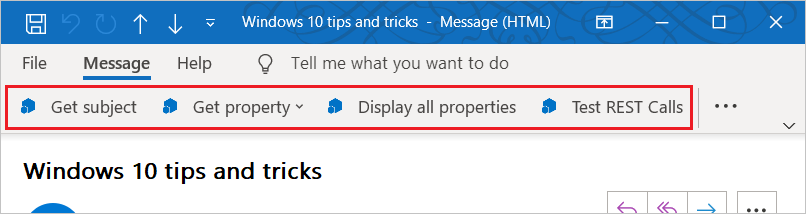
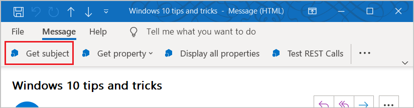
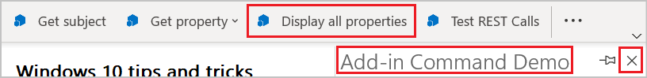

# Add-in commands for Outlook

Outlook add-in commands provide ways to initiate specific add-in actions from the ribbon by adding buttons or drop-down menus. This lets users access add-ins in a simple, intuitive, and unobtrusive way. Because they offer increased functionality in a seamless manner, you can use add-in commands to create more engaging solutions.

> [!NOTE]
> Add-in commands are available only in Outlook 2013 or later on Windows, Outlook 2016 or later on Mac, Outlook on iOS, Outlook on Android, Outlook on the web for Exchange 2016 or later, and Outlook on the web for Microsoft 365 and Outlook.com.
>
> Support for add-in commands in Outlook 2013 requires three updates:
> - [March 8, 2016 security update for Outlook](https://support.microsoft.com/kb/3114829)
> - [March 8, 2016 security update for Office (KB3114816)](https://support.microsoft.com/topic/3d3eb171-78c2-0e61-62a2-85723bc4bcc0)
> - [March 8, 2016 security update for Office (KB3114828)](https://support.microsoft.com/topic/54437016-d1e0-7aac-dbb7-4ecfbd57f5f0)
>
> Support for add-in commands in Exchange 2016 requires [Cumulative Update 5](https://support.microsoft.com/topic/d67d7693-96a4-fb6e-b60b-e64984e267bd).

Add-in commands are only available for add-ins that do not use [ItemHasAttachment, ItemHasKnownEntity, or ItemHasRegularExpressionMatch rules](activation-rules.md) to limit the types of items they activate on. However, [contextual add-ins](contextual-outlook-add-ins.md) can present different commands depending on whether the currently selected item is a message or appointment, and can choose to appear in read or compose scenarios. Using add-in commands if possible is a [best practice](../concepts/add-in-development-best-practices.md).

## Create the add-in command

Add-in commands are declared in the add-in manifest in the [VersionOverrides element](/javascript/api/manifest/versionoverrides). This element is an addition to the manifest schema v1.1 that ensures backward compatibility. In a client that doesn't support **\<VersionOverrides\>**, existing add-ins will continue to function as they did without add-in commands.

The **\<VersionOverrides\>** manifest entries specify many things for the add-in, such as the application, types of controls to add to the ribbon, the text, the icons, and any associated functions.

When an add-in needs to provide status updates, such as progress indicators or error messages, it must do so through the [notification APIs](/javascript/api/outlook/office.notificationmessages). The processing for the notifications must also be defined in a separate HTML file that is specified in the `FunctionFile` node of the manifest.

Developers should define icons for all required sizes so that the add-in commands will adjust smoothly along with the ribbon. The required icon sizes are 80 x 80 pixels, 32 x 32 pixels, and 16 x 16 pixels for desktop, and 48 x 48 pixels, 32 x 32 pixels, and 25 x 25 pixels for mobile.

## How do add-in commands appear?

An add-in command appears on the ribbon as a button or an item in a drop-down menu. When a user installs an add-in, its commands appear in the UI as a group of buttons. This can either be on the ribbon's default tab or on a custom tab. For messages, the default is either the **Home** or **Message** tab. For the calendar, the default is the **Meeting**, **Meeting Occurrence**, **Meeting Series**, or **Appointment** tab. For module extensions,
the default is a custom tab. On the default tab, each add-in can have one ribbon group with up to 6 commands. On custom tabs, the add-in can have up to 10 groups, each with 6 commands. Add-ins are limited to only one custom tab.

As the ribbon gets more crowded, add-in commands will be displayed in the overflow menu. The add-in commands for an add-in are usually grouped together.

When an add-in command is added to an add-in, the add-in name is removed from the app bar. Only the add-in command button on the ribbon remains.

### Modern Outlook on the web

In Outlook on the web, the add-in name is displayed in an overflow menu. If the add-in has multiple add-in commands, you can expand the add-in menu to see the group of buttons labeled with the add-in name.

## What are the types of add-in commands?

The UI for an add-in command consists of a ribbon button or an item in a drop-down menu. There are two types of add-in commands, based on the kind of action that the command triggers.

- **Task pane commands**: The button or menu item opens the add-in's task pane. You add this kind of add-in command with markup in the manifest. The "code behind" the command is provided by Office.
- **Function commands**: The button or menu item runs any arbitrary JavaScript. The code almost always calls APIs in the Office JavaScript Library, but it doesn't have to. This type of add-in typically displays no UI other than the button or menu item itself. Note the following about function commands:

   - The function that is triggered can call the [displayDialogAsync](/javascript/api/office/office.ui#office-office-ui-displaydialogasync-member(1)) method to show a dialog, which is a good way to display an error, show progress, or prompt for input from the user.
   - The JavaScript runtime in which the function command runs is a full browser-based runtime. It can render HTML and call out to the Internet to send or get data.

### Run a function command

Use an add-in command button that executes a JavaScript function for scenarios where the user doesn't need to make any additional selections to initiate the action. This can be for actions such as track, remind me, or print, or scenarios when the user wants more in-depth information from a service.

In module extensions, the add-in command button can execute JavaScript functions that interact with the content in the main user interface.

### Launch a task pane

Use an add-in command button to launch a task pane for scenarios where a user needs to interact with an add-in for a longer period of time. For example, the add-in requires changes to settings or the completion of many fields.

The default width of the vertical task pane is 320 px. The vertical task pane can be resized in both the Outlook Explorer and inspector. The pane can be resized in the same way the to-do pane and list view resize.

 

This screenshot shows an example of a vertical task pane. The pane opens with the name of the add-in command in the top left corner. Users can use the **X** button in the upper-right corner of the pane to close the add-in when they are finished using it. By default, this pane will not persist across messages. Add-ins can [support pinning](pinnable-taskpane.md) for the task pane and receive events when a new message is selected. All UI elements rendered in the task pane, aside from the add-in name and the close button, are provided by the add-in.

If a user chooses another add-in command that opens a task pane, the task pane is replaced with the recently used command. If a user chooses an add-in command button that executes a function, or drop-down menu while the task pane is open, the action will be completed and the task pane will remain open.

### Drop-down menu

A drop-down menu add-in command defines a static list of items. The menu can be any mix of items that execute a function or that open a task pane. Submenus are not supported.

## Where do add-in commands appear in the UI?

Add-in commands are supported for four scenarios:

### Reading a message

When the user is reading a message in the reading pane or in the **Message** tab for a pop-out read form, add-in commands added to the default tab appear on the **Home** tab.

### Composing a message

When the user is composing a message, add-in commands added to the default tab appear on the **Message** tab.

### Creating or viewing an appointment or meeting as the organizer

When creating or viewing an appointment or meeting as the organizer, add-in commands added to the default tab appear on the **Meeting**, **Meeting Occurrence**, **Meeting Series**, or **Appointment** tabs on pop-out forms. However, if the user selects an item in the calendar but doesn't open the pop-out, the add-in's ribbon group won't be visible in the ribbon.

### Viewing a meeting as an attendee

When viewing a meeting as an attendee, add-in commands added to the default tab appear on the **Meeting**, **Meeting Occurrence**, or **Meeting Series** tabs on pop-out forms. However, if a user selects an item in the calendar but doesn't open the pop-out, the add-in's ribbon group won't be visible in the ribbon

### Using a module extension

When using a module extension, add-in commands appear on the extension's custom tab.

## See also

- [Add-in command demo Outlook add-in](https://github.com/officedev/outlook-add-in-command-demo)
- [Create add-in commands in your manifest for Excel, PowerPoint, and Word](../develop/create-addin-commands.md)
- [Debug function commands in Outlook add-ins](debug-ui-less.md)
- [Tutorial: Build a message compose Outlook add-in](../tutorials/outlook-tutorial.md)
