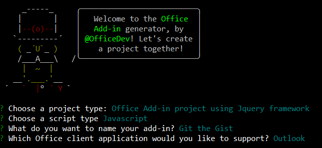

# Advanced Outlook add-in tutorial: Git the Gist

The purpose of this guide is to walk through the process of creating an Outlook add-in that allows the user to access their [Gists](https://gist.github.com/) on GitHub. The source code in this [repository](https://github.com/jasonjoh/git-the-gist) is what you should end up with if you follow the steps outlined here.

This tutorial will use the [Microsoft Office Add-in Project Generator](https://github.com/officedev/generator-office) to generate an add-in project.

## Prerequisites

Outlook add-ins are comprised of HTML, CSS, and JavaScript files, so technically the only absolute prerequisite is some sort of web server to host the files. However, in this guide we're going to use some tools to make it easier to get up and running quickly. To follow along with this guide, you'll need the following:

- [Node.js](https://nodejs.org)
- [Yeoman](https://yeoman.io/)
- [Microsoft Office Add-in Project Generator](https://github.com/officedev/generator-office)
- Internet Explorer version 11 or later

> [!TIP]
> Once you have Node.js installed, you can install all of the other prerequisites via NPM:
>
> npm install -g yo generator-office


You will also need Outlook 2016 connected to an Office 365 account, Outlook.com account, or a Microsoft Exchange Server and a GitHub account to test all of the features of the add-in we're going to create.

## Create the add-in

Open your command prompt/shell in an empty directory. Enter `yo office` and follow the prompts.

- **Choose a project type** - `Office Add-in project using Jquery framework`

- **Choose a script type** - `Javascript`

- **What do you want to name your add-in?** - `Git the Gist`

- **Which Office client application would you like to support?** - `Outlook`



After you complete the wizard, the generator will create the project and install supporting Node components.

### Test the generated add-in

Before we start writing any code, let's test the basic add-in generated by the generator. That way we'll know that we have a working starting point.

#### Update the manifest

Before we load the add-in, we need to make one change to the manifest file. The generator adds a placeholder value for the `SupportUrl` element which is not a valid URL. This makes the file fail validation.

Open the `git-the-gist-manifest.xml` and locate the `SupportUrl` element. Remove or comment the line and save your changes before you continue.

```xml
<!--If you plan to submit this add-in to the Office Store, uncomment the SupportUrl element below-->
<!--<SupportUrl DefaultValue="[Insert the URL of a page that provides support information for the app]" />-->
```

#### Sideload the add-in

1. In your command prompt/shell, make sure you are in the root directory of your project, and enter `npm start`. This will start a web server at `https://localhost:3000` and open your default browser to that address.
    - If your browser indicates that the site's certificate is not trusted, you will need to add the certificate as a trusted certificate. Outlook will not load add-ins if the site is not trusted. See [Adding Self-Signed Certificates as Trusted Root Certificate](https://github.com/OfficeDev/generator-office/blob/master/src/docs/ssl.md) for details.
    - If the browser does not indicate a problem with the certificate, proceed to the next step.
1. Sideload the add-in using the instructions in [Sideload Outlook add-ins for testing](sideload-outlook-add-ins-for-testing.md). When browsing for the manifest file, select `git-the-gist-manifest.xml` in the project root.
1. You should now see a new button on the ribbon labeled **Display all properties**. Click this button to open the taskpane. You should see the add-in's welcome page.

    

## Write the code

Now that we've verified that the base add-in works, we can customize it to do what we want. We'll start with the manifest.

### Update the manifest (again)

The manifest for an add-in controls how it appears in Outlook. It defines the way the add-in appears in the add-in list, the buttons that appear on the ribbon, and it sets the URLs for the HTML and JavaScript files used by the add-in.

Let's start by updating some properties of the add-in itself.

1. Open the `git-the-gist-manifest.xml` file. Locate the `ProviderName` element in the XML and replace the default value with your company name.

   ```xml
    <ProviderName>Contoso</ProviderName>
    ```
1. Update the `Description` with a description of the add-in.

    ```xml
    <Description DefaultValue="Allows users to access their Gists on GitHub"/>
   ```

Now we'll change the buttons defined by the add-in. For our add-in, we'll implement two buttons: **Insert Gist** and **Insert Default Gist** on the compose message window. However, the current manifest only adds buttons to the read message window. We'll have to add the message compose command surface extension point.

> [!NOTE]
> For now we will leave the message read command surface as-is. In future parts of this series, we will revisit the message read scenario.

Locate the line in the manifest that reads `</DesktopFormFactor>`. Above this line, insert the following XML:

```xml
<ExtensionPoint xsi:type="MessageComposeCommandSurface">
  <OfficeTab id="TabDefault">
    <Group id="msgComposeCmdGroup">
      <Label resid="groupLabel"/>
      <Control xsi:type="Button" id="msgComposeInsertGist">
        <Label resid="insertGistLabel"/>
        <Supertip>
          <Title resid="insertGistTitle"/>
          <Description resid="insertGistDesc"/>
        </Supertip>
        <Icon>
          <bt:Image size="16" resid="icon16"/>
          <bt:Image size="32" resid="icon32"/>
          <bt:Image size="80" resid="icon80"/>
        </Icon>
        <Action xsi:type="ShowTaskpane">
          <SourceLocation resid="insertGistPaneUrl" />
        </Action>
      </Control>
      <Control xsi:type="Button" id="msgComposeInsertDefaultGist">
        <Label resid="insertDefaultGistLabel"/>
        <Supertip>
          <Title resid="insertDefaultGistTitle"/>
          <Description resid="insertDefaultGistDesc"/>
        </Supertip>
        <Icon>
          <bt:Image size="16" resid="icon16"/>
          <bt:Image size="32" resid="icon32"/>
          <bt:Image size="80" resid="icon80"/>
        </Icon>
        <Action xsi:type="ExecuteFunction">
          <FunctionName>insertDefaultGist</FunctionName>
        </Action>
      </Control>
    </Group>
  </OfficeTab>
</ExtensionPoint>
```

Now let's look at exactly what that does.

- The `ExtensionPoint` with `xsi:type="MessageComposeCommandSurface"` indicates that we're defining buttons to add to the message compose window.

- By using an `OfficeTab` element with `id="TabDefault"`, we're indicating we want to add our buttons to the default tab on the ribbon.

- The `Group` element defines the grouping for our buttons, with a label set by the `groupLabel` resource.

- The first `Control` element contains an `Action` element with `xsi:type="ShowTaskPane"`, so this button will open a task pane.

- The second `Control` element contains an `Action` element with `xsi:type="ExecuteFunction"`, so this button will invoke a JavaScript function contained in the function file.

Finally we'll update our resources. The code above referenced labels, tool-tips, and URLs that we need to define before our manifest will be valid.

1. Add the following as a child of the `bt:Urls` element:

   ```xml
    <bt:Url id="insertGistPaneUrl" DefaultValue="https://localhost:3000/msg-compose/insert-gist.html"/>
   ```
1. Change the `DefaultValue` attribute of the `bt:String` element with `id="groupLabel"` to `Git the Gist`.

   ```xml
    <bt:String id="groupLabel" DefaultValue="Git the Gist"/>
   ```
1. Add the following elements as children of the `bt:ShortStrings` element.

   ```xml
    <bt:String id="insertGistLabel" DefaultValue="Insert Gist">
      <bt:Override Locale="es-ES" Value="Inserte el Gist"/>
    </bt:String>
    <bt:String id="insertGistTitle" DefaultValue="Insert Gist">
      <bt:Override Locale="es-ES" Value="Inserte el Gist"/>
    </bt:String>
    <bt:String id="insertDefaultGistLabel" DefaultValue="Insert Default Gist">
      <bt:Override Locale="es-ES" Value="Inserte el Gist predeterminado"/>
    </bt:String>
    <bt:String id="insertDefaultGistTitle" DefaultValue="Insert Default Gist">
      <bt:Override Locale="es-ES" Value="Inserte el Gist predeterminado"/>
    </bt:String>
   ```
1. Add the following elements as children of the `bt:LongStrings` element.

   ```xml
    <bt:String id="insertGistDesc" DefaultValue="Displays a list of your Gists and allows you to insert their contents into the current message">
      <bt:Override Locale="es-ES" Value="Muestra una lista de sus Gists y permite insertar su contenido en el mensaje actual"/>
    </bt:String>
    <bt:String id="insertDefaultGistDesc" DefaultValue="Inserts the contents of the Gist you mark as default into the current message">
      <bt:Override Locale="es-ES" Value="Inserta el contenido de lo Gist que marca como predeterminado en el mensaje actual"/>
    </bt:String>
   ```

This defines the string values that will be used for the add-in. It also localizes the strings into Spanish by providing a `bt:Override` element for each string. Additional languages can be added as additional `bt:Override` elements. The `DefaultValue` is used for clients that use the locale specified in the `DefaultLocale` element in the manifest.

Save your changes to the manifest. Since we installed the add-in from a file, we need to reinstall it in order for the changes to take effect.

1. Open Outlook 2016. On the **Home** tab in the ribbon, click the **Store** button.

1. Click the **My add-ins** link on the left side.

1. Click the **...** button next to the **Git the Gist** entry, then choose **Remove**.

1. Close the Store window.

1. The custom button should disappear from the ribbon momentarily.

1. Reinstall the add-in using the new manifest.

Now when you compose a new message in Outlook, you should see two buttons on the ribbon: **Insert Gist** and **Insert Default Gist**. Now we can work on implementing the add-in functionality.

### Implementing a first-run experience

In this add-in, we will ask the user to provide their GitHub URL, and then choose one of their existing Gists to be the default Gist. We'll implement this as a settings dialog for the add-in.

Let's start by creating the HTML for the dialog itself. Create a new folder in the root folder of the project called `settings`. Then create a file inside the `settings` folder called `dialog.html`, and add the following markup.

```html
<!DOCTYPE html>
<html>

<head>
  <meta charset="UTF-8" />
  <meta http-equiv="X-UA-Compatible" content="IE=Edge" />
  <title>Settings</title>

  <!-- Office JavaScript API -->
  <script type="text/javascript" src="https://appsforoffice.microsoft.com/lib/1.1/hosted/office.debug.js"></script>

  <!-- LOCAL -->
  <link rel="stylesheet" href="../node_modules/office-ui-fabric-js/dist/css/fabric.min.css" />
  <link rel="stylesheet" href="../node_modules/office-ui-fabric-js/dist/css/fabric.components.css" />

  <!-- Template styles -->
  <link href="../app.css" rel="stylesheet" type="text/css" />
  <link href="dialog.css" rel="stylesheet" type="text/css" />
</head>

<body class="ms-font-l">
  <main>
    <section class="ms-font-m ms-fontColor-neutralPrimary">
      <div class="not-configured-warning ms-MessageBar ms-MessageBar--warning">
        <div class="ms-MessageBar-content">
          <div class="ms-MessageBar-icon">
            <i class="ms-Icon ms-Icon--Info"></i>
          </div>
          <div class="ms-MessageBar-text">
            Oops! It looks like you haven't configured <strong>Git the Gist</strong> yet.
            </br>
            Please configure your GitHub user name and select a default Gist, then try that action again!
          </div>
        </div>
      </div>
      <div class="ms-font-xxl">Settings</div>
      <div class="ms-Grid">
        <div class="ms-Grid-row">
          <div class="ms-TextField">
            <label class="ms-Label">GitHub Username</label>
            <input class="ms-TextField-field" id="github-user" type="text" value="" placeholder="Please enter your GitHub username">
          </div>
        </div>
        <div class="error-display ms-Grid-row">
          <div class="ms-font-l ms-fontWeight-semibold">An error occurred:</div>
          <pre><code id="error-text"></code></pre>
        </div>
        <div class="gist-list-container ms-Grid-row">
          <div class="list-title ms-font-xl ms-fontWeight-regular">Choose Default Gist</div>
          <ul id="gist-list" class="ms-List">
          </ul>
        </div>
      </div>
      <div class="ms-Dialog-actions">
        <div class="ms-Dialog-actionsRight">
          <button class="ms-Dialog-action ms-Button ms-Button--primary" id="settings-done" disabled>
            <span class="ms-Button-label">Done</span>
          </button>
        </div>
      </div>
    </section>
  </main>
  <script type="text/javascript" src="../node_modules/core-js/client/core.js"></script>
  <script type="text/javascript" src="../node_modules/jquery/dist/jquery.js"></script>
  <script type="text/javascript" src="../node_modules/office-ui-fabric-js/dist/js/fabric.js"></script>

  <script type="text/javascript" src="../helpers/gist-api.js"></script>
  <script type="text/javascript" src="dialog.js"></script>
</body>

</html>
```

This is a very basic form with a text input for a GitHub username and an empty list for Gists that we'll populate via JavaScript. Note that we're using [Office Fabric](https://developer.microsoft.com/fabric#/get-started) for fonts and styles.

Now add `dialog.css` in the same folder, and add the following code.

```CSS
section {
  margin: 10px 20px;
}

.not-configured-warning {
  display: none;
}

.error-display {
  display: none;
}

.gist-list-container {
  margin: 10px -8px;
  display: none;
}

.list-title {
  border-bottom: 1px solid #a6a6a6;
  padding-bottom: 5px;
}

ul {
  margin-top: 10px;
}
```

That takes care of the UI for the dialog, but now we need to add code to make it actually do something. We'll use jQuery to hook up events and the `messageParent` function to send the user's choices back to the caller. Create a file in the `settings` folder called `dialog.js` and add the following code.

```js
(function(){
  'use strict';

  // The Office initialize function must be run each time a new page is loaded
  Office.initialize = function(reason){
    jQuery(document).ready(function(){
      if (window.location.search) {
        // Check if warning should be displayed
        var warn = getParameterByName('warn');
        if (warn) {
          $('.not-configured-warning').show();
        } else {
          // See if the config values were passed
          // If so, pre-populate the values
          var user = getParameterByName('gitHubUserName');
          var gistId = getParameterByName('defaultGistId');

          $('#github-user').val(user);
          loadGists(user, function(success){
            if (success) {
              $('input:hidden').filter(function() {
                return this.value === gistId;
              }).parent().addClass('is-selected');
              $('#settings-done').removeAttr('disabled');
            }
          });
        }
      }

      // When the GitHub username changes,
      // try to load Gists
      $('#github-user').on('change', function(){
        $('#gist-list').empty();
        var ghUser = $('#github-user').val();
        if (ghUser.length > 0) {
          loadGists(ghUser);
        }
      });

      // When the Done button is clicked, send the
      // values back to the caller as a serialized
      // object.
      $('#settings-done').on('click', function() {
        var settings = {};

        settings.gitHubUserName = $('#github-user').val();

        var selectedGist = $('li.is-selected');
        if (selectedGist) {
          settings.defaultGistId = selectedGist.children('.gist-id').val();

          sendMessage(JSON.stringify(settings));
        }
      });
    });
  };

  // Load gists for the user using the GitHub API
  // and build the list
  function loadGists(user, callback) {
    getUserGists(user, function(gists, error){
      if (error) {
        $('.gist-list-container').hide();
        $('#error-text').text(JSON.stringify(error, null, 2));
        $('.error-display').show();
        if (callback) callback(false);
      } else {
        $('.error-display').hide();
        buildGistList($('#gist-list'), gists, onGistSelected);
        $('.gist-list-container').show();
        if (callback) callback(true);
      }
    });
  }

  function onGistSelected() {
    $('.ms-ListItem').removeClass('is-selected');
    $(this).addClass('is-selected');
    $('.not-configured-warning').hide();
    $('#settings-done').removeAttr('disabled');
  }

  function sendMessage(message) {
    Office.context.ui.messageParent(message);
  }

  function getParameterByName(name, url) {
    if (!url) {
      url = window.location.href;
    }
    name = name.replace(/[\[\]]/g, "\\$&");
    var regex = new RegExp("[?&]" + name + "(=([^&#]*)|&|#|$)"),
      results = regex.exec(url);
    if (!results) return null;
    if (!results[2]) return '';
    return decodeURIComponent(results[2].replace(/\+/g, " "));
  }
})();
```

Notice that the `change` event for the GitHub username field is set to load the user's Gists. We need to implement the [GitHub Gists API](https://developer.github.com/v3/gists/). We'll put this into a separate file to make it easier to reuse.

Create a folder in the root of the project called `helpers`. In this folder create a file called `gist-api.js` and add the following code.

```js
function getUserGists(user, callback) {
  var requestUrl = 'https://api.github.com/users/' + user + '/gists';

  $.ajax({
    url: requestUrl,
    dataType: 'json'
  }).done(function(gists){
    callback(gists);
  }).fail(function(error){
    callback(null, error);
  });
}

function buildGistList(parent, gists, clickFunc) {
  gists.forEach(function(gist, index) {

    var listItem = $('<li/>')
      .addClass('ms-ListItem')
      .addClass('is-selectable')
      .attr('tabindex', index)
      .appendTo(parent);

    var desc = $('<span/>')
      .addClass('ms-ListItem-primaryText')
      .text(gist.description)
      .appendTo(listItem);

    var desc = $('<span/>')
      .addClass('ms-ListItem-secondaryText')
      .text(buildFileList(gist.files))
      .appendTo(listItem);

    var updated = new Date(gist.updated_at);

    var desc = $('<span/>')
      .addClass('ms-ListItem-tertiaryText')
      .text('Last updated ' + updated.toLocaleString())
      .appendTo(listItem);

    var selTarget = $('<div/>')
      .addClass('ms-ListItem-selectionTarget')
      .appendTo(listItem);

    var id = $('<input/>')
      .addClass('gist-id')
      .attr('type', 'hidden')
      .val(gist.id)
      .appendTo(listItem);
  });

  $('.ms-ListItem').on('click', clickFunc);
}

function buildFileList(files) {

  var fileList = '';

  for (var file in files) {
    if (files.hasOwnProperty(file)) {
      if (fileList.length > 0) {
        fileList = fileList + ', ';
      }

      fileList = fileList + files[file].filename + ' (' + files[file].language + ')';
    }
  }

  return fileList;
}
```

That fully implements the settings dialog. Now the question is how do we invoke it? You may have noticed that we did not add a button to the ribbon for settings. Instead, the add-in will check that it has been configured. If it hasn't, then it will prompt the user when they invoke the add-in to configure before proceeding. Since the user could click either button first, we'll do this check in both cases.

### Implementing a UI-less button

We'll start with the **Insert Default Gist** button. This button simply executes a JavaScript function in the function file rather than open a task pane. This kind of button is referred to as a UI-less button.

The goal for this button is to check if the add-in has been configured yet. If it has, then it will load the content of the gist that the user has selected as default and insert it into the body. If it hasn't, then it will present the settings dialog. However, it's a little strange to just present the settings dialog to the user without some explanation. So in this case, we'll show the message bar included in the dialog's HTML to give the user some idea why they're seeing the dialog.

Let's start by creating our function file. Any functions that are invoked by a UI-less button must be defined in the function file specified by the `FunctionFile` element in the manifest for the corresponding form factor. Our manifest has this defined as `https://localhost:3000/function-file/function-file.html`. Open the `./function-file/function-file.html` file and update the code inside to look like the following.

```html
<!DOCTYPE html>
<html>

<head>
    <meta charset="UTF-8" />
    <meta http-equiv="X-UA-Compatible" content="IE=Edge" />

    <!-- Office JavaScript API -->
    <script type="text/javascript" src="https://appsforoffice.microsoft.com/lib/1.1/hosted/office.debug.js"></script>

    <script type="text/javascript" src="../node_modules/jquery/dist/jquery.js"></script>
    <script type="text/javascript" src="../node_modules/showdown/dist/showdown.min.js"></script>
    <script type="text/javascript" src="../node_modules/urijs/src/URI.min.js"></script>
    <script type="text/javascript" src="../helpers/addin-config.js"></script>
    <script type="text/javascript" src="../helpers/gist-api.js"></script>
    <script type="text/javascript" src="function-file.js"></script>
</head>

<body>
  <!-- NOTE: The body is empty on purpose. Since functions in function-file.js are
       invoked via a button, there is no UI to render. -->
</body>

</html>
```

Notice that one of the script tags references [Showdown](https://github.com/showdownjs/showdown), which we'll use later to convert Markdown to HTML. Another tag references [URI.js](https://github.com/medialize/URI.js), which we use to build relative URLs. We need to install these libraries. Open your command prompt/shell to the root of the project and run the following command.

```powershell
npm install showdown urijs --save
```

We also referenced `addin-config.js`, which doesn't exist yet. Create the file in the `helpers` folder and add the following code.

```js
function getConfig() {
  var config = {};

  config.gitHubUserName = Office.context.roamingSettings.get('gitHubUserName');
  config.defaultGistId = Office.context.roamingSettings.get('defaultGistId');

  return config;
}

function setConfig(config, callback) {
  Office.context.roamingSettings.set('gitHubUserName', config.gitHubUserName);
  Office.context.roamingSettings.set('defaultGistId', config.defaultGistId);

  Office.context.roamingSettings.saveAsync(callback);
}
```

This makes use of the [RoamingSettings object](https://docs.microsoft.com/javascript/api/outlook_1_5/office.RoamingSettings) to get or set the configuration values.

Now open the `function-file.js` file in the `function-file` folder, and replace the contents with the following code:

```js
var config;
var btnEvent;

// The initialize function must be run each time a new page is loaded
Office.initialize = function (reason) {
  config = getConfig();
};

// Add any ui-less function here
function showError(error) {
  Office.context.mailbox.item.notificationMessages.replaceAsync('github-error', {
    type: 'errorMessage',
    message: error
  }, function(result){
  });
}

var settingsDialog;

function insertDefaultGist(event) {

  // Check if the add-in has been configured
  if (config && config.defaultGistId) {
    // Get the default Gist content and insert
    try {
      getGist(config.defaultGistId, function(gist, error) {
        if (gist) {
          buildBodyContent(gist, function (content, error) {
            if (content) {
              Office.context.mailbox.item.body.setSelectedDataAsync(content,
                {coercionType: Office.CoercionType.Html}, function(result) {
                  event.completed();
              });
            } else {
              showError(error);
              event.completed();
            }
          });
        } else {
          showError(error);
          event.completed();
        }
      });
    } catch (err) {
      showError(err);
      event.completed();
    }

  } else {
    // Save the event object so we can finish up later
    btnEvent = event;
    // Not configured yet, display settings dialog with
    // warn=1 to display warning.
    var url = new URI('../settings/dialog.html?warn=1').absoluteTo(window.location).toString();
    var dialogOptions = { width: 20, height: 40, displayInIframe: true };

    Office.context.ui.displayDialogAsync(url, dialogOptions, function(result) {
      settingsDialog = result.value;
      settingsDialog.addEventHandler(Microsoft.Office.WebExtension.EventType.DialogMessageReceived, receiveMessage);
      settingsDialog.addEventHandler(Microsoft.Office.WebExtension.EventType.DialogEventReceived, dialogClosed);
    });
  }
}

function receiveMessage(message) {
  config = JSON.parse(message.message);
  setConfig(config, function(result) {
    settingsDialog.close();
    settingsDialog = null;
    btnEvent.completed();
    btnEvent = null;
  });
}

function dialogClosed(message) {
  settingsDialog = null;
  btnEvent.completed();
  btnEvent = null;
}
```

Note the addition of the `?warn=1` parameter to the dialog URL in the `insertDefaultGist` function. Including that parameter will cause the dialog to display the message bar.

Before we test the UI-less button, we need to add a couple of functions to the `gist-api.js` file to get the contents of a gist and convert it to HTML to insert in the message body. Add the following functions.

```js
function getGist(gistId, callback) {
  var requestUrl = 'https://api.github.com/gists/' + gistId;

  $.ajax({
    url: requestUrl,
    dataType: 'json'
  }).done(function(gist){
    callback(gist);
  }).fail(function(error){
    callback(null, error);
  });
}

function buildBodyContent(gist, callback) {
  // Find the first non-truncated file in the gist
  // and use it.
  for (var filename in gist.files) {
    if (gist.files.hasOwnProperty(filename)) {
      var file = gist.files[filename];
      if (!file.truncated) {
        // We have a winner
        switch (file.language) {
          case 'HTML':
            // Insert as-is
            callback(file.content);
            break;
          case 'Markdown':
            // Convert Markdown to HTML
            var converter = new showdown.Converter();
            var html = converter.makeHtml(file.content);
            callback(html);
            break;
          default:
            // Insert contents as a <code> block
            var codeBlock = '<pre><code>';
            codeBlock = codeBlock + file.content;
            codeBlock = codeBlock + '</code></pre>';
            callback(codeBlock);
        }
        return;
      }
    }
  }
  callback(null, 'No suitable file found in the gist');
}
```

If the gist contains HTML, then it will be inserted as-is into the body. If the gist is Markdown, the add-in will convert using Showdown and insert the resulting HTML. For anything else, the add-in will insert it as a code snippet.

#### Test the button

The **Insert Default Gist** button should now work. Save all of your changes and run `npm start` if the server isn't already running. Open Outlook and compose a new message. When you click on the **Insert Default Gist** button, you should be prompted to configure the add-in.


Enter your GitHub username. Press **Tab** to invoke the `change` event, which should load your list of gists. Select a gist to be the default, and click **Done**.

> [!NOTE]
> If you don't have any gists on GitHub, go create some!


Now click the **Insert Default Gist** button again. This time you should see the contents of the gist inserted into the body of the email.

### Implementing a task pane

Now we can work on the **Insert Gist** button. For this button we'll open a task pane and display all of the user's gists. The user can pick one and insert it. If the user has not yet configured the add-in, it will display a message asking them to do so.

Create a folder in the root of the project called `msg-compose`. In this folder, create `insert-gist.html` and add the following markup.

> [!NOTE]
> The markup for the taskpane borrows heavily from the **Landing page** design pattern described in [UX design pattern templates for Office Add-ins](https://docs.microsoft.com/office/dev/add-ins/design/ux-design-pattern-templates).

```html
<!DOCTYPE html>
<html>

<head>
  <meta charset="UTF-8" />
  <meta http-equiv="X-UA-Compatible" content="IE=Edge" />
  <title>Landing Page</title>

  <!-- Office JavaScript API -->
  <script type="text/javascript" src="https://appsforoffice.microsoft.com/lib/1.1/hosted/office.debug.js"></script>

  <!-- LOCAL -->
  <link rel="stylesheet" href="../node_modules/office-ui-fabric-js/dist/css/fabric.min.css" />
  <link rel="stylesheet" href="../node_modules/office-ui-fabric-js/dist/css/fabric.components.css" />

  <!-- Template styles -->

  <link href="insert-gist.css" rel="stylesheet" type="text/css" />
</head>

<body class="ms-font-l ms-landing-page">
  <main class="ms-landing-page__main">
    <section class="ms-landing-page__content ms-font-m ms-fontColor-neutralPrimary">
      <div id="not-configured" style="display: none;">
        <div class="centered ms-font-xxl ms-u-textAlignCenter">Welcome!</div>
        <div class="ms-font-xl" id="settings-prompt">Please click the <strong>Settings</strong> icon at the bottom of this window to configure this add-in.</div>
      </div>
      <div id="gist-list-container" style="display: none;">
        <ul id="gist-list" class="ms-List">
        </ul>
      </div>
      <div id="error-display" style="display: none;" class="ms-u-borderBase ms-fontColor-error ms-font-m ms-bgColor-error ms-borderColor-error">
      </div>
    </section>
    <button class="ms-Button ms-Button--primary" id="insert-button" disabled>
      <span class="ms-Button-label">Insert</span>
    </button>
  </main>
  <footer class="ms-landing-page__footer ms-bgColor-themePrimary">
    <div class="ms-landing-page__footer--left">
      
      <h1 class="ms-font-xl ms-fontWeight-semilight ms-fontColor-white">Git the Gist</h1>
    </div>
    <div id="settings-icon" class="ms-landing-page__footer--right">
      <i class="ms-Icon enlarge ms-Icon--Settings ms-fontColor-white"></i>
    </div>
  </footer>
  <script type="text/javascript" src="../node_modules/jquery/dist/jquery.js"></script>
  <script type="text/javascript" src="../node_modules/showdown/dist/showdown.min.js"></script>
  <script type="text/javascript" src="../node_modules/urijs/src/URI.min.js"></script>
  <script type="text/javascript" src="../helpers/addin-config.js"></script>
  <script type="text/javascript" src="../helpers/gist-api.js"></script>
  <script type="text/javascript" src="insert-gist.js"></script>
</body>

</html>
```

Create a file called `insert-gist.css` in the `msg-compose` folder and add the following code.

```CSS
/* Copyright (c) Microsoft. All rights reserved. Licensed under the MIT license. See full license in root of repo. */
html, body {
  width: 100%;
  height: 100%;
  margin: 0;
  padding: 0;
  overflow: auto; }

body {
  position: relative;
  font-size: 16px; }

main {
  height: 100%;
  overflow-y: auto; }

footer {
  width: 100%;
  position: relative;
  bottom: 0;
  margin-top: 10px;}

p, h1, h2, h3, h4, h5, h6 {
  margin: 0;
  padding: 0; }

ul {
  padding: 0; }

#settings-prompt {
  margin: 10px 0;
}

#error-display {
  padding: 10px;
}

#insert-button {
  margin: 0 10px;
}

.clearfix {
  display: block;
  clear: both;
  height: 0; }

.pointerCursor {
  cursor: pointer; }

.invisible {
  visibility: hidden; }

.undisplayed {
  display: none; }

.ms-Icon.enlarge {
  position: relative;
  font-size: 20px;
  top: 4px; }

.ms-landing-page {
  display: -webkit-flex;
  display: flex;
  -webkit-flex-direction: column;
          flex-direction: column;
  -webkit-flex-wrap: nowrap;
          flex-wrap: nowrap;
  height: 100%; }
  .ms-landing-page__main {
    display: -webkit-flex;
    display: flex;
    -webkit-flex-direction: column;
            flex-direction: column;
    -webkit-flex-wrap: nowrap;
            flex-wrap: nowrap;
    -webkit-flex: 1 1 0;
            flex: 1 1 0;
    height: 100%; }

  .ms-landing-page__content {
    display: -webkit-flex;
    display: flex;
    -webkit-flex-direction: column;
            flex-direction: column;
    -webkit-flex-wrap: nowrap;
            flex-wrap: nowrap;
    height: 100%;
    -webkit-flex: 1 1 0;
            flex: 1 1 0;
    padding: 20px; }
    .ms-landing-page__content h2 {
      margin-bottom: 20px; }
  .ms-landing-page__footer {
    display: -webkit-inline-flex;
    display: inline-flex;
    -webkit-justify-content: center;
            justify-content: center;
    -webkit-align-items: center;
            align-items: center; }
    .ms-landing-page__footer--left {
      transition: background ease 0.1s, color ease 0.1s;
      display: -webkit-inline-flex;
      display: inline-flex;
      -webkit-justify-content: flex-start;
              justify-content: flex-start;
      -webkit-align-items: center;
              align-items: center;
      -webkit-flex: 1 0 0px;
              flex: 1 0 0px;
      padding: 20px; }
      .ms-landing-page__footer--left:active, .ms-landing-page__footer--left:hover {
        background: #005ca4;
        cursor: pointer; }
      .ms-landing-page__footer--left:active {
        background: #005ca4; }
      .ms-landing-page__footer--left--disabled {
        opacity: 0.6;
        pointer-events: none;
        cursor: not-allowed; }
        .ms-landing-page__footer--left--disabled:active, .ms-landing-page__footer--left--disabled:hover {
          background: transparent; }
      .ms-landing-page__footer--left img {
        width: 40px;
        height: 40px; }
      .ms-landing-page__footer--left h1 {
        -webkit-flex: 1 0 0px;
                flex: 1 0 0px;
        margin-left: 15px;
        text-align: left;
        width: auto;
        max-width: auto;
        overflow: hidden;
        white-space: nowrap;
        text-overflow: ellipsis; }
    .ms-landing-page__footer--right {
      transition: background ease 0.1s, color ease 0.1s;
      padding: 29px 20px; }
      .ms-landing-page__footer--right:active, .ms-landing-page__footer--right:hover {
        background: #005ca4;
        cursor: pointer; }
      .ms-landing-page__footer--right:active {
        background: #005ca4; }
      .ms-landing-page__footer--right--disabled {
        opacity: 0.6;
        pointer-events: none;
        cursor: not-allowed; }
        .ms-landing-page__footer--right--disabled:active, .ms-landing-page__footer--right--disabled:hover {
          background: transparent; }
```

Now that the UI is implemented, let's add the code behind it. Create a file named `insert-gist.js` in the `msg-compose` folder and add the following code.

```js
(function(){
  'use strict';

  var config;
  var settingsDialog;

  Office.initialize = function(reason){
    config = getConfig();

    jQuery(document).ready(function(){
      // Check if add-in is configured
      if (config && config.gitHubUserName) {
        // If configured load the gist list
        loadGists(config.gitHubUserName);
      } else {
        // Not configured yet
        $('#not-configured').show();
      }

      // When insert button is clicked, build the content
      // and insert into the body.
      $('#insert-button').on('click', function(){
        var gistId = $('.ms-ListItem.is-selected').children('.gist-id').val();
        getGist(gistId, function(gist, error) {
          if (gist) {
            buildBodyContent(gist, function (content, error) {
              if (content) {
                Office.context.mailbox.item.body.setSelectedDataAsync(content,
                  {coercionType: Office.CoercionType.Html}, function(result) {
                    if (result.status == 'failed') {
                      showError('Could not insert Gist: ' + result.error.message);
                    }
                });
              } else {
                showError('Could not create insertable content: ' + error);
              }
            });
          } else {
            showError('Could not retrieve Gist: ' + error);
          }
        });
      });

      // When the settings icon is clicked, open the settings dialog
      $('#settings-icon').on('click', function(){
        // Display settings dialog
        var url = new URI('../settings/dialog.html').absoluteTo(window.location).toString();
        if (config) {
          // If the add-in has already been configured, pass the existing values
          // to the dialog
          url = url + '?gitHubUserName=' + config.gitHubUserName + '&defaultGistId=' + config.defaultGistId;
        }

        var dialogOptions = { width: 20, height: 40, displayInIframe: true };

        Office.context.ui.displayDialogAsync(url, dialogOptions, function(result) {
          settingsDialog = result.value;
          settingsDialog.addEventHandler(Microsoft.Office.WebExtension.EventType.DialogMessageReceived, receiveMessage);
          settingsDialog.addEventHandler(Microsoft.Office.WebExtension.EventType.DialogEventReceived, dialogClosed);
        });
      })
    });
  };

  function loadGists(user) {
    $('#error-display').hide();
    $('#not-configured').hide();
    $('#gist-list-container').show();

    getUserGists(user, function(gists, error) {
      if (error) {

      } else {
        buildGistList($('#gist-list'), gists, onGistSelected);
      }
    });
  }

  function onGistSelected() {
    $('.ms-ListItem').removeClass('is-selected');
    $(this).addClass('is-selected');
    $('#insert-button').removeAttr('disabled');
  }

  function showError(error) {
    $('#not-configured').hide();
    $('#gist-list-container').hide();
    $('#error-display').text(error);
    $('#error-display').show();
  }

  function receiveMessage(message) {
    config = JSON.parse(message.message);
    setConfig(config, function(result) {
      settingsDialog.close();
      settingsDialog = null;
      loadGists(config.gitHubUserName);
    });
  }

  function dialogClosed(message) {
    settingsDialog = null;
  }
})();
```

Save all of your changes and run `npm start` if the server isn't already running. Open Outlook and compose a new message. When you click on the **Insert Gist** button, you should see a taskpane open on the right-hand side. When you select a gist and click **Insert**, the gist should get inserted into the body.


