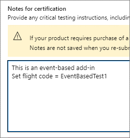
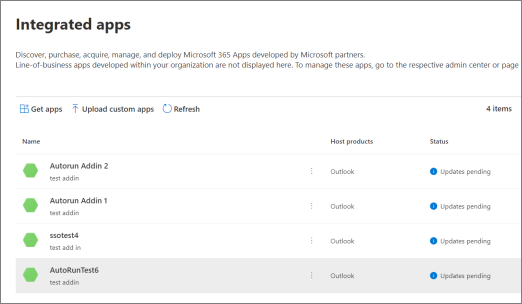
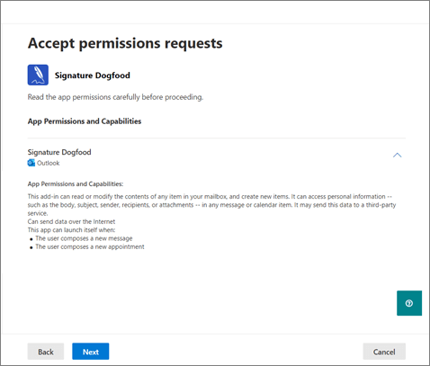

# AppSource listing options for your event-based Outlook add-in

Add-ins must be deployed by an organization's admins for end-users to access the [event-based activation](../develop/event-based-activation.md) feature. Event-based activation is restricted if the end-user acquired the add-in directly from [AppSource](https://appsource.microsoft.com). For example, if the Contoso add-in includes an event-based function, the automatic invocation of the add-in only happens if the add-in was installed for the end-user by their organization's admin. Otherwise, the automatic invocation of the add-in is blocked.

An end-user or admin can acquire add-ins through AppSource or the in-app Microsoft 365 and Copilot store. If your add-in's primary scenario or workflow requires event-based activation, you may want to restrict your add-in to admin deployment only. To enable that restriction, we can provide flight code URLs for add-ins in AppSource. Thanks to the flight codes, only end-users with these special URLs can access the listing. The following is an example URL.

`https://appsource.microsoft.com/product/office/WA200002862?flightCodes=EventBasedTest1`

Users and admins can't explicitly search for an add-in by its name in AppSource or the in-app Microsoft 365 and Copilot store when a flight code is enabled for it. As the add-in creator, you can privately share these flight codes with organization admins for add-in deployment.

> [!NOTE]
> While end-users can install the add-in using a flight code, the add-in won't include event-based activation.

[!INCLUDE [outlook-smart-alerts-deployment](../includes/outlook-smart-alerts-deployment.md)]

## Specify a flight code

To specify the flight code for your add-in, share the code in the **Notes for certification** when you publish your add-in. **Important**: Flight codes are case-sensitive.

## Deploy add-in with flight code

After the flight codes are set, you'll receive the URL from the app certification team. You can then share the URL with admins privately.

> [!NOTE]
> Once your add-in is certified, it may take up to 24 hours for the flight codes to take effect and for AppSource to hide your existing listing from the search results.

To deploy the add-in, the admin can use the following steps.

- Sign in to admin.microsoft.com or AppSource.com with your Microsoft 365 admin account. If the add-in has single sign-on (SSO) enabled, global admin credentials are needed.
- Open the flight code URL into a web browser.
- On the add-in listing page, select **Get it now**. You should be redirected to the integrated app portal.

## Unrestricted AppSource listing

If your add-in doesn't use event-based activation for critical scenarios (that is, your add-in works well without automatic invocation), consider listing your add-in in AppSource without any special flight codes. If an end-user gets your add-in from AppSource, automatic activation won't happen for the user. However, they can use other components of your add-in such as a task pane or function command.

> [!IMPORTANT]
> This is a temporary restriction. In future, we plan to enable event-based add-in activation for end-users who directly acquire your add-in.

## Update existing add-ins to include event-based activation

You can update your existing add-in to include event-based activation then resubmit it for validation and decide if you want a restricted or unrestricted AppSource listing.

After the updated add-in is approved, organization admins who have previously deployed the add-in will receive an update message in the **Integrated apps** section of the admin center. The message advises the admin about the event-based activation changes. After the admin accepts the changes, the update will be deployed to end-users. To learn more about the admin consent process, see [Admin consent for installing event-based add-ins](#admin-consent-for-installing-event-based-add-ins).

For end-users who installed the add-in on their own, the event-based activation feature won't work even after the add-in has been updated.

## Admin consent for installing event-based add-ins

Whenever an event-based add-in is deployed from the **Integrated Apps** screen, the admin gets details about the add-in's event-based activation capabilities in the deployment wizard. The details appear in the **App Permissions and Capabilities** section. The admin should see all the events where the add-in can automatically activate.

Similarly, when an existing add-in is updated to event-based functionality, the admin sees an "Update Pending" status on the add-in. The updated add-in is deployed only if the admin consents to the changes noted in the **App Permissions and Capabilities** section, including the set of events where the add-in can automatically activate.

Each time you add any new event-based activation function to your add-in, admins will see the update flow in the admin portal and need to provide consent for additional events. To learn more about the update and consent process, see [Manage apps in the Integrated apps portal](/microsoft-365/admin/manage/test-and-deploy-microsoft-365-apps#manage-apps-in-the-integrated-apps-portal).

## See also

- [Activate add-ins with events](../develop/event-based-activation.md)
