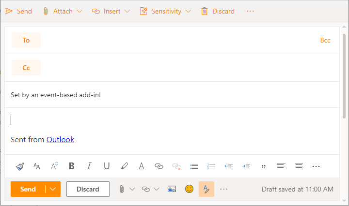
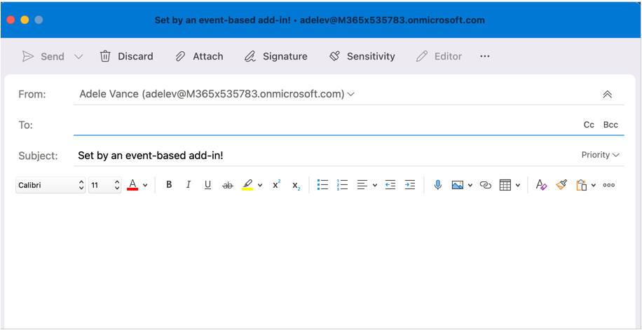
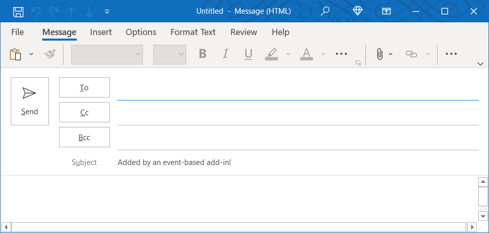

# Configure your Outlook add-in for event-based activation

Without the event-based activation feature, a user has to explicitly launch an add-in to complete their tasks. This feature enables your add-in to run tasks based on certain events, particularly for operations that apply to every item. You can also integrate with the task pane and function commands.

By the end of this walkthrough, you'll have an add-in that runs whenever a new item is created and sets the subject.

> [!NOTE]
> Support for this feature was introduced in [requirement set 1.10](/javascript/api/requirement-sets/outlook/requirement-set-1.10/outlook-requirement-set-1.10), with additional events now available in subsequent requirement sets. For details about an event's minimum requirement set and the clients and platforms that support it, see [Supported events](#supported-events) and [Requirement sets supported by Exchange servers and Outlook clients](/javascript/api/requirement-sets/outlook/outlook-api-requirement-sets#requirement-sets-supported-by-exchange-servers-and-outlook-clients).
>
> Event-based activation isn't supported in Outlook on iOS or Android.

## Supported events

The following table lists events that are currently available and the supported clients for each event. When an event is raised, the handler receives an `event` object which may include details specific to the type of event. The **Description** column includes a link to the related object where applicable.

|Event|Description|Minimum requirement set and supported clients|
|---|---|---|
|`OnNewMessageCompose`|On composing a new message (includes reply, reply all, and forward) but not on editing, for example, a draft.|[1.10](/javascript/api/requirement-sets/outlook/requirement-set-1.10/outlook-requirement-set-1.10)<br><br>- Windows<sup>1</sup><br>- Web browser<br>- New Mac UI |
|`OnNewAppointmentOrganizer`|On creating a new appointment but not on editing an existing one.|[1.10](/javascript/api/requirement-sets/outlook/requirement-set-1.10/outlook-requirement-set-1.10)<br><br>- Windows<sup>1</sup><br>- Web browser<br>- New Mac UI |
|`OnMessageAttachmentsChanged`|On adding or removing attachments while composing a message.<br><br>Event-specific data object: [AttachmentsChangedEventArgs](/javascript/api/outlook/office.attachmentschangedeventargs?view=outlook-js-1.11&preserve-view=true)|[1.11](/javascript/api/requirement-sets/outlook/requirement-set-1.11/outlook-requirement-set-1.11)<br><br>- Windows<sup>1</sup><br>- Web browser<br>- New Mac UI|
|`OnAppointmentAttachmentsChanged`|On adding or removing attachments while composing an appointment.<br><br>Event-specific data object: [AttachmentsChangedEventArgs](/javascript/api/outlook/office.attachmentschangedeventargs?view=outlook-js-1.11&preserve-view=true)|[1.11](/javascript/api/requirement-sets/outlook/requirement-set-1.11/outlook-requirement-set-1.11)<br><br>- Windows<sup>1</sup><br>- Web browser<br>- New Mac UI|
|`OnMessageRecipientsChanged`|On adding or removing recipients while composing a message.<br><br>Event-specific data object: [RecipientsChangedEventArgs](/javascript/api/outlook/office.recipientschangedeventargs?view=outlook-js-1.11&preserve-view=true)|[1.11](/javascript/api/requirement-sets/outlook/requirement-set-1.11/outlook-requirement-set-1.11)<br><br>- Windows<sup>1</sup><br>- Web browser<br>- New Mac UI|
|`OnAppointmentAttendeesChanged`|On adding or removing attendees while composing an appointment.<br><br>Event-specific data object: [RecipientsChangedEventArgs](/javascript/api/outlook/office.recipientschangedeventargs?view=outlook-js-1.11&preserve-view=true)|[1.11](/javascript/api/requirement-sets/outlook/requirement-set-1.11/outlook-requirement-set-1.11)<br><br>- Windows<sup>1</sup><br>- Web browser<br>- New Mac UI|
|`OnAppointmentTimeChanged`|On changing date/time while composing an appointment.<br><br>Event-specific data object: [AppointmentTimeChangedEventArgs](/javascript/api/outlook/office.appointmenttimechangedeventargs?view=outlook-js-1.11&preserve-view=true)|[1.11](/javascript/api/requirement-sets/outlook/requirement-set-1.11/outlook-requirement-set-1.11)<br><br>- Windows<sup>1</sup><br>- Web browser<br>- New Mac UI|
|`OnAppointmentRecurrenceChanged`|On adding, changing, or removing the recurrence details while composing an appointment. If the date/time is changed, the `OnAppointmentTimeChanged` event will also be fired.<br><br>Event-specific data object: [RecurrenceChangedEventArgs](/javascript/api/outlook/office.recurrencechangedeventargs?view=outlook-js-1.11&preserve-view=true)|[1.11](/javascript/api/requirement-sets/outlook/requirement-set-1.11/outlook-requirement-set-1.11)<br><br>- Windows<sup>1</sup><br>- Web browser<br>- New Mac UI|
|`OnInfoBarDismissClicked`|On dismissing a notification while composing a message or appointment item. Only the add-in that added the notification will be notified.<br><br>Event-specific data object: [InfobarClickedEventArgs](/javascript/api/outlook/office.infobarclickedeventargs?view=outlook-js-1.11&preserve-view=true)|[1.11](/javascript/api/requirement-sets/outlook/requirement-set-1.11/outlook-requirement-set-1.11)<br><br>- Windows<sup>1</sup><br>- Web browser<br>- New Mac UI|
|`OnMessageSend`|On sending a message item. To learn more, see the [Smart Alerts walkthrough](smart-alerts-onmessagesend-walkthrough.md).|[1.12](/javascript/api/requirement-sets/outlook/requirement-set-1.12/outlook-requirement-set-1.12)<br><br>- Windows<sup>1</sup><br>- Web browser|
|`OnAppointmentSend`|On sending an appointment item. To learn more, see the [Smart Alerts walkthrough](smart-alerts-onmessagesend-walkthrough.md).|[1.12](/javascript/api/requirement-sets/outlook/requirement-set-1.12/outlook-requirement-set-1.12)<br><br>- Windows<sup>1</sup><br>- Web browser|
|`OnMessageCompose`|On composing a new message (includes reply, reply all, and forward) or editing a draft.|[1.12](/javascript/api/requirement-sets/outlook/requirement-set-1.12/outlook-requirement-set-1.12)<br><br>- Windows<sup>1</sup><br>- Web browser|
|`OnAppointmentOrganizer`|On creating a new appointment or editing an existing one.|[1.12](/javascript/api/requirement-sets/outlook/requirement-set-1.12/outlook-requirement-set-1.12)<br><br>- Windows<sup>1</sup><br>- Web browser|

> [!NOTE]
> <sup>1</sup> Event-based add-ins in Outlook on Windows require a minimum of Windows 10 Version 1903 (Build 18362) or Windows Server 2019 Version 1903 to run.

## Set up your environment

Complete the [Outlook quick start](../quickstarts/outlook-quickstart.md?tabs=yeomangenerator) which creates an add-in project with the [Yeoman generator for Office Add-ins](../develop/yeoman-generator-overview.md).

## Configure the manifest

To enable event-based activation of your add-in, you must configure the [Runtimes](/javascript/api/manifest/runtimes) element and [LaunchEvent](/javascript/api/manifest/extensionpoint#launchevent) extension point in the `VersionOverridesV1_1` node of the manifest. For now, `DesktopFormFactor` is the only supported form factor.

1. In your code editor, open the quick start project.

1. Open the **manifest.xml** file located at the root of your project.

1. Select the entire **\<VersionOverrides\>** node (including open and close tags) and replace it with the following XML, then save your changes.

```XML
<VersionOverrides xmlns="http://schemas.microsoft.com/office/mailappversionoverrides" xsi:type="VersionOverridesV1_0">
  <VersionOverrides xmlns="http://schemas.microsoft.com/office/mailappversionoverrides/1.1" xsi:type="VersionOverridesV1_1">
    <Requirements>
      <bt:Sets DefaultMinVersion="1.10">
        <bt:Set Name="Mailbox" />
      </bt:Sets>
    </Requirements>
    <Hosts>
      <Host xsi:type="MailHost">
        <!-- Event-based activation happens in a lightweight runtime.-->
        <Runtimes>
          <!-- HTML file including reference to or inline JavaScript event handlers.
               This is used by Outlook on the web and Outlook on the new Mac UI. -->
          <Runtime resid="WebViewRuntime.Url">
            <!-- JavaScript file containing event handlers. This is used by Outlook on Windows. -->
            <Override type="javascript" resid="JSRuntime.Url"/>
          </Runtime>
        </Runtimes>
        <DesktopFormFactor>
          <FunctionFile resid="Commands.Url" />
          <ExtensionPoint xsi:type="MessageReadCommandSurface">
            <OfficeTab id="TabDefault">
              <Group id="msgReadGroup">
                <Label resid="GroupLabel" />
                <Control xsi:type="Button" id="msgReadOpenPaneButton">
                  <Label resid="TaskpaneButton.Label" />
                  <Supertip>
                    <Title resid="TaskpaneButton.Label" />
                    <Description resid="TaskpaneButton.Tooltip" />
                  </Supertip>
                  <Icon>
                    <bt:Image size="16" resid="Icon.16x16" />
                    <bt:Image size="32" resid="Icon.32x32" />
                    <bt:Image size="80" resid="Icon.80x80" />
                  </Icon>
                  <Action xsi:type="ShowTaskpane">
                    <SourceLocation resid="Taskpane.Url" />
                  </Action>
                </Control>
                <Control xsi:type="Button" id="ActionButton">
                  <Label resid="ActionButton.Label"/>
                  <Supertip>
                    <Title resid="ActionButton.Label"/>
                    <Description resid="ActionButton.Tooltip"/>
                  </Supertip>
                  <Icon>
                    <bt:Image size="16" resid="Icon.16x16"/>
                    <bt:Image size="32" resid="Icon.32x32"/>
                    <bt:Image size="80" resid="Icon.80x80"/>
                  </Icon>
                  <Action xsi:type="ExecuteFunction">
                    <FunctionName>action</FunctionName>
                  </Action>
                </Control>
              </Group>
            </OfficeTab>
          </ExtensionPoint>

          <!-- Can configure other command surface extension points for add-in command support. -->

          <!-- Enable launching the add-in on the included events. -->
          <ExtensionPoint xsi:type="LaunchEvent">
            <LaunchEvents>
              <LaunchEvent Type="OnNewMessageCompose" FunctionName="onNewMessageComposeHandler"/>
              <LaunchEvent Type="OnNewAppointmentOrganizer" FunctionName="onNewAppointmentComposeHandler"/>
              
              <!-- Other available events -->
              <!--
              <LaunchEvent Type="OnMessageAttachmentsChanged" FunctionName="onMessageAttachmentsChangedHandler" />
              <LaunchEvent Type="OnAppointmentAttachmentsChanged" FunctionName="onAppointmentAttachmentsChangedHandler" />
              <LaunchEvent Type="OnMessageRecipientsChanged" FunctionName="onMessageRecipientsChangedHandler" />
              <LaunchEvent Type="OnAppointmentAttendeesChanged" FunctionName="onAppointmentAttendeesChangedHandler" />
              <LaunchEvent Type="OnAppointmentTimeChanged" FunctionName="onAppointmentTimeChangedHandler" />
              <LaunchEvent Type="OnAppointmentRecurrenceChanged" FunctionName="onAppointmentRecurrenceChangedHandler" />
              <LaunchEvent Type="OnInfoBarDismissClicked" FunctionName="onInfobarDismissClickedHandler" />
              <LaunchEvent Type="OnMessageSend" FunctionName="onMessageSendHandler" SendMode="PromptUser" />
              <LaunchEvent Type="OnAppointmentSend" FunctionName="onAppointmentSendHandler" SendMode="PromptUser" />
              <LaunchEvent Type="OnMessageCompose" FunctionName="onMessageComposeHandler" />
              <LaunchEvent Type="OnAppointmentOrganizer" FunctionName="onAppointmentOrganizerHandler" />
              -->
            </LaunchEvents>
            <!-- Identifies the runtime to be used (also referenced by the Runtime element). -->
            <SourceLocation resid="WebViewRuntime.Url"/>
          </ExtensionPoint>
        </DesktopFormFactor>
      </Host>
    </Hosts>
    <Resources>
      <bt:Images>
        <bt:Image id="Icon.16x16" DefaultValue="https://localhost:3000/assets/icon-16.png"/>
        <bt:Image id="Icon.32x32" DefaultValue="https://localhost:3000/assets/icon-32.png"/>
        <bt:Image id="Icon.80x80" DefaultValue="https://localhost:3000/assets/icon-80.png"/>
      </bt:Images>
      <bt:Urls>
        <bt:Url id="Commands.Url" DefaultValue="https://localhost:3000/commands.html" />
        <bt:Url id="Taskpane.Url" DefaultValue="https://localhost:3000/taskpane.html" />
        <bt:Url id="WebViewRuntime.Url" DefaultValue="https://localhost:3000/commands.html" />
        <!-- Entry needed for Outlook on Windows. -->
        <bt:Url id="JSRuntime.Url" DefaultValue="https://localhost:3000/launchevent.js" />
      </bt:Urls>
      <bt:ShortStrings>
        <bt:String id="GroupLabel" DefaultValue="Contoso Add-in"/>
        <bt:String id="TaskpaneButton.Label" DefaultValue="Show Taskpane"/>
        <bt:String id="ActionButton.Label" DefaultValue="Perform an action"/>
      </bt:ShortStrings>
      <bt:LongStrings>
        <bt:String id="TaskpaneButton.Tooltip" DefaultValue="Opens a pane displaying all available properties."/>
        <bt:String id="ActionButton.Tooltip" DefaultValue="Perform an action when clicked."/>
      </bt:LongStrings>
    </Resources>
  </VersionOverrides>
</VersionOverrides>
```

Outlook on Windows uses a JavaScript file, while Outlook on the web and on the new Mac UI use an HTML file that can reference the same JavaScript file. You must provide references to both these files in the `Resources` node of the manifest as the Outlook platform ultimately determines whether to use HTML or JavaScript based on the Outlook client. As such, to configure event handling, provide the location of the HTML in the **\<Runtime\>** element, then in its `Override` child element provide the location of the JavaScript file inlined or referenced by the HTML.

> [!TIP]
>
> - To learn about runtimes in add-ins, see [Runtimes in Office Add-ins](../testing/runtimes.md).
> - To learn more about manifests for Outlook add-ins, see [Outlook add-in manifests](manifests.md).

## Implement event handling

You have to implement handling for your selected events.

In this scenario, you'll add handling for composing new items.

1. From the same quick start project, create a new folder named **launchevent** under the **./src** directory.

1. In the **./src/launchevent** folder, create a new file named **launchevent.js**.

1. Open the file **./src/launchevent/launchevent.js** in your code editor and add the following JavaScript code.

    ```js
    /*
    * Copyright (c) Microsoft Corporation. All rights reserved. Licensed under the MIT license.
    * See LICENSE in the project root for license information.
    */

    function onNewMessageComposeHandler(event) {
      setSubject(event);
    }
    function onNewAppointmentComposeHandler(event) {
      setSubject(event);
    }
    function setSubject(event) {
      Office.context.mailbox.item.subject.setAsync(
        "Set by an event-based add-in!",
        {
          "asyncContext": event
        },
        function (asyncResult) {
          // Handle success or error.
          if (asyncResult.status !== Office.AsyncResultStatus.Succeeded) {
            console.error("Failed to set subject: " + JSON.stringify(asyncResult.error));
          }

          // Call event.completed() after all work is done.
          asyncResult.asyncContext.completed();
        });
    }

    // 1st parameter: FunctionName of LaunchEvent in the manifest; 2nd parameter: Its implementation in this .js file.
    Office.actions.associate("onNewMessageComposeHandler", onNewMessageComposeHandler);
    Office.actions.associate("onNewAppointmentComposeHandler", onNewAppointmentComposeHandler);
    ```

1. Save your changes.

> [!IMPORTANT]
> Windows: At present, imports aren't supported in the JavaScript file where you implement the handling for event-based activation.

## Update the commands HTML file

1. In the **./src/commands** folder, open **commands.html**.

1. Immediately before the closing **head** tag (`</head>`), add a script entry to include the event-handling JavaScript code.

    ```html
    <script type="text/javascript" src="../launchevent/launchevent.js"></script>
    ```

1. Save your changes.

## Update webpack config settings

1. Open the **webpack.config.js** file found in the root directory of the project and complete the following steps.

1. Locate the `plugins` array within the `config` object and add this new object at the beginning of the array.

    ```js
    new CopyWebpackPlugin({
      patterns: [
        {
          from: "./src/launchevent/launchevent.js",
          to: "launchevent.js",
        },
      ],
    }),
    ```

1. Save your changes.

## Try it out

1. Run the following commands in the root directory of your project. When you run `npm start`, the local web server will start (if it's not already running) and your add-in will be sideloaded.

    ```command&nbsp;line
    npm run build
    ```

    ```command&nbsp;line
    npm start
    ```

    > [!NOTE]
    > If your add-in wasn't automatically sideloaded, then follow the instructions in [Sideload Outlook add-ins for testing](../outlook/sideload-outlook-add-ins-for-testing.md#sideload-manually) to manually sideload the add-in in Outlook.

1. In Outlook on the web, create a new message.

    

1. In Outlook on the new Mac UI, create a new message.

    

1. In Outlook on Windows, create a new message.

    

## Debug

As you make changes to launch-event handling in your add-in, you should be aware that:

- If you updated the manifest, [remove the add-in](sideload-outlook-add-ins-for-testing.md#remove-a-sideloaded-add-in), then sideload it again. If you're using Outlook on Windows, then close and reopen it.
- If you made changes to files other than the manifest, close and reopen Outlook on Windows, or refresh the browser tab running Outlook on the web.

While implementing your own functionality, you may need to debug your code. For guidance on how to debug event-based add-in activation, see [Debug your event-based Outlook add-in](debug-autolaunch.md).

Runtime logging is also available for this feature on Windows. For more information, see [Debug your add-in with runtime logging](../testing/runtime-logging.md#runtime-logging-on-windows).

[!INCLUDE [Loopback exemption note](../includes/outlook-loopback-exemption.md)]

## Deploy to users

You can deploy event-based add-ins by uploading the manifest through the Microsoft 365 admin center. In the admin portal, expand the **Settings** section in the navigation pane then select **Integrated apps**. On the **Integrated apps** page, choose the **Upload custom apps** action.


> [!IMPORTANT]
> Event-based add-ins are restricted to admin-managed deployments only. Users can't activate event-based add-ins from AppSource or in-app Office Store. To learn more, see [AppSource listing options for your event-based Outlook add-in](autolaunch-store-options.md).

[!INCLUDE [outlook-smart-alerts-deployment](../includes/outlook-smart-alerts-deployment.md)]

## Event-based activation behavior and limitations

Add-in launch-event handlers are expected to be short-running, lightweight, and as noninvasive as possible. After activation, your add-in will time out within approximately 300 seconds, the maximum length of time allowed for running event-based add-ins. To signal that your add-in has completed processing a launch event, your associated event handler must call the `event.completed` method. (Note that code included after the `event.completed` statement isn't guaranteed to run.) Each time an event that your add-in handles is triggered, the add-in is reactivated and runs the associated event handler, and the timeout window is reset. The add-in ends after it times out, or the user closes the compose window or sends the item.

If the user has multiple add-ins that subscribed to the same event, the Outlook platform launches the add-ins in no particular order. Currently, only five event-based add-ins can be actively running.

In all supported Outlook clients, the user must remain on the current mail item where the add-in was activated for it to complete running. Navigating away from the current item (for example, switching to another compose window or tab) terminates the add-in operation. The add-in also ceases operation when the user sends the message or appointment they're composing.

Imports aren't supported in the JavaScript file where you implement the handling for event-based activation in the Windows client.

Some Office.js APIs that change or alter the UI aren't allowed from event-based add-ins. The following are the blocked APIs.

- Under `Office.context.auth`:
  - `getAccessToken`
  - `getAccessTokenAsync`
    > [!NOTE]
    > [OfficeRuntime.auth](/javascript/api/office-runtime/officeruntime.auth) is supported in all Outlook versions that support event-based activation and single sign-on (SSO), while [Office.auth](/javascript/api/office/office.auth) is only supported in certain Outlook builds. For more information, see [Enable single sign-on (SSO) in Outlook add-ins that use event-based activation](use-sso-in-event-based-activation.md).
- Under `Office.context.mailbox`:
  - `displayAppointmentForm`
  - `displayMessageForm`
  - `displayNewAppointmentForm`
  - `displayNewMessageForm`
- Under `Office.context.mailbox.item`:
  - `close`
- Under `Office.context.ui`:
  - `displayDialogAsync`
  - `messageParent`

### Requesting external data

You can request external data by using an API like [Fetch](https://developer.mozilla.org/docs/Web/API/Fetch_API) or by using [XMLHttpRequest (XHR)](https://developer.mozilla.org/docs/Web/API/XMLHttpRequest), a standard web API that issues HTTP requests to interact with servers.

Be aware that you must use additional security measures when using XMLHttpRequest objects, requiring [Same Origin Policy](https://developer.mozilla.org/docs/Web/Security/Same-origin_policy) and simple [CORS (Cross-Origin Resource Sharing)](https://developer.mozilla.org/docs/Web/HTTP/CORS).

A [simple CORS](https://developer.mozilla.org/docs/Web/HTTP/CORS#simple_requests) implementation:

- Can't use cookies.
- Only supports simple methods, such as `GET`, `HEAD`, and `POST`.
- Accepts simple headers with field names `Accept`, `Accept-Language`, or `Content-Language`.
- Can use the `Content-Type`, provided that the content type is `application/x-www-form-urlencoded`, `text/plain`, or `multipart/form-data`.
- Can't have event listeners registered on the object returned by `XMLHttpRequest.upload`.
- Can't use `ReadableStream` objects in requests.

> [!NOTE]
> Full CORS support is available in Outlook on the web, Mac, and Windows (starting in version 2201, build 16.0.14813.10000).

## See also

- [Outlook add-in manifests](manifests.md)
- [How to debug event-based add-ins](debug-autolaunch.md)
- [AppSource listing options for your event-based Outlook add-in](autolaunch-store-options.md)
- [Smart Alerts and OnMessageSend walkthrough](smart-alerts-onmessagesend-walkthrough.md)
- Office Add-ins code samples:
  - [Use Outlook event-based activation to encrypt attachments, process meeting request attendees and react to appointment date/time changes](https://github.com/OfficeDev/Office-Add-in-samples/tree/main/Samples/outlook-encrypt-attachments)
  - [Use Outlook event-based activation to set the signature](https://github.com/OfficeDev/Office-Add-in-samples/tree/main/Samples/outlook-set-signature)
  - [Use Outlook event-based activation to tag external recipients](https://github.com/OfficeDev/Office-Add-in-samples/tree/main/Samples/outlook-tag-external)
  - [Use Outlook Smart Alerts](https://github.com/OfficeDev/Office-Add-in-samples/tree/main/Samples/outlook-check-item-categories)
