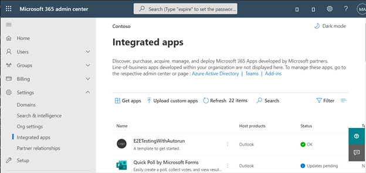
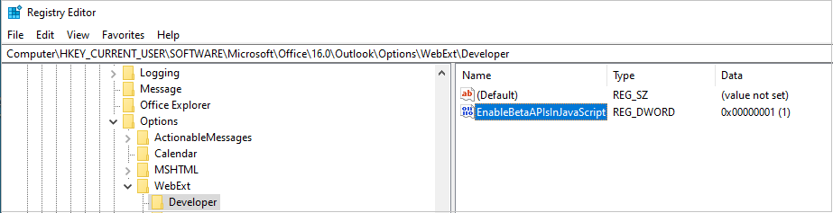

# Configure your Outlook add-in for event-based activation

The event-based activation feature lets a user use your add-in to complete their tasks without explicitly launching the add-in. Your add-in will run tasks when certain events occur, such as automatically update a mail item's attachments when the recipients change or check for a particular attachment before a mail item is sent. You can also integrate event-based activation with the task pane and function commands.

> [!NOTE]
> Support for this feature was introduced in [requirement set 1.10](/javascript/api/requirement-sets/outlook/requirement-set-1.10/outlook-requirement-set-1.10), with additional events now available in subsequent requirement sets. For details about an event's minimum requirement set and the clients and platforms that support it, see [Supported events](#supported-events) and [Requirement sets supported by Exchange servers and Outlook clients](/javascript/api/requirement-sets/outlook/outlook-api-requirement-sets#requirement-sets-supported-by-exchange-servers-and-outlook-clients).
>
> To learn how to implement an event-based add-in that runs in Outlook on mobile devices, see [Implement event-based activation in Outlook mobile add-ins](mobile-event-based.md).

## Supported events

The following table lists events that are currently available and the supported clients for each event. When an event is raised, the handler receives an `event` object which may include details specific to the type of event. The **Description** column includes a link to the related object where applicable.

|Event canonical name and XML manifest name|Unified manifest for Microsoft 365 name|Description|Minimum requirement set and supported clients|
|---|---|---|---|
|`OnNewMessageCompose`| newMessageComposeCreated |On composing a new message (includes reply, reply all, and forward) but not on editing, for example, a draft.|[1.10](/javascript/api/requirement-sets/outlook/requirement-set-1.10/outlook-requirement-set-1.10)  - Windows (classic1 and [new (preview)](https://support.microsoft.com/office/656bb8d9-5a60-49b2-a98b-ba7822bc7627)) - Web browser - New Mac UI - Android2 - iOS2|
|`OnNewAppointmentOrganizer`|newAppointmentOrganizerCreated|On creating a new appointment but not on editing an existing one.|[1.10](/javascript/api/requirement-sets/outlook/requirement-set-1.10/outlook-requirement-set-1.10)  - Windows (classic1 and [new (preview)](https://support.microsoft.com/office/656bb8d9-5a60-49b2-a98b-ba7822bc7627)) - Web browser - New Mac UI|
|`OnMessageAttachmentsChanged`|messageAttachmentsChanged|On adding or removing attachments while composing a message.  Event-specific data object: [AttachmentsChangedEventArgs](/javascript/api/outlook/office.attachmentschangedeventargs?view=outlook-js-1.11&preserve-view=true)|[1.11](/javascript/api/requirement-sets/outlook/requirement-set-1.11/outlook-requirement-set-1.11)  - Windows (classic1 and [new (preview)](https://support.microsoft.com/office/656bb8d9-5a60-49b2-a98b-ba7822bc7627)) - Web browser - New Mac UI|
|`OnAppointmentAttachmentsChanged`|appointmentAttachmentsChanged|On adding or removing attachments while composing an appointment.  Event-specific data object: [AttachmentsChangedEventArgs](/javascript/api/outlook/office.attachmentschangedeventargs?view=outlook-js-1.11&preserve-view=true)|[1.11](/javascript/api/requirement-sets/outlook/requirement-set-1.11/outlook-requirement-set-1.11)  - Windows (classic1 and [new (preview)](https://support.microsoft.com/office/656bb8d9-5a60-49b2-a98b-ba7822bc7627)) - Web browser - New Mac UI|
|`OnMessageRecipientsChanged`|messageRecipientsChanged|On adding or removing recipients while composing a message.  Event-specific data object: [RecipientsChangedEventArgs](/javascript/api/outlook/office.recipientschangedeventargs?view=outlook-js-1.11&preserve-view=true)|[1.11](/javascript/api/requirement-sets/outlook/requirement-set-1.11/outlook-requirement-set-1.11)  - Windows (classic1 and [new (preview)](https://support.microsoft.com/office/656bb8d9-5a60-49b2-a98b-ba7822bc7627)) - Web browser - New Mac UI|
|`OnAppointmentAttendeesChanged`|appointmentAttendeesChanged|On adding or removing attendees while composing an appointment.  Event-specific data object: [RecipientsChangedEventArgs](/javascript/api/outlook/office.recipientschangedeventargs?view=outlook-js-1.11&preserve-view=true)|[1.11](/javascript/api/requirement-sets/outlook/requirement-set-1.11/outlook-requirement-set-1.11)  - Windows (classic1 and [new (preview)](https://support.microsoft.com/office/656bb8d9-5a60-49b2-a98b-ba7822bc7627)) - Web browser - New Mac UI|
|`OnAppointmentTimeChanged`|appointmentTimeChanged|On changing date/time while composing an appointment.  Event-specific data object: [AppointmentTimeChangedEventArgs](/javascript/api/outlook/office.appointmenttimechangedeventargs?view=outlook-js-1.11&preserve-view=true)  **Important**: If you drag and drop an appointment to a different date/time slot on the calendar, the `OnAppointmentTimeChanged` event doesn't occur. It only occurs when the date/time is directly changed from an appointment. |[1.11](/javascript/api/requirement-sets/outlook/requirement-set-1.11/outlook-requirement-set-1.11)  - Windows (classic1 and [new (preview)](https://support.microsoft.com/office/656bb8d9-5a60-49b2-a98b-ba7822bc7627)) - Web browser - New Mac UI|
|`OnAppointmentRecurrenceChanged`|appointmentRecurrenceChanged|On adding, changing, or removing the recurrence details while composing an appointment. If the date/time is changed, the `OnAppointmentTimeChanged` event also occurs.  Event-specific data object: [RecurrenceChangedEventArgs](/javascript/api/outlook/office.recurrencechangedeventargs?view=outlook-js-1.11&preserve-view=true)|[1.11](/javascript/api/requirement-sets/outlook/requirement-set-1.11/outlook-requirement-set-1.11)  - Windows (classic1 and [new (preview)](https://support.microsoft.com/office/656bb8d9-5a60-49b2-a98b-ba7822bc7627)) - Web browser - New Mac UI|
|`OnInfoBarDismissClicked`|infoBarDismissClicked|On dismissing a notification while composing a message or appointment item. Only the add-in that added the notification will be notified.  Event-specific data object: [InfobarClickedEventArgs](/javascript/api/outlook/office.infobarclickedeventargs?view=outlook-js-1.11&preserve-view=true)|[1.11](/javascript/api/requirement-sets/outlook/requirement-set-1.11/outlook-requirement-set-1.11)  - Windows (classic1 and [new (preview)](https://support.microsoft.com/office/656bb8d9-5a60-49b2-a98b-ba7822bc7627)) - Web browser - New Mac UI|
|`OnMessageSend`|messageSending|On sending a message item. To learn more, try the [Smart Alerts walkthrough](smart-alerts-onmessagesend-walkthrough.md).|[1.12](/javascript/api/requirement-sets/outlook/requirement-set-1.12/outlook-requirement-set-1.12)  - Windows (classic1 and [new (preview)](https://support.microsoft.com/office/656bb8d9-5a60-49b2-a98b-ba7822bc7627)) - Web browser - New Mac UI|
|`OnAppointmentSend`|appointmentSending|On sending an appointment item. To learn more, see [Handle OnMessageSend and OnAppointmentSend events in your Outlook add-in with Smart Alerts](onmessagesend-onappointmentsend-events.md).|[1.12](/javascript/api/requirement-sets/outlook/requirement-set-1.12/outlook-requirement-set-1.12)  - Windows (classic1 and [new (preview)](https://support.microsoft.com/office/656bb8d9-5a60-49b2-a98b-ba7822bc7627)) - Web browser - New Mac UI|
|`OnMessageCompose`|messageComposeOpened|On composing a new message (includes reply, reply all, and forward) or editing a draft.|[1.12](/javascript/api/requirement-sets/outlook/requirement-set-1.12/outlook-requirement-set-1.12)  - Windows (classic1 and [new (preview)](https://support.microsoft.com/office/656bb8d9-5a60-49b2-a98b-ba7822bc7627)) - Web browser - New Mac UI|
|`OnAppointmentOrganizer`|appointmentOrganizerOpened|On creating a new appointment or editing an existing one.|[1.12](/javascript/api/requirement-sets/outlook/requirement-set-1.12/outlook-requirement-set-1.12)  - Windows (classic1 and [new (preview)](https://support.microsoft.com/office/656bb8d9-5a60-49b2-a98b-ba7822bc7627)) - Web browser - New Mac UI|
|`OnMessageFromChanged`|messageFromChanged|On changing the mail account in the **From** field of a message being composed. To learn more, see [Automatically update your signature when switching between Exchange accounts](onmessagefromchanged-onappointmentfromchanged-events.md).|[1.13](/javascript/api/requirement-sets/outlook/requirement-set-1.13/outlook-requirement-set-1.13)  - Windows (classic1 and [new (preview)](https://support.microsoft.com/office/656bb8d9-5a60-49b2-a98b-ba7822bc7627)) - Web browser - New Mac UI|
|`OnAppointmentFromChanged`|appointmentFromChanged|On changing the mail account in the organizer field of an appointment being composed. To learn more, see [Automatically update your signature when switching between Exchange accounts](onmessagefromchanged-onappointmentfromchanged-events.md).|[1.13](/javascript/api/requirement-sets/outlook/requirement-set-1.13/outlook-requirement-set-1.13)  - [new Outlook on Windows (preview)](https://support.microsoft.com/office/656bb8d9-5a60-49b2-a98b-ba7822bc7627) - Web browser - New Mac UI|
|`OnSensitivityLabelChanged`|sensitivityLabelChanged|On changing the sensitivity label while composing a message or appointment. To learn how to manage the sensitivity label of a mail item, see [Manage the sensitivity label of your message or appointment in compose mode](sensitivity-label.md).  Event-specific data object: [SensitivityLabelChangedEventArgs](/javascript/api/outlook/office.sensitivitylabelchangedeventargs?view=outlook-js-preview&preserve-view=true)|[1.13](/javascript/api/requirement-sets/outlook/requirement-set-1.13/outlook-requirement-set-1.13)  - Windows (classic1 and [new (preview)](https://support.microsoft.com/office/656bb8d9-5a60-49b2-a98b-ba7822bc7627)) - Web browser - New Mac UI|
|`OnMessageReadWithCustomAttachment`|Not available|On opening a message that contains a specific attachment type in read mode.|[Preview](/javascript/api/requirement-sets/outlook/preview-requirement-set/outlook-requirement-set-preview)3  - Windows1|
|`OnMessageReadWithCustomHeader`|Not available|On opening a message that contains a specific internet header name in read mode.|[Preview](/javascript/api/requirement-sets/outlook/preview-requirement-set/outlook-requirement-set-preview)3  - Windows1|

> [!NOTE]
> 1 Event-based add-ins in Outlook on Windows require a minimum of Windows 10 Version 1903 (Build 18362) or Windows Server 2019 Version 1903 to run.
>
> 2 Outlook on mobile supports APIs up to Mailbox requirement set 1.5. However, support is now enabled for additional APIs and features introduced in later requirement sets, such as the `OnNewMessageCompose` event. To learn more, see [Implement event-based activation in Outlook mobile add-ins](mobile-event-based.md).
>
> 3 To preview the `OnMessageReadWithCustomAttachment` and `OnMessageReadWithCustomHeader` events, you must install Outlook on Windows Version 2312 (Build 17110.10000) or later. Then, join the [Microsoft 365 Insider program](https://insider.microsoft365.com/join/Windows) and select the **Beta Channel** option to access Office beta builds.

## Troubleshoot your add-in

As you develop your event-based add-in, you may need to troubleshoot issues, such as your add-in not loading or the event not occurring. For guidance on how to troubleshoot an event-based add-in, see [Troubleshoot event-based and spam-reporting add-ins](troubleshoot-event-based-and-spam-reporting-add-ins.md).

## Deploy to users

Event-based add-ins are restricted to admin-managed deployments only, even if they're acquired from AppSource. If users acquire the add-in from AppSource or the in-app Office Store, they won't be able to activate the event-based function of the add-in. To learn more about listing your event-based add-in in AppSource, see [AppSource listing options for your event-based Outlook add-in](autolaunch-store-options.md).

Admin deployments are done by uploading the manifest to the Microsoft 365 admin center. In the admin portal, expand the **Settings** section in the navigation pane then select **Integrated apps**. On the **Integrated apps** page, choose the **Upload custom apps** action.

[!INCLUDE [outlook-smart-alerts-deployment](../includes/outlook-smart-alerts-deployment.md)]

### Deploy manifest updates

Because event-based add-ins are deployed by admins, any change you make to the manifest requires admin consent through the Microsoft 365 admin center. Until the admin accepts your changes, users in their organization are blocked from using the add-in. To learn more about the admin consent process, see [Admin consent for installing event-based add-ins](autolaunch-store-options.md#admin-consent-for-installing-event-based-add-ins).

## Event-based activation behavior and limitations

Add-in launch-event handlers are expected to be short-running, lightweight, and as noninvasive as possible. After activation, your add-in will time out within approximately 300 seconds, the maximum length of time allowed for running event-based add-ins. To signal that your add-in has completed processing a launch event, your associated event handler must call the [event.completed](/javascript/api/outlook/office.mailboxevent#outlook-office-mailboxevent-completed-member(1)) method. (Note that code included after the `event.completed` statement isn't guaranteed to run.) Each time an event that your add-in handles is triggered, the add-in is reactivated and runs the associated event handler, and the timeout window is reset. The add-in ends after it times out, or the user closes the compose window or sends the item.

If the user has multiple add-ins that subscribed to the same event, the Outlook platform launches the add-ins in no particular order. Currently, only five event-based add-ins can be actively running.

In all supported Outlook clients, the user must remain on the current mail item where the add-in was activated for it to complete running. Navigating away from the current item (for example, switching to another compose window or tab) terminates the add-in operation. The add-in also ceases operation when the user sends the message or appointment they're composing.

When developing an event-based add-in to run in the Outlook on Windows client, be mindful of the following:

- Imports aren't supported in the JavaScript file where you implement the handling for event-based activation.
- Add-ins don't run code included in `Office.onReady()` and `Office.initialize`. We recommend adding any startup logic, such as checking the user's Outlook version, to your event handlers instead.
- Only the JavaScript file referenced in the manifest is supported for event-based activation. You must bundle your event-handling JavaScript code into this single file. The location of the referenced JavaScript file in the manifest varies depending on the type of manifest your add-in uses.
  - **XML manifest**: **\<Override\>** child element of the **\<Runtime\>** node
  - **Unified manifest for Microsoft 365 (preview)**: "script" property of the "code" object

  Note that a large JavaScript bundle may cause issues with the performance of your add-in. We recommend preprocessing heavy operations, so that they're not included in your event-handling code.

Some Office.js APIs that change or alter the UI aren't allowed from event-based add-ins. The following are the blocked APIs.

- Under `Office.context.auth`:
  - `getAccessToken`
  - `getAccessTokenAsync`
    > [!NOTE]
    > [OfficeRuntime.auth](/javascript/api/office-runtime/officeruntime.auth) is supported in all Outlook versions that support event-based activation and single sign-on (SSO), while [Office.auth](/javascript/api/office/office.auth) is only supported in certain Outlook builds. For more information, see [Use single sign-on (SSO) or cross-origin resource sharing (CORS) in your event-based or spam-reporting Outlook add-in](use-sso-in-event-based-activation.md).
- Under `Office.context.mailbox`:
  - `displayAppointmentForm`
  - `displayMessageForm`
  - `displayNewAppointmentForm`
  - `displayNewMessageForm`
- Under `Office.context.mailbox.item`:
  - `close`
- Under `Office.context.ui`:
  - `displayDialogAsync`
  - `messageParent`

### Preview features in event handlers (Outlook on Windows)

Outlook on Windows includes a local copy of the production and beta versions of Office.js instead of loading from the content delivery network (CDN). By default, the local production copy of the API is referenced. To reference the local beta copy of the API, you must configure your computer's registry. This will enable you to test [preview features](/javascript/api/requirement-sets/outlook/preview-requirement-set/outlook-requirement-set-preview) in your event handlers in Outlook on Windows.

1. In the registry, navigate to `HKEY_CURRENT_USER\SOFTWARE\Microsoft\Office\16.0\Outlook\Options\WebExt\Developer`. If the key doesn't exist, create it.
1. Create an entry named `EnableBetaAPIsInJavaScript` and set its value to `1`.

    

### Enable single sign-on (SSO)

To enable SSO in your event-based add-in, you must add its JavaScript file to a well-known URI. For guidance on how to configure this resource, see [Use single sign-on (SSO) or cross-origin resource sharing (CORS) in your event-based or spam-reporting Outlook add-in](use-sso-in-event-based-activation.md).

### Request external data

You can request external data by using an API like [Fetch](https://developer.mozilla.org/docs/Web/API/Fetch_API) or by using [XMLHttpRequest (XHR)](https://developer.mozilla.org/docs/Web/API/XMLHttpRequest), a standard web API that issues HTTP requests to interact with servers.

Be aware that you must use additional security measures when using XMLHttpRequest objects, requiring [Same Origin Policy](https://developer.mozilla.org/docs/Web/Security/Same-origin_policy) and [CORS (Cross-Origin Resource Sharing)](https://developer.mozilla.org/docs/Web/HTTP/CORS).

> [!NOTE]
> Full CORS support is available in Outlook on the web, Mac, and Windows (starting in Version 2201, Build 16.0.14813.10000).

To make CORS requests from your event-based add-in, you must add the add-in and its JavaScript file to a well-known URI. For guidance on how to configure this resource, see [Use single sign-on (SSO) or cross-origin resource sharing (CORS) in your event-based or spam-reporting Outlook add-in](use-sso-in-event-based-activation.md).

## See also

- [Troubleshoot event-based and spam-reporting add-ins](troubleshoot-event-based-and-spam-reporting-add-ins.md)
- [Debug event-based and spam-reporting add-ins](debug-autolaunch.md)
- [AppSource listing options for your event-based Outlook add-in](autolaunch-store-options.md)
- [Handle OnMessageSend and OnAppointmentSend events in your Outlook add-in with Smart Alerts](onmessagesend-onappointmentsend-events.md)
- [Automatically set the subject of a new message or appointment](on-new-compose-events-walkthrough.md)
- [Automatically check for an attachment before a message is sent](smart-alerts-onmessagesend-walkthrough.md)
- [Automatically update your signature when switching between mail accounts](onmessagefromchanged-onappointmentfromchanged-events.md)
- Office Add-ins code samples:
  - [Encrypt attachments, process meeting request attendees, and react to appointment date/time changes using Outlook event-based activation](https://github.com/OfficeDev/Office-Add-in-samples/tree/main/Samples/outlook-encrypt-attachments)
  - [Set your signature using Outlook event-based activation](https://github.com/OfficeDev/Office-Add-in-samples/tree/main/Samples/outlook-set-signature)
  - [Identify and tag external recipients using Outlook event-based activation](https://github.com/OfficeDev/Office-Add-in-samples/tree/main/Samples/outlook-tag-external)
  - [Verify the color categories of a message or appointment before it's sent using Smart Alerts](https://github.com/OfficeDev/Office-Add-in-samples/tree/main/Samples/outlook-check-item-categories)
  - [Verify the sensitivity label of a message](https://github.com/OfficeDev/Office-Add-in-samples/tree/main/Samples/outlook-verify-sensitivity-label)
