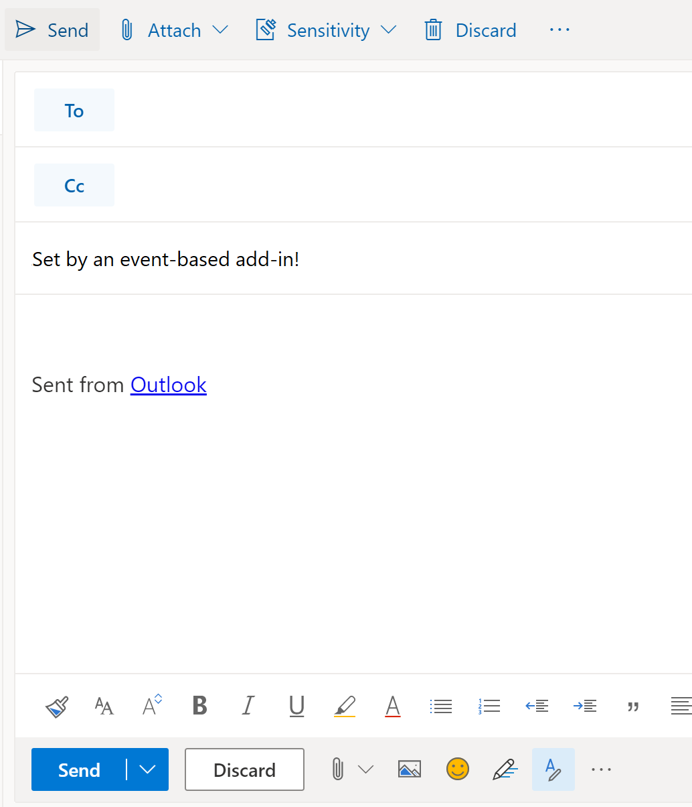

# Configure your Outlook add-in for event-based activation (preview)

Without the event-based activation feature, a user has to explicitly launch an add-in to complete their tasks. This feature enables your add-in to run tasks based on certain events, particularly for operations that apply to every item. You can also integrate with the task pane and UI-less functionality. At present, the supported events are as follows.

- `OnNewMessageCompose`: On composing a new message (includes reply, reply all, and forward)
- `OnNewAppointmentOrganizer`: On creating a new appointment

By the end of this walkthrough, you'll have an add-in that runs whenever a new message is created.

> [!IMPORTANT]
> This feature is only supported for [preview](../reference/objectmodel/preview-requirement-set/outlook-requirement-set-preview.md) in Outlook on the web with an Office 365 subscription. See [How to preview the event-based activation feature](#how-to-preview-the-event-based-activation-feature) in this article for more details.
>
> Because preview features are subject to change without notice, they shouldn't be used in production add-ins.

## How to preview the event-based activation feature

We invite you to try out the event-based activation feature! Let us know your scenarios and how we can improve by giving us feedback through GitHub (see the **Feedback** section at the end of this page).

To preview this feature:

- Reference the **beta** library on the CDN (https://appsforoffice.microsoft.com/lib/beta/hosted/office.js). The [type definition file](https://appsforoffice.microsoft.com/lib/beta/hosted/office.d.ts) for TypeScript compilation and IntelliSense is found at the CDN and [DefinitelyTyped](https://raw.githubusercontent.com/DefinitelyTyped/DefinitelyTyped/master/types/office-js-preview/index.d.ts). You can install these types with `npm install --save-dev @types/office-js-preview`.
- Request access to preview bits for Outlook on the web using your Microsoft 365 account by completing and submitting [this request form](https://aka.ms/OWAPreview). We'll let you know when your tenant is ready.

## Set up your environment

Complete the [Outlook quick start](../quickstarts/outlook-quickstart.md?tabs=yeomangenerator) which creates an add-in project with the Yeoman generator for Office Add-ins.

## Configure the manifest

To enable event-based activation of your add-in, you must configure the [Runtimes](../reference/manifest/runtimes.md) element and [LaunchEvent](../reference/manifest/extensionpoint.md#launchevent-preview) extension point in the manifest. For now, `DesktopFormFactor` is the only supported form factor.

1. In your code editor, open the quick start project.

1. Open the **manifest.xml** file located at the root of your project.

1. Select the entire `<VersionOverrides>` node (including open and close tags) and replace it with the following XML.

```XML
<VersionOverrides xmlns="http://schemas.microsoft.com/office/mailappversionoverrides" xsi:type="VersionOverridesV1_0">
  <VersionOverrides xmlns="http://schemas.microsoft.com/office/mailappversionoverrides/1.1" xsi:type="VersionOverridesV1_1">
    <Requirements>
      <bt:Sets DefaultMinVersion="1.3">
        <bt:Set Name="Mailbox" />
      </bt:Sets>
    </Requirements>
    <Hosts>
      <Host xsi:type="MailHost">
        <!-- Event-based activation happens in a lightweight runtime.-->
        <Runtimes>
          <!-- HTML file including reference to or inline JavaScript event handlers.
               This is used by Outlook on the web. -->
          <Runtime resid="WebViewRuntime.Url">
            <!-- JavaScript file containing event handlers. This is used by Outlook Desktop. -->
            <Override type="javascript" resid="JSRuntime.Url"/>
          </Runtime>
        </Runtimes>
        <DesktopFormFactor>
          <FunctionFile resid="Commands.Url" />
          <ExtensionPoint xsi:type="MessageComposeCommandSurface">
            <OfficeTab id="TabDefault">
              <Group id="msgComposeGroup">
                <Label resid="GroupLabel" />
                <Control xsi:type="Button" id="msgComposeOpenPaneButton">
                  <Label resid="TaskpaneButton.Label" />
                  <Supertip>
                    <Title resid="TaskpaneButton.Label" />
                    <Description resid="TaskpaneButton.Tooltip" />
                  </Supertip>
                  <Icon>
                    <bt:Image size="16" resid="Icon.16x16" />
                    <bt:Image size="32" resid="Icon.32x32" />
                    <bt:Image size="80" resid="Icon.80x80" />
                  </Icon>
                  <Action xsi:type="ShowTaskpane">
                    <SourceLocation resid="Taskpane.Url" />
                  </Action>
                </Control>
                <Control xsi:type="Button" id="ActionButton">
                  <Label resid="ActionButton.Label"/>
                  <Supertip>
                    <Title resid="ActionButton.Label"/>
                    <Description resid="ActionButton.Tooltip"/>
                  </Supertip>
                  <Icon>
                    <bt:Image size="16" resid="Icon.16x16"/>
                    <bt:Image size="32" resid="Icon.32x32"/>
                    <bt:Image size="80" resid="Icon.80x80"/>
                  </Icon>
                  <Action xsi:type="ExecuteFunction">
                    <FunctionName>action</FunctionName>
                  </Action>
                </Control>
              </Group>
            </OfficeTab>
          </ExtensionPoint>

          <!-- Configure AppointmentOrganizerCommandSurface extension point to support
          add-in activation on composing a new appointment. -->

          <!-- Enable launching the add-in on the included events. -->
          <ExtensionPoint xsi:type="LaunchEvent">
            <LaunchEvents>
              <LaunchEvent Type="OnNewMessageCompose" FunctionName="onMessageComposeHandler"/>
              <LaunchEvent Type="OnNewAppointmentOrganizer" FunctionName="onAppointmentComposeHandler"/>
            </LaunchEvents>
            <!-- Identifies the runtime to be used (also referenced by the Runtime element). -->
            <SourceLocation resid="WebViewRuntime.Url"/>
          </ExtensionPoint>
        </DesktopFormFactor>
      </Host>
    </Hosts>
    <Resources>
      <bt:Images>
        <bt:Image id="Icon.16x16" DefaultValue="https://localhost:3000/assets/icon-16.png"/>
        <bt:Image id="Icon.32x32" DefaultValue="https://localhost:3000/assets/icon-32.png"/>
        <bt:Image id="Icon.80x80" DefaultValue="https://localhost:3000/assets/icon-80.png"/>
      </bt:Images>
      <bt:Urls>
        <bt:Url id="Commands.Url" DefaultValue="https://localhost:3000/commands.html" />
        <bt:Url id="Taskpane.Url" DefaultValue="https://localhost:3000/taskpane.html" />
        <bt:Url id="WebViewRuntime.Url" DefaultValue="https://localhost:3000/commands.html" />
        <bt:Url id="JSRuntime.Url" DefaultValue="https://localhost:3000/runtime.js" />
      </bt:Urls>
      <bt:ShortStrings>
        <bt:String id="GroupLabel" DefaultValue="Contoso Add-in"/>
        <bt:String id="TaskpaneButton.Label" DefaultValue="Show Taskpane"/>
        <bt:String id="ActionButton.Label" DefaultValue="Perform an action"/>
      </bt:ShortStrings>
      <bt:LongStrings>
        <bt:String id="TaskpaneButton.Tooltip" DefaultValue="Opens a pane displaying all available properties."/>
        <bt:String id="ActionButton.Tooltip" DefaultValue="Perform an action when clicked."/>
      </bt:LongStrings>
    </Resources>
  </VersionOverrides>
</VersionOverrides>
```

Outlook on Windows uses a JavaScript file, while Outlook on the web uses an HTML file that references the same JavaScript file. You must provide references to both these files in the manifest as the Outlook platform ultimately determines whether to use HTML or JavaScript based on the Outlook client. As such, to configure event handling, provide the location of the HTML in the `Runtime` element, then in its `Override` child element provide the location of the JavaScript file inlined or referenced by the HTML.

> [!TIP]
> To learn more about manifests for Outlook add-ins, see [Outlook add-in manifests](manifests.md).

## Implement event handling

You have to implement handling for your selected events.

In this scenario, you'll add handling for composing new items.

1. From the same quick start project, open the file **./src/commands/commands.js** in your code editor.

1. After the `action` function, insert the following JavaScript functions.

    ```js
    function onMessageComposeHandler(event) {
      setSubject();
      event.completed();
    }
    function onAppointmentComposeHandler(event) {
      setSubject();
      event.completed();
    }
    function setSubject() {
      Office.context.mailbox.item.subject.setAsync("Set by an event-based add-in!");
    }
    ```

1. At the end of the file, add the following statements.

    ```js
    g.onMessageComposeHandler = onMessageComposeHandler;
    g.onAppointmentComposeHandler = onAppointmentComposeHandler;
    ```

## Try it out

1. Run the following command in the root directory of your project. When you run this command, the local web server will start (if it's not already running).

    ```command&nbsp;line
    npm run dev-server
    ```

1. Follow the instructions in [Sideload Outlook add-ins for testing](sideload-outlook-add-ins-for-testing.md) to sideload the add-in in Outlook.

1. In Outlook on the web, create a new message.

    

## Event-based activation behavior and limitations

Add-ins that activate based on events are designed to be short-running, up to 330 seconds only. We recommend you have your add-in call the `event.completed` method to signal it has completed processing the launch event. The add-in also ends when the user closes the compose window.

If the user has multiple add-ins that subscribed to the same event, the Outlook platform launches the add-ins in no particular order. Currently, only five event-based add-ins can be actively running. Any additional add-ins are pushed to a queue then run as previously active add-ins are completed or deactivated.

The user can switch or navigate away from the current mail item where the add-in started running. The add-in that was launched will finish its operation in the background.

Some Office.js APIs that change or alter the UI are not allowed from event-based add-ins. The following are the blocked APIs.

- Under `Office.context.mailbox`:
  - `displayAppointmentForm`
  - `displayMessageForm`
  - `displayNewAppointmentForm`
  - `displayNewMessageForm`
- Under `Office.context.ui`:
  - `displayDialogAsync`
  - `messageParent`
- Under `Office.context.auth`:
  - `getAccessTokenAsync`

## See also

[Outlook add-in manifests](manifests.md)
