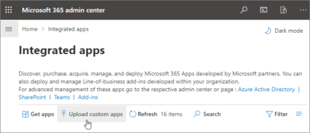

# Configure your Outlook add-in for event-based activation

Without the event-based activation feature, a user has to explicitly launch an add-in to complete their tasks. This feature enables your add-in to run tasks based on certain events, particularly for operations that apply to every item. You can also integrate with the task pane and UI-less functionality.

By the end of this walkthrough, you'll have an add-in that runs whenever a new item is created and sets the subject.

> [!NOTE]
> Support for this feature was introduced in [requirement set 1.10](../reference/objectmodel/requirement-set-1.10/outlook-requirement-set-1.10.md). See [clients and platforms](../reference/requirement-sets/outlook-api-requirement-sets.md#requirement-sets-supported-by-exchange-servers-and-outlook-clients) that support this requirement set.

## Supported events

At present, the following events are supported on the web and on Windows.

|Event|Description|Minimum<br>requirement set|
|---|---|---|
|`OnNewMessageCompose`|On composing a new message (includes reply, reply all, and forward) but not on editing, for example, a draft.|1.10|
|`OnNewAppointmentOrganizer`|On creating a new appointment but not on editing an existing one.|1.10|
|`OnMessageAttachmentsChanged`|On adding or removing attachments while composing a message.|Preview|
|`OnAppointmentAttachmentsChanged`|On adding or removing attachments while composing an appointment.|Preview|
|`OnMessageRecipientsChanged`|On adding or removing recipients while composing a message.|Preview|
|`OnAppointmentAttendeesChanged`|On adding or removing attendees while composing an appointment.|Preview|
|`OnAppointmentTimeChanged`|On changing date/time while composing an appointment.|Preview|
|`OnAppointmentRecurrenceChanged`|On adding, changing, or removing the recurrence details while composing an appointment. If the date/time is changed, the `OnAppointmentTimeChanged` event will also be fired.|Preview|
|`OnInfoBarDismissClicked`|On dismissing a notification while composing a message or appointment item. Only the add-in that added the notification will be notified.|Preview|

> [!IMPORTANT]
> Events still in preview are only available with a Microsoft 365 subscription in Outlook on the web and on Windows. For more details, see [How to preview](#how-to-preview) in this article. Preview events shouldn't be used in production add-ins.

### How to preview

We invite you to try out the events now in preview! Let us know your scenarios and how we can improve by giving us feedback through GitHub (see the **Feedback** section at the end of this page).

To preview these events:

- For Outlook on the web:
  - [Configure targeted release on your Microsoft 365 tenant](/microsoft-365/admin/manage/release-options-in-office-365?view=o365-worldwide&preserve-view=true#set-up-the-release-option-in-the-admin-center).
  - Reference the **beta** library on the CDN (https://appsforoffice.microsoft.com/lib/beta/hosted/office.js). The [type definition file](https://appsforoffice.microsoft.com/lib/beta/hosted/office.d.ts) for TypeScript compilation and IntelliSense is found at the CDN and [DefinitelyTyped](https://raw.githubusercontent.com/DefinitelyTyped/DefinitelyTyped/master/types/office-js-preview/index.d.ts). You can install these types with `npm install --save-dev @types/office-js-preview`.
- For Outlook on Windows:
  - The minimum required build is 16.0.14026.20000. Join the [Office Insider program](https://insider.office.com) for access to Office beta builds.
  - Configure the registry. Outlook includes a local copy of the production and beta versions of Office.js instead of loading from the CDN. By default, the local production copy of the API is referenced. To switch to the local beta copy of the Outlook JavaScript APIs, you need to add this registry entry, otherwise beta APIs may not be found.
    1. Create the registry key `HKEY_CURRENT_USER\SOFTWARE\Microsoft\Office\16.0\Outlook\Options\WebExt\Developer`.
    1. Add an entry named `EnableBetaAPIsInJavaScript` and set the value to `1`. The following image shows what the registry should look like.

        

## Set up your environment

Complete the [Outlook quick start](../quickstarts/outlook-quickstart.md?tabs=yeomangenerator) which creates an add-in project with the Yeoman generator for Office Add-ins.

## Configure the manifest

To enable event-based activation of your add-in, you must configure the [Runtimes](../reference/manifest/runtimes.md) element and [LaunchEvent](../reference/manifest/extensionpoint.md#launchevent) extension point in the `VersionOverridesV1_1` node of the manifest. For now, `DesktopFormFactor` is the only supported form factor.

1. In your code editor, open the quick start project.

1. Open the **manifest.xml** file located at the root of your project.

1. Select the entire `<VersionOverrides>` node (including open and close tags) and replace it with the following XML, then save your changes.

```XML
<VersionOverrides xmlns="http://schemas.microsoft.com/office/mailappversionoverrides" xsi:type="VersionOverridesV1_0">
  <VersionOverrides xmlns="http://schemas.microsoft.com/office/mailappversionoverrides/1.1" xsi:type="VersionOverridesV1_1">
    <Requirements>
      <bt:Sets DefaultMinVersion="1.3">
        <bt:Set Name="Mailbox" />
      </bt:Sets>
    </Requirements>
    <Hosts>
      <Host xsi:type="MailHost">
        <!-- Event-based activation happens in a lightweight runtime.-->
        <Runtimes>
          <!-- HTML file including reference to or inline JavaScript event handlers.
               This is used by Outlook on the web. -->
          <Runtime resid="WebViewRuntime.Url">
            <!-- JavaScript file containing event handlers. This is used by Outlook Desktop. -->
            <Override type="javascript" resid="JSRuntime.Url"/>
          </Runtime>
        </Runtimes>
        <DesktopFormFactor>
          <FunctionFile resid="Commands.Url" />
          <ExtensionPoint xsi:type="MessageReadCommandSurface">
            <OfficeTab id="TabDefault">
              <Group id="msgReadGroup">
                <Label resid="GroupLabel" />
                <Control xsi:type="Button" id="msgReadOpenPaneButton">
                  <Label resid="TaskpaneButton.Label" />
                  <Supertip>
                    <Title resid="TaskpaneButton.Label" />
                    <Description resid="TaskpaneButton.Tooltip" />
                  </Supertip>
                  <Icon>
                    <bt:Image size="16" resid="Icon.16x16" />
                    <bt:Image size="32" resid="Icon.32x32" />
                    <bt:Image size="80" resid="Icon.80x80" />
                  </Icon>
                  <Action xsi:type="ShowTaskpane">
                    <SourceLocation resid="Taskpane.Url" />
                  </Action>
                </Control>
                <Control xsi:type="Button" id="ActionButton">
                  <Label resid="ActionButton.Label"/>
                  <Supertip>
                    <Title resid="ActionButton.Label"/>
                    <Description resid="ActionButton.Tooltip"/>
                  </Supertip>
                  <Icon>
                    <bt:Image size="16" resid="Icon.16x16"/>
                    <bt:Image size="32" resid="Icon.32x32"/>
                    <bt:Image size="80" resid="Icon.80x80"/>
                  </Icon>
                  <Action xsi:type="ExecuteFunction">
                    <FunctionName>action</FunctionName>
                  </Action>
                </Control>
              </Group>
            </OfficeTab>
          </ExtensionPoint>

          <!-- Can configure other command surface extension points for add-in command support. -->

          <!-- Enable launching the add-in on the included events. -->
          <ExtensionPoint xsi:type="LaunchEvent">
            <LaunchEvents>
              <LaunchEvent Type="OnNewMessageCompose" FunctionName="onMessageComposeHandler"/>
              <LaunchEvent Type="OnNewAppointmentOrganizer" FunctionName="onAppointmentComposeHandler"/>
              <LaunchEvent Type="OnMessageAttachmentsChanged" FunctionName="onMessageAttachmentsChangedHandler" />
              <LaunchEvent Type="OnAppointmentAttachmentsChanged" FunctionName="onAppointmentAttachmentsChangedHandler" />
              <LaunchEvent Type="OnMessageRecipientsChanged" FunctionName="onMessageRecipientsChangedHandler" />
              <LaunchEvent Type="OnAppointmentAttendeesChanged" FunctionName="onAppointmentAttendeesChangedHandler" />
              <LaunchEvent Type="OnAppointmentTimeChanged" FunctionName="onAppointmentTimeChangedHandler" />
              <LaunchEvent Type="OnAppointmentRecurrenceChanged" FunctionName="onAppointmentRecurrenceChangedHandler" />
              <LaunchEvent Type="OnInfoBarDismissClicked" FunctionName="onInfobarDismissClickedHandler" />
            </LaunchEvents>
            <!-- Identifies the runtime to be used (also referenced by the Runtime element). -->
            <SourceLocation resid="WebViewRuntime.Url"/>
          </ExtensionPoint>
        </DesktopFormFactor>
      </Host>
    </Hosts>
    <Resources>
      <bt:Images>
        <bt:Image id="Icon.16x16" DefaultValue="https://localhost:3000/assets/icon-16.png"/>
        <bt:Image id="Icon.32x32" DefaultValue="https://localhost:3000/assets/icon-32.png"/>
        <bt:Image id="Icon.80x80" DefaultValue="https://localhost:3000/assets/icon-80.png"/>
      </bt:Images>
      <bt:Urls>
        <bt:Url id="Commands.Url" DefaultValue="https://localhost:3000/commands.html" />
        <bt:Url id="Taskpane.Url" DefaultValue="https://localhost:3000/taskpane.html" />
        <bt:Url id="WebViewRuntime.Url" DefaultValue="https://localhost:3000/commands.html" />
        <!-- Entry needed for Outlook Desktop. -->
        <bt:Url id="JSRuntime.Url" DefaultValue="https://localhost:3000/src/commands/commands.js" />
      </bt:Urls>
      <bt:ShortStrings>
        <bt:String id="GroupLabel" DefaultValue="Contoso Add-in"/>
        <bt:String id="TaskpaneButton.Label" DefaultValue="Show Taskpane"/>
        <bt:String id="ActionButton.Label" DefaultValue="Perform an action"/>
      </bt:ShortStrings>
      <bt:LongStrings>
        <bt:String id="TaskpaneButton.Tooltip" DefaultValue="Opens a pane displaying all available properties."/>
        <bt:String id="ActionButton.Tooltip" DefaultValue="Perform an action when clicked."/>
      </bt:LongStrings>
    </Resources>
  </VersionOverrides>
</VersionOverrides>
```

Outlook on Windows uses a JavaScript file, while Outlook on the web uses an HTML file that can reference the same JavaScript file. You must provide references to both these files in the `Resources` node of the manifest as the Outlook platform ultimately determines whether to use HTML or JavaScript based on the Outlook client. As such, to configure event handling, provide the location of the HTML in the `Runtime` element, then in its `Override` child element provide the location of the JavaScript file inlined or referenced by the HTML.

> [!TIP]
> To learn more about manifests for Outlook add-ins, see [Outlook add-in manifests](manifests.md).

## Implement event handling

You have to implement handling for your selected events.

In this scenario, you'll add handling for composing new items.

1. From the same quick start project, open the file **./src/commands/commands.js** in your code editor.

1. After the `action` function, insert the following JavaScript functions.

    ```js
    function onMessageComposeHandler(event) {
      setSubject(event);
    }
    function onAppointmentComposeHandler(event) {
      setSubject(event);
    }
    function setSubject(event) {
      Office.context.mailbox.item.subject.setAsync(
        "Set by an event-based add-in!",
        {
          "asyncContext" : event
        },
        function (asyncResult) {
          // Handle success or error.
          if (asyncResult.status !== Office.AsyncResultStatus.Succeeded) {
            console.error("Failed to set subject: " + JSON.stringify(asyncResult.error));
          }
    
          // Call event.completed() after all work is done.
          asyncResult.asyncContext.completed();
        });
    }
    ```

1. Add the following JavaScript code at the end of the file.

    ```js
    // 1st parameter: FunctionName of LaunchEvent in the manifest; 2nd parameter: Its implementation in this .js file.
    Office.actions.associate("onMessageComposeHandler", onMessageComposeHandler);
    Office.actions.associate("onAppointmentComposeHandler", onAppointmentComposeHandler);
    ```

1. Save your changes.

> [!IMPORTANT]
> Windows: At present, imports are not supported in the JavaScript file where you implement the handling for event-based activation.

## Try it out

1. Run the following command in the root directory of your project. When you run this command, the local web server will start (if it's not already running) and your add-in will be sideloaded.

    ```command&nbsp;line
    npm start
    ```

    > [!NOTE]
    > If your add-in wasn't automatically sideloaded, then follow the instructions in [Sideload Outlook add-ins for testing](../outlook/sideload-outlook-add-ins-for-testing.md#sideload-manually) to manually sideload the add-in in Outlook.

1. In Outlook on the web, create a new message.

    

1. In Outlook on Windows, create a new message.

    

    > [!NOTE]
    > If you're running your add-in from localhost and see the error "We're sorry, we couldn't access *{your-add-in-name-here}*. Make sure you have a network connection. If the problem continues, please try again later.", you may need to enable a loopback exemption.
    >
    > 1. Close Outlook.
    > 1. Open the **Task Manager** and ensure that the **msoadfsb.exe** process is not running.
    > 1. Run the following command.
    >
    >    ```command&nbsp;line
    >    call %SystemRoot%\System32\CheckNetIsolation.exe LoopbackExempt -a -n=1_http___localhost_300004ACA5EC-D79A-43EA-AB47-E50E47DD96FC
    >    ```
    >
    > 1. Restart Outlook.

## Debug

As you make changes to launch-event handling in your add-in, you should be aware that:

- If you updated the manifest, [remove the add-in](sideload-outlook-add-ins-for-testing.md#remove-a-sideloaded-add-in) then sideload it again.
- If you made changes to files other than the manifest, close and reopen Outlook on Windows, or refresh the browser tab running Outlook on the web.

While implementing your own functionality, you may need to debug your code. For guidance on how to debug event-based add-in activation, see [Debug your event-based Outlook add-in](debug-autolaunch.md).

Runtime logging is also available for this feature on Windows. For more information, see [Debug your add-in with runtime logging](../testing/runtime-logging.md#runtime-logging-on-windows).

## Deploy to users

You can deploy event-based add-ins by uploading the manifest through the Microsoft 365 admin center. In the admin portal, expand the **Settings** section in the navigation pane then select **Integrated apps**. On the **Integrated apps** page, choose the **Upload custom apps** action.



AppSource and inclient stores: The ability to deploy event-based add-ins or update existing add-ins to include the event-based activation feature should be available soon.

> [!IMPORTANT]
> Event-based add-ins are restricted to admin-managed deployments only. For now, users can't get event-based add-ins from AppSource or inclient stores.

## Event-based activation behavior and limitations

Add-in launch-event handlers are expected to be short-running, lightweight, and as noninvasive as possible. After activation, your add-in will time out within approximately 300 seconds, the maximum length of time allowed for running event-based add-ins. To signal that your add-in has completed processing a launch event, we recommend you have the associated handler call the `event.completed` method. (Note that code included after the `event.completed` statement is not guaranteed to run.) Each time an event that your add-in handles is triggered, the add-in is reactivated and runs the associated event handler, and the timeout window is reset. The add-in ends after it times out, or the user closes the compose window or sends the item.

If the user has multiple add-ins that subscribed to the same event, the Outlook platform launches the add-ins in no particular order. Currently, only five event-based add-ins can be actively running.

The user can switch or navigate away from the current mail item where the add-in started running. The add-in that was launched will finish its operation in the background.

Imports are not supported in the JavaScript file where you implement the handling for event-based activation in the Windows client.

Some Office.js APIs that change or alter the UI are not allowed from event-based add-ins. The following are the blocked APIs.

- Under `OfficeRuntime.auth`:
  - `getAccessToken` (Windows only)
- Under `Office.context.auth`:
  - `getAccessToken`
  - `getAccessTokenAsync`
- Under `Office.context.mailbox`:
  - `displayAppointmentForm`
  - `displayMessageForm`
  - `displayNewAppointmentForm`
  - `displayNewMessageForm`
- Under `Office.context.mailbox.item`:
  - `close`
- Under `Office.context.ui`:
  - `displayDialogAsync`
  - `messageParent`

### Requesting external data

You can request external data by using an API like [Fetch](https://developer.mozilla.org/docs/Web/API/Fetch_API) or by using [XmlHttpRequest (XHR)](https://developer.mozilla.org/docs/Web/API/XMLHttpRequest), a standard web API that issues HTTP requests to interact with servers.

Be aware that you must use additional security measures when making XmlHttpRequests, requiring [Same Origin Policy](https://developer.mozilla.org/docs/Web/Security/Same-origin_policy) and simple [CORS](https://www.w3.org/TR/cors/).

A simple CORS implementation cannot use cookies and only supports simple methods (GET, HEAD, POST). Simple CORS accepts simple headers with field names `Accept`, `Accept-Language`, `Content-Language`. You can also use a `Content-Type` header in simple CORS, provided that the content type is `application/x-www-form-urlencoded`, `text/plain`, or `multipart/form-data`.

Full CORS support is coming soon.

## See also

- [Outlook add-in manifests](manifests.md)
- [How to debug event-based add-ins](debug-autolaunch.md)
- [AppSource listing options for your event-based Outlook add-in](autolaunch-store-options.md)
- PnP samples:
  - [Use Outlook event-based activation to set the signature](https://github.com/OfficeDev/PnP-OfficeAddins/tree/main/Samples/outlook-set-signature)
  - [Use Outlook event-based activation to tag external recipients](https://github.com/OfficeDev/PnP-OfficeAddins/tree/main/Samples/outlook-tag-external)
