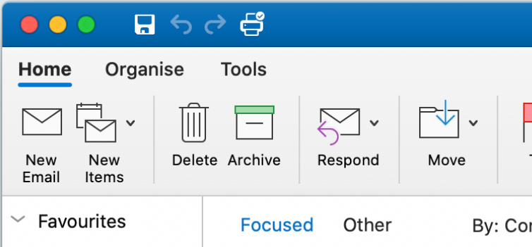
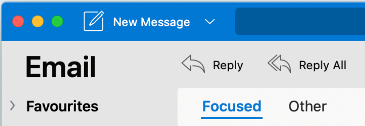

---
title: Compare Outlook add-in support in Outlook on Mac
description: Learn how add-in support in Outlook on Mac compares with other Outlook clients.
ms.date: 08/13/2025
ms.localizationpriority: medium
---

# Compare Outlook add-in support in Outlook on Mac with other Outlook clients

You can create and run an Outlook add-in the same way in Outlook on Mac as in the other clients, including Outlook on the web, Windows ([new](https://support.microsoft.com/office/656bb8d9-5a60-49b2-a98b-ba7822bc7627) and classic), iOS, and Android, without customizing the JavaScript for each client. The same calls from the add-in to the Office JavaScript API generally work the same way, except for the areas described in the following table.

For more information, see [Deploy and install Outlook add-ins for testing](testing-and-tips.md).

| Area | Outlook on the web, Windows (new and classic), and mobile devices | Outlook on Mac |
|:-----|:-----|:-----|
| Supported versions of office.js| All APIs in Office.js. | All APIs in Office.js.  **NOTE**: In Outlook on Mac, only Version 16.35 (20030802) or later supports saving a meeting. Otherwise, the `saveAsync` method fails when called from a meeting in compose mode. See [Cannot save a meeting as a draft in Outlook for Mac by using Office JS API](https://support.microsoft.com/help/4505745) for a workaround. |
| Instances of a recurring appointment series | <ul><li>Can get the item ID and other properties of a master appointment or appointment instance of a recurring series.</li><li>Can use [mailbox.displayAppointmentForm](/javascript/api/requirement-sets/outlook/preview-requirement-set/office.context.mailbox#methods) to display an instance or the master of a recurring series.</li></ul> | <ul><li>Can get the item ID and other properties of the master appointment, but not those of an instance of a recurring series.</li><li>Can display the master appointment of a recurring series. Without the item ID, cannot display an instance of a recurring series.</li></ul> |
| Recipient type of an appointment attendee | Can use [EmailAddressDetails.recipientType](/javascript/api/outlook/office.emailaddressdetails#outlook-office-emailaddressdetails-recipienttype-member) to identify the recipient type of an attendee. | `EmailAddressDetails.recipientType` returns `undefined` for appointment attendees. |
| Version string of the client application | The format of the version string returned by [diagnostics.hostVersion](/javascript/api/outlook/office.diagnostics#outlook-office-diagnostics-hostversion-member) depends on the Outlook client. <ul><li>Outlook on Windows: Returns the version of the Outlook client. For example, `16.0.4454.1002`.</li><li>Outlook on the web and new Outlook on Windows: Returns the version of the Exchange Server. For example, `15.0.918.2`</li></ul> |The `diagnostics.hostVersion` call returns the version of the Outlook client. For example, `16.0 (140325)`.|
| Custom properties of an item | If the network goes down, an add-in can still access cached custom properties. | Because Outlook on Mac does not cache custom properties, if the network goes down, add-ins would not be able to access them. |
| Attachment details | The content type and attachment names in an [AttachmentDetails](/javascript/api/outlook/office.attachmentdetails) object depend on the type of client:<ul><li>A JSON example of `AttachmentDetails.contentType`: `"contentType": "image/x-png"`. </li><li>`AttachmentDetails.name` does not contain any filename extension. As an example, if the attachment is a message that has the subject "RE: Summer activity", the JSON object that represents the attachment name would be `"name": "RE: Summer activity"`.</li></ul> | <ul><li>A JSON example of `AttachmentDetails.contentType`: `"contentType" "image/png"`</li><li>`AttachmentDetails.name` always includes a filename extension. Attachments that are mail items have a .eml extension, and appointments have a .ics extension. As an example, if an attachment is an email with the subject "RE: Summer activity", the JSON object that represents the attachment name would be `"name": "RE: Summer activity.eml"`.
**NOTE**: If a file is programmatically attached (e.g through an add-in) without an extension then the `AttachmentDetails.name`  will not contain the extension as part of filename.
</li></ul> |
| String representing the time zone in the `dateTimeCreated` and `dateTimeModified` properties |As an example: `Thu Mar 13 2014 14:09:11 GMT+0800 (China Standard Time)` | As an example: `Thu Mar 13 2014 14:09:11 GMT+0800 (CST)` |
| Time accuracy of `dateTimeCreated` and `dateTimeModified` | If an add-in uses the following code, the accuracy is up to a millisecond. `JSON.stringify(Office.context.mailbox.item, null, 4);`| The accuracy is up to only a second. |

## Add-in support in Outlook on new Mac UI

Outlook add-ins are now supported in the new Mac UI (available from Outlook version 16.38.506). For requirement sets currently supported in the new Mac UI, see [Outlook API requirement set client support](/javascript/api/requirement-sets/outlook/outlook-api-requirement-sets#outlook-client-support).

To learn more about the new Mac UI, see [The new Outlook for Mac](https://support.microsoft.com/office/6283be54-e74d-434e-babb-b70cefc77439).

You can determine which UI version you're on, as follows:

**Classic UI**

**New UI**

## Support for add-ins with the unified manifest for Microsoft 365

Add-ins that use the [unified manifest for Microsoft 365](../develop/unified-manifest-overview.md) aren't directly supported in Outlook on Mac. To run this type of add-in, it must first be published to [Microsoft Marketplace](https://marketplace.microsoft.com/) then deployed in the [Microsoft 365 admin center](../publish/publish.md#integrated-apps-portal-in-the-microsoft-365-admin-center). An add-in only manifest is then generated from the unified manifest, which enables the add-in to be installed in Outlook on Mac.

> [!NOTE]
> Custom add-ins or line-of-business (LOB) add-ins that use the unified manifest can be deployed in the [Integrated apps portal](/microsoft-365/admin/manage/test-and-deploy-microsoft-365-apps) of the Microsoft 365 admin center, but they won't be installable in Outlook on Mac.

For more information, see the "Client and platform support" section of [Office Add-ins with the unified app manifest for Microsoft 365](../develop/unified-manifest-overview.md#client-and-platform-support).
