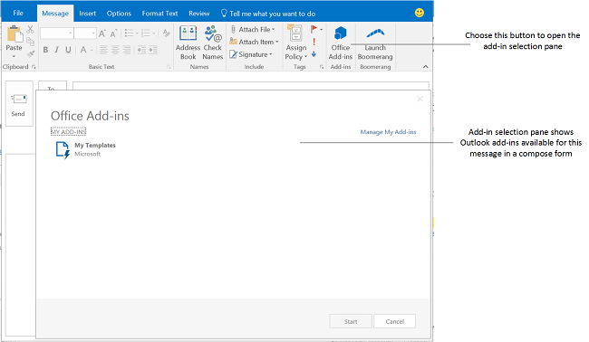

# Create Outlook add-ins for compose forms

You can create compose add-ins, which are Outlook add-ins activated in compose forms. In contrast with read add-ins (Outlook add-ins that are activated in read mode when a user is viewing a message or appointment), compose add-ins are available in the following user scenarios.

- Composing a new message, meeting request, or appointment in a compose form.

- Viewing or editing an existing appointment, or meeting item in which the user is the organizer.

   > [!NOTE]
   > If the user is on the RTM release of Outlook 2013 and Exchange 2013 and is viewing a meeting item organized by the user, the user can find read add-ins available. Starting in the Office 2013 SP1 release, there's a change such that in the same scenario, only compose add-ins can activate and be available.

- Composing an inline response message or replying to a message in a separate compose form.

- Editing a response (**Accept**, **Tentative**, or **Decline**) to a meeting request or meeting item.

- Proposing a new time for a meeting item.

- Forwarding or replying to a meeting request or meeting item.

In each of these compose scenarios, any add-in command buttons defined by the add-in are shown. For older add-ins that do not implement add-in commands, users can choose **Office Add-ins** in the ribbon to open the add-in selection pane, and then choose and start a compose add-in. The following figure shows add-in commands in a compose form.

The following figure shows the add-in selection pane consisting of two compose add-ins that do not implement add-in commands, activated when the user is composing an inline reply in Outlook.

## Types of add-ins available in compose mode

Compose add-ins are implemented as [add-in commands](../design/add-in-commands.md). To activate add-ins for composing email or meeting responses, add-ins include a [MessageComposeCommandSurface extension point element](/javascript/api/manifest/extensionpoint#messagecomposecommandsurface) in the manifest. To activate add-ins for composing or editing appointments or meetings where the user is the organizer, add-ins include a [AppointmentOrganizerCommandSurface extension point element](/javascript/api/manifest/extensionpoint#appointmentorganizercommandsurface).

> [!NOTE]
> Add-ins developed for servers or clients that do not support add-in commands use [activation rules](activation-rules.md) in a [Rule](/javascript/api/manifest/rule) element contained in the [OfficeApp](/javascript/api/manifest/officeapp) element. Unless the add-in is being specifically developed for older clients and servers, new add-ins should use add-in commands.
>
[!include[Rule features not supported with unified Microsoft 365 manifest](../includes/rules-not-supported-json-note.md)]

## API features available to compose add-ins

- [Add and remove attachments to an item in a compose form in Outlook](add-and-remove-attachments-to-an-item-in-a-compose-form.md)
- [Get and set item data in a compose form in Outlook](get-and-set-item-data-in-a-compose-form.md)
- [Get, set, or add recipients when composing an appointment or message in Outlook](get-set-or-add-recipients.md)
- [Get or set the subject when composing an appointment or message in Outlook](get-or-set-the-subject.md)
- [Insert data in the body when composing an appointment or message in Outlook](insert-data-in-the-body.md)
- [Get or set the location when composing an appointment in Outlook](get-or-set-the-location-of-an-appointment.md)
- [Get or set the time when composing an appointment in Outlook](get-or-set-the-time-of-an-appointment.md)

## See also

- [Get Started with Outlook add-ins for Office](../quickstarts/outlook-quickstart.md)
