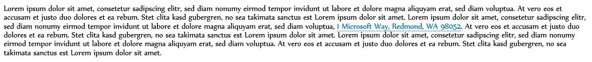

# Contextual Outlook add-ins

Contextual add-ins are Outlook add-ins that activate based on text in a message or appointment. By using contextual add-ins, a user can initiate tasks related to a message without leaving the message itself, which results in an easier and richer user experience.

Contextual add-ins are different from add-ins that involve attachments or that are specific to certain message types. The following are examples of contextual add-ins:


- Choosing an address to open a map of the location.
    
- Choosing a string that opens a meeting suggestion add-in.
    
- Choosing a phone number to add to your contacts.
    
Currently, contextual add-ins are limited to Outlook Web App.

## How to make a contextual add-in

To make a contextual add-in, its add-in manifest must specify the entity or regular expression that can activate it. The entity can be any of the properties in the [Entities](../../reference/outlook/simple-types.md) object. Thus, the add-in manifest must contain a rule of type **ItemHasKnownEntity** or **ItemHasRegularExpressionMatch**. The following example shows how to specify an entity that is a phone number:


```XML
<Rule xsi:type="ItemHasKnownEntity" EntityType="PhoneNumber"/>

```

After a contextual add-in is associated with an account, it will automatically start when the user clicks a highlighted entity or regular expression. For more information on regular expressions for Outlook add-ins, see [Use regular expression activation rules to show an Outlook add-in](../outlook/use-regular-expressions-to-show-an-outlook-add-in.md).

There are several restrictions on contextual add-ins:


- A contextual add-in can only exist in read add-ins (not compose add-ins).
    
- You cannot specify the color of the highlighted entity.
    
- An entity that is not highlighted will not launch a contextual add-in in a card.
    
- The dimension of the card is 140-450 pixels (recommended limit 300 pixels) in height and 570 pixels in width.
    
- You cannot specify whether the add-in will display in the card or the add-in bar.
    

## How to launch a contextual add-in

A user launches a contextual add-in through text, either a known entity or a developer's regular expression, or by the add-in bar. Typically, a user identifies a contextual add-in because the entity is highlighted. The following example shows how highlighting appears in a message. Here the entity (an address) is colored blue and underlined with a dotted blue line. A user launches the contextual add-in by clicking the highlighted entity. 


**Example of text with highlighted entity (an address)**



While highlighting is the best indication of contextual add-ins, there are some cases where a contextual add-in will appear in the add-in bar:

- When the entity is a URL or an email address
    
- When the add-in manifest has a rule with type="ItemHasRegularExpressionMatch" and PropertyName="BodyAsHTML" or PropertyName="SenderSMTPAddress"
    
- When the add-in manifest contains an activation rule that uses an OR RuleCollection where the first rule has type="ItemIs" with itemType="Appointment" or "Message" and where the second rule has type="ItemHasKnownEntity" or "ItemHasRegularExpressionMatch"
    
- If the complexity of the email body affects the mail client
    
When there are multiple entities or contextual add-ins in a message, there are a few user interaction rules:


- If there are multiple entities, the user has to click a different entity to launch the add-in for it.
    
- If an entity activates multiple add-ins, each add-in opens a new tab. The user switches between tabs, similar to the add-in bar, to change between add-ins. For example, a name and address might trigger a phone add-in and a map.
    
- If a single string contains multiple entities that activate multiple add-ins, the entire string is highlighted, and clicking the string shows all add-ins relevant to the string on separate tabs. For example, a string that describes a proposed meeting at a restaurant might activate the Suggested Meeting add-in and a restaurant rating add-in.
    

## How a contextual add-in displays

An activated contextual add-in appears in one of two places:


- In the card, which is a separate window near the entity
    
- In the add-in bar, which is the line between the sender and the body of a message
    
The card will normally appear below the entity and centered with respect to the entity as much as possible. If there is not enough room below the entity, the card is placed above it. The following screenshot shows the highlighted entity, and below it, an activated add-in (Bing Maps) in a card.


**Example of an add-in displayed in a card**


Note the following:

- The "Bing Maps" tab appears as white text with a blue background. If a new add-in is selected, the tab will change to blue text with a white background.
    
- Additional add-in tabs, if any, would appear in a tab to the right of "Bing Maps" with blue text and a white background. When a user clicks any tab, it changes to white text with a blue background, and the new add-in loads.
    
- Clicking the "+ Get more add-ins" button opens the Office Store.
    
- If the add-in name is too large for the available space, it is replaced with "..." that is to the left of the "+ Get more add-ins". The user can then click that to see a dropdown list of the add-ins that wouldn't fit into the bar.
    
- To close the card and end the add-in, a user clicks anywhere outside of the card.
    
The following screenshot shows how the same add-in (in this case Bing Maps) would appear in the bar if the text couldn't be highlighted (for example, if it was contained in a hyperlink).


**Example of an add-in bar and an add-in in an iframe**


Note the following:

- In this screenshot, the add-in bar shows the name of the launched add-in and the "+ Get more add-ins" above the iframe. If there are any other add-ins (contextual or not) that launch from the add-in bar, they would also appear.
    
- The iframe displays the add-in. The developer can set the height of the iframe, but the width is a fixed value. The same height is used for the add-in bar add-in as for the card; the developer doesn't need to specify two separate heights.
    

## How contextual add-ins appear on different devices

On a desktop computer, a contextual add-in typically displays in a card; if there are multiple add-ins, they appear on separate tabs. On tablets, the same add-in displays in an overleaf and, if there are multiple add-ins, they appear in tabs. On phones, the add-in displays as an immersive experience. In the case where there are multiple add-ins that have activated on the entity, a "..." is visible in the top right to let users navigate between the different add-ins on the specific entity.


## Current contextual add-ins

The following contextual add-ins are installed by default for users with Outlook add-ins:


- Bing Maps 
    
- Suggested Meetings
    
Also, the [Package Tracker](https://store.office.com/package-tracker-WA104162083.aspx?assetid=WA104162083.aspx) contextual add-in is available from the Office Store.


## Additional Resources


- [Get Started with Outlook add-ins for Office 365](https://dev.outlook.com/MailAppsGettingStarted/GetStarted.aspx)
    
- [Use regular expression activation rules to show an Outlook add-in](../outlook/use-regular-expressions-to-show-an-outlook-add-in.md)

- [Entities object](../../reference/outlook/simple-types.md#Entities)
    
