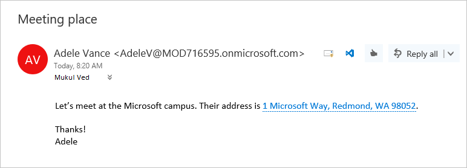

# Contextual Outlook add-ins

Contextual add-ins are Outlook add-ins that activate based on text in a message or appointment. By using contextual add-ins, a user can initiate tasks related to a message without leaving the message itself, which results in an easier and richer user experience.

[!include[Unified Microsoft 365 manifest does not support contextual add-ins](../includes/json-manifest-outlook-contextual-not-supported.md)]

The following are examples of contextual add-ins.

- Choosing an address to open a map of the location.
- Choosing a string that opens a meeting suggestion add-in.
- Choosing a phone number to add to your contacts.


> [!NOTE]
> Contextual add-ins are not currently available in Outlook on Android and iOS. This functionality will be made available in the future.
>
> Support for this feature was introduced in requirement set 1.6. See [clients and platforms](/javascript/api/requirement-sets/outlook/outlook-api-requirement-sets#requirement-sets-supported-by-exchange-servers-and-outlook-clients) that support this requirement set.

## How to make a contextual add-in

A contextual add-in's manifest must include an [ExtensionPoint](/javascript/api/manifest/extensionpoint#detectedentity) element with an `xsi:type` attribute set to `DetectedEntity`. Within the **\<ExtensionPoint\>** element, the add-in specifies the entities or regular expression that can activate it. If an entity is specified, the entity can be any of the properties in the [Entities](/javascript/api/outlook/office.entities) object.

Thus, the add-in manifest must contain a rule of type **ItemHasKnownEntity** or **ItemHasRegularExpressionMatch**. The following example shows how to specify that an add-in should activate on messages with a detected entity that is a phone number.

```XML
<ExtensionPoint xsi:type="DetectedEntity">
  <Label resid="contextLabel" />
  <!--If you opt to include RequestedHeight, it must be between 140px to 450px, inclusive.-->
  <!--<RequestedHeight>360</RequestedHeight>-->
  <SourceLocation resid="detectedEntityURL" />
  <Rule xsi:type="RuleCollection" Mode="And">
    <Rule xsi:type="ItemIs" ItemType="Message" />
    <Rule xsi:type="ItemHasKnownEntity" EntityType="PhoneNumber" Highlight="all" />
  </Rule>
</ExtensionPoint>
```

After a contextual add-in is associated with an account, it will automatically start when the user clicks a highlighted entity or regular expression. For more information about regular expressions for Outlook add-ins, see [Use regular expression activation rules to show an Outlook add-in](use-regular-expressions-to-show-an-outlook-add-in.md).

There are several restrictions on contextual add-ins:

- A contextual add-in can only exist in read add-ins (not compose add-ins).
- You cannot specify the color of the highlighted entity.
- An entity that is not highlighted will not launch a contextual add-in in a card.

Because an entity or regular expression that is not highlighted will not launch a contextual add-in, add-ins must include at least one `Rule` element with the `Highlight` attribute set to `all`.

> [!NOTE]
> The `EmailAddress` and `Url` entity types do not support highlighting, so they cannot be used to launch a contextual add-in. They can however be combined in a `RuleCollection` rule type as an additional activation criteria.

## How to launch a contextual add-in

A user launches a contextual add-in through text, either a known entity or a developer's regular expression. Typically, a user identifies a contextual add-in because the entity is highlighted. The following example shows how highlighting appears in a message. Here the entity (an address) is colored blue and underlined with a dotted blue line. A user launches the contextual add-in by clicking the highlighted entity. 

**Example of text with highlighted entity (an address)**


    
When there are multiple entities or contextual add-ins in a message, there are a few user interaction rules:

- If there are multiple entities, the user has to click a different entity to launch the add-in for it.
- If an entity activates multiple add-ins, each add-in opens a new tab. The user switches between tabs to change between add-ins. For example, a name and address might trigger a phone add-in and a map.
- If a single string contains multiple entities that activate multiple add-ins, the entire string is highlighted, and clicking the string shows all add-ins relevant to the string on separate tabs. For example, a string that describes a proposed meeting at a restaurant might activate the Suggested Meeting add-in and a restaurant rating add-in.

## How a contextual add-in displays

An activated contextual add-in appears in a card, which is a separate window near the entity. The card will normally appear below the entity and centered with respect to the entity as much as possible. If there is not enough room below the entity, the card is placed above it. The following screenshot shows the highlighted entity, and below it, an activated add-in (Bing Maps) in a card.

**Example of an add-in displayed in a card**


To close the card and the add-in, a user clicks anywhere outside of the card.

## Current contextual add-ins

The following contextual add-ins are installed by default for users with Outlook add-ins.

- Bing Maps
- Suggested Meetings

## See also

- [Outlook add-in: Contoso Order Number](https://github.com/OfficeDev/Outlook-Add-In-Contextual-Regex) (sample contextual add-in that activates based on a regular expression match)
- [Write your first Outlook add-in](../quickstarts/outlook-quickstart.md)
- [Use regular expression activation rules to show an Outlook add-in](use-regular-expressions-to-show-an-outlook-add-in.md)
- [Entities object](/javascript/api/outlook/office.entities)
