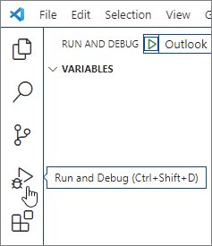

# Debug your event-based Outlook add-in (preview)

This article is meant to provide debugging guidance as you implement [event-based activation](autolaunch.md) in your add-in. The event-based activation feature is currently in preview.

> [!IMPORTANT]
> This debugging capability is only supported for preview in Outlook on Windows with a Microsoft 365 subscription. See [How to preview debugging for the event-based activation feature](#how-to-preview-debugging-for-the-event-based-activation-feature) in this article for more details.

In this article, we'll discuss the key stages to enable debugging.

- [Mark the add-in for debugging](#mark-your-add-in-for-debugging)
- [Configure Visual Studio Code](#configure-visual-studio-code)
- [Attach VS Code](#attach-vs-code)
- [Debug](#debug)

You have several options for creating your add-in project. In a couple of stages, the steps vary depending on the option you're using. Where this is the case, if you used the Yeoman generator for Office Add-ins to create your add-in project (for example, by doing the [event-based activation walkthrough](autolaunch.md)), then follow the **yo office** steps, else follow the **Other** steps.

## How to preview debugging for the event-based activation feature

We invite you to try out the debugging capability for the event-based activation feature! Let us know your scenarios and how we can improve by giving us feedback through GitHub (see the **Feedback** section at the end of this page).

To preview this capability for Outlook on Windows, the minimum required build is 16.0.13729.20000. Join the [Office Insider program](https://insider.office.com) for access to Office beta builds.

## Mark your add-in for debugging

1. Set the registry key `HKEY_CURRENT_USER\SOFTWARE\Microsoft\Office\16.0\Wef\Developer\[Add-in Id]\UseDirectDebugger`. `[Add-in Id]` is the Id in the add-in manifest.

    **yo office**: In a command line window, navigate to the root of your add-in folder then run the following command.

    ```command&nbsp;line
    npm start
    ```

    In addition to building the code and starting the local server, this command should set the `UseDirectDebugger` registry key for this add-in to `1`.

    **Other**: Add the `UseDirectDebugger` registry key under `HKEY_CURRENT_USER\SOFTWARE\Microsoft\Office\16.0\WEF\Developer\[Add-in Id]\`. Replace `[Add-in Id]` with the Id in the add-in manifest. Set the registry key to `1`.

    [!include[Developer registry key](../includes/developer-registry-key.md)]

1. Start Outlook desktop (or restart Outlook if it's already open).
1. Compose a new message or appointment. You should see the following dialog. Do *not* interact with the dialog yet.

    

## Configure Visual Studio Code

### yo office

1. Back in the command line window, open VS Code.

    ```command&nbsp;line
    code .
    ```

1. In VS Code, open the file **./.vscode/launch.json** and add the following excerpt to your list of configurations. Save your changes.

    ```json
    {
      "name": "Direct Debugging",
      "type": "node",
      "request": "attach",
      "port": 9229,
      "protocol": "inspector",
      "timeout": 600000,
      "trace": true
    }
    ```

### Other

1. Create a new folder called **Debugging** (perhaps in your **Desktop** folder).
1. Open VS Code.
1. Go to **File** > **Open Folder**, navigate to the folder you just created, then choose **Select Folder**.
1. Select the **Debug** item in the left menu.

    

1. Select the **create a launch.json file** link.

    

1. In the menu, select **Edge: Launch** to create a launch.json file.
1. Add the following excerpt to your list of configurations. Save your changes.

    ```json
    {
      "name": "Direct Debugging",
      "type": "node",
      "request": "attach",
      "port": 9229,
      "protocol": "inspector",
      "timeout": 600000,
      "trace": true
    }
    ```

## Attach VS Code

1. To find the add-in's **bundle.js**, open the following folder in Windows Explorer and search for your add-in's Id (found in the manifest).

    ```text
    %LOCALAPPDATA%\Microsoft\Office\16.0\Wef
    ```

    Open the folder prefixed with this Id and copy its full path. In VS Code, open **bundle.js** from that folder. The pattern of the file path should be as follows:

    `%LOCALAPPDATA%\Microsoft\Office\16.0\Wef\{[Outlook profile GUID]}\[encoding]\Javascript\[Add-in Id]_[Add-in Version]_[locale]\bundle.js`

1. Place breakpoints in bundle.js where you want the debugger to stop.
1. In the **DEBUG** dropdown, select the name **Direct Debugging** then select the **Run** button.

    

## Debug

1. After confirming that the debugger is attached, return to Outlook then choose the **OK** button in the **Debug Event-based handler** dialog.

1. Your breakpoints in VS Code should now be hit, enabling you to debug your event-based activation code.

## Stop debugging

To stop debugging for:

- The rest of the current Outlook desktop session, choose the **Cancel** button in the **Debug Event-based handler** dialog. To re-enable debugging, restart Outlook desktop.
- Subsequent Outlook sessions and prevent the **Debug Event-based handler** dialog from popping up, delete the associated registry key or set its value to 0: `HKEY_CURRENT_USER\SOFTWARE\Microsoft\Office\16.0\Wef\Developer\[Add-in Id]\UseDirectDebugger`.

## See also

[Configure your Outlook add-in for event-based activation](autolaunch.md)
