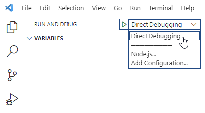

# Debug your event-based or spam-reporting Outlook add-in

This article discusses the key debugging stages to enable and set breakpoints in your code as you implement [event-based activation](autolaunch.md) or [integrated spam reporting](spam-reporting.md) in your add-in. Before you proceed, we recommend reviewing the [troubleshooting guide](troubleshoot-event-based-and-spam-reporting-add-ins.md) for additional steps on how to resolve development errors.

To begin debugging, select the tab for your applicable client.

# [Windows](#tab/windows)

If you used the [Yeoman generator for Office Add-ins](../develop/yeoman-generator-overview.md) to create your add-in project (for example, by completing an [event-based activation walkthrough](on-new-compose-events-walkthrough.md)), follow the **Created with Yeoman generator** option throughout this article. Otherwise, follow the **Other** steps. Visual Studio Code should be at least version 1.56.1.

## Mark your add-in for debugging and set the debugger port

1. Get your add-in's ID from the manifest.

    - **XML manifest**: Use the value of the **\<Id\>** element child of the root **\<OfficeApp\>** element.
    - **Unified manifest for Microsoft 365**: Use the value of the "id" property of the root anonymous `{ ... }` object.

1. Create a registry `DWORD` value named `UseDirectDebugger` in `HKEY_CURRENT_USER\SOFTWARE\Microsoft\Office\16.0\Wef\Developer\[Add-in ID]`. Replace `[Add-in ID]` with your add-in's ID from the manifest.

    [!include[Developer registry key](../includes/developer-registry-key.md)]

    **Created with Yeoman generator**: In a command line window, navigate to the root of your add-in folder then run the following command.

    ```command&nbsp;line
    npm start
    ```

    In addition to building the code and starting the local server, this command sets the `UseDirectDebugger` registry DWORD value data for this add-in to `1`.

    **Other**: In the `HKEY_CURRENT_USER\SOFTWARE\Microsoft\Office\16.0\WEF\Developer\[Add-in ID]\UseDirectDebugger` registry DWORD value, where `[Add-in ID]` is your add-in's ID from the manifest, set the value data to `1`.

1. In the registry key `HKEY_CURRENT_USER\SOFTWARE\Microsoft\Office\16.0\Wef\Developer\[Add-in ID]`, where `[Add-in ID]` is your add-in's ID from the manifest, create a new `DWORD` value with the following configuration.

    - **Value name**: `DebuggerPort`
    - **Value data (hexadecimal)**: `00002407`

   This sets the debugger port to `9223`.

1. Start Outlook or restart it if it's already open.
1. Perform the action to initiate the event you're developing for, such as creating a new message to initiate the `OnNewMessageCompose` event or reporting spam messages. The Debug Event-based handler dialog should appear. Do *not* interact with the dialog yet.

    

## Configure Visual Studio Code

### Created with Yeoman generator

1. Back in the command line window, run the following to open your add-in project in Visual Studio Code.

    ```command&nbsp;line
    code .
    ```

1. In Visual Studio Code, open the **./.vscode/launch.json** file and add the following excerpt to your list of configurations. Save your changes.

    ```json
    {
      "name": "Direct Debugging",
      "type": "node",
      "request": "attach",
      "port": 9223,
      "timeout": 600000,
      "trace": true
    }
    ```

### Other

1. Create a new folder called **Debugging** (perhaps in your **Desktop** folder).
1. Open Visual Studio Code.
1. Go to **File** > **Open Folder**, navigate to the folder you just created, then choose **Select Folder**.
1. On the Activity Bar, select **Run and Debug** (Ctrl+Shift+D).

    

1. Select the **create a launch.json file** link.

    

1. In the **Select Environment** dropdown, select **Edge: Launch** to create a launch.json file.
1. Add the following excerpt to your list of configurations. Save your changes.

    ```json
    {
      "name": "Direct Debugging",
      "type": "node",
      "request": "attach",
      "port": 9223,
      "timeout": 600000,
      "trace": true
    }
    ```

## Attach the debugger

The **bundle.js** file of an add-in contains the JavaScript code of your add-in. It's created when Outlook on Windows is opened. When Outlook starts, the **bundle.js** file of each installed add-in is cached in the **Wef** folder of your machine.

1. To find the add-in's **bundle.js** file, navigate to the following folder in File Explorer. Replace text enclosed in `[]` with your applicable Outlook and add-in information.

    ```text
    %LOCALAPPDATA%\Microsoft\Office\16.0\Wef\{[Outlook profile GUID]}\[Outlook mail account encoding]\Javascript\[Add-in ID]_[Add-in Version]_[locale]
    ```

    [!INCLUDE [outlook-bundle-js](../includes/outlook-bundle-js.md)]

1. Open **bundle.js** in Visual Studio Code.
1. Place breakpoints in **bundle.js** where you want the debugger to stop.
1. In the **DEBUG** dropdown, select **Direct Debugging**, then select the **Start Debugging** icon.

    

## Run the debugger

1. After confirming that the debugger is attached, return to Outlook, and in the **Debug Event-based handler** dialog, choose **OK** .

1. You can now hit your breakpoints in Visual Studio Code, enabling you to debug your event-based activation or spam-reporting code.

## Stop the debugger

To stop debugging the rest of the current Outlook on Windows session, in the **Debug Event-based handler** dialog, choose **Cancel**. To re-enable debugging, restart Outlook.

To prevent the **Debug Event-based handler** dialog from popping up and stop debugging for subsequent Outlook sessions, delete the associated registry key, `HKEY_CURRENT_USER\SOFTWARE\Microsoft\Office\16.0\Wef\Developer\[Add-in ID]\UseDirectDebugger`, or set its value to `0`.

# [New Windows (preview)](#tab/new-windows)

To debug your add-in in [new Outlook on Windows desktop client (preview)](https://support.microsoft.com/office/656bb8d9-5a60-49b2-a98b-ba7822bc7627), you must run the following command to open Microsoft Edge DevTools.

```command&nbsp;line
olk.exe --devtools
```

For more information, see the "Debug your add-in" section of [Develop Outlook add-ins for the new Outlook on Windows (preview)](one-outlook.md#debug-your-add-in).

# [Mac](#tab/mac)

Event-based add-ins that run in Outlook on Mac use the browser runtime. Because of this, you can debug your add-in using Safari Web Inspector.

1. To use the Safari Web Inspector in Outlook, follow the steps in [Debugging with Safari Web Inspector on a Mac](../testing/debug-office-add-ins-on-ipad-and-mac.md#debugging-with-safari-web-inspector-on-a-mac).
1. Open Outlook, then [sideload your add-in](sideload-outlook-add-ins-for-testing.md).
1. Perform an action that will initiate the event your add-in handles. For example, create a new message to initiate the `OnNewMessageCompose` event. This opens an empty Developer Window. The name of your add-in appears in the title bar of the window.
1. Right-click anywhere in the Developer Window, then select **Inspect Element**. This opens the Inspector, where you can set breakpoints and debug your add-in.

# [Web](#tab/web)

Use your preferred browser's developer tools to debug your event-based add-in in Outlook on the web. For more information, see [Debug add-ins in Office on the web](../testing/debug-add-ins-in-office-online.md).

---

## See also

- [Configure your Outlook add-in for event-based activation](autolaunch.md)
- [Implement an integrated spam-reporting add-in](spam-reporting.md)
- [Troubleshoot event-based and spam-reporting add-ins](troubleshoot-event-based-and-spam-reporting-add-ins.md)
- [Debug your add-in with runtime logging](../testing/runtime-logging.md#runtime-logging-on-windows)
