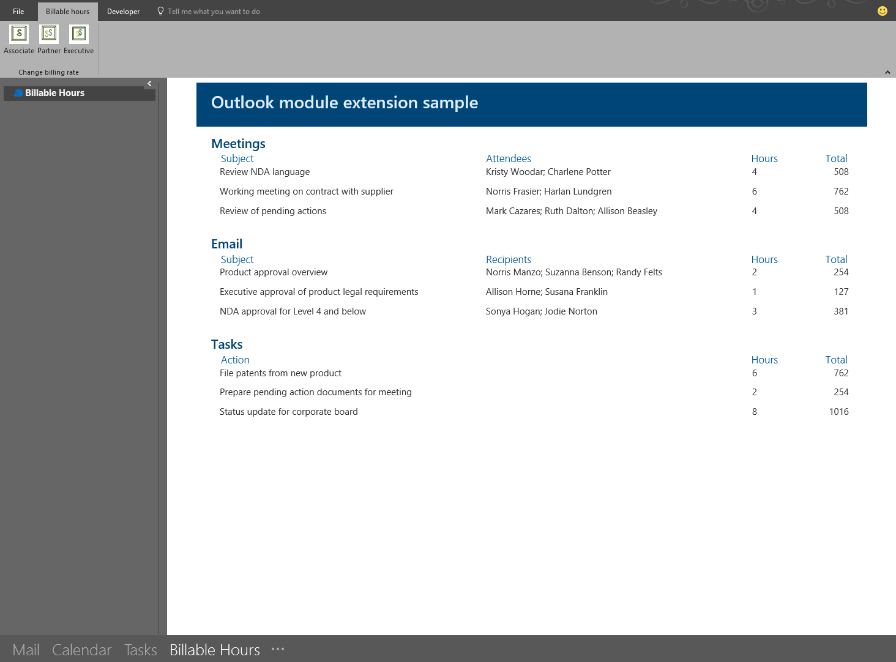

# Module extension Outlook add-ins

Module extension add-ins appear in the Outlook navigation bar, right alongside mail, tasks, and calendars. A module extension isn't limited to using mail and appointment information. You can create applications that run inside Outlook to make it easy for your users to access business information and productivity tools without ever leaving Outlook.

> [!TIP]
> Module extensions are only supported in classic Outlook on Windows. To provide a more modern solution that's available on various platforms, create [personal tab apps that open in Outlook](/microsoftteams/platform/m365-apps/extend-m365-teams-personal-tab) instead. With personal tab apps, your users will have access to business critical data and productivity tools not just in Outlook, but across Microsoft 365 applications, including Microsoft Teams, and various platforms.

## Supported clients and manifests

To create and run module extension add-ins, you must:

- Develop the add-in using an add-in only manifest. The [Unified manifest for Microsoft 365](../develop/json-manifest-overview.md) doesn't support module extensions.
- Run the add-in in classic Outlook on Windows (Outlook 2016 or later).

## Open a module extension

To open a module extension, navigate to the Outlook navigation bar, select **More Apps**, then choose the module extension add-in.


> [!TIP]
> In older versions of classic Outlook on Windows, the navigation bar appears at the bottom of the window. Access to a module extension varies depending on the layout of the navigation bar and the number of available module extensions.
>
> - If the user has compact navigation selected, the navigation bar has an icon that shows an extension is loaded.
>
>   
> - If the user isn't using compact navigation, the navigation bar will display the name of the add-in.
>
>   
> - If more than one add-in is loaded, the **Add-ins** options is displayed in the navigation bar. Select **Add-ins**, then choose the add-in you want to use.
>
>   

## Configure a module extension

When you select a module extension add-in, Outlook replaces the built-in module with your custom module so that you can interact with the add-in. You can use some of the features of the [Outlook JavaScript API](/javascript/api/outlook) in your add-in. APIs that logically assume a specific Outlook item, such as a message or appointment, don't work in module extensions. The module can also include function commands in the Outlook ribbon that interact with the add-in's page. To facilitate this, your function commands must call the [Office.onReady or Office.initialize method](../develop/initialize-add-in.md) and the [Event.completed](/javascript/api/office/office.addincommands.event#office-office-addincommands-event-completed-member(1)) method.

To test and learn how to configure a module extension, see the [Office Add-ins module extension sample](https://github.com/OfficeDev/Outlook-Add-in-JavaScript-ModuleExtension).



## Example

The following is a section of a manifest file that defines a module extension.

```xml

<VersionOverrides xmlns="http://schemas.microsoft.com/office/mailappversionoverrides"
                  xsi:type="VersionOverridesV1_0">
  <VersionOverrides xmlns="http://schemas.microsoft.com/office/mailappversionoverrides/1.1"
                    xsi:type="VersionOverridesV1_1">
    <Requirements>
      <bt:Sets DefaultMinVersion="1.3">
        <bt:Set Name="Mailbox"/>
      </bt:Sets>
    </Requirements>
    <Hosts>
      <Host xsi:type="MailHost">
        <DesktopFormFactor>
          <!-- Sets the URL of the JavaScript file that contains the code to
               run the operations of a module extension add-in. -->
          <FunctionFile resid="residFunctionFileUrl"/>
          <!--Configures the add-in as a module extension. -->
          <ExtensionPoint xsi:type="Module">
            <SourceLocation resid="residExtensionPointUrl"/>
            <Label resid="residExtensionPointLabel"/>
            <CommandSurface>
              <CustomTab id="idTab">
                <Group id="idGroup">
                  <Label resid="residGroupLabel"/>
                  <Control xsi:type="Button" id="group.changeToAssociate">
                    <Label resid="residChangeToAssociateLabel"/>
                    <Supertip>
                      <Title resid="residChangeToAssociateLabel"/>
                      <Description resid="residChangeToAssociateDesc"/>
                    </Supertip>
                    <Icon>
                      <bt:Image size="16" resid="residAssociateIcon16"/>
                      <bt:Image size="32" resid="residAssociateIcon32"/>
                      <bt:Image size="80" resid="residAssociateIcon80"/>
                    </Icon>
                    <Action xsi:type="ExecuteFunction">
                      <FunctionName>changeToAssociateRate</FunctionName>
                    </Action>
                  </Control>
                </Group>
                <Label resid="residCustomTabLabel"/>
              </CustomTab>
            </CommandSurface>
          </ExtensionPoint>
        </DesktopFormFactor>
      </Host>
    </Hosts>
    <Resources>
      <bt:Images>
        <bt:Image id="residAssociateIcon16"
                  DefaultValue="https://localhost:3000/assets/associate-16.png"/>
        <bt:Image id="residAssociateIcon32"
                  DefaultValue="https://localhost:3000/assets/associate-32.png"/>
        <bt:Image id="residAssociateIcon80"
                  DefaultValue="https://localhost:3000/assets/associate-80.png"/>
      </bt:Images>
      <bt:Urls>
        <bt:Url id="residFunctionFileUrl"
                DefaultValue="https://localhost:3000/module.html"/>
        <bt:Url id="residExtensionPointUrl"
                DefaultValue="https://localhost:3000/module.html"/>
      </bt:Urls>
      <bt:ShortStrings>
        <bt:String id="residExtensionPointLabel"
                    DefaultValue="Billable Hours"/>
        <bt:String id="residGroupLabel"
                    DefaultValue="Change billing rate"/>
        <bt:String id="residCustomTabLabel"
                    DefaultValue="Billable hours"/>
        <bt:String id="residChangeToAssociateLabel"
                    DefaultValue="Associate Rate"/>
      </bt:ShortStrings>
      <bt:LongStrings>
        <bt:String id="residChangeToAssociateDesc"
                    DefaultValue="Change to the associate billing rate: $127/hr"/>
      </bt:LongStrings>
    </Resources>
  </VersionOverrides>
</VersionOverrides>
```

## See also

- [Office Add-in manifests](../develop/add-in-manifests.md)
- [Add-in commands](../design/add-in-commands.md)
- [Office Add-ins sample: Compute billable hours with a module extension add-in in Outlook](https://github.com/OfficeDev/Outlook-Add-in-JavaScript-ModuleExtension)
