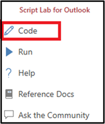

# Nested app authentication and Outlook legacy tokens deprecation FAQ

Exchange [user identity tokens](authentication.md#exchange-user-identity-token) and [callback tokens](authentication.md#callback-tokens) are deprecated and will be turned off starting February 17th, 2025. We recommend moving Outlook add-ins that use legacy Exchange tokens to nested app authentication.

## General FAQ

### What is nested app authentication (NAA)?

Nested app authentication enables single sign-on (SSO) for applications nested inside of supported Microsoft applications such as Outlook. Compared with existing full-trust authentication models, and the on-behalf-of flow, NAA provides better security and greater flexibility in app architecture, enabling the creation of rich, client-driven applications. For more information, see [Enable SSO in an Office Add-in using nested app authentication](../develop/enable-nested-app-authentication-in-your-add-in.md).

### What is the timeline for shutting down legacy Exchange online tokens?

Microsoft begins turning off legacy Exchange online tokens starting February 17th 2025. From now until February 17th 2025, existing and new tenants will not be affected.  We've provided tooling for administrators to reenable Exchange tokens for tenants and add-ins if those add-ins aren't yet migrated to NAA. See [Can I turn legacy tokens back on?](#can-i-turn-exchange-online-legacy-tokens-back-on) for more information.

| Date     | Legacy tokens status |
| -------- | ------------------------------------------------------ |
| Feb 17th, 2025 | Legacy tokens turned off for all tenants. Admins can reenable legacy tokens via PowerShell. |
| Jun 2025 | Legacy tokens turned off for all tenants. Admins can no longer reenable legacy tokens via PowerShell and must contact Microsoft for any exception. |
| Oct 2025 | Legacy tokens turned off for all tenants. Exceptions are no longer allowed. |

#### What happens on February 17th?

Microsoft will begin deploying a change to all users worldwide in Microsoft 365 tenants that will turn off the issuance of legacy Exchange online tokens. The deployment will take several weeks to deploy to all users. If an Outlook add-in requests a legacy Exchange token, and token issuance is turned off, the add-in will receive an error. Outlook add-ins that still request legacy Exchange Online tokens will be broken by this change. Please note that even after legacy tokens are turned off, legacy tokens previously issued will continue to be valid for up to an hour.

Note that since the change is applied per user, and deployed over several weeks, you could see some users affected while others are not. If you need to opt out of this change, see [Can I turn legacy tokens back on?](#can-i-turn-exchange-online-legacy-tokens-back-on)

### When is NAA generally available for my channel?

The general availability (GA) date for NAA depends on which channel you are using.

| Date     | NAA General Availability (GA) |
| -------- | ------------------------------------------------------ |
| Oct 2024 | NAA is GA in Current Channel. |
| Nov 2024 | NAA is GA in Monthly Enterprise Channel. |
| Jan 2025 | NAA is GA in Semi-Annual Channel build 16.0.17928.20392. |
| Jun 2025 | NAA will GA in Semi-Annual Extended Channel. |

### How do I handled legacy tokens turned off in Semi-Annual Extended Channel, which doesn't support NAA yet?

Semi-Annual Extended Channel won't support NAA until June 2025. This means even if add-ins are updated to support NAA, and no longer use legacy Exchange Online tokens, they won't function on this channel. If you are using Semi-Annual Extended Channel as an administrator, we recommend the following.

- Check if your tenant is using any add-ins that require legacy Exchange Online tokens. For more information, see [Find Outlook add-ins that use legacy Exchange Online tokens](https://github.com/OfficeDev/office-js/tree/release/add-in-ids).
- If you have deployed add-ins that require legacy Exchange Online tokens, and the add-ins are necessary for your organization, we recommend you turn on tokens now so that they are not turned off after February 17th, 2025. To turn tokens on, see [Turn legacy Exchange Online tokens on or off](turn-exchange-tokens-on-off.md).

### Are COM Add-ins affected by the deprecation of legacy Exchange Online tokens?

It's very unlikely any COM add-ins are affected by the deprecation of legacy Exchange Online tokens. Outlook web add-ins are primarily affected because they can use Office.js APIs that rely on Exchange tokens. For more information, see [How do i know if my outlook add in relies on legacy tokens](#how-do-i-know-if-my-outlook-add-in-relies-on-legacy-tokens). The Exchange tokens are used to access Exchange Web Services (EWS) or Outlook REST APIs, both of which are also deprecated. If you suspect a COM add-in might be affected, you can test it by using it on a tenant with Exchange tokens turned off. For more information, see [Turn legacy Exchange Online tokens on or off](turn-exchange-tokens-on-off.md).

## Microsoft 365 administrator questions

### Can I turn Exchange Online legacy tokens back on?

Yes, there are PowerShell commands you can use to turn legacy tokens on or off in any tenant. For more information on how to turn legacy tokens on or off, see [Turn legacy Exchange Online tokens on or off](turn-exchange-tokens-on-off.md). If you use the commands to enable legacy Exchange Online tokens, they will not be turned off in February 2025. They will remain on until June 2025, or until you use the tooling to turn them off.

In June 2025, legacy tokens will be turned off and you won't be able to turn them back on without a specific exception granted by Microsoft. In October 2025, it won't be possible to turn on legacy tokens and they'll be disabled for all tenants. We'll update this FAQ with additional information once the exception process is ready.

### How does the admin consent flow work?

Independent software vendors (ISVs) are updating their add-ins to use Entra ID tokens and Microsoft Graph scopes. When the add-in requests an access token, it must have admin or user consent. If the administrator consents, all users on the tenant can use the add-in for the scopes the add-in requires. Otherwise, each end-user will be prompted for consent, if [user consent is enabled](/microsoft-365/admin/misc/user-consent). For a better experience because the users aren't prompted, complete admin consent.

One option for consent is that the ISV provides you with an admin consent URI.

1. The add-in developer provides an admin consent URI. If this is not in the documentation they provide, you need to contact them for more information.
1. The administrator browses to the admin consent URI.
1. The administrator is prompted to sign in and consent to a list of scopes that the add-in requires.
1. Once complete, the browser redirects to a web page from the ISV, which should show the consent was successful.

As an alternative, the ISV may provide an updated app manifest that will prompt for admin consent as part of central deployment. In this scenario, when you deploy the updated app manifest, you'll be prompted to consent before the deployment can complete. There is no need for an admin consent URI.

Finally, if the add-in is published in the Microsoft 365 store, the update will deploy automatically and the administrator will be prompted to consent to the scopes. If the administrator doesn't consent, users won't be able to use the updated add-in.

### What if the add-in doesn't work after admin consent?

Ensure you don't disable features, or revoke permissions that the add-in requires. For an example, see [modifying mailbox policy properties](/exchange/clients-and-mobile-in-exchange-online/outlook-on-the-web/configure-outlook-web-app-mailbox-policy-properties). The add-in uses delegated permissions and therefore has access to the same resources as the signed-in user. However, if a policy or setting blocks the user from a particular resource or action, the add-in will also be blocked.

### How do I deploy add-in updates from an ISV?

If you have an add-in that uses legacy Exchange tokens, you should reach out to your ISV for information about their timeline to migrate their add-in to use NAA. Once the ISV migrates their add-in, they will most likely provide an admin consent URL. For more information, see [How does the admin consent flow work?](#how-does-the-admin-consent-flow-work) .

The ISV may also provide you with an updated app manifest to deploy through centralized deployment. During centralized deployment, this may prompt you to consent to any Microsoft Graph scopes the add-in requires. In this scenario you won't need to use an admin consent URI.

If the add-in is deployed from Microsoft AppSource, most likely you'll be prompted to consent to Microsoft Graph scopes when the ISV rolls out updates to the add-in. Until you consent, users on the tenant won't be able to use the new version of the add-in with NAA.

### Which add-ins in my organization are impacted?

We published a list of all Outlook add-ins published to the Microsoft store that use legacy tokens as of October 2024. For more information on how to use the list and build a report of Outlook add-ins that are potentially using legacy tokens, see [Find Outlook add-ins that use legacy Exchange Online tokens](https://github.com/OfficeDev/office-js/tree/release/add-in-ids).

Add-ins may use the legacy tokens to get resources from Exchange through the EWS or Outlook REST APIs. Sometimes an add-in requires Exchange resources for some use cases and not others, making it difficult to figure out whether the add-in requires an update. We recommend reaching out to add-in developers and owners to ask them if their add-in code references the following APIs.

- `makeEwsRequestAsync`
- `getUserIdentityTokenAsync`
- `getCallbackTokenAsync`

If you rely on an ISV for your add-in, we recommend you contact them as soon as possible to confirm they have a plan and a timeline for moving off of legacy Exchange tokens. ISV developers should reach out directly to their Microsoft contacts with questions to ensure they're ready for the end of Exchange legacy tokens. If you rely on a developer within your organization, they should review this FAQ and the article [Enable SSO in an Office Add-in using nested app authentication](../develop/enable-nested-app-authentication-in-your-add-in.md). Any questions should be raised on the [OfficeDev/office-js GitHub issues site](https://github.com/OfficeDev/office-js/issues).

> [!NOTE]
> We've been working to provide a command update to [Exchange Online PowerShell](/powershell/exchange/connect-to-exchange-online-powershell) that reports any add-ins using legacy Exchange Online tokens. Unfortunately, we've had difficulties rolling out this update due to the complexities of capturing specific token usage in the Microsoft 365 ecosystem. We continue to work on this update and will provide new information in this FAQ when it is available.

### Where do I find which add-ins have consent?

Once the admin or a user consents, it will be listed in the Microsoft Entra admin center. You can find app registrations using the following steps.

1. Go to [https://entra.microsoft.com/#home](https://entra.microsoft.com/#home) and sign in as admin on your tenant.
1. In the left navigation pane, select **Applications** > **Enterprise applications**.
1. On the **Enterprise applications** page, in the **Manage** section, select **All applications**.
1. Select the Add-in. This will open an overview page.
In the overview page, select **Permissions**.
There are two views for permissions; Admin consent, and User consent. Select User consent to see any individual consents.

### Is there a list of publishers that have updated their add-ins?

Some widely used Outlook add-in publishers have already updated their add-ins as listed below.

- [Atlassian Jira Cloud for Outlook](https://marketplace.atlassian.com/apps/1220666/jira-cloud-for-outlook-official?tab=overview&hosting=cloud)
- [Box for Outlook](https://appsource.microsoft.com/product/office/WA200000015)
- [Clickup for Outlook](https://appsource.microsoft.com/product/office/WA104382026)
- [iEnterprises® - Outlook Connector](https://ienterprises.com/connector/outlook-connector)
- [HubStar Connect](https://www.hubstar.com/solutions/connect/)
- [SalesForce for Outlook](https://appsource.microsoft.com/product/office/wa104379334)
- [LawToolBox](https://lawtoolbox.com/lawtoolbox-for-copilot/)
- [OnePlace Solutions](https://www.oneplacesolutions.com/oneplacemail-sharepoint-app-for-outlook.html)
- [Set-OutlookSignatures Benefactor Circle](https://explicitconsulting.at/open-source/set-outlooksignatures/)
- [Wrike](https://appsource.microsoft.com/product/office/wa104381120)
- [Zoho CRM for Email](https://appsource.microsoft.com/product/office/WA104379468)
- [Zoho Recruit for Email](https://appsource.microsoft.com/product/office/WA200001485)
- [Zoho Projects for Email](https://appsource.microsoft.com/product/office/WA200006712)
- [Zoho Sign for Outlook](https://appsource.microsoft.com/product/office/WA200002326)
- [Zoho WorkDrive for Email](https://appsource.microsoft.com/product/office/WA200006673)
- [Invoice and Time Tracking - Zoho Invoice](https://appsource.microsoft.com/product/office/WA104381067)

If the publisher updated their manifest, and the add-in is deployed through the Microsoft store, you'll be prompted as an administrator to upgrade and deploy the updates. If the publisher updated their manifest, and the add-in is deployed through central deployment, you'll need to deploy the new manifest as an administrator. In some cases the publisher may have an admin consent URI you need to use to consent to new scopes for the add-in. Reach out to publishers if you need more information about updating an add-in.

### Some add-ins are breaking. Can I tell if this is because Exchange tokens were turned off?

Beginning February 17, 2025, Microsoft is rolling out an update to gradually turn off legacy Exchange Online tokens for all users. The update won't turn off Exchange tokens in your tenant if you already [turned legacy Exchange Online tokens on](turn-exchange-tokens-on-off.md).

If your tenant uses an add-in that still relies on Exchange tokens, the add-in will break or lose functionality. The update is rolled out **per user**. This means that one or more users may have an add-in affected when Exchange tokens are off, but other users would still have a working add-in. If you notice that an add-in has issues and suspect it may be affected by Exchange tokens turned off, please take the following actions.

#### Check the list of known add-ins

We posted a list of add-ins that were known to be using legacy Exchange tokens as of October 2024. If an add-in is on this list, you should reach out to the publisher to see if there are updates available. For more information, see [Find Outlook add-ins that use legacy Exchange Online tokens](https://github.com/OfficeDev/office-js/tree/release/add-in-ids)

#### Check if tokens are off by using Script Lab

Check if legacy Exchange Online tokens are off for a user by using the Script Lab add-in.

1. Install [Script Lab for Outlook](https://appsource.microsoft.com/en-us/product/office/WA200001603).
1. Sign in to Outlook with the user account/mailbox that is affected. Exchange tokens can be off for one user, but not another until the rollout is complete.
1. From an existing or new email, open Script Lab from the **Apps** menu, and choose **Code** from the Script Lab menu.

    

1. In the Script Lab task pane, select the backstage icon (it has three lines).

    

1. Select **Samples** and then search for the **Get a user identity token** sample. Select this sample to open it in the code editor.

    

1. After the code for the sample is loaded, select **Run** > **Run in this pane**.

    

1. After the code runs, select **Get token**.

If legacy Exchange Online tokens are on, you'll see a token displayed in the console as a Base64-encoded string.


If legacy Exchange Online tokens are off, you'll see an error displayed in the console as shown below.


The actual error and code can vary, but often you will see error code 9017 or 9018 along with the following error descriptions.

- `GenericTokenError: An internal error has occurred.`
- `InternalServerError: The Exchange server returned an error. Please look at the diagnostics object for more information.`

If an add-in is affected by Exchange tokens turned off, you can turn them back on. For more information, see [Can I turn Exchange Online legacy tokens back on?](#can-i-turn-exchange-online-legacy-tokens-back-on).

## Outlook add-in migration FAQ

### Why is Microsoft making Outlook add-ins migrate?

Switching to Microsoft Graph using Entra ID tokens is a big improvement in security for Outlook and Exchange customers. Entra ID (formerly Azure Active Directory) is a leading cloud-based identity and access management service. Customers can take advantage of zero trust features such as conditional access, MFA requirements, continual token monitoring, real time safety heuristics, and more that aren't available with legacy Exchange tokens. Customers store important business data stored in Exchange, so it's vital that we ensure this data is protected. Migrating the whole Outlook ecosystem to use Entra ID tokens with Microsoft Graph greatly improves security for customer data.

### Does my Outlook add-in have to migrate to NAA?

No. Outlook add-ins don't have to use NAA, although NAA offers the best authentication experience for users and the best security posture for organizations. If add-ins aren't using legacy Exchange tokens, they won't be affected by the deprecation of Exchange tokens. Add-ins using MSAL.js or other SSO methods that rely on Entra ID will continue to work.

### How do I know if my Outlook add-in relies on legacy tokens?

To find out whether your add-in uses legacy Exchange user identity tokens and callback tokens, search your code for calls to the following APIs.

- `makeEwsRequestAsync`
- `getUserIdentityTokenAsync`
- `getCallbackTokenAsync`

If your add-in calls any of these APIs, you should adopt NAA and migrate to using Entra ID tokens to access Microsoft Graph instead.

### Which Outlook add-ins are in scope?

Many major add-ins are in scope. If your add-in is using EWS or Outlook REST to access Exchange Online resources, it almost certainly needs to migrate off of legacy Outlook tokens to NAA.
If your add-in is for Exchange on-premises only (for example, Exchange 2019), it's not affected by this change.

### What will happen to my Outlook add-ins if I don't migrate to NAA?

If you don't migrate your Outlook add-ins to NAA, they'll stop working as expected in Exchange Online. When Exchange tokens are turned off, Exchange Online will block legacy token issuance. Any add-in that uses legacy tokens won't be able to access Exchange online resources. When your add-in calls an API that requests an Exchange token, such as `getUserIdentityTokenAsync`, it gets a generic error similar to the following with error codes such as 9018 or 9017.

- "GenericTokenError: An internal error has occurred."
- "InternalServerError: The Exchange server returned an error. Please look at the diagnostics object for more information."

If your add-in only works on-premises or if your add-in is on a deprecation path, you may not need to update. However, most add-ins that access Exchange resources through EWS or Outlook REST must migrate to continue functioning as expected.

### How do I migrate my Outlook add-ins to NAA?

To support NAA in your Outlook add-in, please refer to the following documentation and sample.

- [Enable SSO in an Office Add-in using nested app authentication](../develop/enable-nested-app-authentication-in-your-add-in.md).
- [Outlook add-in with SSO using nested app authentication](https://github.com/OfficeDev/Office-Add-in-samples/tree/main/Samples/auth/Outlook-Add-in-SSO-NAA).

### How do I keep up with the latest guidance?

We'll update this FAQ as any new information becomes available. We'll share additional guidance moving forward on the [Office Add-ins community call](../overview/office-add-ins-community-call.md) and the [M365 developer blog](https://devblogs.microsoft.com/microsoft365dev/).
Finally, you can ask questions about NAA and legacy Exchange Online token deprecation on the [OfficeDev/office-js GitHub issues site](https://github.com/OfficeDev/office-js/issues). Please put "NAA" in the title so we can group and prioritize issues.

If you submit an issue, please include the following information.

- Outlook client version.
- Outlook release channel audience (for client).
- Screen capture of the issue.
- The platform where the issue occurs (Windows, Outlook (new), Mac, iOS, Android).
- Session id where the issue is encountered.
- Type of account being used.
- Version of msal-browser.
- Logs from msal-browser.

## Developer questions

### How do I get more debug information from MSAL and NAA?

Use the following code to enable debug information in the msalConfig when you initialize the nestable public client application. This will log additional details to the console.

```javascript
const msalConfig = {
  auth: {...},
  system: {
    loggerOptions: {
      logLevel: LogLevel.Verbose,
      loggerCallback: (level, message, containsPii) => {
        switch (level) {
          case LogLevel.Error:
            console.error(message);
            return;
          case LogLevel.Info:
            console.info(message);
            return;
          case LogLevel.Verbose:
            console.debug(message);
            return;
          case LogLevel.Warning:
            console.warn(message);
            return;
        }
      },
    }
  }
};
```

### Test your updated add-in

Once you've updated your add-in to use NAA, you should test it on all platforms you support, such as Mac, mobile, web, and Outlook on Windows.

#### Test when Exchange tokens turned off

To test that your add-in works correctly when Exchange tokens are turned off, deploy your add-in to a tenant with tokens turned off and test it. To turn tokens off, see [Turn legacy Exchange Online tokens on or off](turn-exchange-tokens-on-off.md).

If you've implemented a pattern where your code uses Exchange tokens but then falls over if they are unavailable, be sure you are checking for the correct errors. When a call to get an Exchange token fails, check the [asyncResult.diagnostics](/javascript/api/office/office.asyncresult). If either of the following errors is returned, switch to NAA.

- `GenericTokenError: An internal error has occurred.`
- `InternalServerError: The Exchange server returned an error. Please look at the diagnostics object for more information.`

#### Test fallback code for Trident+ webview

If your Outlook add-in supports Outlook 2016 or Outlook 2019 on Windows, test that it works correctly when the Trident+ (Internet Explorer 11) webview is used. When the Trident+ webview is used, your code must fall back to MSAL v2 to open a dialog and sign in the user. For more information on how to implement the fallback pattern, see [Outlook add-in with SSO using nested app authentication including Internet Explorer fallback](https://github.com/OfficeDev/Office-Add-in-samples/tree/main/Samples/auth/Outlook-Add-in-SSO-NAA-IE).

#### Testing in Trident+ and WebView2

Outlook 2016 and Outlook 2019 on Windows use the Trident+ or WebView2 based on various OS conditions.

- For more information on when Trident+ or Webview2 is used, see [Browsers and webview controls used by Office Add-ins](../concepts/browsers-used-by-office-web-add-ins.md).
- For more information on how to determine which webview is running, see  [Support older Microsoft webviews and Office versions](../develop/support-ie-11.md#determine-the-webview-the-add-in-is-running-in-at-runtime)

### What tokens does MSAL return and are there minimum scopes to request?

When you request a token through MSAL, it always returns three tokens.

|Token          |Purpose  |Scopes  | `AuthencationResult` property |
|---------------|---------|---------|----------------------------|
|ID token | Provides information about the user to the client (task pane). | `profile` and `openid` | `authResult.idToken` |
|Refresh token  | Refreshes the ID and access tokens when they expire.     | `offline_access`       | Not available. |
|Access token   | Authenticates the user for specific scopes to a resource, such as Microsoft Graph. | Any resource scopes, such as `user.read`. | `authResult.accessToken` |

MSAL always returns these three tokens. It requests the `profile`, `openid`, and `offline_access` as default scopes even if your token request doesn't include them. This ensures the ID and refresh tokens are requested. However, you must include at least one resource scope, such as `user.read` so that you get an access token. If not, the request can fail.

### Should I validate the ID token from MSAL?

No. This is a legacy authentication pattern that was used with Exchange tokens to authorize access to your own resources. Passing the ID token over a network call to enable or authorize access to a service is a security anti-pattern. The ID token is intended only for the client (task pane) and there is no way for the service to reliably use the token to be sure the user has authorized access. For more information about ID token claims, see [ID token claims reference](/entra/identity-platform/id-token-claims-reference).

It's very important that you always request an access token to your own services. The access token also includes the same ID claims, so you don't need to pass the ID token. Instead create a custom scope for your service. For more information about app registration settings for your own services, see [Protected web API: App registration](/entra/identity-platform/scenario-protected-web-api-app-registration). When your service receives the access token, it can validate it, and use ID claims from inside the access token.

### Why is the ID token not refreshed?

There is a known issue where MSAL sometimes doesn't refresh the ID token after it expires. This shouldn't cause any issues in your add-in since the ID token is only intended for use in your task pane to get basic user identity information, such as name and email. There's no reason to validate the ID token or check the expiration claim. If you need to authenticate the user to your own resources, use the access token which also contains user identity information. The ID token must never be passed outside of your client code that received it.

### How do I determine if the user is an online or on-premise account?

You can determine if the signed-in user has an Exchange Online account or on-premise Exchange account by using the [Office.UserProfile.accountType](/javascript/api/outlook/office.userprofile) property. If the account type property value is **enterprise**, then the mailbox is on an on-premises Exchange server. Note that volume-licensed perpetual Outlook 2016 doesn’t support the **accountType** property. To work around this, call the [ResolveNames](/exchange/client-developer/web-service-reference/resolvenames-operation) operation in Exchange Web Service (EWS) in the Exchange on-premise server to get the recipient types.

### How do I deploy my add-in to Microsoft AppSource

If you're publishing a new add-in to Microsoft AppSource, it will need to go through a certification process. For more information, see [Publish your Office Add-in to Microsoft AppSource](../publish/publish-office-add-ins-to-appsource.md). If you're updating the manifest of an add-in that is already published to Microsoft AppSource, you need to go through the certification process again. You can update the add-in's source code on your web server any time without a need to go through the certification process.

If you're add-in uses SSO through NAA, your add-in must be in compliance with the following publishing guidelines.

- [1000.3 Authentication options](/legal/marketplace/certification-policies#10003-authentication-options)
- [1120.3 Functionality](/legal/marketplace/certification-policies#11203-functionality)

Be sure to handle admin consent properly. See [Publish an add-in that requires admin consent for Microsoft Graph scopes](../publish/publish-nested-app-auth-add-in.md)

For additional deployment details, see [Make your solutions available in Microsoft AppSource and within Office](/partner-center/marketplace-offers/submit-to-appsource-via-partner-center). If you update your add-in (change the manifest) you need to go through the [certification process again](../publish/publish-nested-app-auth-add-in.md). You can update your web server code any time without a need for review.

## Related content

- [Enable SSO in an Office Add-in using nested app authentication](../develop/enable-nested-app-authentication-in-your-add-in.md).
- [Outlook add-in with SSO using nested app authentication](https://github.com/OfficeDev/Office-Add-in-samples/tree/main/Samples/auth/Outlook-Add-in-SSO-NAA).
