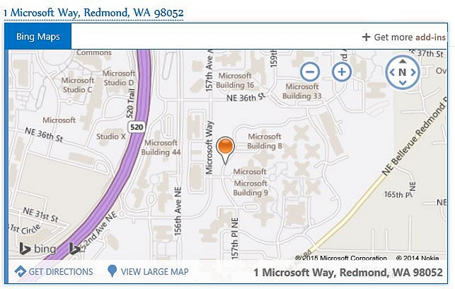

# Outlook add-ins overview

Outlook add-ins are integrations built by third parties into Outlook by using the new web technologies-based platform. Outlook add-ins have three key aspects:

- The same add-in and business logic works across desktop (Outlook for Windows and Mac), web (Office 365 and Outlook.com), and mobile.
-  Outlook add-ins consist of a manifest, which describes how the add-in integrates into Outlook (for example, a button or a task pane), and JavaScript/HTML code, which makes up the UI and business logic of the add-in.
- Outlook add-ins can be acquired from the Office store or side-loaded by end-users or administrators.

Outlook add-ins are different from COM or VSTO add-ins, which are older integrations specific to Outlook running on Windows. Unlike COM add-ins, Outlook add-ins don't have any code physically installed on the user's device or Outlook client. For an Outlook add-in, Outlook reads the manifest and hooks up the specified controls in the UI, and then loads the JavaScript and HTML. This all executes in the context of a browser in a sandbox.

The Outlook items that support mail add-ins include email messages, meeting requests, responses and cancellations, and appointments. Each mail add-in defines the context in which it is available, including the types of items and if the user is reading or composing an item. 

> [!NOTE]
> When you build your add-in, if you plan to [publish](https://docs.microsoft.com/office/dev/add-ins/publish/publish?product=outlook) your add-in to the Office Store, make sure that you conform to the [Office Store validation policies](https://docs.microsoft.com/office/dev/store/validation-policies). For example, to pass validation, your add-in must work across all platforms that support the methods that you define (for more information, see [section 4.12](https://docs.microsoft.com/office/dev/store/validation-policies#4-apps-and-add-ins-behave-predictably) and the [Office Add-in host and availability page](https://docs.microsoft.com/office/dev/add-ins/overview/office-add-in-availability)).

## Extension points

Extension points are the ways that add-ins integrate with Outlook. The following are the ways this can be done:

- Add-ins can declare buttons that appear in command surfaces across messages and appointments. For more information, see [Add-in commands for Outlook](add-in-commands-for-outlook.md).
    
    **An add-in with command buttons on the ribbon**

    

- Add-ins can link off regular expression matches or detected entities in messages and appointments. For more information, see [Contextual Outlook add-ins](contextual-outlook-add-ins.md).
    
    **A contextual add-in for a highlighted entity (an address)**

    

> [!NOTE]
> [Custom panes have been deprecated](https://developer.microsoft.com/outlook/blogs/make-your-add-ins-available-in-the-office-ribbon/) so please ensure that you're using a supported extension point.

## Mailbox items available to add-ins

Outlook add-ins are available on messages or appointments while composing or reading, but not other item types. Outlook does not activate add-ins if the current message item, in a compose or read form, is one of the following:

- Protected by Information Rights Management (IRM) or encrypted in other ways for protection. A digitally signed message is an example since digital signing relies on one of these mechanisms.
    
- A delivery report or notification that has the message class IPM.Report.*, including delivery and Non-Delivery Report (NDR) reports, and read, non-read, and delay notifications.

- A draft (does not have a sender assigned to it), or in the Outlook Drafts folder.
    
- A .msg or .eml file which is an attachment to another message.
    
- A .msg or .eml file opened from the file system.

- In a shared mailbox, in another user's mailbox, in an archive mailbox, or in a public folder.

- Using a [custom form](https://support.office.com/en-us/article/Overview-of-forms-in-Outlook-CC2D2F5B-635F-4E60-95CA-6B8D91639214).
    
In general, Outlook can activate add-ins in read form for items in the Sent Items folder, with the exception of add-ins that activate based on string matches of well-known entities. For more information about the reasons behind this, see "Support for well-known entities" in [Match strings in an Outlook item as well-known entities](match-strings-in-an-item-as-well-known-entities.md).

## Supported hosts

Outlook add-ins are supported in Outlook 2013 and later versions, Outlook 2016 for Mac, Outlook Web App for Exchange 2013 on-premises, and Outlook on the web in Office 365 and Outlook.com. Not all of the newest features are supported in all clients at the same time. Please refer to individual topics and API references to see which hosts they are/are not supported in.

## Get started building Outlook add-ins

To get started building Outlook add-ins, see [Get Started with Outlook add-ins for Office 365](addin-tutorial.md).

## See also

- [Best practices for developing Office Add-ins](https://docs.microsoft.com/office/dev/add-ins/concepts/add-in-development-best-practices?product=outlook)
- [Design guidelines for Office Add-ins](https://docs.microsoft.com/office/dev/add-ins/design/add-in-design?product=outlook)
- [License your Office and SharePoint Add-ins](https://docs.microsoft.com/office/dev/store/license-your-add-ins)
- [Publish your Office Add-in](https://docs.microsoft.com/office/dev/add-ins/publish/publish?product=outlook)
- [Make your solutions available in AppSource and within Office](https://docs.microsoft.com/office/dev/store/submit-to-the-office-store)
