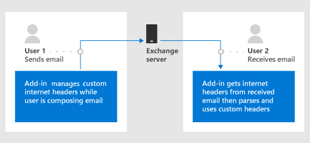

# Get and set internet headers on a message in an Outlook add-in

## Background

A common requirement in Outlook add-ins development is to store custom properties associated with an add-in at different levels. At present, custom properties are stored at the item or mailbox level.

- Item level - For properties that apply to a specific item, use the [CustomProperties](/javascript/api/outlook/office.customproperties) object. For example, store a customer code associated with the person who sent the email.
- Mailbox level - For properties that apply to all the mail items in the user's mailbox, use the [RoamingSettings](/javascript/api/outlook/office.roamingsettings) object. For example, store a user's preference to show the temperature in a particular scale.

Both types of properties aren't preserved after the item leaves the Exchange server, so the email recipients can't get any properties set on the item. Therefore, developers can't access those settings or other Multipurpose Internet Mail Extensions (MIME) properties to enable better read scenarios.

While there's a way for you to set the internet headers through EWS requests, in some scenarios, making an EWS request won't work. For example, in Compose mode on Outlook desktop, the item ID isn't synced on `saveAsync` in cached mode.

> [!TIP]
> See [Get and set add-in metadata for an Outlook add-in](metadata-for-an-outlook-add-in.md) to learn more about using these options.

## Purpose of the internet headers API

Introduced in [requirement set 1.8](/javascript/api/requirement-sets/outlook/requirement-set-1.8/outlook-requirement-set-1.8), the internet headers APIs enable developers to:

- Stamp information on an email that persists after it leaves Exchange across all clients.
- Read information on an email that persisted after the email left Exchange across all clients in mail read scenarios.
- Access the entire MIME header of the email.



## Set internet headers while composing a message

Use the [item.internetHeaders](/javascript/api/outlook/office.messagecompose#outlook-office-messagecompose-internetheaders-member) property to manage the custom internet headers you place on the current message in Compose mode.

### Set, get, and remove custom internet headers example

The following example shows how to set, get, and remove custom internet headers.

```js
// Set custom internet headers.
function setCustomHeaders() {
  Office.context.mailbox.item.internetHeaders.setAsync(
    { "x-preferred-fruit": "orange", "x-preferred-vegetable": "broccoli", "x-best-vegetable": "spinach" },
    setCallback
  );
}

function setCallback(asyncResult) {
  if (asyncResult.status === Office.AsyncResultStatus.Succeeded) {
    console.log("Successfully set headers");
  } else {
    console.log("Error setting headers: " + JSON.stringify(asyncResult.error));
  }
}

// Get custom internet headers.
function getSelectedCustomHeaders() {
  Office.context.mailbox.item.internetHeaders.getAsync(
    ["x-preferred-fruit", "x-preferred-vegetable", "x-best-vegetable", "x-nonexistent-header"],
    getCallback
  );
}

function getCallback(asyncResult) {
  if (asyncResult.status === Office.AsyncResultStatus.Succeeded) {
    console.log("Selected headers: " + JSON.stringify(asyncResult.value));
  } else {
    console.log("Error getting selected headers: " + JSON.stringify(asyncResult.error));
  }
}

// Remove custom internet headers.
function removeSelectedCustomHeaders() {
  Office.context.mailbox.item.internetHeaders.removeAsync(
    ["x-best-vegetable", "x-nonexistent-header"],
    removeCallback);
}

function removeCallback(asyncResult) {
  if (asyncResult.status === Office.AsyncResultStatus.Succeeded) {
    console.log("Successfully removed selected headers");
  } else {
    console.log("Error removing selected headers: " + JSON.stringify(asyncResult.error));
  }
}

setCustomHeaders();
getSelectedCustomHeaders();
removeSelectedCustomHeaders();
getSelectedCustomHeaders();

/* Sample output:
Successfully set headers
Selected headers: {"x-best-vegetable":"spinach","x-preferred-fruit":"orange","x-preferred-vegetable":"broccoli"}
Successfully removed selected headers
Selected headers: {"x-preferred-fruit":"orange","x-preferred-vegetable":"broccoli"}
*/
```

## Get internet headers while reading a message

Call [item.getAllInternetHeadersAsync](/javascript/api/outlook/office.messageread#outlook-office-messageread-getallinternetheadersasync-member(1)) to get internet headers on the current message in Read mode.

### Get sender preferences from current MIME headers example

Building on the example from the previous section, the following code shows how to get the sender's preferences from the current email's MIME headers.

```js
Office.context.mailbox.item.getAllInternetHeadersAsync(getCallback);

function getCallback(asyncResult) {
  if (asyncResult.status === Office.AsyncResultStatus.Succeeded) {
    console.log("Sender's preferred fruit: " + asyncResult.value.match(/x-preferred-fruit:.*/gim)[0].slice(19));
    console.log("Sender's preferred vegetable: " + asyncResult.value.match(/x-preferred-vegetable:.*/gim)[0].slice(23));
  } else {
    console.log("Error getting preferences from header: " + JSON.stringify(asyncResult.error));
  }
}

/* Sample output:
Sender's preferred fruit: orange
Sender's preferred vegetable: broccoli
*/
```

> [!IMPORTANT]
> This sample works for simple cases. For more complex information retrieval (for example, multi-instance headers or folded values as described in [RFC 2822](https://tools.ietf.org/html/rfc2822)), try using an appropriate MIME-parsing library.

## Recommended practices

Currently, internet headers are a finite resource on a user's mailbox. When the quota is exhausted, you can't create any more internet headers on that mailbox, which can result in unexpected behavior from clients that rely on this to function.

Apply the following guidelines when you create internet headers in your add-in.

- Create the minimum number of headers required. The header quota is based on the total size of headers applied to a message. In Exchange Online, the header limit is capped at 256 KB, while in an Exchange on-premises environment, the limit is determined by your organization's administrator. For further information on header limits, see [Exchange Online message limits](/office365/servicedescriptions/exchange-online-service-description/exchange-online-limits) and [Exchange Server message limits](/exchange/mail-flow/message-size-limits?view=exchserver-2019).
- Name headers so that you can reuse and update their values later. As such, avoid naming headers in a variable manner (for example, based on user input, timestamp, etc.).

## See also

- [Get and set add-in metadata for an Outlook add-in](metadata-for-an-outlook-add-in.md)
