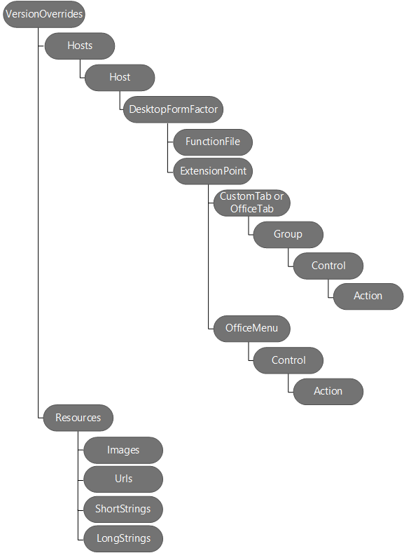

# Define add-in commands in your manifest

Add-in commands provide an easy way to customize the default Office UI with UI elements that perform actions; for example, you can add custom buttons on the ribbon. To create commands, you add a **VersionOverrides** node to an existing task pane manifest. 

When a manifest contains the **VersionOverrides** element, versions of Word, Excel, Outlook, and PowerPoint that support add-in commands will use the information within that element to load the add-in. Earlier versions of Office products that do not support add-in commands will ignore the element.

When client applications recognize the  **VersionOverrides** node, the add-in name appears in the ribbon, not in a task pane or a read/compose pane. The add-in won't appear in both places.
 

## VersionOverrides node

The  [VersionOverrides](../../reference/manifest/versionoverrides.md) element is the root element that contains information for the add-in commands implemented by the add-in. It is supported in manifest schema v1.1 and later, but is defined in the VersionOverrides v1.0 schema. 

The VersionOverrides element includes the following child elements:

- [Description](../../reference/manifest/description.md)
- [Requirements](../../reference/manifest/requirements.md)
- [Hosts](../../reference/manifest/hosts.md)
- [Resources](../../reference/manifest/resources.md)

The following diagram shows the hierarchy of elements used to define add-in commands. 

## Rule changes for Outlook add-in commands

The following changes affect the rules in the manifest:

- Activation rules are now inside each entry point.
    
- The **ItemIs** attribute of the [Rule](../../../reference/manifest/rule.md) element has been modified. **ItemType** can either be Message or AppointmentAttendee. The **FormType** attribute has been removed.
    
- The **ItemHasKnownEntity** attribute of the [Rule](../../../reference/manifest/rule.md) element has been udpated to accept a string for the EntityType.
    

## Sample manifests

For a sample manifest that implements add-in commands for Word, Excel, and PowerPoint, see [Simple add-in commands sample](https://github.com/OfficeDev/Office-Add-in-Commands-Samples/tree/master/Simple).

For a sample manifest that implements add-in commands for Outlook, see [Sample manifest file for an Outlook add-in](https://gist.github.com/mlafleur/95b7ac030bb7a7ae742527e85a36b095).

## Additional resources

- [Add-in commands for Outlook](../../outlook/add-in-commands-for-outlook.md)
    
- [Outlook add-in manifests](../../outlook/manifests/manifests.md)
    
- [Outlook add-in command demo sample](https://github.com/jasonjoh/command-demo)
