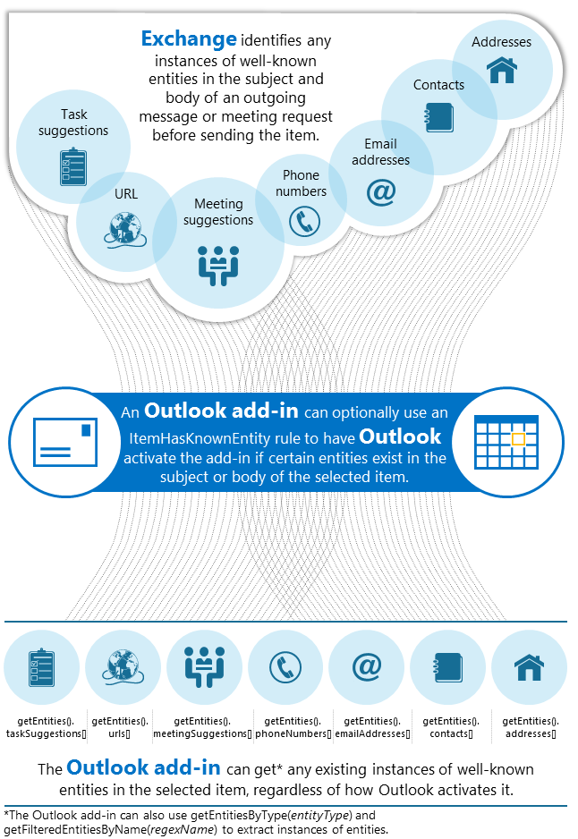

# Match strings in an Outlook item as well-known entities


Before sending a message or meeting request item, Exchange Server parses the contents of the item, identifies and stamps certain strings in the subject and body that resemble entities well-known to Exchange, for example, email addresses, phone numbers, and URLs. Messages and meeting requests are delivered by Exchange Server in an Outlook Inbox with well-known entities stamped. 

Using the JavaScript API for Office, you can get these strings that match specific well-known entities for further processing. You can also specify a well-known entity in a rule in the add-in manifest so that Outlook can activate your add-in when the user is viewing an item that contains matches for that entity. You can then extract and take action on matches for the entity. 

Being able to identify or extract such instances from a selected message or appointment is convenient. For example, you can build a reverse phone look-up service as an Outlook add-in. The add-in can extract strings in the item subject or body that resemble a phone number, do a reverse lookup and display the registered owner of each phone number.

This topic introduces these well-known entities, shows examples of activation rules based on well-known entities, and how to extract entity matches independently of having used entities in activation rules.


## Support for well-known entities


Exchange Server stamps well-known entities in a message or meeting request item after the sender sends the item and before Exchange delivers the item to the recipient. Therefore, only items that have gone through transport in Exchange are stamped, and Outlook can activate add-ins based on these stamps when the user is viewing such items. On the contrary, when the user is composing an item or viewing an item that is in the Sent Items folder, because the item has not gone through transport, Outlook cannot activate add-ins based on well-known entities. 

Similarly, you cannot extract well-known entities in items that are being composed or in the Sent Items folder, as these items have not gone through transport and are not stamped. For additional information about the kinds of items that support activation, see [Activation rules for Outlook add-ins](../outlook/manifests/activation-rules.md#MailAppDefineRules_Activation).

The following table lists the entities that Exchange Server and Outlook support and recognize (hence the name "well-known entities"), and the object type of an instance of each entity. The natural language recognition of a string as one of these entities is based on a learning model that has been trained on a large amount of data. Therefore, the recognition is non-deterministic. See [Tips for using well-known entities](#MailAppEntities_Tips) for more information about conditions for recognition.

 **Table 1. Supported entities and their types**


|**Entity type**|**Conditions for recognition**|**Object type**|
|:-----|:-----|:-----|
|**Address**|United States street addresses; for example: 1234 Main Street, Redmond, WA 07722.Generally, for an address to be recognized, it should follow the structure of a United States postal address, with most of the elements of a street number, street name, city, state, and zip code present. The address can be specified in one or multiple lines.|JavaScript  **String** object|
|**Contact**|A reference to a person's information as recognized in natural language.The recognition of a contact depends on the context. For example, a signature at the end of a message, or a person's name appearing in the vicinity of some of the following information: a phone number, address, email address, and URL.|[Contact](../../reference/outlook/simple-types.md) object|
|**EmailAddress**|SMTP email addresses.|JavaScript  **String** object|
|**MeetingSuggestion**|A reference to an event or meeting. For example, Exchange 2013 would recognize the following text as a meeting suggestion:  _Let's meet tomorrow for lunch._|[MeetingSuggestion](../../reference/outlook/simple-types.md) object|
|**PhoneNumber**|United States telephone numbers; for example:  _(235) 555-0110_|[PhoneNumber](../../reference/outlook/simple-types.md) object|
|**TaskSuggestion**|Actionable sentences in an email. For example:  _Please update the spreadsheet._|[TaskSuggestion](../../reference/outlook/simple-types.md) object|
|**Url**|A web address that explicitly specifies the network location and identifier for a web resource. Exchange Server does not require the access protocol in the web address, and does not recognize URLs that are embedded in link text as instances of the  **Url** entity. Exchange Server can match the following examples: _www.youtube.com/user/officevideos_ _http://www.youtube.com/user/officevideos_|JavaScript  **String** object|
Figure 1 describes how Exchange Server and Outlook support well-known entities for add-ins, and what add-ins can do with well-known entities. See [Retrieving entities in your add-in](#MailAppEntities_Retrieving) and [Activating an add-in based on the existence of an entity](#MailAppEntities_Activating) for more details on how to use these entities.


**Figure 1. How Exchange Server, Outlook and add-ins support well-known entities**




## Permissions to extract entities


To extract entities in your JavaScript code or to have your add-in activated based on the existence of certain well-known entities, make sure you have requested the appropriate permissions in the add-in manifest.

Specifying the default restricted permission allows your add-in to extract the  **Address**,  **MeetingSuggestion**, or  **TaskSuggestion** entity. To extract any of the other entities, specify read item, read/write item or read/write mailbox permission. To do that in the manifest, use the [Permissions](http://msdn.microsoft.com/en-us/library/c20cdf29-74b0-564c-e178-b75d148b36d1%28Office.15%29.aspx) element and specify the appropriate permission - **Restricted**,  **ReadItem**,  **ReadWriteItem**, or  **ReadWriteMailbox** - as in the following example:


```XML
<Permissions>ReadItem</Permissions>
```


## Retrieving entities in your add-in


As long as the subject or body of the item that is being viewed by the user contains strings that Exchange and Outlook can recognize as well-known entities, these instances are available to add-ins. They are available even if an add-in is not activated based on well-known entities. With the appropriate permission, you can use the  **getEntities** or **getEntitiesByType** method to retrieve well-known entities that are present in the current message or appointment. The **getEntities** method returns an array of [Entities](../../reference/outlook/simple-types.md) objects that contains all the well-known entities in the item. If you're interested in a particular type of entities, use the **getEntitiesByType** method which returns an array of only the entities you want. The [EntityType](../../reference/outlook/Office.MailboxEnums.md) enumeration represents all the types of well-known entities you can extract.

After calling  **getEntities**, you can then use the corresponding property of the  **Entities** object to obtain an array of instances of a type of entity. Depending on the type of entity, the instances in the array can be just strings, or can map to specific objects. As an example seen in Figure 1, to get addresses in the item, access the array returned by `getEntities().addresses[]`. The  **Entities.addresses** property returns an array of strings that Outlook recognizes as postal addresses. Similarly, the **Entities.contacts** property returns an array of **Contact** objects that Outlook recognizes as contact information. Tables 1 lists the object type of an instance of each supported entity.

The following example shows how to retrieve any addresses found in a message.


```
// Get the address entities from the item.
var entities = Office.context.mailbox.item.getEntities();
// Check to make sure that address entities are present.
if (null != entities &amp;&amp; null != entities.addresses &amp;&amp; undefined != entities.addresses) {
   //Addresses are present, so use them here.
}

```


## Activating an add-in based on the existence of an entity


Another way to use well-known entities is to have Outlook activate your add-in based on the existence of one or more types of entities in the subject or body of the currently viewed item. You can do so by specifying an  **ItemHasKnownEntity** rule in the add-in manifest. The [KnownEntityType](http://msdn.microsoft.com/en-us/library/432d413b-9fcc-eb50-cfea-0ed10a43bd52%28Office.15%29.aspx) simple type represents the different types of well-known entities supported by **ItemHasKnownEntity** rules. After your add-in is activated, you can also retrieve the instances of such entities for your purposes, as described in the previous section [Retrieving entities in your add-in](#MailAppEntities_Retrieving). 

You can optionally apply a regular expression in an  **ItemHasKnownEntity** rule, so as to further filter instances of an entity and have Outlook activate an add-in only on a subset of the instances of the entity. For example, you can specify a filter for the street address entity in a message that contains a Washington state zip code beginning with "98". To apply a filter on the entity instances, use the **RegExFilter** and **FilterName** attributes in the [Rule](http://msdn.microsoft.com/en-us/library/56dfc32e-2b8c-1724-05be-5595baf38aa3%28Office.15%29.aspx) element of the [ItemHasKnownEntity](http://msdn.microsoft.com/en-us/library/87e10fd2-eab4-c8aa-bec3-dff92d004d39%28Office.15%29.aspx) type.

Similar to other activation rules, you can specify multiple rules to form a rule collection for your add-in. The following example applies an "AND" operation on 2 rules: an  **ItemIs** rule and an **ItemHasKnownEntity** rule. This rule collection activates the add-in whenever the current item is a message and Outlook recognizes an address in the subject or body of that item.


```XML
<Rule xsi:type="RuleCollection" Mode="And">
   <Rule xsi:type="ItemIs" ItemType="Message" />
   <Rule xsi:type="ItemHasKnownEntity" EntityType="Address" />
</Rule>
```

The following example uses  **getEntitiesByType** of the current item to set a variable `addresses` to the results of the preceding rule collection.


```
var addresses = Office.context.mailbox.item.getEntitiesByType(Office.MailboxEnums.EntityType.Address);
```

The following  **ItemHasKnownEntity** rule example activates the add-in whenever there is a URL in the subject or body of the current item, and the URL contains the string "youtube", regardless of the case of the string.


```XML
<Rule xsi:type="ItemHasKnownEntity" 
    EntityType="Url" 
    RegExFilter="youtube"
    FilterName="youtube"
    IgnoreCase="true"/>
```

The following example uses  **getFilteredEntitiesByName(name)** of the current item to set a variable `videos` to get an array of results that match the regular expression in the preceding **ItemHasKnownEntity** rule.


```
var videos = Office.context.mailbox.item.getFilteredEntitiesByName(youtube);
```


## Tips for using well-known entities


There are a few facts and limits you should be aware of if you use well-known entities in your add-in. The following applies as long as your add-in is activated when the user is reading an item which contains matches of well-known entities, regardless of whether you use an  **ItemHasKnownEntity** rule:


1. You can extract strings that are well-known entities only if the strings are in English.
    
2. You can extract well-known entities from the first 2,000 characters in the item body, but not beyond that limit. This size limit helps balance the need for functionality and performance, so that Exchange Server and Outlook are not bogged down by parsing and identifying instances of well-known entities in large messages and appointments. Note that this limit is independent of whether the add-in specifies an  **ItemHasKnownEntity** rule. If the add-in does use such a rule, note also the rule processing limit in item 2 below for the Outlook rich clients.
    
3. You can extract entities from appointments that are meetings organized by someone other than the mailbox owner. You cannot extract entities from calendar items that are not meetings, or meetings organized by the mailbox owner.
    
4. You can extract entities of the  **MeetingSuggestion** type from only messages but not appointments.
    
5. You can extract URLs that exist explicitly in the item body, but not URLs that are embedded in hyperlinked text in HTML item body. Consider using an  **ItemHasRegularExpressionMatch** rule instead to get both explicit and embedded URLs. Specify **BodyAsHTML** as the _PropertyName_, and a regular expression that matches URLs as the  _RegExValue_.
    
6. You cannot extract entities from items in the Sent Items folder.
    
In addition, the following applies if you use an [ItemHasKnownEntity](http://msdn.microsoft.com/en-us/library/87e10fd2-eab4-c8aa-bec3-dff92d004d39%28Office.15%29.aspx) rule, and may affect the scenarios where you'd otherwise expect your add-in to be activated:


1. When using the  **ItemHasKnownEntity** rule, expect Outlook to match entity strings in only English regardless of the default locale specified in the manifest.
    
2. When your add-in is running on an Outlook rich client, expect Outlook to apply the  **ItemHasKnownEntity** rule to the first megabyte of the item body and not to the rest of the body over that limit.
    
3. You cannot use an  **ItemHasKnownEntity** rule to activate an add-in for items in the Sent Items folder.
    

## Additional resources


- [Create Outlook add-ins for read forms](../outlook/read-scenario.md)
    
- [Extract entity strings from an Outlook item](../outlook/extract-entity-strings-from-an-item.md)
    
- [Activation rules for Outlook add-ins](../outlook/manifests/activation-rules.md)
    
- [Use regular expression activation rules to show an Outlook add-in](../outlook/use-regular-expressions-to-show-an-outlook-add-in.md)
    
- [Understanding Outlook add-in permissions](../outlook/understanding-outlook-add-in-permissions.md)
    
