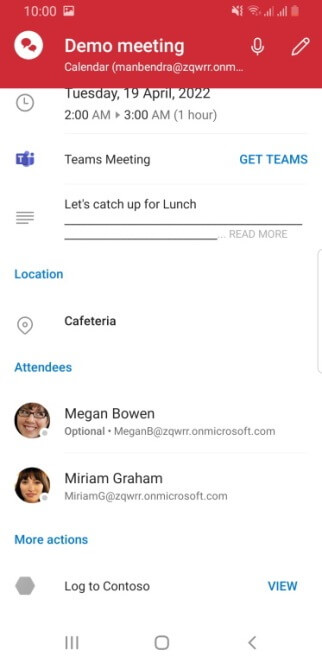

# Log appointment notes to an external application in Outlook mobile add-ins

Saving your appointment notes and other details to a customer relationship management (CRM) or note-taking application can help you keep track of meetings you've attended.

In this article, you'll learn how to set up your Outlook mobile add-in to enable users to log notes and other details about their appointments to your CRM or note-taking application. Throughout this article, we'll be using a fictional CRM service provider named "Contoso".

> [!IMPORTANT]
> This feature is only supported on Android with a Microsoft 365 subscription.

## Set up your environment

Complete the [Outlook quick start](../quickstarts/outlook-quickstart.md?tabs=yeomangenerator) to create an add-in project with the Yeoman generator for Office Add-ins.

## Capture and view appointment notes

You can opt to implement a function command or task pane. To update your add-in, select the tab for either function command or task pane, then follow the instructions.

# [Function command](#tab/noui)

This option will enable a user to log and view their notes and other details about their appointments when they select a function command from the ribbon.

### Configure the manifest

To enable users to log appointment notes with your add-in, you must configure the [MobileLogEventAppointmentAttendee extension point](/javascript/api/manifest/extensionpoint#mobilelogeventappointmentattendee) in the manifest under the parent element `MobileFormFactor`. Other form factors are not supported.

[!INCLUDE [Teams manifest not supported on mobile devices](../includes/no-mobile-with-json-note.md)]

1. In your code editor, open the quick start project.

1. Open the **manifest.xml** file located at the root of your project.

1. Select the entire `<VersionOverrides>` node (including open and close tags) and replace it with the following XML. Make sure to replace all references to **Contoso** with your company's information.

    ```xml
    <VersionOverrides xmlns="http://schemas.microsoft.com/office/mailappversionoverrides" xsi:type="VersionOverridesV1_0">
      <VersionOverrides xmlns="http://schemas.microsoft.com/office/mailappversionoverrides/1.1" xsi:type="VersionOverridesV1_1">
        <Description resid="residDescription"></Description>
        <Requirements>
          <bt:Sets>
            <bt:Set Name="Mailbox" MinVersion="1.3"/>
          </bt:Sets>
        </Requirements>
        <Hosts>
          <Host xsi:type="MailHost">
            <DesktopFormFactor>
              <FunctionFile resid="residFunctionFile"/>
              <ExtensionPoint xsi:type="AppointmentAttendeeCommandSurface">
                <OfficeTab id="TabDefault">
                  <Group id="apptReadGroup">
                    <Label resid="residDescription"/>
                    <Control xsi:type="Button" id="apptReadOpenPaneButton">
                      <Label resid="residLabel"/>
                      <Supertip>
                        <Title resid="residLabel"/>
                        <Description resid="residTooltip"/>
                      </Supertip>
                      <Icon>
                        <bt:Image size="16" resid="icon-16"/>
                        <bt:Image size="32" resid="icon-32"/>
                        <bt:Image size="80" resid="icon-80"/>
                      </Icon>
                      <Action xsi:type="ExecuteFunction">
                        <FunctionName>logCRMEvent</FunctionName>
                      </Action>
                    </Control>
                  </Group>
                </OfficeTab>
              </ExtensionPoint>
            </DesktopFormFactor>
            <MobileFormFactor>
              <FunctionFile resid="residFunctionFile"/>
              <ExtensionPoint xsi:type="MobileLogEventAppointmentAttendee">
                <Control xsi:type="MobileButton" id="appointmentReadFunctionButton">
                  <Label resid="residLabel"/>
                  <Icon>
                    <bt:Image size="25" scale="1" resid="icon-16"/>
                    <bt:Image size="25" scale="2" resid="icon-16"/>
                    <bt:Image size="25" scale="3" resid="icon-16"/>
                    <bt:Image size="32" scale="1" resid="icon-32"/>
                    <bt:Image size="32" scale="2" resid="icon-32"/>
                    <bt:Image size="32" scale="3" resid="icon-32"/>
                    <bt:Image size="48" scale="1" resid="icon-48"/>
                    <bt:Image size="48" scale="2" resid="icon-48"/>
                    <bt:Image size="48" scale="3" resid="icon-48"/>
                  </Icon>
                  <Action xsi:type="ExecuteFunction">
                    <FunctionName>logCRMEvent</FunctionName>
                  </Action>
                </Control>
              </ExtensionPoint>
            </MobileFormFactor>
          </Host>
        </Hosts>
        <Resources>
          <bt:Images>
            <bt:Image id="icon-16" DefaultValue="https://contoso.com/assets/icon-16.png"/>
            <bt:Image id="icon-32" DefaultValue="https://contoso.com/assets/icon-32.png"/>
            <bt:Image id="icon-48" DefaultValue="https://contoso.com/assets/icon-48.png"/>
            <bt:Image id="icon-80" DefaultValue="https://contoso.com/assets/icon-80.png"/>
          </bt:Images>
          <bt:Urls>
            <bt:Url id="residFunctionFile" DefaultValue="https://contoso.com/commands.html"/>
          </bt:Urls>
          <bt:ShortStrings>
            <bt:String id="residDescription" DefaultValue="Log appointment notes and other details to Contoso CRM."/>
            <bt:String id="residLabel" DefaultValue="Log to Contoso CRM"/>
          </bt:ShortStrings>
          <bt:LongStrings>
            <bt:String id="residTooltip" DefaultValue="Log notes to Contoso CRM for this appointment."/>
          </bt:LongStrings>
        </Resources>
      </VersionOverrides>
    </VersionOverrides>
    ```

> [!TIP]
> To learn more about manifests for Outlook add-ins, see [Outlook add-in manifests](manifests.md) and [Add support for add-in commands for Outlook Mobile](add-mobile-support.md).

### Capture appointment notes

In this section, learn how your add-in can extract appointment details when the user selects the **Log** button.

1. From the same quick start project, open the file **./src/commands/commands.js** in your code editor.

1. Replace the entire content of the **commands.js** file with the following JavaScript.

    ```js
    var event;

    Office.initialize = function (reason) {
      // Add any initialization code here.
    };

    function logCRMEvent(appointmentEvent) {
      event = appointmentEvent;
      console.log(`Subject: ${Office.context.mailbox.item.subject}`);
      Office.context.mailbox.item.body.getAsync(
        "html",
        { asyncContext: "This is passed to the callback" },
        function callback(result) {
          if (result.status === Office.AsyncResultStatus.Succeeded) {
            event.completed({ allowEvent: true });
          } else {
            console.error("Failed to get body.");
            event.completed({ allowEvent: false });
          }
        }
      );
    }

    // Register the function.
    Office.actions.associate("logCRMEvent", logCRMEvent);
    ```

Next, update the **commands.html** file to reference **commands.js**.

1. From the same quick start project, open the **./src/commands/commands.html** file in your code editor.

1. Find and replace `<script type="text/javascript" src="https://appsforoffice.microsoft.com/lib/1.1/hosted/office.js"></script>` with the following:

    ```html
    <script type="text/javascript" src="https://appsforoffice.microsoft.com/lib/1.1/hosted/office.js"></script>
    <script type="text/javascript" src="commands.js"></script>
    ```

### View appointment notes

The **Log** button label can be toggled to display **View** by setting the **EventLogged** custom property reserved for this purpose. When the user selects the **View** button, they can look at their logged notes for this appointment.

Your add-in defines the log viewing experience. For example, you can display the logged appointment notes in a dialog when the user selects the **View** button. For details on using dialogs, refer to [Use the Office dialog API in your Office Add-ins](../develop/dialog-api-in-office-add-ins.md).

Add the following function to **./src/commands/commands.js**. This function sets the **EventLogged** custom property on the current appointment item.

```js
function updateCustomProperties() {
  Office.context.mailbox.item.loadCustomPropertiesAsync(
    function callback(customPropertiesResult) {
      if (customPropertiesResult.status === Office.AsyncResultStatus.Succeeded) {
        let customProperties = customPropertiesResult.value;
        customProperties.set("EventLogged", true);
        customProperties.saveAsync(
          function callback(setSaveAsyncResult) {
            if (setSaveAsyncResult.status === Office.AsyncResultStatus.Succeeded) {
              console.log("EventLogged custom property saved successfully.");
              event.completed({ allowEvent: true });
              event = undefined;
            }
          }
        );
      }
    }
  );
}
```

Then call it after the add-in successfully logs the appointment notes. For example, you can call it from **logCRMEvent** as shown in the following function.

```js
function logCRMEvent(appointmentEvent) {
  event = appointmentEvent;
  console.log(`Subject: ${Office.context.mailbox.item.subject}`);
  Office.context.mailbox.item.body.getAsync(
    "html",
    { asyncContext: "This is passed to the callback" },
    function callback(result) {
      if (result.status === Office.AsyncResultStatus.Succeeded) {
        // Replace `event.completed({ allowEvent: true });` with the following statement.
        updateCustomProperties();
      } else {
        console.error("Failed to get body.");
        event.completed({ allowEvent: false });
      }
    }
  );
}
```

### Delete the appointment log

If you'd like to enable your users to undo logging or delete the logged appointment notes so a replacement log can be saved, you have two options.

1. Use Microsoft Graph to [clear the custom properties object](/graph/api/resources/extended-properties-overview?view=graph-rest-1.0&preserve-view=true) when the user selects the appropriate button in the ribbon.
1. Add the following function to **./src/commands/commands.js** to clear the **EventLogged** custom property on the current appointment item.

    ```js
    function clearCustomProperties() {
      Office.context.mailbox.item.loadCustomPropertiesAsync(
        function callback(customPropertiesResult) {
          if (customPropertiesResult.status === Office.AsyncResultStatus.Succeeded) {
            var customProperties = customPropertiesResult.value;
            customProperties.remove("EventLogged");
            customProperties.saveAsync(
              function callback(removeSaveAsyncResult) {
                if (removeSaveAsyncResult.status === Office.AsyncResultStatus.Succeeded) {
                  console.log("Custom properties cleared");
                  event.completed({ allowEvent: true });
                  event = undefined;
                }
              }
            );
          }
        }
      );
    }
    ```

Then call it when you want to clear the custom property. For example, you can call it from **logCRMEvent** if setting the log failed in some way as shown in the following function.

  ```js
  function logCRMEvent(appointmentEvent) {
    event = appointmentEvent;
    console.log(`Subject: ${Office.context.mailbox.item.subject}`);
    Office.context.mailbox.item.body.getAsync(
      "html",
      { asyncContext: "This is passed to the callback" },
      function callback(result) {
        if (result.status === Office.AsyncResultStatus.Succeeded) {
          updateCustomProperties();
        } else {
          console.error("Failed to get body.");
          // Replace `event.completed({ allowEvent: false });` with the following statement.
          clearCustomProperties();
        }
      }
    );
  }
  ```

# [Task pane](#tab/taskpane)

This option will enable a user to log and view their notes and other details about their appointments from a task pane.

### Configure the manifest

To enable users to log appointment notes with your add-in, you must configure the [MobileLogEventAppointmentAttendee extension point](/javascript/api/manifest/extensionpoint#mobilelogeventappointmentattendee) in the manifest under the parent element `MobileFormFactor`. Other form factors are not supported.

[!INCLUDE [Teams manifest not supported on mobile devices](../includes/no-mobile-with-json-note.md)]

1. In your code editor, open the quick start project.

1. Open the **manifest.xml** file located at the root of your project.

1. Select the entire `<VersionOverrides>` node (including open and close tags) and replace it with the following XML. Make sure to replace all references to **Contoso** with your company's information.

    ```xml
    <VersionOverrides xmlns="http://schemas.microsoft.com/office/mailappversionoverrides" xsi:type="VersionOverridesV1_0">
      <VersionOverrides xmlns="http://schemas.microsoft.com/office/mailappversionoverrides/1.1" xsi:type="VersionOverridesV1_1">
        <Description resid="residDescription"></Description>
          <Requirements>
            <bt:Sets>
              <bt:Set Name="Mailbox" MinVersion="1.3"/>
            </bt:Sets>
          </Requirements>
          <Hosts>
            <Host xsi:type="MailHost">
              <DesktopFormFactor>
                <ExtensionPoint xsi:type="AppointmentAttendeeCommandSurface">
                  <OfficeTab id="TabDefault">
                    <Group id="apptReadGroup">
                      <Label resid="residDescription"/>
                      <Control xsi:type="Button" id="apptReadOpenPaneButton">
                        <Label resid="residLabel"/>
                        <Supertip>
                          <Title resid="residLabel"/>
                          <Description resid="residTooltip"/>
                        </Supertip>
                        <Icon>
                          <bt:Image size="16" resid="icon-16"/>
                          <bt:Image size="32" resid="icon-32"/>
                          <bt:Image size="80" resid="icon-80"/>
                        </Icon>
                        <Action xsi:type="ShowTaskpane">
                          <SourceLocation resid="Taskpane.Url"/>
                        </Action>
                      </Control>
                    </Group>
                  </OfficeTab>
                </ExtensionPoint>
              </DesktopFormFactor>
              <MobileFormFactor>
                <ExtensionPoint xsi:type="MobileLogEventAppointmentAttendee">
                  <Control xsi:type="MobileButton" id="appointmentReadFunctionButton">
                    <Label resid="residLabel"/>
                    <Icon>
                      <bt:Image size="25" scale="1" resid="icon-16"/>
                      <bt:Image size="25" scale="2" resid="icon-16"/>
                      <bt:Image size="25" scale="3" resid="icon-16"/>
    
                      <bt:Image size="32" scale="1" resid="icon-32"/>
                      <bt:Image size="32" scale="2" resid="icon-32"/>
                      <bt:Image size="32" scale="3" resid="icon-32"/>
    
                      <bt:Image size="48" scale="1" resid="icon-48"/>
                      <bt:Image size="48" scale="2" resid="icon-48"/>
                      <bt:Image size="48" scale="3" resid="icon-48"/>
                    </Icon>
                    <Action xsi:type="ShowTaskpane">
                      <SourceLocation resid="Taskpane.Url"/>
                    </Action> 
                  </Control>
                </ExtensionPoint>
              </MobileFormFactor>
            </Host>
          </Hosts>
          <Resources>
            <bt:Images>
              <bt:Image id="icon-16" DefaultValue="https://contoso.com/assets/icon-16.png"/>
              <bt:Image id="icon-32" DefaultValue="https://contoso.com/assets/icon-32.png"/>
              <bt:Image id="icon-48" DefaultValue="https://contoso.com/assets/icon-48.png"/>
              <bt:Image id="icon-80" DefaultValue="https://contoso.com/assets/icon-80.png"/>
            </bt:Images>
            <bt:Urls>
              <bt:Url id="residFunctionFile" DefaultValue="https://contoso.com/commands.html"/>
              <bt:Url id="Taskpane.Url" DefaultValue="https://contoso.com/taskpane.html"/>
            </bt:Urls>
            <bt:ShortStrings>
              <bt:String id="residDescription" DefaultValue="Log appointment notes and other details to Contoso CRM."/>
              <bt:String id="residLabel" DefaultValue="Log to Contoso CRM"/>
            </bt:ShortStrings>
            <bt:LongStrings>
              <bt:String id="residTooltip" DefaultValue="Log notes to Contoso CRM for this appointment."/>
            </bt:LongStrings>
          </Resources>
        </VersionOverrides>
    </VersionOverrides>
    ```

> [!TIP]
> To learn more about manifests for Outlook add-ins, see [Outlook add-in manifests](manifests.md) and [Add support for add-in commands for Outlook Mobile](add-mobile-support.md).

### Capture appointment notes

In this section, learn how to display the logged appointment notes and other details in a task pane when the user selects the **Log** button.

1. From the same quick start project, open the file **./src/taskpane/taskpane.js** in your code editor.

1. Replace the entire content of the **taskpane.js** file with the following JavaScript.

    ```js
    // Office is ready.
    Office.onReady(function () {
        getEventData();
      }
    );

    function getEventData() {
      console.log(`Subject: ${Office.context.mailbox.item.subject}`);
      Office.context.mailbox.item.body.getAsync(
        "html",
        function callback(result) {
          if (result.status === Office.AsyncResultStatus.Succeeded) {
            console.log("event logged successfully");
          } else {
            console.error("Failed to get body.");
          }
        }
      );
    }
    ```

Next, update the **taskpane.html** file to reference **taskpane.js**.

1. From the same quick start project, open the **./src/taskpane/taskpane.html** file in your code editor.

1. Find and replace `<script type="text/javascript" src="https://appsforoffice.microsoft.com/lib/1.1/hosted/office.js"></script>` with the following:

    ```html
    <script type="text/javascript" src="https://appsforoffice.microsoft.com/lib/1.1/hosted/office.js"></script>
    <script type="text/javascript" src="taskpane.js"></script>
    ```

### View appointment notes

The **Log** button label can be toggled to display **View** by setting the **EventLogged** custom property reserved for this purpose. When the user selects the **View** button, they can look at their logged notes for this appointment. Your add-in defines the log viewing experience.

Add the following function to **./src/taskpane/taskpane.js**. This function sets the **EventLogged** custom property on the current appointment item.

```js
function updateCustomProperties() {
  Office.context.mailbox.item.loadCustomPropertiesAsync(
    function callback(customPropertiesResult) {
      if (customPropertiesResult.status === Office.AsyncResultStatus.Succeeded) {
        let customProperties = customPropertiesResult.value;
        customProperties.set("EventLogged", true);
        customProperties.saveAsync(
          function callback(setSaveAsyncResult) {
            if (setSaveAsyncResult.status === Office.AsyncResultStatus.Succeeded) {
              console.log("EventLogged custom property saved successfully.");
            }
          }
        );
      }
    }
  );
}
```

Then call it after the add-in successfully logs the appointment notes. For example, you can call it from **getEventData** as shown in the following function.

```js
function getEventData() {
  console.log(`Subject: ${Office.context.mailbox.item.subject}`);
  Office.context.mailbox.item.body.getAsync(
    "html",
    function callback(result) {
      if (result.status === Office.AsyncResultStatus.Succeeded) {
        console.log("event logged successfully");
        updateCustomProperties();
      } else {
        console.error("Failed to get body.");
      }
    }
  );
}
```

### Delete the appointment log

If you'd like to enable your users to undo logging or delete the logged appointment notes so a replacement log can be saved, you have two options.

1. Use Microsoft Graph to [clear the custom properties object](/graph/api/resources/extended-properties-overview?view=graph-rest-1.0&preserve-view=true) when the user selects the appropriate button in the task pane.
1. Add the following function to **./src/taskpane/taskpane.js** to clear the **EventLogged** custom property on the current appointment item.

    ```js
    function clearCustomProperties() {
      Office.context.mailbox.item.loadCustomPropertiesAsync(
        function callback(customPropertiesResult) {
          if (customPropertiesResult.status === Office.AsyncResultStatus.Succeeded) {
            var customProperties = customPropertiesResult.value;
            customProperties.remove("EventLogged");
            customProperties.saveAsync(
              function callback(removeSaveAsyncResult) {
                if (removeSaveAsyncResult.status === Office.AsyncResultStatus.Succeeded) {
                  console.log("Custom properties cleared");
                }
              }
            );
          }
        }
      );
    }
    ```

Then call it when you want to clear the custom property. For example, you can call it from **getEventData** if setting the log failed in some way as shown in the following function.

  ```js
  function getEventData() {
    console.log(`Subject: ${Office.context.mailbox.item.subject}`);
    Office.context.mailbox.item.body.getAsync(
      "html",
      function callback(result) {
        if (result.status === Office.AsyncResultStatus.Succeeded) {
          console.log("event logged successfully");
          updateCustomProperties();
        } else {
          console.error("Failed to get body.");
          clearCustomProperties();
        }
      }
    );
  }
  ```

---

## Test and validate

1. Follow the usual guidance to [test and validate your add-in](testing-and-tips.md).
1. After you [sideload](sideload-outlook-add-ins-for-testing.md) the add-in in Outlook on the web, Windows, or Mac, restart Outlook on your Android mobile device.
1. Open an appointment as an attendee then verify that under the **Meeting Insights** card, there's a new card with your add-in's name alongside the **Log** button.

### UI: Log the appointment notes

As a meeting attendee, you should see a screen similar to the following image when you open a meeting.


### UI: View the appointment log

After successfully logging the appointment notes, the button should now be labeled **View** instead of **Log**. You should see a screen similar to the following image.



## Available APIs

The following APIs are available for this feature.

- [Dialog APIs](../develop/dialog-api-in-office-add-ins.md)
- [Office.AddinCommands.Event](/javascript/api/office/office.addincommands.event?view=outlook-js-preview&preserve-view=true)
- [Office.CustomProperties](/javascript/api/outlook/office.customproperties?view=outlook-js-preview&preserve-view=true)
- [Office.RoamingSettings](/javascript/api/outlook/office.roamingsettings?view=outlook-js-preview&preserve-view=true)
- [Appointment Read (attendee) APIs](/javascript/api/outlook/office.appointmentread?view=outlook-js-preview&preserve-view=true) **except** the following:
  - [Office.context.mailbox.item.categories](/javascript/api/outlook/office.appointmentread?view=outlook-js-preview&preserve-view=true#categories)
  - [Office.context.mailbox.item.enhancedLocation](/javascript/api/outlook/office.appointmentread?view=outlook-js-preview&preserve-view=true#enhancedLocation)
  - [Office.context.mailbox.item.isAllDayEvent](/javascript/api/outlook/office.appointmentread?view=outlook-js-preview&preserve-view=true#isAllDayEvent)
  - [Office.context.mailbox.item.recurrence](/javascript/api/outlook/office.appointmentread?view=outlook-js-preview&preserve-view=true#recurrence)
  - [Office.context.mailbox.item.sensitivity](/javascript/api/outlook/office.appointmentread?view=outlook-js-preview&preserve-view=true#sensitivity)
  - [Office.context.mailbox.item.seriesId](/javascript/api/outlook/office.appointmentread?view=outlook-js-preview&preserve-view=true#seriesId)

## Restrictions

Several restrictions apply.

- The **Log** button name cannot be changed. However, there is a way for a different label to be displayed by setting a custom property on the appointment item. For more details, refer to the **View appointment notes** section for [function command](?tabs=noui#view-appointment-notes) or [task pane](?tabs=taskpane#view-appointment-notes-1) as appropriate.
- The **EventLogged** custom property must be used if you want to toggle the label of the **Log** button to **View** and back.
- The add-in icon should be in grayscale using hex code `#919191` or its equivalent in [other color formats](https://convertingcolors.com/hex-color-919191.html).
- The add-in should extract the meeting details from the appointment form within the one-minute timeout period. However, any time spent in a dialog box the add-in opened for authentication, for example, is excluded from the timeout period.

## See also

- [Add-ins for Outlook Mobile](outlook-mobile-addins.md)
- [Add support for add-in commands for Outlook Mobile](add-mobile-support.md)
