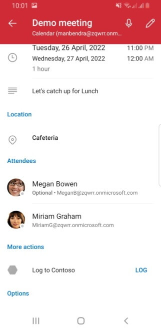

# Log appointment notes to an external application in Outlook mobile add-ins

Saving your appointment notes and other details to a customer relationship management (CRM) or note-taking application can help you keep track of meetings you've attended.

In this article, you'll learn how to set up your Outlook mobile add-in to enable users to log notes and other details about their appointments to your CRM or note-taking application. Throughout this article, we'll be using a fictional CRM service provider named "Contoso".

You can opt to implement a function command or task pane add-in. With a function command implementation, users can log and view notes and other details about their appointments when they select the add-in button. With a task pane implementation, users can directly manage their appointment notes from a task pane interface. As you follow the instructions in this article, select the tab for the type of add-in you're developing.

## Supported clients

Logging notes to an external application from an Outlook mobile add-in is supported in Outlook on Android and on iOS with a Microsoft 365 subscription.

## Set up your environment

Complete the [Outlook quick start](../quickstarts/outlook-quickstart-yo.md) to create an add-in project with the Yeoman generator for Office Add-ins.

## Configure the manifest

To configure your add-in's manifest, select the type of manifest you're using.

- [Unified manifest for Microsoft 365](#unified-manifest-for-microsoft-365)
- [Add-in only manifest](#add-in-only-manifest)

### Unified manifest for Microsoft 365

# [Function command](#tab/noui)

1. Open the quick start project in your code editor.

1. Open the **manifest.json** file located at the root of your project.

1. In the [`"authorization.permissions.resourceSpecific"`](/microsoft-365/extensibility/schema/root-authorization-permissions#resourcespecific) array, find the *first* object and set its `"name"` property to `"MailboxItem.ReadWrite.User"`. It should look like the following when you're done.

    ```json
    {
        "name": "MailboxItem.ReadWrite.User",
        "type": "Delegated"
    }
    ```

1. In the [`"validDomains"`](/microsoft-365/extensibility/schema/root#validdomains) array, ensure that the URL to `https://www.contoso.com` is included. The array should look like the following when you're done.

    ```json
    "validDomains": [
        "https://www.contoso.com"
    ],
    ```

1. In the [`"extensions.runtimes"`](/microsoft-365/extensibility/schema/extension-runtimes-array?view=m365-app-prev&preserve-view=true) array, delete the object whose `"id"` is set to `"TaskPaneRuntime"`.

1. In the same array, navigate to the remaining object, whose `"id"` is set to `"CommandsRuntime"`, and replace it with the following object.

    ```json
    {
        "requirements": {
            "capabilities": [
                {
                    "name": "Mailbox",
                    "minVersion": "1.3"
                }
            ]
        },
        "id": "CommandsRuntime",
        "type": "general",
        "code": {
            "page": "https://localhost:3000/commands.html",
            "script": "https://localhost:3000/commands.js"
        },
        "lifetime": "short",
        "actions": [
            {
                "id": "logCRMEvent",
                "type": "executeFunction"
            }
        ]
    }
    ```

1. In the [`"ribbons"`](/microsoft-365/extensibility/schema/element-extensions#ribbons) array, replace the existing object with the following code. Note the following about these changes.

    - The `"desktop"` and `"mobile"` values in the [`"ribbons.requirements.formFactors"`](/microsoft-365/extensibility/schema/requirements-extension-element#formfactors) array configure the **Log to Contoso** button to appear in Outlook on mobile devices and on desktop clients.
    - The `"logEventMeetingDetailsAttendee"` value in the `"contexts"` array configures the add-in button to appear in the Appointment Attendee surface, so that users can log their appointment notes.
    - The object in the `"ribbons.tabs.groups.controls"` array configures the add-in button that calls the note-logging function in Outlook desktop clients. The `"actionId"` property must match the [`"actions.id"`](/microsoft-365/extensibility/schema/extension-runtimes-actions-item#id) of the object in the `"extensions.runtimes"` array.
    - The object in the [`"ribbons.tabs.customMobileRibbonGroups"`](/microsoft-365/extensibility/schema/extension-ribbons-array-tabs-item#custommobileribbongroups) array configures the add-in button that calls the note-logging function in Outlook on mobile devices. All nine of the objects specified in the `"customMobileRibbonGroups.controls.icons"` array are required for a mobile button. Additionally, the `"customMobileRibbonGroups.controls.actionId"` property must match the `"actions.id"` of the object in the `"extensions.runtimes"` array.

    ```json
    {
        "requirements": {
            "formFactors": [
                "desktop",
                "mobile"
            ]
        },
        "contexts": [
            "logEventMeetingDetailsAttendee"
        ],
        "tabs": [
            {
                "builtInTabId": "TabDefault",
                "groups": [
                    {
                        "id": "apptReadGroup",
                        "label": "Contoso Add-in",
                        "icons": [
                            {
                                "size": 16,
                                "url": "https://localhost:3000/assets/icon-16.png"
                            },
                            {
                                "size": 32,
                                "url": "https://localhost:3000/assets/icon-32.png"
                            },
                            {
                                "size": 80,
                                "url": "https://localhost:3000/assets/icon-80.png"
                            }
                        ],
                        "controls": [
                            {
                                "id": "desktopLogToCRM",
                                "type": "button",
                                "label": "Log to Contoso",
                                "icons": [
                                    {
                                        "size": 16,
                                        "url": "https://www.contoso.com/assets/icon-16.png"
                                    },
                                    {
                                        "size": 32,
                                        "url": "https://www.contoso.com/assets/icon-32.png"
                                    },
                                    {
                                        "size": 80,
                                        "url": "https://www.contoso.com/assets/icon-80.png"
                                    }
                                ],
                                "supertip": {
                                    "title": "Log to Contoso CRM",
                                    "description": "Log notes to Contoso CRM for this appointment."
                                },
                                "actionId": "logCRMEvent"
                            }
                        ]
                    }
                ],
                "customMobileRibbonGroups": [
                    {
                        "id": "mobileApptReadGroup",
                        "label": "Contoso Add-in",
                        "controls": [
                            {
                                "id": "mobileLogToCRM",
                                "label": "Log to Contoso",
                                "type": "mobileButton",
                                "icons": [
                                    {
                                        "scale": 1,
                                        "size": 25,
                                        "url": "https://contoso.com/assets/icon-25.png"
                                    },
                                    {
                                        "scale": 1,
                                        "size": 32,
                                        "url": "https://contoso.com/assets/icon-32.png"
                                    },
                                    {
                                        "scale": 1,
                                        "size": 48,
                                        "url": "https://contoso.com/assets/icon-48.png"
                                    },                                
                                    {
                                        "scale": 2,
                                        "size": 25,
                                        "url": "https://contoso.com/assets/icon-25.png"
                                    },
                                    {
                                        "scale": 2,
                                        "size": 32,
                                        "url": "https://contoso.com/assets/icon-32.png"
                                    },
                                    {
                                        "scale": 2,
                                        "size": 48,
                                        "url": "https://contoso.com/assets/icon-48.png"
                                    },                                
                                    {
                                        "scale": 3,
                                        "size": 25,
                                        "url": "https://contoso.com/assets/icon-25.png"
                                    },
                                    {
                                        "scale": 3,
                                        "size": 32,
                                        "url": "https://contoso.com/assets/icon-32.png"
                                    },
                                    {
                                        "scale": 3,
                                        "size": 48,
                                        "url": "https://contoso.com/assets/icon-48.png"
                                    }
                                ],
                                "actionId": "logCRMEvent"
                            }
                        ]
                    }
                ]
            }
        ]
    }
    ```

1. Save your changes.

# [Task pane](#tab/taskpane)

1. Open the quick start project in your code editor.

1. Open the **manifest.json** file located at the root of your project.

1. In the `"authorization.permissions.resourceSpecific"` array, find the *first* object and set its `"name"` property to `"MailboxItem.ReadWrite.User"`. It should look like the following when you're done.

    ```json
    {
        "name": "MailboxItem.ReadWrite.User",
        "type": "Delegated"
    }
    ```

1. In the `"validDomains"` array, ensure that the URL to `https://www.contoso.com` is included. The array should look like the following when you're done.

    ```json
    "validDomains": [
        "https://www.contoso.com"
    ],
    ```

1. In the `"extensions.runtimes"` array, delete the object whose `"id"` is set to `"CommandsRuntime"`.

1. In the `"ribbons"` array, replace the existing object with the following code. Note the following about these changes.

    - The `"desktop"` and `"mobile"` values in the `"ribbons.requirements.formFactors"` array configure the **Log to Contoso** button to appear in Outlook on mobile devices and on desktop clients.
    - The `"logEventMeetingDetailsAttendee"` value in the `"contexts"` array configures the add-in button to appear in the Appointment Attendee surface, so that users can open a task pane to view and log their appointment notes.
    - The object in the `"ribbons.tabs.groups.controls"` array configures the add-in button to open a task pane in Outlook desktop clients. The `"actionId"` property must match the `"actions.id"` of the object in the `"extensions.runtimes"` array.
    - The object in the `"ribbons.tabs.customMobileRibbonGroups"` array configures the add-in button to open a task pane in Outlook on mobile devices. All nine of the objects specified in the `"customMobileRibbonGroups.controls.icons"` array are required for a mobile button. Additionally, the `"customMobileRibbonGroups.controls.actionId"` property must match the `"actions.id"` of the object in the `"extensions.runtimes"` array.

    ```json
    {
        "requirements": {
            "formFactors": [
                "desktop",
                "mobile"
            ]
        },
        "contexts": [
            "logEventMeetingDetailsAttendee"
        ],
        "tabs": [
            {
                "builtInTabId": "TabDefault",
                "groups": [
                    {
                        "id": "apptReadGroup",
                        "label": "Contoso Add-in",
                        "icons": [
                            {
                                "size": 16,
                                "url": "https://localhost:3000/assets/icon-16.png"
                            },
                            {
                                "size": 32,
                                "url": "https://localhost:3000/assets/icon-32.png"
                            },
                            {
                                "size": 80,
                                "url": "https://localhost:3000/assets/icon-80.png"
                            }
                        ],
                        "controls": [
                            {
                                "id": "desktopOpenTaskpane",
                                "type": "button",
                                "label": "Log to Contoso",
                                "icons": [
                                    {
                                        "size": 16,
                                        "url": "https://www.contoso.com/assets/icon-16.png"
                                    },
                                    {
                                        "size": 32,
                                        "url": "https://www.contoso.com/assets/icon-32.png"
                                    },
                                    {
                                        "size": 80,
                                        "url": "https://www.contoso.com/assets/icon-80.png"
                                    }
                                ],
                                "supertip": {
                                    "title": "Log to Contoso CRM",
                                    "description": "Log appointment notes and other details to Contoso CRM using a task pane."
                                },
                                "actionId": "TaskPaneRuntimeShow"
                            }
                        ]
                    }
                ],
                "customMobileRibbonGroups": [
                    {
                        "id": "mobileApptReadGroup",
                        "label": "Contoso Add-in",
                        "controls": [
                            {
                                "id": "mobileTaskpaneButton",
                                "label": "Log to Contoso",
                                "type": "mobileButton",
                                "icons": [
                                    {
                                        "scale": 1,
                                        "size": 25,
                                        "url": "https://contoso.com/assets/icon-25.png"
                                    },
                                    {
                                        "scale": 1,
                                        "size": 32,
                                        "url": "https://contoso.com/assets/icon-32.png"
                                    },
                                    {
                                        "scale": 1,
                                        "size": 48,
                                        "url": "https://contoso.com/assets/icon-48.png"
                                    },                                
                                    {
                                        "scale": 2,
                                        "size": 25,
                                        "url": "https://contoso.com/assets/icon-25.png"
                                    },
                                    {
                                        "scale": 2,
                                        "size": 32,
                                        "url": "https://contoso.com/assets/icon-32.png"
                                    },
                                    {
                                        "scale": 2,
                                        "size": 48,
                                        "url": "https://contoso.com/assets/icon-48.png"
                                    },                                
                                    {
                                        "scale": 3,
                                        "size": 25,
                                        "url": "https://contoso.com/assets/icon-25.png"
                                    },
                                    {
                                        "scale": 3,
                                        "size": 32,
                                        "url": "https://contoso.com/assets/icon-32.png"
                                    },
                                    {
                                        "scale": 3,
                                        "size": 48,
                                        "url": "https://contoso.com/assets/icon-48.png"
                                    }
                                ],
                                "actionId": "TaskPaneRuntimeShow"
                            }
                        ]
                    }
                ]
            }
        ]
    }
    ```

1. Save your changes.

---

### Add-in only manifest

To enable users to log appointment notes with your add-in, you must configure the [MobileLogEventAppointmentAttendee extension point](/javascript/api/manifest/extensionpoint#mobilelogeventappointmentattendee) in the manifest under the parent element `MobileFormFactor`. Other form factors aren't supported.

# [Function command](#tab/noui)

1. Open the quick start project in your code editor.

1. Open the **manifest.xml** file located at the root of your project.

1. Select the entire `<VersionOverrides>` node (including open and close tags) and replace it with the following XML. Make sure to replace all references to **Contoso** with your company's information.

    ```xml
    <VersionOverrides xmlns="http://schemas.microsoft.com/office/mailappversionoverrides" xsi:type="VersionOverridesV1_0">
      <VersionOverrides xmlns="http://schemas.microsoft.com/office/mailappversionoverrides/1.1" xsi:type="VersionOverridesV1_1">
        <Description resid="residDescription"></Description>
        <Requirements>
          <bt:Sets>
            <bt:Set Name="Mailbox" MinVersion="1.3"/>
          </bt:Sets>
        </Requirements>
        <Hosts>
          <Host xsi:type="MailHost">
            <DesktopFormFactor>
              <FunctionFile resid="residFunctionFile"/>
              <!-- Configures the add-in button to appear in the Appointment Attendee surface of Outlook desktop clients. -->
              <ExtensionPoint xsi:type="AppointmentAttendeeCommandSurface">
                <OfficeTab id="TabDefault">
                  <Group id="apptReadGroup">
                    <Label resid="residDescription"/>
                    <Control xsi:type="Button" id="apptReadDesktopFunctionButton">
                      <Label resid="residLabel"/>
                      <Supertip>
                        <Title resid="residLabel"/>
                        <Description resid="residTooltip"/>
                      </Supertip>
                      <Icon>
                        <bt:Image size="16" resid="icon-16"/>
                        <bt:Image size="32" resid="icon-32"/>
                        <bt:Image size="80" resid="icon-80"/>
                      </Icon>
                      <Action xsi:type="ExecuteFunction">
                        <FunctionName>logCRMEvent</FunctionName>
                      </Action>
                    </Control>
                  </Group>
                </OfficeTab>
              </ExtensionPoint>
            </DesktopFormFactor>
            <MobileFormFactor>
              <FunctionFile resid="residFunctionFile"/>
              <!-- Configures the add-in button to appear in the Appointment Attendee surface of Outlook on mobile devices. -->
              <ExtensionPoint xsi:type="MobileLogEventAppointmentAttendee">
                <Control xsi:type="MobileButton" id="apptReadMobileFunctionButton">
                  <Label resid="residLabel"/>
                  <Icon>
                    <bt:Image size="25" scale="1" resid="icon-16"/>
                    <bt:Image size="25" scale="2" resid="icon-16"/>
                    <bt:Image size="25" scale="3" resid="icon-16"/>
                    <bt:Image size="32" scale="1" resid="icon-32"/>
                    <bt:Image size="32" scale="2" resid="icon-32"/>
                    <bt:Image size="32" scale="3" resid="icon-32"/>
                    <bt:Image size="48" scale="1" resid="icon-48"/>
                    <bt:Image size="48" scale="2" resid="icon-48"/>
                    <bt:Image size="48" scale="3" resid="icon-48"/>
                  </Icon>
                  <Action xsi:type="ExecuteFunction">
                    <FunctionName>logCRMEvent</FunctionName>
                  </Action>
                </Control>
              </ExtensionPoint>
            </MobileFormFactor>
          </Host>
        </Hosts>
        <Resources>
          <bt:Images>
            <bt:Image id="icon-16" DefaultValue="https://contoso.com/assets/icon-16.png"/>
            <bt:Image id="icon-32" DefaultValue="https://contoso.com/assets/icon-32.png"/>
            <bt:Image id="icon-48" DefaultValue="https://contoso.com/assets/icon-48.png"/>
            <bt:Image id="icon-80" DefaultValue="https://contoso.com/assets/icon-80.png"/>
          </bt:Images>
          <bt:Urls>
            <bt:Url id="residFunctionFile" DefaultValue="https://contoso.com/commands.html"/>
          </bt:Urls>
          <bt:ShortStrings>
            <bt:String id="residDescription" DefaultValue="Log appointment notes and other details to Contoso CRM."/>
            <bt:String id="residLabel" DefaultValue="Log to Contoso"/>
          </bt:ShortStrings>
          <bt:LongStrings>
            <bt:String id="residTooltip" DefaultValue="Log notes to Contoso CRM for this appointment."/>
          </bt:LongStrings>
        </Resources>
      </VersionOverrides>
    </VersionOverrides>
    ```

1. Save your changes.

# [Task pane](#tab/taskpane)

1. Open the quick start project in your code editor.

1. Open the **manifest.xml** file located at the root of your project.

1. Select the entire `<VersionOverrides>` node (including open and close tags) and replace it with the following XML. Make sure to replace all references to **Contoso** with your company's information.

    ```xml
    <VersionOverrides xmlns="http://schemas.microsoft.com/office/mailappversionoverrides" xsi:type="VersionOverridesV1_0">
      <VersionOverrides xmlns="http://schemas.microsoft.com/office/mailappversionoverrides/1.1" xsi:type="VersionOverridesV1_1">
        <Description resid="residDescription"></Description>
          <Requirements>
            <bt:Sets>
              <bt:Set Name="Mailbox" MinVersion="1.3"/>
            </bt:Sets>
          </Requirements>
          <Hosts>
            <Host xsi:type="MailHost">
              <DesktopFormFactor>
                <!-- Configures the add-in button to appear in the Appointment Attendee surface of Outlook desktop clients. -->
                <ExtensionPoint xsi:type="AppointmentAttendeeCommandSurface">
                  <OfficeTab id="TabDefault">
                    <Group id="apptReadGroup">
                      <Label resid="residDescription"/>
                      <Control xsi:type="Button" id="apptReadOpenPaneButton">
                        <Label resid="residLabel"/>
                        <Supertip>
                          <Title resid="residLabel"/>
                          <Description resid="residTooltip"/>
                        </Supertip>
                        <Icon>
                          <bt:Image size="16" resid="icon-16"/>
                          <bt:Image size="32" resid="icon-32"/>
                          <bt:Image size="80" resid="icon-80"/>
                        </Icon>
                        <Action xsi:type="ShowTaskpane">
                          <SourceLocation resid="Taskpane.Url"/>
                        </Action>
                      </Control>
                    </Group>
                  </OfficeTab>
                </ExtensionPoint>
              </DesktopFormFactor>
              <MobileFormFactor>
                <!-- Configures the add-in button to appear in the Appointment Attendee surface of Outlook on mobile devices. -->
                <ExtensionPoint xsi:type="MobileLogEventAppointmentAttendee">
                  <Control xsi:type="MobileButton" id="appointmentReadFunctionButton">
                    <Label resid="residLabel"/>
                    <Icon>
                      <bt:Image size="25" scale="1" resid="icon-16"/>
                      <bt:Image size="25" scale="2" resid="icon-16"/>
                      <bt:Image size="25" scale="3" resid="icon-16"/>
    
                      <bt:Image size="32" scale="1" resid="icon-32"/>
                      <bt:Image size="32" scale="2" resid="icon-32"/>
                      <bt:Image size="32" scale="3" resid="icon-32"/>
    
                      <bt:Image size="48" scale="1" resid="icon-48"/>
                      <bt:Image size="48" scale="2" resid="icon-48"/>
                      <bt:Image size="48" scale="3" resid="icon-48"/>
                    </Icon>
                    <Action xsi:type="ShowTaskpane">
                      <SourceLocation resid="Taskpane.Url"/>
                    </Action> 
                  </Control>
                </ExtensionPoint>
              </MobileFormFactor>
            </Host>
          </Hosts>
          <Resources>
            <bt:Images>
              <bt:Image id="icon-16" DefaultValue="https://contoso.com/assets/icon-16.png"/>
              <bt:Image id="icon-32" DefaultValue="https://contoso.com/assets/icon-32.png"/>
              <bt:Image id="icon-48" DefaultValue="https://contoso.com/assets/icon-48.png"/>
              <bt:Image id="icon-80" DefaultValue="https://contoso.com/assets/icon-80.png"/>
            </bt:Images>
            <bt:Urls>
              <bt:Url id="residFunctionFile" DefaultValue="https://contoso.com/commands.html"/>
              <bt:Url id="Taskpane.Url" DefaultValue="https://contoso.com/taskpane.html"/>
            </bt:Urls>
            <bt:ShortStrings>
              <bt:String id="residDescription" DefaultValue="Log appointment notes and other details to Contoso CRM."/>
              <bt:String id="residLabel" DefaultValue="Log to Contoso"/>
            </bt:ShortStrings>
            <bt:LongStrings>
              <bt:String id="residTooltip" DefaultValue="Log notes to Contoso CRM for this appointment."/>
            </bt:LongStrings>
          </Resources>
        </VersionOverrides>
    </VersionOverrides>
    ```

1. Save your changes.

---

> [!TIP]
> To learn more about manifests for Outlook add-ins, see [Office Add-in manifests](../develop/add-in-manifests.md) and [Add support for add-in commands in Outlook on mobile devices](add-mobile-support.md).

## Capture appointment notes

# [Function command](#tab/noui)

In this section, learn how your add-in can extract appointment details when the user selects the **Log** button.

1. From the same quick start project, open the file **./src/commands/commands.js** in your code editor.

1. Replace the entire content of the **commands.js** file with the following JavaScript.

    ```js
    let event;

    // Add start-up logic code to the onReady function, if any.
    Office.onReady();

    function logCRMEvent(appointmentEvent) {
      event = appointmentEvent;
      console.log(`Subject: ${Office.context.mailbox.item.subject}`);
      Office.context.mailbox.item.body.getAsync(
        "html",
        { asyncContext: "This is passed to the callback" },
        (result) => {
          if (result.status === Office.AsyncResultStatus.Succeeded) {
            event.completed({ allowEvent: true });
          } else {
            console.error("Failed to get body.");
            event.completed({ allowEvent: false });
          }
        }
      );
    }

    // Register the function.
    Office.actions.associate("logCRMEvent", logCRMEvent);
    ```

1. Save your changes.

1. Open the **./src/commands/commands.html** file of your add-in project.

1. Locate `<script type="text/javascript" src="https://appsforoffice.microsoft.com/lib/1/hosted/office.js"></script>`, then add the following code after it. This adds a reference to the **commands.js** file.

    ```html
    <script type="text/javascript" src="commands.js"></script>
    ```

1. Save your changes.

# [Task pane](#tab/taskpane)

In this section, learn how to display the logged appointment notes and other details in a task pane when the user selects the **Log** button.

1. From the same quick start project, open the file **./src/taskpane/taskpane.js** in your code editor.

1. Replace the entire content of the **taskpane.js** file with the following JavaScript.

    ```js
    // Office is ready.
    Office.onReady(function () {
        getEventData();
      }
    );

    function getEventData() {
      console.log(`Subject: ${Office.context.mailbox.item.subject}`);
      Office.context.mailbox.item.body.getAsync("html", (result) => {
        if (result.status === Office.AsyncResultStatus.Succeeded) {
          console.log("Event logged successfully.");
        } else {
          console.error("Failed to get body.");
        }
      });
    }
    ```

1. Save your changes.

1. Open the **./src/taskpane/taskpane.html** file of your add-in project.

1. Locate `<script type="text/javascript" src="https://appsforoffice.microsoft.com/lib/1/hosted/office.js"></script>`, then add the following code after it. This references the **taskpane.js** file.

    ```html
    <script type="text/javascript" src="taskpane.js"></script>
    ```

1. Save your changes.

---

## View appointment notes

The **Log** button label can be toggled to display **View** by setting the **EventLogged** custom property reserved for this purpose. When the user selects the **View** button, they can look at their logged notes for this appointment.

Your add-in defines the log-viewing experience. For example, in a function command implementation, you can display the logged appointment notes in a dialog when the user selects the **View** button. For details on how to implement dialogs, see [Use the Office dialog API in your Office Add-ins](../develop/dialog-api-in-office-add-ins.md).

# [Function command](#tab/noui)

1. In **./src/commands/commands.js**, add the following function. This function sets the **EventLogged** custom property on the current appointment item.

    ```js
    function updateCustomProperties() {
      Office.context.mailbox.item.loadCustomPropertiesAsync((customPropertiesResult) => {
        if (customPropertiesResult.status === Office.AsyncResultStatus.Succeeded) {
          const customProperties = customPropertiesResult.value;
          customProperties.set("EventLogged", true);
          customProperties.saveAsync((setSaveAsyncResult) => {
            if (setSaveAsyncResult.status === Office.AsyncResultStatus.Succeeded) {
              console.log("EventLogged custom property saved successfully.");
              event.completed({ allowEvent: true });
              event = undefined;
            }
          });
        }
      });
    }
    ```

1. Save your changes.

1. Call the **updateCustomProperties** function after the add-in successfully logs the appointment notes. For example, you can call it from **logCRMEvent** as shown in the following code.

    ```js
    function logCRMEvent(appointmentEvent) {
      event = appointmentEvent;
      console.log(`Subject: ${Office.context.mailbox.item.subject}`);
      Office.context.mailbox.item.body.getAsync(
        "html",
        { asyncContext: "This is passed to the callback" },
        (result) => {
          if (result.status === Office.AsyncResultStatus.Succeeded) {
            // Replace `event.completed({ allowEvent: true });` with the following statement.
            updateCustomProperties();
          } else {
            console.error("Failed to get body.");
            event.completed({ allowEvent: false });
          }
        }
      );
    }
    ```

# [Task pane](#tab/taskpane)

1. In **./src/taskpane/taskpane.js**, add the following function. This function sets the **EventLogged** custom property on the current appointment item.

    ```js
    function updateCustomProperties() {
      Office.context.mailbox.item.loadCustomPropertiesAsync((customPropertiesResult) => {
        if (customPropertiesResult.status === Office.AsyncResultStatus.Succeeded) {
          const customProperties = customPropertiesResult.value;
          customProperties.set("EventLogged", true);
          customProperties.saveAsync((setSaveAsyncResult) => {
            if (setSaveAsyncResult.status === Office.AsyncResultStatus.Succeeded) {
              console.log("EventLogged custom property saved successfully.");
            }
          });
        }
      });
    }
    ```

1. Save your changes.

1. Call the **updateCustomProperties** function after the add-in successfully logs the appointment notes. For example, you can call it from **getEventData** as shown in the following code.

    ```js
    function getEventData() {
      console.log(`Subject: ${Office.context.mailbox.item.subject}`);
      Office.context.mailbox.item.body.getAsync("html", (result) =>  {
        if (result.status === Office.AsyncResultStatus.Succeeded) {
          console.log("Event logged successfully.");
          updateCustomProperties();
        } else {
          console.error("Failed to get body.");
        }
      });
    }
    ```

---

## Delete the appointment log

If you'd like your users to undo logging or delete the logged appointment notes so a replacement log can be saved, you have two options.

- Use Microsoft Graph to [clear the custom properties object](/graph/api/resources/extended-properties-overview?view=graph-rest-1.0&preserve-view=true) when the user selects the appropriate button in the task pane.
- Create a function to clear the **EventLogged** custom property on the current appointment item (shown in the following example).

# [Function command](#tab/noui)

1. In **./src/commands/commands.js**, add the following function to clear the **EventLogged** custom property on the current appointment item.

    ```js
    function clearCustomProperties() {
      Office.context.mailbox.item.loadCustomPropertiesAsync((customPropertiesResult) => {
        if (customPropertiesResult.status === Office.AsyncResultStatus.Succeeded) {
          const customProperties = customPropertiesResult.value;
          customProperties.remove("EventLogged");
          customProperties.saveAsync((removeSaveAsyncResult) => {
            if (removeSaveAsyncResult.status === Office.AsyncResultStatus.Succeeded) {
              console.log("Custom properties cleared");
              event.completed({ allowEvent: true });
              event = undefined;
            }
          });
        }
      });
    }
    ```

1. Save your changes.

1. Call the **clearCustomProperties** function when you want to clear the custom property. For example, you can call it from **logCRMEvent** if setting the log failed in some way as shown in the following function.

  ```js
  function logCRMEvent(appointmentEvent) {
    event = appointmentEvent;
    console.log(`Subject: ${Office.context.mailbox.item.subject}`);
    Office.context.mailbox.item.body.getAsync(
      "html",
      { asyncContext: "This is passed to the callback" },
      (result) => {
        if (result.status === Office.AsyncResultStatus.Succeeded) {
          updateCustomProperties();
        } else {
          console.error("Failed to get body.");
          // Replace `event.completed({ allowEvent: false });` with the following statement.
          clearCustomProperties();
        }
      }
    );
  }
  ```

# [Task pane](#tab/taskpane)

1. In **./src/taskpane/taskpane.js**, add the following function to clear the **EventLogged** custom property on the current appointment item.

    ```js
    function clearCustomProperties() {
      Office.context.mailbox.item.loadCustomPropertiesAsync((customPropertiesResult) => {
          if (customPropertiesResult.status === Office.AsyncResultStatus.Succeeded) {
            const customProperties = customPropertiesResult.value;
            customProperties.remove("EventLogged");
            customProperties.saveAsync((removeSaveAsyncResult) => {
                if (removeSaveAsyncResult.status === Office.AsyncResultStatus.Succeeded) {
                  console.log("Custom properties cleared.");
                }
            });
          }
      });
    }
    ```

1. Save your changes.

1. Call the **clearCustomProperties** function when you want to clear the custom property. For example, you can call it from **getEventData** if setting the log failed in some way as shown in the following code.

  ```js
  function getEventData() {
    console.log(`Subject: ${Office.context.mailbox.item.subject}`);
    Office.context.mailbox.item.body.getAsync("html", (result) => {
      if (result.status === Office.AsyncResultStatus.Succeeded) {
        console.log("Event logged successfully.");
        updateCustomProperties();s
      } else {
        console.error("Failed to get body.");
        clearCustomProperties();
      }
    });
  }
  ```

---

## Test and validate

1. Follow the usual guidance to [test and validate your add-in](testing-and-tips.md).
1. After you [sideload](sideload-outlook-add-ins-for-testing.md) the add-in in Outlook on the web, on Windows ([new](https://support.microsoft.com/office/656bb8d9-5a60-49b2-a98b-ba7822bc7627) or classic), or on Mac, restart Outlook on your Android or iOS mobile device.
1. Open an appointment as an attendee, then verify that under the **Meeting Insights** card, there's a new card with your add-in's name alongside the **Log** button.

### UI: Log the appointment notes

As a meeting attendee, you should see a screen similar to the following image when you open a meeting.



### UI: View the appointment log

After successfully logging the appointment notes, the button should now be labeled **View** instead of **Log**. You should see a screen similar to the following image.


## Available APIs

The following APIs are available for this feature.

- [Dialog APIs](../develop/dialog-api-in-office-add-ins.md)
- [Office.AddinCommands.Event](/javascript/api/office/office.addincommands.event?view=outlook-js-preview&preserve-view=true)
- [Office.CustomProperties](/javascript/api/outlook/office.customproperties?view=outlook-js-preview&preserve-view=true)
- [Office.RoamingSettings](/javascript/api/outlook/office.roamingsettings?view=outlook-js-preview&preserve-view=true)
- [Appointment Read (attendee) APIs](/javascript/api/outlook/office.appointmentread?view=outlook-js-preview&preserve-view=true) **except** the following:
  - [Office.context.mailbox.item.categories](/javascript/api/outlook/office.appointmentread?view=outlook-js-preview&preserve-view=true#categories)
  - [Office.context.mailbox.item.enhancedLocation](/javascript/api/outlook/office.appointmentread?view=outlook-js-preview&preserve-view=true#enhancedLocation)
  - [Office.context.mailbox.item.isAllDayEvent](/javascript/api/outlook/office.appointmentread?view=outlook-js-preview&preserve-view=true#isAllDayEvent)
  - [Office.context.mailbox.item.recurrence](/javascript/api/outlook/office.appointmentread?view=outlook-js-preview&preserve-view=true#recurrence)
  - [Office.context.mailbox.item.sensitivity](/javascript/api/outlook/office.appointmentread?view=outlook-js-preview&preserve-view=true#sensitivity)
  - [Office.context.mailbox.item.seriesId](/javascript/api/outlook/office.appointmentread?view=outlook-js-preview&preserve-view=true#seriesId)

To learn more about APIs that are supported in Outlook on mobile devices, see [Outlook JavaScript APIs supported in Outlook on mobile devices](outlook-mobile-apis.md).

## Restrictions

Several restrictions apply.

- The **Log** button name can't be changed. However, there's a way for a different label to be displayed by setting a custom property on the appointment item. For more details, see [View appointment notes](#view-appointment-notes).
- The **EventLogged** custom property must be used if you want to toggle the label of the **Log** button to **View** and back.
- The add-in icon should be in grayscale using hex code `#919191` or its equivalent in [other color formats](https://convertingcolors.com/hex-color-919191.html).
- The add-in should extract the meeting details from the appointment form within the one-minute timeout period. However, any time spent in a dialog box the add-in opened for authentication, for example, is excluded from the timeout period.

## See also

- [Add-ins for Outlook on mobile devices](outlook-mobile-addins.md)
- [Add support for add-in commands in Outlook on mobile devices](add-mobile-support.md)
- [Outlook JavaScript APIs supported in Outlook on mobile devices](outlook-mobile-apis.md)
