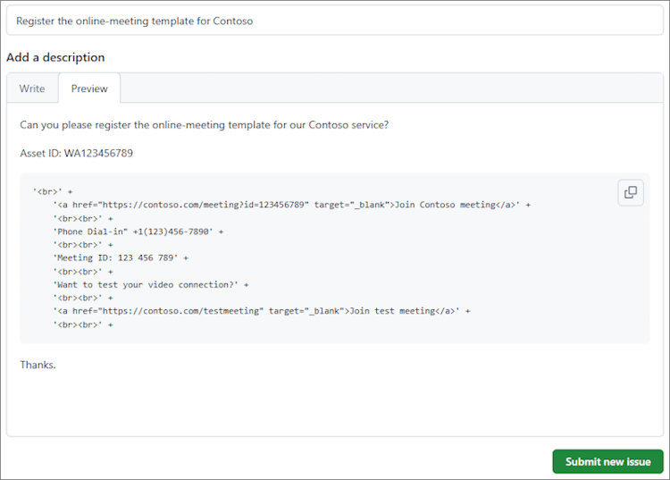

# Create an Outlook mobile add-in for an online-meeting provider

Setting up an online meeting is a core experience for an Outlook user, and it's easy to [create a Teams meeting with Outlook](/microsoftteams/teams-add-in-for-outlook) mobile. However, creating an online meeting in Outlook with a non-Microsoft service can be cumbersome. By implementing this feature, service providers can streamline the online meeting creation experience for their Outlook add-in users.

> [!IMPORTANT]
> This feature is only supported on Android and iOS with a Microsoft 365 subscription.

In this article, you'll learn how to set up your Outlook mobile add-in to enable users to organize and join a meeting using your online-meeting service. Throughout this article, we'll be using a fictional online-meeting service provider, "Contoso".

## Set up your environment

Complete the [Outlook quick start](../quickstarts/outlook-quickstart.md?tabs=yeomangenerator) which creates an add-in project with the Yeoman generator for Office Add-ins.

## Configure the manifest

To enable users to create online meetings with your add-in, you must configure the [MobileOnlineMeetingCommandSurface extension point](../reference/manifest/extensionpoint.md#mobileonlinemeetingcommandsurface) in the manifest under the parent element `MobileFormFactor`. Other form factors are not supported.

1. In your code editor, open the quick start project.

1. Open the **manifest.xml** file located at the root of your project.

1. Select the entire `<VersionOverrides>` node (including open and close tags) and replace it with the following XML.

```xml
<VersionOverrides xmlns="http://schemas.microsoft.com/office/mailappversionoverrides" xsi:type="VersionOverridesV1_0">
  <VersionOverrides xmlns="http://schemas.microsoft.com/office/mailappversionoverrides/1.1" xsi:type="VersionOverridesV1_1">
    <Description resid="residDescription"></Description>
    <Requirements>
      <bt:Sets>
        <bt:Set Name="Mailbox" MinVersion="1.3"/>
      </bt:Sets>
    </Requirements>
    <Hosts>
      <Host xsi:type="MailHost">
        <DesktopFormFactor>
          <FunctionFile resid="residFunctionFile"/>
          <ExtensionPoint xsi:type="AppointmentOrganizerCommandSurface">
            <OfficeTab id="TabDefault">
              <Group id="apptComposeGroup">
                <Label resid="residDescription"/>
                <Control xsi:type="Button" id="insertMeetingButton">
                  <Label resid="residLabel"/>
                  <Supertip>
                    <Title resid="residLabel"/>
                    <Description resid="residTooltip"/>
                  </Supertip>
                  <Icon>
                    <bt:Image size="16" resid="icon-16"/>
                    <bt:Image size="32" resid="icon-32"/>
                    <bt:Image size="64" resid="icon-64"/>
                    <bt:Image size="80" resid="icon-80"/>
                  </Icon>
                  <Action xsi:type="ExecuteFunction">
                    <FunctionName>insertContosoMeeting</FunctionName>
                  </Action>
                </Control>
              </Group>
            </OfficeTab>
          </ExtensionPoint>
        </DesktopFormFactor>

        <MobileFormFactor>
          <FunctionFile resid="residFunctionFile"/>
          <ExtensionPoint xsi:type="MobileOnlineMeetingCommandSurface">
            <Control xsi:type="MobileButton" id="insertMeetingButton">
              <Label resid="residLabel"/>
              <Icon>
                <bt:Image size="25" scale="1" resid="icon-16"/>
                <bt:Image size="25" scale="2" resid="icon-16"/>
                <bt:Image size="25" scale="3" resid="icon-16"/>

                <bt:Image size="32" scale="1" resid="icon-32"/>
                <bt:Image size="32" scale="2" resid="icon-32"/>
                <bt:Image size="32" scale="3" resid="icon-32"/>

                <bt:Image size="48" scale="1" resid="icon-48"/>
                <bt:Image size="48" scale="2" resid="icon-48"/>
                <bt:Image size="48" scale="3" resid="icon-48"/>
              </Icon>
              <Action xsi:type="ExecuteFunction">
                <FunctionName>insertContosoMeeting</FunctionName>
              </Action>
            </Control>
          </ExtensionPoint>
        </MobileFormFactor>
      </Host>
    </Hosts>
    <Resources>
      <bt:Images>
        <bt:Image id="icon-16" DefaultValue="https://contoso.com/assets/icon-16.png"/>
        <bt:Image id="icon-32" DefaultValue="https://contoso.com/assets/icon-32.png"/>
        <bt:Image id="icon-48" DefaultValue="https://contoso.com/assets/icon-48.png"/>
        <bt:Image id="icon-64" DefaultValue="https://contoso.com/assets/icon-64.png"/>
        <bt:Image id="icon-80" DefaultValue="https://contoso.com/assets/icon-80.png"/>
      </bt:Images>
      <bt:Urls>
        <bt:Url id="residFunctionFile" DefaultValue="https://contoso.com/commands.html"/>
      </bt:Urls>
      <bt:ShortStrings>
        <bt:String id="residDescription" DefaultValue="Contoso meeting"/>
        <bt:String id="residLabel" DefaultValue="Add a contoso meeting"/>
      </bt:ShortStrings>
      <bt:LongStrings>
        <bt:String id="residTooltip" DefaultValue="Add a contoso meeting to this appointment."/>
      </bt:LongStrings>
    </Resources>
  </VersionOverrides>
</VersionOverrides>
```

> [!TIP]
> To learn more about manifests for Outlook add-ins, see [Outlook add-in manifests](manifests.md) and [Add support for add-in commands for Outlook Mobile](add-mobile-support.md).

## Implement adding online meeting details

In this section, learn how your add-in script can update a user's meeting to include online meeting details.

1. From the same quick start project, open the file **./src/commands/commands.js** in your code editor.

1. Replace the entire content of the **commands.js** file with the following JavaScript.

    ```js
    // 1. How to construct online meeting details.
    // Not shown: How to get the meeting organizer's ID and other details from your service.
    const newBody = '<br>' +
        '<a href="https://contoso.com/meeting?id=123456789" target="_blank">Join Contoso meeting</a>' +
        '<br><br>' +
        'Phone Dial-in: +1(123)456-7890' +
        '<br><br>' +
        'Meeting ID: 123 456 789' +
        '<br><br>' +
        'Want to test your video connection?' +
        '<br><br>' +
        '<a href="https://contoso.com/testmeeting" target="_blank">Join test meeting</a>' +
        '<br><br>';

    var mailboxItem;

    // Office is ready.
    Office.onReady(function () {
            mailboxItem = Office.context.mailbox.item;
        }
    );

    // 2. How to define a UI-less function named `insertContosoMeeting` (referenced in the manifest)
    //    to update the meeting body with the online meeting details.
    function insertContosoMeeting(event) {
        // Get HTML body from the client.
        mailboxItem.body.getAsync("html",
            { asyncContext: event },
            function (getBodyResult) {
                if (getBodyResult.status === Office.AsyncResultStatus.Succeeded) {
                    updateBody(getBodyResult.asyncContext, getBodyResult.value);
                } else {
                    console.error("Failed to get HTML body.");
                    getBodyResult.asyncContext.completed({ allowEvent: false });
                }
            }
        );
    }

    // 3. How to implement a supporting function `updateBody`
    //    that appends the online meeting details to the current body of the meeting.
    function updateBody(event, existingBody) {
        // Append new body to the existing body.
        mailboxItem.body.setAsync(existingBody + newBody,
            { asyncContext: event, coercionType: "html" },
            function (setBodyResult) {
                if (setBodyResult.status === Office.AsyncResultStatus.Succeeded) {
                    setBodyResult.asyncContext.completed({ allowEvent: true });
                } else {
                    console.error("Failed to set HTML body.");
                    setBodyResult.asyncContext.completed({ allowEvent: false });
                }
            }
        );
    }

    function getGlobal() {
      return typeof self !== "undefined"
        ? self
        : typeof window !== "undefined"
        ? window
        : typeof global !== "undefined"
        ? global
        : undefined;
    }

    const g = getGlobal();

    // The add-in command functions need to be available in global scope.
    g.insertContosoMeeting = insertContosoMeeting;
    ```

## Testing and validation

Follow the usual guidance to [test and validate your add-in](testing-and-tips.md). After [sideloading](sideload-outlook-add-ins-for-testing.md) in Outlook on the web, Windows, or Mac, restart Outlook on your Android or iOS mobile device. Then, on a new meeting screen, verify that the Microsoft Teams or Skype toggle is replaced with your own.

### Create meeting UI

As a meeting organizer, you should see screens similar to the following three images when you create a meeting.

[](../images/outlook-android-create-online-meeting-off-expanded.png#lightbox) [](../images/outlook-android-create-online-meeting-load-expanded.png#lightbox) [](../images/outlook-android-create-online-meeting-on-expanded.png#lightbox)

### Join meeting UI

As a meeting attendee, you should see a screen similar to the following image when you view the meeting.

[](../images/outlook-android-join-online-meeting-view-1-expanded.png#lightbox)

> [!IMPORTANT]
> If you don't see the **Join** link, it may be that the online-meeting template for your service is not registered on our servers. See the [Register your online-meeting template](#register-your-online-meeting-template) section for details.

## Register your online-meeting template

If you would like to register the online-meeting template for your service, you can create a GitHub issue with the details. After that, we'll contact you to coordinate registration timeline.

1. Go to the **Feedback** section at the end of this article.
1. Press the **This page** link.
1. Set the **Title** of the new issue to "Register the online-meeting template for my-service", replacing `my-service` with your service name.
1. In the issue body, replace the string "[Enter feedback here]" with the string you set in the `newBody` or similar variable from the [Implement adding online meeting details](#implement-adding-online-meeting-details) section earlier in this article.
1. Click **Submit new issue**.



## Available APIs

The following APIs are available for this feature.

- Appointment Organizer APIs
  - [Office.context.mailbox.item.body](/javascript/api/outlook/office.appointmentcompose?view=outlook-js-preview&preserve-view=true#body) ([Body.getAsync](/javascript/api/outlook/office.body?view=outlook-js-preview&preserve-view=true#getasync-coerciontype--options--callback-), [Body.setAsync](/javascript/api/outlook/office.body?view=outlook-js-preview&preserve-view=true#setasync-data--options--callback-))
  - [Office.context.mailbox.item.end](/javascript/api/outlook/office.appointmentcompose?view=outlook-js-preview&preserve-view=true#end) ([Time](/javascript/api/outlook/office.time?view=outlook-js-preview&preserve-view=true))
  - [Office.context.mailbox.item.loadCustomPropertiesAsync](/javascript/api/outlook/office.appointmentcompose?view=outlook-js-preview&preserve-view=true#loadcustompropertiesasync-callback--usercontext-) ([CustomProperties](/javascript/api/outlook/office.customproperties?view=outlook-js-preview&preserve-view=true))
  - [Office.context.mailbox.item.location](/javascript/api/outlook/office.appointmentcompose?view=outlook-js-preview&preserve-view=true#location) ([Location](/javascript/api/outlook/office.location?view=outlook-js-preview&preserve-view=true))
  - [Office.context.mailbox.item.optionalAttendees](/javascript/api/outlook/office.appointmentcompose?view=outlook-js-preview&preserve-view=true#optionalattendees) ([Recipients](/javascript/api/outlook/office.recipients?view=outlook-js-preview&preserve-view=true))
  - [Office.context.mailbox.item.requiredAttendees](/javascript/api/outlook/office.appointmentcompose?view=outlook-js-preview&preserve-view=true#requiredattendees) ([Recipients](/javascript/api/outlook/office.recipients?view=outlook-js-preview&preserve-view=true))
  - [Office.context.mailbox.item.start](/javascript/api/outlook/office.appointmentcompose?view=outlook-js-preview&preserve-view=true#start) ([Time](/javascript/api/outlook/office.time?view=outlook-js-preview&preserve-view=true))
  - [Office.context.mailbox.item.subject](/javascript/api/outlook/office.appointmentcompose?view=outlook-js-preview&preserve-view=true#subject) ([Subject](/javascript/api/outlook/office.subject?view=outlook-js-preview&preserve-view=true))
  - [Office.context.roamingSettings](../reference/objectmodel/preview-requirement-set/office.context.md?view=outlook-js-preview&preserve-view=true#roamingsettings-roamingsettings) ([RoamingSettings](/javascript/api/outlook/office.roamingsettings?view=outlook-js-preview&preserve-view=true))
- Handle auth flow
  - [Dialog APIs](../develop/dialog-api-in-office-add-ins.md)

## Restrictions

Several restrictions apply.

- Applicable only to online-meeting service providers.
- Only admin-installed add-ins will appear on the meeting compose screen, replacing the default Teams or Skype option. User-installed add-ins won't activate.
- The add-in icon should be in grayscale using hex code `#919191` or its equivalent in [other color formats](https://convertingcolors.com/hex-color-919191.html).
- Only one UI-less command is supported in Appointment Organizer (compose) mode.
- The add-in should update the meeting details in the appointment form within the one-minute timeout period. However, any time spent in a dialog box the add-in opened for authentication, etc. is excluded from the timeout period.

## See also

- [Add-ins for Outlook Mobile](outlook-mobile-addins.md)
- [Add support for add-in commands for Outlook Mobile](add-mobile-support.md)
