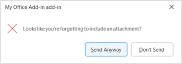
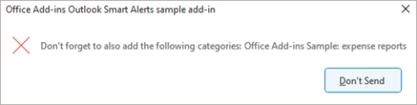
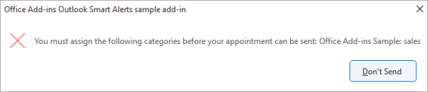
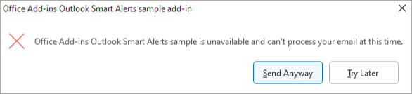
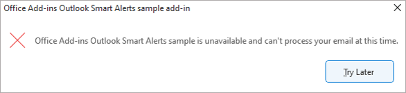
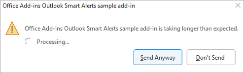
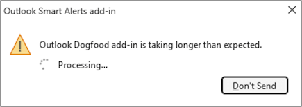
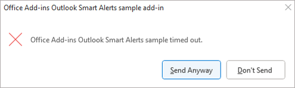
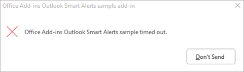
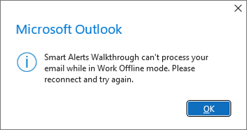

# Handle OnMessageSend and OnAppointmentSend events in your Outlook add-in with Smart Alerts

The `OnMessageSend` and `OnAppointmentSend` events take advantage of Smart Alerts, which allows you to run logic after a user selects **Send** in their Outlook message or appointment. With Smart Alerts, users of your add-in can take the opportunity to improve the content of their email, add a missing sensitivity label, or include an important recipient in a meeting invite.

Smart Alerts is available through the event-based activation feature. To understand how to configure your add-in to use this feature, use other available events, debug your add-in, and more, see [Configure your Outlook add-in for event-based activation](autolaunch.md).

> [!NOTE]
> The `OnMessageSend` and `OnAppointmentSend` events were introduced in [requirement set 1.12](/javascript/api/requirement-sets/outlook/requirement-set-1.12/outlook-requirement-set-1.12). See [clients and platforms](#supported-clients-and-platforms) that support this requirement set.

## Supported clients and platforms

The following table lists supported client-server combinations for the Smart Alerts feature, including the minimum required Exchange Server Cumulative Update where applicable. Excluded combinations aren't supported.

|Client|Exchange Online|Exchange 2019 on-premises (Cumulative Update 12 or later)|Exchange 2016 on-premises (Cumulative Update 22 or later) |
|-----|-----|-----|-----|
|**Windows** Version 2206 (Build 15330.20196) or later|Yes|Yes|Yes|
|**Mac** Version 16.65.827.0 or later|Yes|Not applicable|Not applicable|
|**Web browser (modern UI)**|Yes|Not applicable|Not applicable|
|**iOS**|Not applicable|Not applicable|Not applicable|
|**Android**|Not applicable|Not applicable|Not applicable|

## Smart Alerts feature behavior and scenarios

The following sections include guidance on the send mode options and the behavior of the feature in certain scenarios.

### Available send mode options

When you configure your add-in to respond to the `OnMessageSend` or `OnAppointmentSend` event, you must include the send mode property in the manifest. Its markup varies depending on the type of manifest your add-in uses.

- **XML manifest**: Set the **SendMode** property of the [LaunchEvent](/javascript/api/manifest/launchevent) element.
- **Unified manifest for Microsoft 365 (preview)**: Set the "sendMode" option of the event object in the "autoRunEvents" array.

If the conditions implemented by your add-in aren't met or your add-in is unavailable when the event occurs, a dialog is shown to the user to alert them that additional actions may be needed before the mail item can be sent. The send mode property determines the options available to the user in the dialog.

The following table lists the available send mode options.

|Send mode option canonical name|XML manifest name|Unified manifest for Microsoft 365 name|
|-----|-----|-----|
|**prompt user**|`PromptUser`|promptUser|
|**soft block**|`SoftBlock`|softBlock|
|**block**|`Block`|block|

#### prompt user

If the item doesn't meet the add-in's conditions, the user can choose **Send Anyway** in the alert, or address the issue then try to send the item again. If the add-in is taking a long time to process the item, the user will be prompted with the option to stop running the add-in and choose **Send Anyway**. In the event the add-in is unavailable (for example, there's an error loading the add-in), the item will be sent.

Use the **prompt user** option in your add-in if one of the following applies.

- The condition checked by the add-in isn't mandatory, but is nice to have in the message or appointment being sent.
- You'd like to recommend an action and allow the user to decide whether they want to apply it to the message or appointment being sent.

Some scenarios where the **prompt user** option is applied include suggesting to tag the message or appointment as low or high importance and recommending to apply a color category to the item.

#### soft block

Default option if the send mode property of your manifest isn't configured. The user is alerted that the item they're sending doesn't meet the add-in's conditions and they must address the issue before trying to send the item again. However, if the add-in is unavailable (for example, there's an error loading the add-in), the item will be sent.

Use the **soft block** option in your add-in when you want a condition to be met before a message or appointment can be sent, but you don't want the user to be blocked from sending the item if the add-in is unavailable. Sample scenarios where the **soft block** option is used include prompting the user to set a message or appointment's importance level and checking that the appropriate signature is applied before the item is sent.

#### block

The item isn't sent if any of the following situations occur.

- The item doesn't meet the add-in's conditions.
- The add-in is unable to connect to the server.
- There's an error loading the add-in.

Use the **block** option if the add-in's conditions are mandatory, even if the add-in is unavailable. For example, the **block** option is ideal when users are required to apply a sensitivity label to a message or appointment before it can be sent.

### Add-in is unavailable

If the add-in is unavailable when a message or appointment is being sent (for example, an error occurs that prevents the add-in from loading), the user is alerted. The options available to the user differ depending on the send mode option applied to the add-in.

If the **prompt user** or **soft block** option is used, the user can choose **Send Anyway** to send the item without the add-in checking it, or **Try Later** to let the item be checked by the add-in when it becomes available again.

If the **block** option is used, the user can't send the item until the add-in becomes available.

> [!IMPORTANT]
> If a Smart Alerts add-in that implements the [send mode override](smart-alerts-onmessagesend-walkthrough.md#override-the-send-mode-option-at-runtime-optional-preview) feature can't complete processing an event due to an error or is unavailable when the event occurs, it uses the send mode option specified in the manifest.

### Long-running add-in operations

If the add-in runs for more than five seconds, but less than five minutes, the user is alerted that the add-in is taking longer than expected to process the message or appointment.

If the **prompt user** option is used, the user can choose **Send Anyway** to send the item without the add-in completing its check. Alternatively, the user can select **Don't Send** to stop the add-in from processing.

However, if the **soft block** or **block** option is used, the user will not be able to send the item until the add-in completes processing it.

`OnMessageSend` and `OnAppointmentSend` add-ins should be short-running and lightweight. To avoid the long-running operation dialog, use other events to process conditional checks before the `OnMessageSend` or `OnAppointmentSend` event is activated. For example, if the user is required to encrypt attachments for every message or appointment, consider using the `OnMessageAttachmentsChanged` or `OnAppointmentAttachmentsChanged` event to perform the check.

### Add-in timed out

If the add-in runs for five minutes or more, it will time out. If the **prompt user** option is used, the user can choose **Send Anyway** to send the item without the add-in completing its check. Alternatively, the user can choose **Don't Send**.

If the **soft block** or **block** option is  used, the user can't send the item until the add-in completes its check. The user must attempt to send the item again to reactivate the add-in.

### Outlook client in Work Offline mode

In Outlook on Windows (starting in Version 2310 (Build 16913.10000)), a Smart Alerts add-in that implements the **soft block** or **block** option can only process a mail item while the Outlook client is online. If [Work Offline mode](https://support.microsoft.com/office/f3a1251c-6dd5-4208-aef9-7c8c9522d633) is turned on in the Outlook client when a mail item is sent, the item isn't saved to the **Outbox** folder and the user is alerted that they must deactivate Work Offline mode before they can attempt to send their item.

In Outlook on Mac, the **Send** option becomes unavailable while in Work Offline mode. Once Work Offline mode is turned off, the user can select **Send** and activate the Smart Alerts add-in.

## Activate Smart Alerts in applications that use Simple MAPI

> [!NOTE]
> This feature is currently only supported in Outlook on Windows starting in Version 2301 (Build 17126.20004).

Users can send mail items through certain applications that use [Simple MAPI](/previous-versions/windows/desktop/windowsmapi/simple-mapi), even if the Outlook client isn't running at the time the item is sent. When this occurs, any installed Smart Alerts add-in won't activate to check the mail item for compliance.

To ensure that outgoing items meet the conditions of your Smart Alerts add-in before they're sent, you must turn on the **Running Outlook for Simple MAPI Mail Sending** Group Policy setting on every applicable machine in your organization.

### Behavior when the setting is turned on

When the **Running Outlook for Simple MAPI Mail Sending** setting is set to **Enabled**, users are required to have their Outlook client running at the time a mail item is sent in the following scenarios.

- A file is sent as an attachment through the **Share** > **Attach a copy instead** option in Excel, Word, or PowerPoint.

  :::image type="content" source="../images/office-attach-a-copy.png" alt-text="The 'Attach a copy instead' option selected in Word.":::

- A file is sent as an attachment through the **Send to** > **Mail recipient** option in File Explorer.

  :::image type="content" source="../images/file-explorer-send-to.png" alt-text="The 'Send to mail recipient' option selected in File Explorer.":::

- A file is sent through an application that uses Simple MAPI, which opens a new message Outlook window.

If a user's Outlook client isn't running at the time the mail item is sent, a dialog is shown to notify them that they must open their client to send the item.

:::image type="content" source="../images/outlook-simple-mapi.png" alt-text="Dialog that alerts a user to open the Outlook client when sending a mail item.":::

### Behavior when the setting is turned off or not configured

When the **Running Outlook for Simple MAPI Mail Sending** setting is set to **Disabled** or **Not Configured** in your organization, any user who uses applications that implement Simple MAPI to send mail items will be able to do so without activating their Smart Alerts add-in for compliance checks.

### Configure the Group Policy setting

By default, the **Running Outlook for Simple MAPI Mail Sending** setting is set to **Not Configured**. To turn on the setting, perform the following:

1. Download the latest [Administrative Templates tool](https://www.microsoft.com/download/details.aspx?id=49030).
1. Open the **Local Group Policy Editor** (**gpedit.msc**).
1. Navigate to **User Configuration\Administrative Templates\Microsoft Outlook 2016\Miscellaneous**.
1. Open the **Running Outlook for Simple MAPI Mail Sending** setting.
1. In the dialog that appears, select **Enabled**.
1. Select **OK** or **Apply** to save your change.

## Limitations

Because the `OnMessageSend` and `OnAppointmentSend` events are supported through the event-based activation feature, the same feature limitations apply to add-ins that activate as a result of these events. For a description of these limitations, see [Event-based activation behavior and limitations](autolaunch.md#event-based-activation-behavior-and-limitations).

In addition to these constraints, only one instance each of the `OnMessageSend` and `OnAppointmentSend` event can be declared in the manifest. If you require multiple `OnMessageSend` or `OnAppointmentSend` events, you must declare each one in a separate add-in.

While you can change the Smart Alerts dialog message and **Don't Send** button to suit your add-in scenario, the following can't be customized.

- The dialog's title bar. Your add-in's name is always displayed there.
- The message's format. For example, you can't change the text's font size and color or insert a bulleted list.
- Dialogs that provide information on event processing and progress. For example, the text and options that appear in the timeout and long-running operation dialogs can't be changed.

If you customize the **Don't Send** button in the dialog, you can only assign a task pane command to it. Function commands aren't supported. If you select a **Don't Send** button with an assigned function command, the command is ignored and the add-in cancels the send operation and closes the dialog. When this occurs, no error is shown or logged. For guidance on the types of add-in commands, see [Types of add-in commands](../design/add-in-commands.md#types-of-add-in-commands).

## Debug your add-in

For guidance on how to troubleshoot your Smart Alerts add-in, see [Troubleshoot event-based and spam-reporting add-ins](troubleshoot-event-based-and-spam-reporting-add-ins.md).

## Deploy to users

Similar to other event-based add-ins, add-ins that use the Smart Alerts feature must be deployed by an organization's administrator. For guidance on how to deploy your add-in via the Microsoft 365 admin center, see the "Deploy to users" section in [Configure your Outlook add-in for event-based activation](autolaunch.md#deploy-to-users).

> [!IMPORTANT]
> Add-ins that use the Smart Alerts feature can only be published to AppSource if the manifest's [send mode property](#available-send-mode-options) is set to the **soft block** or **prompt user** option. If an add-in's send mode property is set to **block**, it can only be deployed by an organization's admin as it will fail AppSource validation. To learn more about publishing your event-based add-in to AppSource, see [AppSource listing options for your event-based Outlook add-in](autolaunch-store-options.md).

## Differences between Smart Alerts and the on-send feature

While Smart Alerts and the [on-send feature](outlook-on-send-addins.md) provide your users the opportunity to improve their messages and meeting invites before they're sent, Smart Alerts is a newer feature that offers you more flexibility with how you prompt your users for further action. Key differences between the two features are outlined in the following table.

|Attribute|Smart Alerts|On-send|
|-----|-----|-----|
|**Minimum supported requirement set**|[Mailbox 1.12](/javascript/api/requirement-sets/outlook/requirement-set-1.12/outlook-requirement-set-1.12)|[Mailbox 1.8](/javascript/api/requirement-sets/outlook/requirement-set-1.8/outlook-requirement-set-1.8)|
|**Supported Outlook clients**|- Windows - Web browser (modern UI) - Mac (new UI)|- Windows - Web browser (classic and modern UI) - Mac (classic and new UI) |
|**Supported events**|**XML manifest** - `OnMessageSend` - `OnAppointmentSend`  **Unified manifest for Microsoft 365 (preview)** - "messageSending" - "appointmentSending"|**XML manifest** - `ItemSend`  **Unified manifest for Microsoft 365 (preview)** - Not supported|
|**Manifest extension property**|**XML manifest** - `LaunchEvent`  **Unified manifest for Microsoft 365 (preview)** - "autoRunEvents"|**XML manifest** - `Events`  **Unified manifest for Microsoft 365 (preview)** - Not supported|
|**Supported send mode options**|- prompt user - soft block - block  To learn more about each option, see [Available send mode options](#available-send-mode-options).|Block|
|**Maximum number of supported events in an add-in**|One `OnMessageSend` and one `OnAppointmentSend` event.|One `ItemSend` event.|
|**Add-in deployment**|Add-in can be published to AppSource if its send mode property is set to the **soft block** or **prompt user** option. Otherwise, the add-in must be deployed by an organization's administrator.|Add-in can't be published to AppSource. It must be deployed by an organization's administrator.|
|**Additional configuration for add-in installation**|No additional configuration is needed once the manifest is uploaded to the Microsoft 365 admin center.|Depending on the organization's compliance standards and the Outlook client used, certain mailbox policies must be configured to install the add-in.|

## Try out Smart Alerts in an event-based add-in

Ready to implement Smart Alerts in an event-based add-in? Try out the [walkthrough](smart-alerts-onmessagesend-walkthrough.md) where you'll create an add-in that checks whether a document or picture is attached to a message before it's sent.

## See also

- [Handle OnMessageSend and OnAppointmentSend events in your Outlook add-in with Smart Alerts](onmessagesend-onappointmentsend-events.md)
- [Configure your Outlook add-in for event-based activation](autolaunch.md)
- [AppSource listing options for your event-based Outlook add-in](autolaunch-store-options.md)
- [Office Add-ins code sample: Office Add-ins code sample: Verify the color categories of a message or appointment before it's sent using Smart Alerts](https://github.com/OfficeDev/Office-Add-in-samples/tree/main/Samples/outlook-check-item-categories)
- [Office Add-ins code sample: Verify the sensitivity label of a message](https://github.com/OfficeDev/Office-Add-in-samples/tree/main/Samples/outlook-verify-sensitivity-label)
