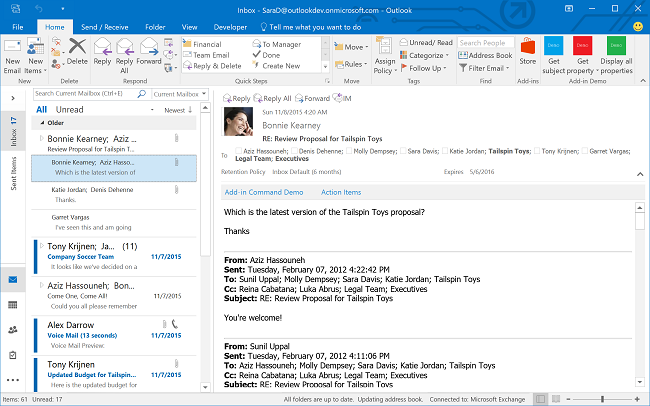
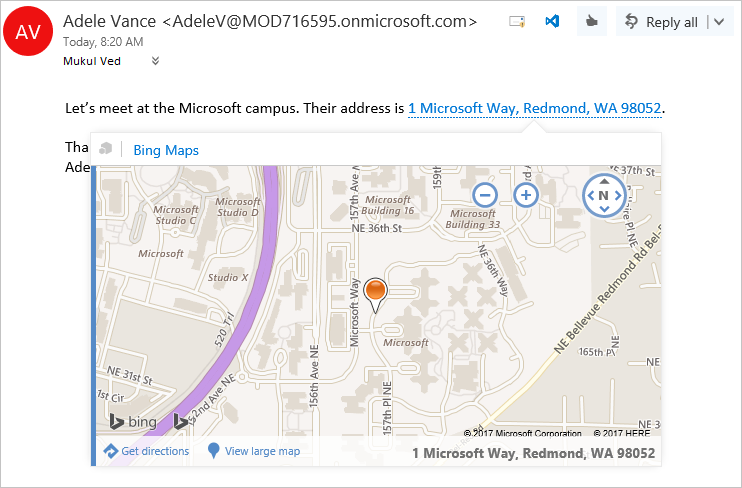

# Outlook add-ins overview

Outlook add-ins are integrations built by third parties into Outlook by using our web-based platform. Outlook add-ins have three key aspects:

- The same add-in and business logic works across desktop (Outlook on Windows and Mac), web (Microsoft 365 and Outlook.com), and mobile.
- Outlook add-ins consist of a manifest, which describes how the add-in integrates into Outlook (for example, a button or a task pane), and JavaScript/HTML code, which makes up the UI and business logic of the add-in.
- Outlook add-ins can be acquired from [AppSource](https://appsource.microsoft.com) or [sideloaded](sideload-outlook-add-ins-for-testing.md) by end-users or administrators.

Outlook add-ins are different from COM or VSTO add-ins, which are older integrations specific to Outlook running on Windows. Unlike COM add-ins, Outlook add-ins don't have any code physically installed on the user's device or Outlook client. For an Outlook add-in, Outlook reads the manifest and hooks up the specified controls in the UI, and then loads the JavaScript and HTML. The web components all run in the context of a browser in a sandbox.

[!INCLUDE [new-outlook-vsto-com-support](../includes/new-outlook-vsto-com-support.md)]

The Outlook items that support add-ins include email messages, meeting requests, responses and cancellations, and appointments. Each Outlook add-in defines the context in which it is available, including the types of items and if the user is reading or composing an item.

[!INCLUDE [publish policies note](../includes/note-publish-policies.md)]

## Extension points

Extension points are the ways that add-ins integrate with Outlook. The following are the ways this can be done.

- Add-ins can declare buttons that appear in command surfaces across messages and appointments. For more information, see [Add-in commands](../design/add-in-commands.md).

    **An add-in with command buttons on the ribbon**

    

- Add-ins can link off regular expression matches or detected entities in messages and appointments. For more information, see [Contextual Outlook add-ins](contextual-outlook-add-ins.md).

    **A contextual add-in for a highlighted entity (an address)**

    

## Mailbox items available to add-ins

Outlook add-ins activate when the user is composing or reading a message or appointment, but not other item types. However, add-ins are *not* activated if the current message item, in a compose or read form, is one of the following:

- Protected by Information Rights Management (IRM) or encrypted in other ways for protection and accessed from Outlook on non-Windows clients. A digitally signed message is an example since digital signing relies on one of these mechanisms.

[!INCLUDE [outlook-irm-add-in-activation](../includes/outlook-irm-add-in-activation.md)]

- A delivery report or notification that has the message class IPM.Report.*, including delivery and Non-Delivery Report (NDR) reports, and read, non-read, and delay notifications.

- A .msg or .eml file which is an attachment to another message.

- A .msg or .eml file opened from the file system.

- In a [group mailbox](/microsoft-365/admin/create-groups/compare-groups?view=o365-worldwide&preserve-view=true#shared-mailboxes), in a shared mailbox\*, in another user's mailbox\*, in an [archive mailbox](/office365/servicedescriptions/exchange-online-archiving-service-description/archive-client-and-compliance-&-security-feature-details?tabs=Archive-features#archive-mailbox), or in a public folder.

  > [!IMPORTANT]
  > \* Support for delegate access scenarios (for example, folders shared from another user's mailbox) was introduced in [requirement set 1.8](/javascript/api/requirement-sets/outlook/requirement-set-1.8/outlook-requirement-set-1.8). Shared mailbox support is now in preview in Outlook on Windows and on Mac. To learn more, see [Enable shared folders and shared mailbox scenarios](delegate-access.md).

- Using a custom form.

- Created through Simple MAPI. Simple MAPI is used when an Office user creates or sends an email from an Office application on Windows while Outlook is closed. For example, a user can create an Outlook email while working in Word which triggers an Outlook compose window without launching the full Outlook application. If, however, Outlook is already running when the user creates the email from Word, that isn't a Simple MAPI scenario so Outlook add-ins work in the compose form as long as other activation requirements are met.

In general, Outlook can activate add-ins in read form for items in the Sent Items folder, with the exception of add-ins that activate based on string matches of well-known entities. For more information about the reasons behind this, see [Support for well-known entities](match-strings-in-an-item-as-well-known-entities.md#support-for-well-known-entities).

Currently, there are additional considerations when designing and implementing add-ins for mobile clients. To learn more, see [Add mobile support to an Outlook add-in](add-mobile-support.md#compose-mode-and-appointments).

## Supported clients

Outlook add-ins are supported in Outlook on Windows, Outlook on Mac, Outlook on the web, Outlook on iOS, Outlook on Android, and Outlook.com. Not all of the newest features are supported in all [clients](/javascript/api/requirement-sets/outlook/outlook-api-requirement-sets#requirement-sets-supported-by-exchange-servers-and-outlook-clients) at the same time. Please refer to articles and API references for those features to see which applications they may or may not be supported in.

## Get started building Outlook add-ins

To get started building Outlook add-ins, try the following:

- [Quick start](../quickstarts/outlook-quickstart.md) - Build a simple task pane.
- [Tutorial](../tutorials/outlook-tutorial.md) - Learn how to create an add-in that inserts GitHub gists into a new message.

## See also

- [Learn about the Microsoft 365 Developer Program](https://developer.microsoft.com/microsoft-365/dev-program)
- [Best practices for developing Office Add-ins](../concepts/add-in-development-best-practices.md)
- [Design guidelines for Office Add-ins](../design/add-in-design.md)
- [License your Office and SharePoint Add-ins](/office/dev/store/license-your-add-ins)
- [Publish your Office Add-in](../publish/publish.md)
- [Make your solutions available in AppSource and within Office](/office/dev/store/submit-to-the-office-store)
