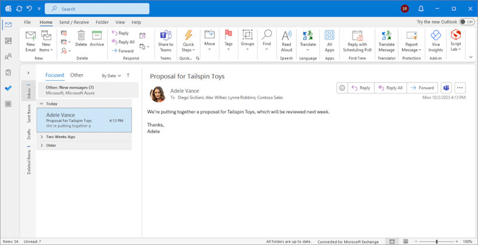

# Outlook add-ins overview

Outlook add-ins are solutions that extend the functionality of the Outlook client through a web-based platform. Outlook add-ins have the following key aspects.

- The same add-in and business logic works across web (Microsoft 365 and Outlook.com), desktop (Outlook on Windows ([new](https://support.microsoft.com/office/656bb8d9-5a60-49b2-a98b-ba7822bc7627) and classic) and on Mac), and mobile.
- Outlook add-ins consist of a manifest, which describes how the add-in integrates into Outlook (for example, a button, task pane, or event). It also includes JavaScript and HTML code, which make up the UI and business logic of the add-in.
- Outlook add-ins can be acquired from [Microsoft Marketplace](https://marketplace.microsoft.com) or [sideloaded](sideload-outlook-add-ins-for-testing.md) by end users or administrators.
- Outlook add-ins require a network connection to run.

Outlook add-ins are different from COM or VSTO add-ins, which are older integrations specific to Outlook running on Windows. Unlike COM add-ins, Outlook add-ins don't have any code physically installed on the user's device or Outlook client. For an Outlook add-in, Outlook reads the manifest and hooks up the specified controls in the UI, and then loads the JavaScript and HTML. The web components all run in the context of a browser or webview control in a sandbox.

> [!IMPORTANT]
>
> - COM and VSTO add-ins aren't supported in the [new Outlook on Windows](https://support.microsoft.com/office/656bb8d9-5a60-49b2-a98b-ba7822bc7627). However, these add-ins are still supported in the classic Outlook on Windows desktop client. To learn more, see [Develop Outlook add-ins for new Outlook on Windows](../outlook/one-outlook.md).
>
> - In classic Outlook on Windows, it isn't recommended to install COM add-ins alongside Office web add-ins, especially if they operate on the same surface or mail item. The operations performed by COM and web add-ins could interfere with each other and lead to unexpected behavior. If you need to support both COM and web add-in versions of your solution, you must specify the COM solution as an equivalent add-in. To learn more, see [Make your Office Add-in compatible with an existing COM or VSTO add-in](../develop/make-office-add-in-compatible-with-existing-com-add-in.md).

The Outlook items that support add-ins include email messages, meeting requests, responses and cancellations, and appointments. Each Outlook add-in defines the context in which it is available, including the types of items and if the user is reading or composing an item.

> [!NOTE]
> [!INCLUDE [Calendar add-ins not available in Teams](../includes/calendar-availability.md)]

[!INCLUDE [publish policies note](../includes/note-publish-policies.md)]

## Extension points

Extension points are the ways that add-ins integrate with Outlook. The following are the ways this can be done.

- Add-ins can declare buttons that appear in command surfaces across messages and appointments. For more information, see [Add-in commands](../design/add-in-commands.md).

    

- Add-ins can link off regular expression matches in messages and appointments. For more information, see [Contextual Outlook add-ins](contextual-outlook-add-ins.md).

    [!INCLUDE [outlook-contextual-add-ins-retirement](../includes/outlook-contextual-add-ins-retirement.md)]

- Add-ins can perform tasks when a specific event occurs. For more information, see [Activate add-ins with events](../develop/event-based-activation.md).

## Mailbox items available to add-ins

Outlook add-ins activate when the user is composing or reading a message or appointment, but not other item types. However, add-ins are *not* activated if the current message item, in a compose or read form, is one of the following:

- Protected by Information Rights Management (IRM) or encrypted in other ways for protection and accessed from Outlook on mobile devices. A digitally-signed message is an example since digital signing relies on one of these mechanisms. To learn more about IRM support in Outlook add-ins, see [Mail items protected by IRM](#mail-items-protected-by-irm).

- An IRM-protected mail item with a sensitivity label that has the **Allow programmatic access** custom policy option set to `false`. To learn more about IRM support in Outlook add-ins, see [Mail items protected by IRM](#mail-items-protected-by-irm).

- A delivery report or notification that has the message class IPM.Report.*, including delivery and Non-Delivery Report (NDR) reports, and read, non-read, and delay notifications.

- A .msg or .eml file which is an attachment to another message.

- A .msg or .eml file opened from the file system.

- In a [group mailbox](/microsoft-365/admin/create-groups/compare-groups?view=o365-worldwide&preserve-view=true#shared-mailboxes), in a shared mailbox\*, in another user's mailbox\*, in an [archive mailbox](/purview/archive-mailboxes), or in a public folder.

  > [!IMPORTANT]
  > \* Support for delegate access scenarios (for example, folders shared from another user's mailbox) was introduced in [requirement set 1.8](/javascript/api/requirement-sets/outlook/requirement-set-1.8/outlook-requirement-set-1.8), while shared mailbox support was introduced in [requirement set 1.13](/javascript/api/requirement-sets/outlook/requirement-set-1.13/outlook-requirement-set-1.13). To learn more, see [Implement shared folders and shared mailbox scenarios](delegate-access.md).

- Using a custom form.

- Created through Simple MAPI. Simple MAPI is used when an Office user creates or sends an email from an Office application on Windows while Outlook is closed. For example, a user can create an Outlook email while working in Word which triggers an Outlook compose window without launching the full Outlook application. If, however, Outlook is already running when the user creates the email from Word, that isn't a Simple MAPI scenario so Outlook add-ins work in the compose form as long as other activation requirements are met.

Currently, there are additional considerations when designing and implementing add-ins for mobile clients. To learn more, see [Add support for add-in commands in Outlook on mobile devices](add-mobile-support.md).

### Mail items protected by IRM

Outlook add-ins activate on IRM-protected mail items when the item is accessed from the following supported clients.

- Outlook on the web
- [New Outlook on Windows](https://support.microsoft.com/office/656bb8d9-5a60-49b2-a98b-ba7822bc7627)
- Classic Outlook on Windows starting in Version 2009 (Build 13229.10000)

    >[!NOTE]
    > Digital signing relies on protection mechanisms, such as IRM. Starting in classic Outlook on Windows Version 1711 (Build 8711.1000) associated with a Microsoft 365 subscription, add-ins activate on digitally-signed messages.

- Outlook on Mac starting in Version 16.77 (23082700)

However, add-ins won't activate on IRM-protected items when:

- The IRM-protected item is accessed from Outlook on mobile devices.
- The IRM-protected item has a sensitivity label with the **Allow programmatic access** custom policy option set to `false`. For more information on custom policy options, see [Usage rights and descriptions](/azure/information-protection/configure-usage-rights).

## Supported clients

Outlook add-ins are supported in Outlook on the web, Outlook on Windows (new and classic), Outlook on Mac, Outlook on iOS, Outlook on Android, and Outlook.com. Not all of the newest features are supported in all clients at the same time. For details about feature support on clients and servers, see [Requirement sets supported by Exchange servers and Outlook clients](/javascript/api/requirement-sets/outlook/outlook-api-requirement-sets#requirement-sets-supported-by-exchange-servers-and-outlook-clients) and articles specific to those features.

## Supported accounts

On supported Outlook clients, add-ins can run on Outlook.com (consumer or personal) and Microsoft 365 business mailbox accounts. For more information on Microsoft accounts, see [What's the difference between a Microsoft account and a work or school account?](https://support.microsoft.com/account-billing/72f10e1e-cab8-4950-a8da-7c45339575b0).

While non-Microsoft mailbox accounts, such as Gmail and Yahoo Mail, can be added to certain Outlook clients, Outlook add-ins aren't always supported on these accounts. The following table outlines add-in support on non-Microsoft accounts for each Outlook client.

|Outlook client|Add-in support on non-Microsoft accounts|
|-----|-----|
|Web|Not supported.|
|new Outlook on Windows|Not supported.|
|classic Outlook on Windows|Not supported.|
|Mac|<ul><li>If a non-Microsoft account was added using the IMAP CloudCache option, add-ins are supported.</li><li>If a non-Microsoft account was added using the IMAP Direct option, add-ins aren't supported.</li></ul>|
|Mobile (Android and iOS)|Not supported.|

When using non-Microsoft accounts that support add-ins in Outlook, note that you must first select a folder or item in the non-Microsoft mailbox to load the add-in.

## Get started building Outlook add-ins

To get started building Outlook add-ins, try the following:

- [Quick start](../quickstarts/outlook-quickstart-yo.md) - Build a simple task pane.
- [Tutorial](../tutorials/outlook-tutorial.md) - Learn how to create an add-in that inserts GitHub gists into a new message.

## See also

- [Learn about the Microsoft 365 Developer Program](https://aka.ms/m365devprogram)
- [Best practices for developing Office Add-ins](../concepts/add-in-development-best-practices.md)
- [Design guidelines for Office Add-ins](../design/add-in-design.md)
- [License your Office and SharePoint Add-ins](/partner-center/marketplace-offers/why-publish)
- [Publish your Office Add-in](../publish/publish.md)
- [Make your solutions available in Microsoft Marketplace and within Office](/partner-center/marketplace-offers/submit-to-appsource-via-partner-center)
