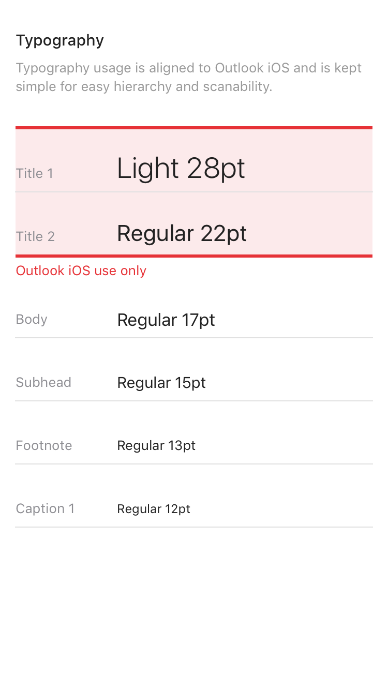

# Designing Add-ins for Outlook

Add-ins are a great way for partners to extend the functionality of Outlook beyond our core feature set. Add-ins enable users to access third party experiences, tasks, and content without needing to leave their inbox. Once installed, Outlook Add-ins are available on every platform and device. The following high-level guidelines will help you design and build a compelling add-in, which brings the best of your app right into Outlook – on Windows, Web, iOS, Mac and Android (coming soon).

1. **Focus on a few key tasks; do them well**

    The best designed add-ins are simple to use, focused, and provide real value to users. Because your add-in will run inside of Outlook, there is additional emphasis placed on this principle. Outlook is a productivity app – it's where people go to get things done.

    You will be an extension of our experience and it is important to make sure the scenarios you enable feel like a natural fit inside of Outlook. Think carefully about which of your common use cases will benefit the most from having hooks to them from within our email and calendaring experiences.

    An add-in should not attempt to do everything your app does. The focus should be on the most frequently used, and appropriate, actions in the context of Outlook content. Think about your call to action and make it clear what the user should do when your task pane opens.

2. **Make it feel as native as possible**

    Your add-in should be designed using patterns native to the platform that Outlook is running on. To achieve this, be sure to respect and implement the interaction and visual guidelines set forth by each platform. Outlook has its own guidelines and those are also important to consider. A well-designed add-in will be an appropriate blend of your app, the platform, and Outlook.

3. **Make it enjoyable to use and get the details right**

    People enjoy using products that are both functionally and visually appealing. You can help ensure the success of your add-in by crafting an experience where you've carefully considered every interaction and visual detail. The necessary steps to complete a task must be clear and relevant. Ideally, no action should be further than a click or two away. Try not to take a user out of context to complete an action. A user should easily be able to get in and out of your add-in and back to whatever she was doing before. An add-in is not meant to be a destination to spend a lot of time in – it is an enhancement to our core functionality. If done properly, your add-in will help us deliver on the goal of making people more productive.

4. **Brand wisely**

    We value great branding, and we know it is important to provide users with your unique experience. But we feel the best way to ensure your add-in's success is to build an intuitive experience that subtly incorporates elements of your brand versus displaying persistent or obtrusive brand elements that only distract a user from moving through your system in an unencumbered manner. A good way to incorporate your brand in a meaningful way is through the use of your brand colors, icons, and voice – assuming these don't conflict with the preferred platform patterns or accessibility requirements. Strive to keep the focus on content and task completion, not brand attention.

5. **Help us help you**

    We want your add-in to be successful, so we will be providing you with some tools to help, including: 1) a creative brief, to help you better identify the objective of your add-in, 2) design patterns and examples, to make sure your designs stay platform-specific, and 3) review feedback so you know early on things that are working and things that need some adjustment.

## Focus on a few key tasks; do them well

The best designed add-ins are simple to use, focused, and provide real value to users. Because your add-in will run inside of Outlook, there is additional emphasis placed on this principle. Outlook is a productivity app – it's where people go to get things done. 

You will be an extension of our experience and it is important to make sure the scenarios you enable feel like a natural fit inside of Outlook. Think carefully about which of your common use cases will benefit the most from having hooks to them from within our email and calendaring experiences. 

An add-in should not attempt to do everything your app does. The focus should be on the most frequently used, and appropriate, actions in the context of Outlook content. Think about your call to action and make it clear what the user should do when your task pane opens. 

## Make it feel as native as possible

Your add-in should be designed using patterns native to the platform that Outlook is running on. To achieve this, be sure to respect and implement the interaction and visual guidelines set forth by each platform. Outlook has its own guidelines and those are also important to consider. A well-designed add-in will be an appropriate blend of your app, the platform, and Outlook.

## Make it enjoyable to use and get the details right

People enjoy using products that are both functionally and visually appealing. You can help ensure the success of your add-in by crafting an experience where you've carefully considered every interaction and visual detail. The necessary steps to complete a task must be clear and relevant. Ideally, no action should be further than a click or two away. Try not to take a user out of context to complete an action. A user should easily be able to get in and out of your add-in and back to whatever she was doing before. An add-in is not meant to be a destination to spend a lot of time in – it is an enhancement to our core functionality. If done properly, your add-in will help us deliver on the goal of making people more productive.

## Brand wisely

We value great branding, and we know it is important to provide users with your unique experience. But we feel the best way to ensure your add-in's success is to build an intuitive experience that subtly incorporates elements of your brand versus displaying persistent or obtrusive brand elements that only distract a user from moving through your system in an unencumbered manner. A good way to incorporate your brand in a meaningful way is through the use of your brand colors, icons, and voice – assuming these don't conflict with the preferred platform patterns or accessibility requirements. Strive to keep the focus on content and task completion, not brand attention.

## Help us help you

We want your add-in to be successful, so we will be providing you with some tools to help, including: 1) a creative brief, to help you better identify the objective of your add-in, 2) design patterns and examples, to make sure your designs stay platform-specific, and 3) review feedback so you know early on things that are working and things that need some adjustment.

## Example UX Pattern Image

Typography usage is aligned to Outlook iOS and is kept simple for easy hierarchy and scanability.

