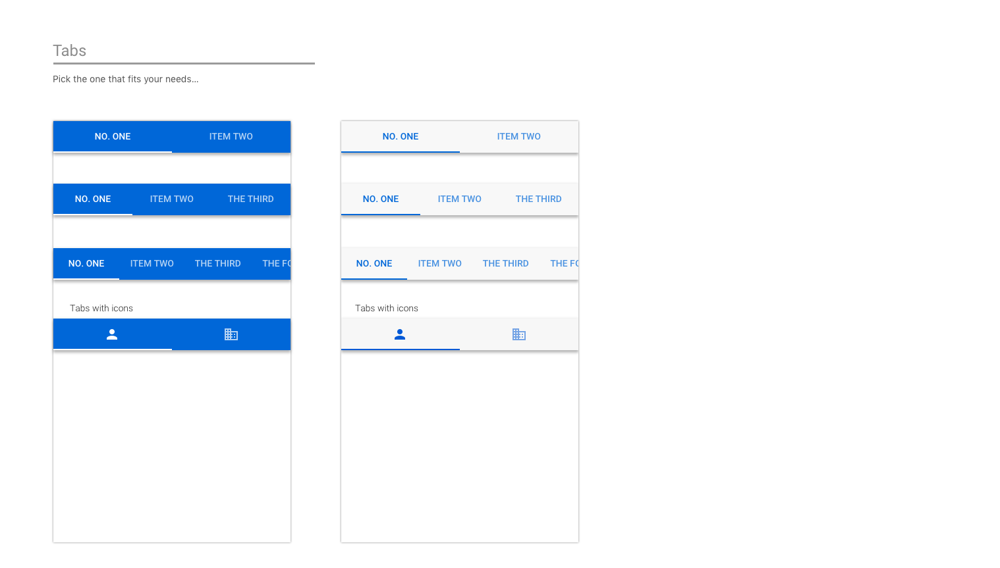

# Design add-ins for Outlook on mobile devices

Outlook on mobile devices provides a unique environment for add-ins, with platform-specific design patterns for Android and iOS. This article provides guidelines and visual examples to help you create add-ins that feel native to each mobile platform while maintaining a consistent brand experience.

> [!TIP]
> The [general Office Add-in design principles](../design/add-in-design.md) apply to Outlook mobile add-ins. Review those guidelines in addition to the mobile-specific patterns outlined in this article.

## Add-in components and patterns

A typical mobile add-in is made up of the following components.

- Branding area
- Navigation bar
- Section title
- Cells or input fields
- Actions

The following images show how each component appears in Outlook on Android and on iOS.

**Android**

**iOS**

The succeeding sections outline UX design patterns for Outlook on mobile. To learn more about design patterns for Office Add-ins, see [UX design patterns for Office Add-ins](../design/ux-design-pattern-templates.md).

### Loading

When a user taps on your add-in, the UX should display as quickly as possible. If there is any delay, use a progress bar or activity indicator. A progress bar should be used when the amount of time is determinable and an activity indicator should be used when the amount of time is indeterminable.

**An example of loading pages on Android**

**An example of loading pages on iOS**

### Sign in/Sign up

Make your sign in and sign up flows straightforward and simple to use.

**An example sign in page on Android**

**An example page to sign in and sign up on iOS**

### Brand bar

The first screen of your add-in should include your branding element. Designed for recognition, the brand bar also helps set context for the user. Because the navigation bar contains the name of your company or your brand, it's unnecessary to repeat the brand bar on subsequent pages.

**An example of branding on Android**

**An example of branding on iOS**

> [!NOTE]
> Ads should not be shown within add-ins in Outlook on iOS or on Android.

### Margins

The recommended mobile margins vary depending on the Outlook client.

- **Android**: 16px for each side
- **iOS**: 15px (8% of screen) for each side

The following is an example of margins set in Outlook on iOS.

### Typography

Keep typography simple to make content easy to scan.

**Typography on Android**

**Typography on iOS**

### Color palette

Color usage is subtle in Outlook on mobile. We recommend localizing color usage to actions and error states, with only the brand bar using a unique color.

### Cells

Since the navigation bar can't be used to label a page, use section titles to label pages.

**Examples of cells on Android**

* * *

* * *

* * *

**Examples of cells on iOS**

* * *

* * *

* * *

### Actions

Even if your app handles a multitude of actions, think about the most important ones you want your add-in to perform, and concentrate on those.

**Examples of actions on Android**

* * *

**Examples of actions on iOS**

* * *

### Buttons

Buttons are used when there are other UX elements below (vs. actions, where the action is the last element on the screen).

**Examples of buttons on Android**

**Examples of buttons on iOS**

### Tabs

Tabs can aid in content organization.

**Examples of tabs on Android**

**Examples of tabs on iOS**

### Icons

Icons should follow the current Outlook mobile design when possible. Use our standard size and color.

**Examples of icons on Android**

**Examples of icons on iOS**

## Add-in examples

> [!NOTE]
> [!INCLUDE [Calendar add-ins not available in Teams](../includes/calendar-availability.md)]

When Outlook mobile add-ins were launched, we worked closely with our partners who were building add-ins. As a way to showcase the potential of their add-ins on Outlook mobile, our designer put together end-to-end flows for each add-in, leveraging our guidelines and patterns.

> [!IMPORTANT]
> These examples are meant to highlight the ideal way to approach both the interaction and visual design of an add-in and may not match the exact feature sets in the shipped versions of the add-ins.

### GIPHY

**An example of GIPHY on Android**

**An example of GIPHY on iOS**

### Nimble

**An example of Nimble on Android**

**An example of Nimble on iOS**

### Dynamics CRM

**An example of Dynamics CRM on Android**

**An example of Dynamics CRM on iOS**

## See also

- [Design the UI of Office Add-ins](../design/add-in-design.md)
- [UX design patterns for Office Add-ins](../design/ux-design-pattern-templates.md)
