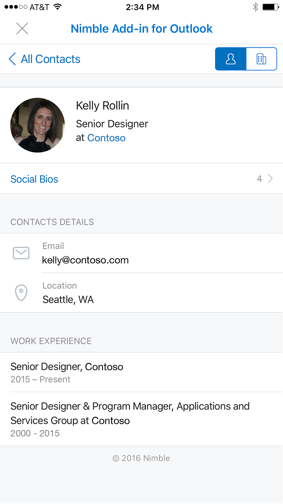
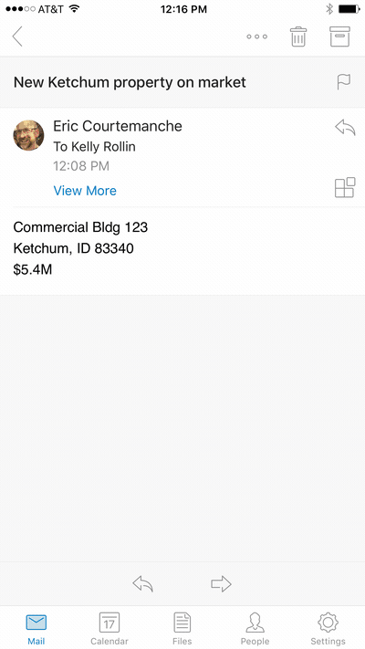

# Add-ins for Outlook Mobile 

> **Note:** Add-ins are available on Outlook for iOS. Outlook for Android support is coming soon.

Add-ins now work on Outlook Mobile, using the same APIs available for other Outlook endpoints. If you've built an add-in for Outlook already, it's easy to get it working on Outlook Mobile.

Outlook Mobile Add-ins are supported on all Office 365 Commercial accounts, and support is rolling out to Outlook.com accounts.

**An example taskpane in Outlook for iOS**

## What's different on mobile? 

- The small size and quick interactions make designing for mobile a challenge. To ensure quality experiences for our customers, we are setting strict validation criteria that must be met by an add-in declaring mobile support, in order to be approved in the Office Store.
    - The add-in **MUST** adhere to the [UI guidelines](./outlook-addin-design.md).
    - The scenario for the add-in **MUST** [make sense on mobile](#what-makes-a-good-scenario-for-mobile-add-ins).
- Only mail read is supported at this time. That means `MobileMessageReadCommandSurface` is the only [ExtensionPoint](../../reference/manifest/extensionpoint.md) you should declare in the mobile section of your manifest
- The [makeEwsRequestAsync](../../reference/outlook/Office.context.mailbox.md) API is not supported on mobile since the mobile app uses REST APIs to communicate with the server. If your app backend needs to connect to the Exchange server, you can use the callback token to make REST API calls. For details, see [Use the Outlook REST APIs from an Outlook add-in](./use-rest-api.md).
- When you submit your add-in to the store with [MobileFormFactor](../../reference/manifest/mobileformfactor.md) in the manifest, you'll need to agree to our developer addendum for add-ins on iOS, and you must submit your Apple Developer ID for verification.
- Finally, your manifest will need to declare `MobileFormFactor`, and have the correct types of [controls](../../reference/manifest/control.md) and [icon sizes](../../reference/manifest/icon.md) included.

## What makes a good scenario for mobile add-ins?

Remember that the average Outlook session length on a phone is much shorter than on a PC. That means your add-in must be fast, and the scenario must allow the user to get in, get out, and get on with their email workflow.

Here are examples of scenarios that make sense in Outlook Mobile.

- The add-in brings valuable information into Outlook, helping users triage their email and respond appropriately. Example: a CRM add-in that lets the user see customer information and share appropriate information.
- The add-in adds value to the user's email content by saving the information to a tracking, collaboration, or similar system. Example: an add-in that lets users turn emails into task items for project tracking, or help tickets for a support team.

There are definitely other great scenarios out there, so if you have an idea for an add-in that expands beyond these, please reach out to us using the [form here](https://aka.ms/outlookmobileaddin) to get feedback on whether this is an acceptable scenario for Outlook Mobile. We'll be happy to provide guidance, and the more information you can provide the better. We love a good UI walkthrough!

**An example user interaction to create a Trello card from an email message**

## Testing your add-ins on mobile

To test an add-in on Outlook Mobile, you can side-load an add-in to an O365 or Outlook.com account. In the Outlook Web App, go to the settings gear, and choose "Manage Integrations" or "Manage Add-ins." Near the top, click where it says "Click here to add a custom add-in" and upload your manifest. Make sure your manifest is properly formatted to contain `MobileFormFactor` or it won't load.

Once your add-in is working, make sure to test it on different screen sizes, including phones and tablets. You should make sure it meets accessibility guidelines for contrast, font size, and color, as well as being usable with a screen reader such as VoiceOver on iOS or TalkBack on Android.

Troubleshooting on mobile can be hard, since you may not have the tools you're used to. One option for troubleshooting is to [use Vorlon.js](../testing/debug-office-add-ins-on-ipad-and-mac.md). Or, if you've used Fiddler before, check out [this tutorial on using it with an iOS device](http://www.telerik.com/blogs/using-fiddler-with-apple-ios-devices).

## Next steps

- Learn how to [add mobile support to your add-in's manifest](./manifests/add-mobile-support.md).
- Learn how to [get an access token and call Outlook REST APIs](./use-rest-api.md) from your add-in.