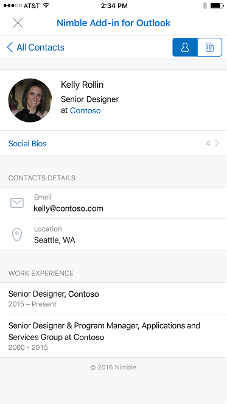
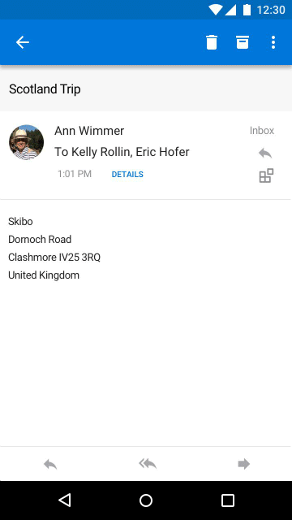

# Add-ins for Outlook on mobile devices

Add-ins now work in Outlook on mobile devices, using the same APIs available for other Outlook endpoints. If you've built an add-in for Outlook already, it's easy to get it working on Outlook mobile.

Outlook mobile add-ins are supported on all Microsoft 365 business accounts and Outlook.com accounts. However, support isn't currently available for non-Microsoft accounts, such as Gmail. For more information, see the "Supported accounts" section of [Outlook add-ins overview](outlook-add-ins-overview.md#supported-accounts).

**An example task pane in Outlook on iOS**

**An example task pane in Outlook on Android**

## What's different on mobile?

- The small size and quick interactions make designing for mobile a challenge. To ensure quality experiences for customers, any add-in declaring mobile support must meet certain validation criteria to be approved in AppSource.
  - The add-in **MUST** adhere to the [UI guidelines](outlook-addin-design.md).
  - The scenario for the add-in **MUST** [make sense on mobile](#what-makes-a-good-scenario-for-outlook-mobile-add-ins).
  - You'll need to agree to our developer addendum for add-ins on iOS, and you must submit your Apple Developer ID for verification.

- In general, only Message Read mode is supported. This has implications for how you configure the manifest.
  - **Unified manifest for Microsoft 365**: `"mailRead"` is the only item you should declare in the [`"extensions.ribbons.contexts"`](/microsoft-365/extensibility/schema/extension-ribbons-array#contexts) array.
  - **Add-in only manifest**: `MobileMessageReadCommandSurface` is the only [ExtensionPoint](/javascript/api/manifest/extensionpoint#mobilemessagereadcommandsurface) you should declare in the mobile section of your manifest.
  
  However, there are some exceptions.
  1. Appointment Organizer mode is supported for online meeting provider integrated add-ins.
     - **Unified manifest for Microsoft 365**: `"onlineMeetingDetailsOrganizer"` is permitted in the `"extensions.ribbons.contexts"` array.
     - **Add-in only manifest**: The [MobileOnlineMeetingCommandSurface extension point](/javascript/api/manifest/extensionpoint#mobileonlinemeetingcommandsurface) is permitted.
  
     For more information on this scenario, see [Create an Outlook mobile add-in for an online-meeting provider](online-meeting.md).

  1. Appointment Attendee mode is supported for integrated add-ins created by providers of note-taking and customer relationship management (CRM) applications.
     - **Unified manifest for Microsoft 365**: `"logEventMeetingDetailsAttendee"` is permitted in the `"extensions.ribbons.contexts"` array.
     - **Add-in only manifest**: The [MobileLogEventAppointmentAttendee extension point](/javascript/api/manifest/extensionpoint#mobilelogeventappointmentattendee) is permitted.

     For more information on this scenario, see [Log appointment notes to an external application in Outlook mobile add-ins](mobile-log-appointments.md).

  1. Event-based activation is supported.
     - **Unified manifest for Microsoft 365**: Event-based add-ins aren't treated as a context in the unified manifest, so there is no exception for configuring the `"extensions.ribbons.contexts"` array. But note that event-based add-ins do require an `"extensions.autoRunEvents"` property in the manifest.
     - **Add-in only manifest**: The [LaunchEvent extension point](/javascript/api/manifest/extensionpoint#launchevent) *must be declared*.
  
     For more information, see [Implement event-based activation in Outlook mobile add-ins](mobile-event-based.md).

- Your manifest needs to declare mobile support including special mobile controls and icon sizes.
  - **Unified manifest for Microsoft 365**: Include the string `"mobile"` in the [`"extensions.ribbons.requirements.formFactors"`](/microsoft-365/extensibility/schema/requirements-extension-element#formfactors) array, and include a `"customMobileRibbonGroups"` array in the tab object of the [`"extensions.ribbons.tabs"`](/microsoft-365/extensibility/schema/extension-ribbons-array#tabs) array. The object in this array must include a `"controls.type"` of `"mobileButton"` and a `"controls.icons"` array.
  - **Add-in only manifest**: Include a **\<MobileFormFactor\>**, and include the correct types of [controls](/javascript/api/manifest/control) and [icon sizes](/javascript/api/manifest/icon).
  
  To learn more, see [Add support for add-in commands in Outlook on mobile devices](add-mobile-support.md).

## What makes a good scenario for Outlook mobile add-ins?

Remember that the average Outlook session length on a phone is much shorter than on a PC. That means your add-in must be fast, and the scenario must allow the user to get in, get out, and get on with their email workflow.

Here are examples of scenarios that make sense in Outlook mobile.

- The add-in brings valuable information into Outlook, helping users triage their email and respond appropriately. For example, a customer relationship management (CRM) add-in that lets the user see customer information and share appropriate information.

- The add-in adds value to the user's email content by saving the information to a tracking, collaboration, or similar system. For example, an add-in that lets users turn emails into task items for project tracking, or help tickets for a support team.

**An example user interaction to create a Trello card from an email message on iOS**

**An example user interaction to create a Trello card from an email message on Android**

## Support for add-ins with the unified manifest for Microsoft 365

Add-ins that use the [unified manifest for Microsoft 365](../develop/unified-manifest-overview.md) aren't directly supported in Outlook on mobile devices. To run this type of add-in, it must first be published to [AppSource](https://appsource.microsoft.com/). An add-in only manifest is then generated from the unified manifest, which enables the add-in to be installed in Outlook mobile.

If you're deploying an add-in that uses the unified manifest in the [Microsoft 365 Admin Center](../publish/publish.md) and require it to run in Outlook mobile, the add-in must be a published AppSource add-in. Custom add-ins or line-of-business (LOB) add-ins that use the unified manifest can't currently be deployed in the Microsoft 365 Admin Center.

For more information, see the "Client and platform support" section of [Office Add-ins with the unified app manifest for Microsoft 365](../develop/unified-manifest-overview.md#client-and-platform-support).

## Testing your add-ins on mobile

To test an add-in on Outlook mobile, first [sideload an add-in](sideload-outlook-add-ins-for-testing.md) using a Microsoft 365 or Outlook.com account in Outlook on the web, on Windows ([new](https://support.microsoft.com/office/656bb8d9-5a60-49b2-a98b-ba7822bc7627) or classic), or on Mac. Make sure your manifest is properly formatted to contain `MobileFormFactor` or it won't load in Outlook mobile.

After your add-in is working, make sure to test it on different screen sizes, including phones and tablets. You should make sure it meets [accessibility guidelines](../design/accessibility-guidelines.md) for contrast, font size, and color, as well as being usable with a screen reader such as VoiceOver on iOS or TalkBack on Android.

Troubleshooting on mobile can be hard since you may not have the tools you're used to. However, one option for troubleshooting on iOS is to use Fiddler (check out [this tutorial on using it with an iOS device](https://www.telerik.com/blogs/using-fiddler-with-apple-ios-devices)).

> [!NOTE]
> Modern Outlook on the web on iPhone and Android smartphones is no longer required or available for testing Outlook add-ins. Additionally, add-ins aren't supported in Outlook on Android, on iOS, and modern mobile web with on-premises Exchange accounts. Certain iOS devices still support add-ins when using on-premises Exchange accounts with classic Outlook on the web. For information about supported devices, see [Requirements for running Office Add-ins](../concepts/requirements-for-running-office-add-ins.md#client-requirements-non-windows-smartphone-and-tablet).

## Next steps

Learn how to:

- [Add support for add-in commands in Outlook on mobile devices](add-mobile-support.md).
- [Implement supported Outlook JavaScript APIs](outlook-mobile-apis.md).
- [Design a great mobile experience for your add-in](outlook-addin-design.md).
- [Get an access token and call Outlook REST APIs](use-rest-api.md) from your add-in.
