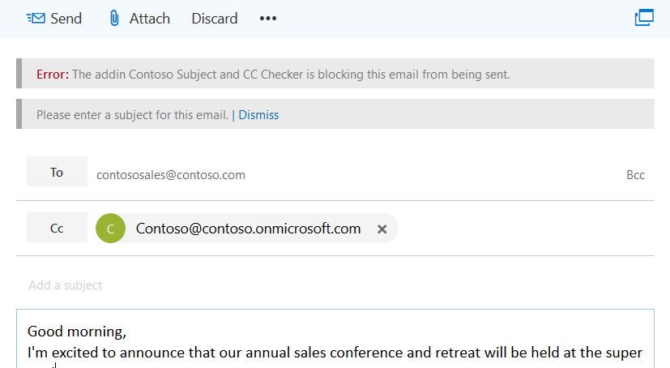
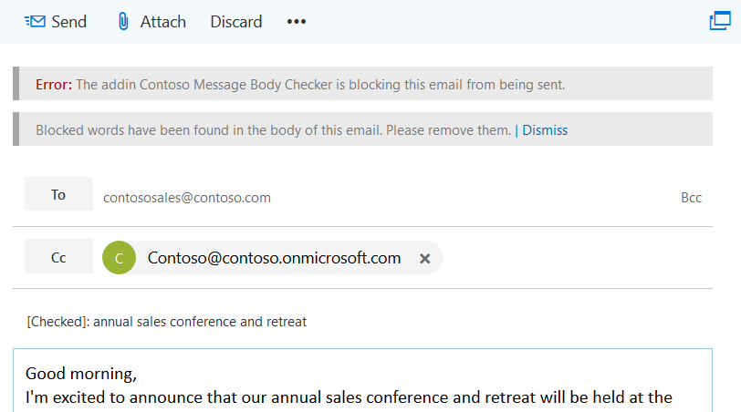

# On send feature for Outlook add-ins

The on send feature for Outlook add-ins provides a way to handle email or block email users from certain actions, and allows an add-in to set certain items on send. For example, you can use the on send feature to:

- Prevent a user from sending sensitive information or leaving the subject line blank.  
- Add a specific recipient to the CC line.

> [!NOTE]
> The on send feature is currently supported for Outlook on the web in Office 365 only. Support for other platforms is coming soon. Add-ins that use the on send feature aren't allowed in the Office Store.

The on send feature is triggered by events. Currently, the feature supports the **ItemSend** event type. Events in Outlook add-ins enable you to handle, check, or block user actions when something of interest occurs. For example, events provide ways to:

- Control user actions
- Handle changes
- Signal user actions such as button clicks
- Verify user data input
- Validate content in a message    

For information about limitations related to the on send feature, see [Limitations](#limitations) later in this article.

## How does the on send feature work?

You can use the on send feature to build an Outlook add-in that integrates the **ItemSend** synchronous event. This event detects that the user is pressing the **Send** button and can be used to block the email from sending if the message validation fails. For example, when a user triggers a message send event, an Outlook add-in that uses the on send feature can:

- Read and validate the email message contents
- Verify that the message includes a subject line
- Set a predetermined recipient 

Validation is done on the client side in Outlook on the web, on trigger of the send event. If validation fails, the sending of the email is blocked, and an error message with an information bar is displayed that prompts the user to take action.  

The following screenshot shows an information bar that notifies the sender to add a subject.

<br/>

 

<br/>

<br/>

The following screenshot shows an information bar that notifies the sender that blocked words were found.

<br/>



## Limitations

The on send feature currently has the following limitations:

- **Office Store** &ndash; You can't publish Outlook add-ins that use the on send feature to the Office Store. Add-ins that use the on send event will fail Office Store validation.    
- **Manifest** &ndash; Only one **ItemSend** event is supported per add-in. If you have two or more **ItemSend** events in a manifest, the manifest will fail validation. 
- **Performance** &ndash; Multiple roundtrips to the web server that hosts the add-in can affect the performance of the add-in. Consider the effects on performance when you create add-ins that require multiple email message-based operations.

### Mailbox type limitations

On send functionality is only supported for user mailboxes in Outlook on the web. The functionality is not currently supported for the following mailbox types:

- Shared mailboxes
- Offline mode
- Group mailboxes 

Outlook on the web won't allow sending if the on send feature is enabled for these mailbox types. If a user responds to an email in a group mailbox, the on send add-in won't run and the message will be sent.

##  Multiple on send add-ins

If more than one on send add-in is installed, the add-ins will run in the order in which they were installed. If the first add-in allows sending, the second add-in can change something that would make the first one block sending. However, the first add-in won't run again if all installed add-ins have allowed sending. 

For example, Add-in1 and Add-in2 both use the on send feature. Add-in1 is installed first, and Add-in2 is installed second. Add-in1 verifies that the word Fabrikam appears in the message as a condition for the add-in to allow send.  However, Add-in2 removes any occurrences of the word Fabrikam. The message will send with all instances of Fabrikam removed (due to the order of installation of Add-in1 and Add-in2).

## Deploying Outlook add-ins that use on send 

We recommend that administrators deploy Outlook add-ins that use the on send feature. Administrators have to ensure that the on send add-in:

- Is always present any time a compose item is opened (for email, new, reply, or forward).
- Can't be closed or disabled by the user.

## Installing Outlook add-ins that use on send

The on send feature in Outlook on the web requires that add-ins are configured for the send event types. Add-ins for Outlook on the web that use the on send feature will run for users who are assigned an Outlook on the web mailbox policy that has the *OnSendAddinsEnabled* flag set to **true**.

To install a new add-in, run the following Exchange Online PowerShell cmdlets. 

```powershell
$Data=Get-Content -Path '.\Contoso Message Body Checker.xml' -Encoding Byte –ReadCount 0 
```

```powershell
New-App -OrganizationApp -FileData $Data -DefaultStateForUser Enabled
```

> [!NOTE]
> To learn how to use remote PowerShell to connect to Exchange Online, see [Connect to Exchange Online PowerShell](https://go.microsoft.com/fwlink/p/?LinkId=396554).

### Enabling the on send feature 

By default, on send functionality is disabled. Administrators can enable on send by running Exchange Online PowerShell cmdlets.

To enable on send add-ins for all users: 

1. Create a new Outlook on the web mailbox policy.

   ```powershell
    New-OWAMailboxPolicy OWAOnSendAddinAllUserPolicy
   ```

    > [!NOTE]
    > Administrators can use an existing policy, but on send functionality is only supported on certain mailbox types. Unsupported mailboxes will be blocked from sending by default in Outlook on the web.

2. Enable the on send feature.

   ```powershell
    Get-OWAMailboxPolicy OWAOnSendAddinAllUserPolicy | Set-OWAMailboxPolicy –OnSendAddinsEnabled:$true
   ```

3. Assign the policy to users.

   ```powershell
    Get-User -Filter {RecipientTypeDetails -eq 'UserMailbox'}|Set-CASMailbox -OwaMailboxPolicy OWAOnSendAddinAllUserPolicy
   ```

### Enabling the on send feature for a group of users

To enable the on send feature for a specific group of users the steps are as follows.  In this example, an administrator only wants to enable an Outlook on the web on send add-in feature in an environment for Finance users (where the Finance users are in the Finance Department).

1. Create a new Outlook on the web mailbox policy for the group.

   ```powershell
    New-OWAMailboxPolicy FinanceOWAPolicy
   ```

   > [!NOTE]
   > Administrators can use an existing policy, but on send functionality is only supported on certain mailbox types (see **Mailbox type limitations** earlier in this article for more information). Unsupported mailboxes will be blocked from sending by default in Outlook on the web.

2. Enable the on send feature.

   ```powershell
    Get-OWAMailboxPolicy FinanceOWAPolicy | Set-OWAMailboxPolicy –OnSendAddinsEnabled:$true
   ```

3. Assign the policy to users.

   ```powershell
    $targetUsers = Get-Group 'Finance'|select -ExpandProperty members
    $targetUsers | Get-User -Filter {RecipientTypeDetails -eq 'UserMailbox'}|Set-CASMailbox -OwaMailboxPolicy FinanceOWAPolicy
   ```

> [!NOTE]
> Wait up to 60 minutes for the policy to take effect, or restart Internet Information Services (IIS). When the policy takes effect, the on send feature will be enabled for the group.

### Disabling the on send feature

To disable the on send feature for a user or assign an Outlook on the web mailbox policy that does not have the flag enabled, run the following cmdlets. In this example, the mailbox policy is *ContosoCorpOWAPolicy*.

```powershell
Get-CASMailbox joe@contoso.com | Set-CASMailbox –OWAMailboxPolicy "ContosoCorpOWAPolicy"
```

> [!NOTE] 
> For more information about how to use the **Set-OwaMailboxPolicy** cmdlet to configure existing Outlook on the web mailbox policies, see [Set-OwaMailboxPolicy](https://technet.microsoft.com/en-us/library/dd297989(v=exchg.160).aspx).

To disable the on send feature for all users that have a specific Outlook on the web mailbox policy assigned, run the following cmdlets. 

```powershell
Get-OWAMailboxPolicy OWAOnSendAddinAllUserPolicy | Set-OWAMailboxPolicy –OnSendAddinsEnabled:$false
```

## On send feature scenarios

The following are the supported and unsupported scenarios for add-ins that use the on send feature.

### User mailbox has the on send add-in feature enabled but no add-ins are installed

In this scenario the user will be able to send mail without any add-ins executing.

### User mailbox has the on send add-in feature enabled and add-ins that supports on send are installed and enabled

Add-ins will run during the send event, which will then either allow or block the user from sending.

### Mailbox delegation, where mailbox 1 has full access permissions to mailbox 2

<br/>

|**Scenario**|**Mailbox 1 on send feature**|**Mailbox 2 on send feature**|**Outlook on the web session**|**Result**|**Supported?**|
|:------------|:------------|:--------------------------|:---------|:-------------|:-------------|
|1|Enabled|Enabled|New session|Mailbox 1 cannot send an email from mailbox 2.|Not currently supported.As a workaround, use scenario 3.|
|2|Disabled|Enabled|New session|Mailbox 1 cannot send an email from mailbox 2.|Not currently supported. As a workaround, use scenario 3.|
|3|Enabled|Enabled|Same session|On send add-ins assigned to mailbox 1 run on send.|Supported.|
|4|Enabled|Disabled|New session|No on send add-ins run; mail is sent.|Supported.|


### Group 1 is a modern group mailbox and user mailbox 1 is a member of Group 1

<br/>

|**Scenario**|**Mailbox 1 on send feature**|**On send add-ins enabled?**|**Mailbox 1 action**|**Result**|**Supported?**|
|:------------|:-------------------------|:-------------------|:---------|:----------|:-------------|
|1|Enabled|Yes|Mailbox 1 composes new message to Group 1.|On send add-ins run during send.|Yes|
|2|Enabled|Yes|Mailbox 1 composes a new message to Group 1 within Group 1’s group window in Outlook on the web.|On send add-ins do not run during send.|Not currently supported. As a workaround, use scenario 1.|

### User mailbox with on send add-in feature enabled, add-ins that support on send are installed and enabled and offline mode is enabled

The on send add-ins will run during send if the user is online. If the user is offline, the on send add-ins will not run during send and the email will not be sent.

## Code examples

The following code examples show you how to create a simple on send add-in. To download the code sample that these examples are based on, see [Outlook-Add-in-On-Send](https://github.com/OfficeDev/Outlook-Add-in-On-Send).

### Manifest, version override, and event

The [Outlook-Add-in-On-Send](https://github.com/OfficeDev/Outlook-Add-in-On-Send) code sample includes two manifests:

- `Contoso Message Body Checker.xml` &ndash; Shows how to check the body of a message for restricted words or sensitive information on send.  

- `Contoso Subject and CC Checker.xml` &ndash; Shows how to add a recipient to the CC line and verify that the message includes a subject line on send.  

In the `Contoso Message Body Checker.xml` manifest file, you include the function file and function name that should be called on the **ItemSend** event. The operation runs synchronously.

```xml
<Hosts>
        <Host xsi:type="MailHost">
          <DesktopFormFactor>
            <!-- The functionfile and function name to call on message send.  -->
            <!-- In this case, the function validateBody will be called within the JavaScript code referenced in residUILessFunctionFileUrl. -->
            <FunctionFile resid="residUILessFunctionFileUrl" />
            <ExtensionPoint xsi:type="Events">
              <Event Type="ItemSend" FunctionExecution="synchronous" FunctionName="validateBody" />
            </ExtensionPoint>
          </DesktopFormFactor>
        </Host>
      </Hosts>
```

<br/>

For the `Contoso Subject and CC Checker.xml` manifest file, the function file and function name to call on message send event is shown in the following example.

```xml
<Hosts>
        <Host xsi:type="MailHost">
          <DesktopFormFactor>
            <!-- The functionfile and function name to call on message send.  -->
            <!-- In this case the function validateSubjectAndCC will be called within the JavaScript code referenced in residUILessFunctionFileUrl. -->
            <FunctionFile resid="residUILessFunctionFileUrl" />
            <ExtensionPoint xsi:type="Events">
              <Event Type="ItemSend" FunctionExecution="synchronous" FunctionName="validateSubjectAndCC" />
            </ExtensionPoint>
          </DesktopFormFactor>
        </Host>
      </Hosts>
```

<br/>

The on send API requires **VersionOverrides v1_1**. The following shows you how to add the VersionOverrides node in your manifest.

```xml
 <VersionOverrides xmlns="http://schemas.microsoft.com/office/mailappversionoverrides" xsi:type="VersionOverridesV1_0">
    <!-- On Send requires VersionOverridesV1_1 -->
    <VersionOverrides xmlns="http://schemas.microsoft.com/office/mailappversionoverrides/1.1" xsi:type="VersionOverridesV1_1">
```


> [!NOTE]
> For more information, see the following:
> - [Outlook add-in manifests](manifests.md)
> - [VersionOverrides](https://docs.microsoft.com/office/dev/add-ins/develop/create-addin-commands#step-3-add-versionoverrides-element)
> - [Office Add-ins XML manifest](https://docs.microsoft.com/office/dev/add-ins/overview/add-in-manifests)


### Event, item, body getAsync, and setAsync methods

To access the currently selected message (in this example, the newly composed  message), use the **Office.context.mailbox.item** namespace. The **ItemSend** event is automatically passed by the on send feature to the function specified in the manifest&mdash;in this example, the `validateBody`function.

```js
 var mailboxItem;

    Office.initialize = function (reason) {
        mailboxItem = Office.context.mailbox.item;
    }

    // Entry point for Contoso Message Body Checker add-in before send is allowed.
    // <param name="event">ItemSend event is automatically passed by on send code to the function specified in the manifest.</param>
    function validateBody(event) {
        mailboxItem.body.getAsync("html", { asyncContext: event }, checkBodyOnlyOnSendCallBack);
    }
```

The `validateBody` function gets the current body in the specified format (HTML) and passes the **ItemSend** event object that the code wants to access in the callback method. In addition to the **getAsync** method, the **Body** object also provides a **setAsync** method that you can use to replace the body with the specified text. 

> [!NOTE]
> For more information, see [Event Object](https://docs.microsoft.com/javascript/api/office/office.addincommands.event) and [Body.getAsync](https://docs.microsoft.com/javascript/api/outlook_1_5/office.Body#getasync-coerciontype--options--callback-).
  

### NotificationMessages object and event.completed method

The `checkBodyOnlyOnSendCallBack` function uses a regular expression to determine whether the message body contains blocked words. If it finds a match against an array of restricted words, it then blocks the email from being sent and notifies the sender via the information bar. To do this, it uses the **notificationMessages** property of the **Item** object to return a **NotificationMessages** object. It then adds a notification to the item by calling the **addAsync** method, as shown in the following example. 

```js
  // Determine whether the body contains a specific set of blocked words. If it contains the blocked words, block email from being sent. Otherwise allow sending.
    // <param name="asyncResult">ItemSend event passed from the calling function.</param>
    function checkBodyOnlyOnSendCallBack(asyncResult) {
        var listOfBlockedWords = new Array("blockedword", "blockedword1", "blockedword2");
        var wordExpression = listOfBlockedWords.join('|');

        // \b to perform a "whole words only" search using a regular expression in the form of \bword\b.
        // i to perform case-insensitive search.
        var regexCheck = new RegExp('\\b(' + wordExpression + ')\\b', 'i');
        var checkBody = regexCheck.test(asyncResult.value);

        if (checkBody) {
            mailboxItem.notificationMessages.addAsync('NoSend', { type: 'errorMessage', message: 'Blocked words have been found in the body of this email. Please remove them.' });
            // Block send.
            asyncResult.asyncContext.completed({ allowEvent: false });
        }

        // Allow send.
        asyncResult.asyncContext.completed({ allowEvent: true });
    }
```

The following are the parameters for the **addAsync** method:

- *NoSend* &ndash; A string that is a developer-specified key to reference a notification message. You can use it to modify this message later. The key can’t be longer than 32 characters. 
- *type* &ndash; One of the properties of the  JSON object parameter. Represents the type of a message; the types correspond to the values of the [Office.MailboxEnums.ItemNotificationMessageType](https://docs.microsoft.com/javascript/api/outlook_1_5/office.mailboxenums.itemnotificationmessagetype) enumeration. Possible values are progress indicator, information message, or error message. In this example, *type* is an error message.  
- *message* &ndash; One of the properties of the JSON object parameter. In this example, *message* is the text of the notification message. 

To signal that the add-in has finished processing the **ItemSend** event triggered by the send operation, call the **event.completed({allowEvent:Boolean}** method. The **allowEvent** property is a Boolean. If set to **true**, send is allowed. If set to **false**, the email message is blocked from sending.

> [!NOTE]
> For more information, see [notificationMessages](https://docs.microsoft.com/office/dev/add-ins/reference/objectmodel/requirement-set-1.5/Office.context.mailbox.item#notificationmessages-notificationmessagesjavascriptapioutlook15officenotificationmessages) and [completed](https://docs.microsoft.com/javascript/api/office/office.addincommands.event).

### replaceAsync, removeAsync, and getAllAsync methods

In addition to the **addAsync** method, the **NotificationMessages** object also includes **replaceAsync, removeAsync and getAllAsync** methods.  These methods are not used in this code sample.  For more information, see [NotificationMessages](https://docs.microsoft.com/javascript/api/outlook_1_5/office.NotificationMessages).


### Subject and CC checker

The following code example shows you how to add a recipient to the CC line and verify that the message includes a subject on send. This example uses the on send feature to allow or disallow an email from sending.  

```js
    // Invoke by Contoso Subject and CC Checker add-in before send is allowed.
    // <param name="event">ItemSend event is automatically passed by on send code to the function specified in the manifest.</param>
    function validateSubjectAndCC(event) {
        shouldChangeSubjectOnSend(event);
    }

    // Determine whether the subject should be changed. If it is already changed, allow send. Otherwise change it.
    // <param name="event">ItemSend event passed from the calling function.</param>
    function shouldChangeSubjectOnSend(event) {
        mailboxItem.subject.getAsync(
            { asyncContext: event },
            function (asyncResult) {
                addCCOnSend(asyncResult.asyncContext);
                //console.log(asyncResult.value);
                // Match string.
                var checkSubject = (new RegExp(/\[Checked\]/)).test(asyncResult.value)
                // Add [Checked]: to subject line.
                subject = '[Checked]: ' + asyncResult.value;

                // Determine whether a string is blank, null, or undefined.
                // If yes, block send and display information bar to notify sender to add a subject.
                if (asyncResult.value === null || (/^\s*$/).test(asyncResult.value)) {
                    mailboxItem.notificationMessages.addAsync('NoSend', { type: 'errorMessage', message: 'Please enter a subject for this email.' });
                    asyncResult.asyncContext.completed({ allowEvent: false });
                }
                else {
                    // If can't find a [Checked]: string match in subject, call subjectOnSendChange function.
                    if (!checkSubject) {
                        subjectOnSendChange(subject, asyncResult.asyncContext);
                        //console.log(checkSubject);
                    }
                    else {
                        // Allow send.
                        asyncResult.asyncContext.completed({ allowEvent: true });
                    }
                }

            }
          )
    }

    // Add a CC to the email. In this example, CC contoso@contoso.onmicrosoft.com
    // <param name="event">ItemSend event passed from calling function</param>
    function addCCOnSend(event) {
        mailboxItem.cc.setAsync(['Contoso@contoso.onmicrosoft.com'], { asyncContext: event });        
    }

    // Determine whether the subject should be changed. If it is already changed, allow send, otherwise change it.
    // <param name="subject">Subject to set.</param>
    // <param name="event">ItemSend event passed from the calling function.</param>
    function subjectOnSendChange(subject, event) {
        mailboxItem.subject.setAsync(
            subject,
            { asyncContext: event },
            function (asyncResult) {
                if (asyncResult.status == Office.AsyncResultStatus.Failed) {
                    mailboxItem.notificationMessages.addAsync('NoSend', { type: 'errorMessage', message: 'Unable to set the subject.' });

                    // Block send.
                    asyncResult.asyncContext.completed({ allowEvent: false });
                }
                else {
                    // Allow send.
                    asyncResult.asyncContext.completed({ allowEvent: true });
                }

            });
    }
```

To learn more about how to add a recipient to the CC line and verify that the email message includes a subject line on send, and to see the APIs you can use, see the [Outlook-Add-in-On-Send sample](https://github.com/OfficeDev/Outlook-Add-in-On-Send). The code is well commented.   


## See also

- [Overview of Outlook add-ins architecture and features](index.md)    
- [Add-in Command Demo Outlook add-in](https://github.com/OfficeDev/outlook-add-in-command-demo)
    
