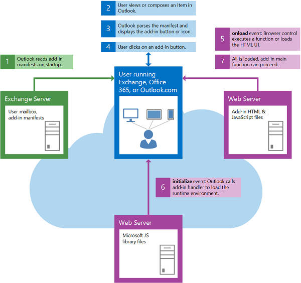

# Overview of Outlook add-ins architecture and features

An Outlook add-in consists of an XML manifest and code (JavaScript and HTML). The manifest specifies the name and description of the add-in, as well as how the add-in integrates into Outlook. Using the manifest, developers can place buttons on command surfaces, link off regular expression matches and so on. The manifest also defines the URL that hosts the JavaScript and HTML code for the add-in.

When a user or administrator acquires an add-in, the add-in's manifest is saved to the user's mailbox or into the organization. When Outlook starts up, it loads all manifests the user has installed, processes them and sets up all the extension points for the add-in (for example, display buttons in command surfaces, run regular expression against currently selected message, and so forth). The user can now use the add-in.

When the user interacts with the add-in, the JavaScript and HTML files are loaded from the host location specified in the manifest.

Add-ins use the Office.js API to access the Outlook Add-in API and interact with Outlook.

**Interaction of typical components when the user starts Outlook**

### Versioning

As we evolve Outlook clients and the add-in platform and add new ways for add-ins to integrate, sometimes we're unable to implement a feature at the same time across all clients (Mac, Windows, web, mobile). To handle this situation, we version both the manifest and the APIs. In this way the platform supports backwards compatibility at all times, meaning that developers can build an add-in which works in a down-level way in older clients, but also lets you take advantage of new features in newer clients. You can read more about how versioning works in [Outlook add-in manifests](../outlook/manifests/manifests.md).

## Outlook add-in features

Outlook add-ins offer many rich features that can be used to support various scenarios.

|**Feature**|**Description**|
|:-----|:-----|
|Contextual activation|Outlook add-ins are contextually based. They can activate based on the following criteria:<ul><li>(default) for any item in the mailbox or calendar</li><li>for a specific item type (an email message, meeting request message, or appointment)</li><li>for an item message class</li><li>for specific entities in a message or appointment, see [Contextual Outlook add-ins](contextual-outlook-add-ins.md).</li><li>based on specific rules or regular expressions, see [Activation rules for Outlook add-ins](manifests/activation-rules.md) and [Use regular expression activation rules to show an Outlook add-in](use-regular-expressions-to-show-an-outlook-add-in.md)</li><li>for string matches of properties, see [Match strings in an Outlook item as well-known entities](match-strings-in-an-item-as-well-known-entities.md)</li></ul>|
|Add-in commands|Outlook add-in commands provide ways to initiate specific add-in actions from the ribbon. They are only available for add-ins that apply to all emails or events. For more information see [Add-in commands for Outlook](../outlook/add-in-commands-for-outlook.md). |
|Roaming settings|An Outlook add-in can save data that is specific to the user's mailbox that you can access in a subsequent Outlook session. For more information see [Get and set add-in metadata for an Outlook add-in](../outlook/metadata-for-an-outlook-add-in.md). |
|Custom properties|An Outlook add-in can save data that is specific to an item in the user's mailbox that you can access in a subsequent Outlook session. For more information see [Get and set add-in metadata for an Outlook add-in](../outlook/metadata-for-an-outlook-add-in.md).|
|Getting attachments or the entire selected item|An Outlook add-in can access attachments and the entire selected item from the server-side. See the following:<ul><li>Attachments - see [Get attachments of an Outlook item from the server](get-attachments-of-an-outlook-item.md) and [Add and remove attachments to an item in a compose form in Outlook]add-and-remove-attachments-to-an-item-in-a-compose-form.md)</li><li>Entire selected item - this is similar to using a callback token to get attachments. See the following:<ul><li>[mailbox.getCallbackTokenAsync](../../reference/outlook/Office.context.mailbox.md#getcallbacktokenasynccallback-usercontext) method - provides a callback token to identify the add-in's server side code for the Exchange Server.</li><li>[item.itemId](../../reference/outlook/Office.context.mailbox.item.md#nullable-itemid-string) property - identifies the item that the user is reading and that the server-side code is getting.</li><li>[mailbox.ewsUrl](../../reference/outlook/Office.context.mailbox.md#ewsurl-string) property - provides the EWS endpoint URL which, together with the callback token and item ID, the server-side code can use to access the [GetItem](http://msdn.microsoft.com/en-us/library/e3590b8b-c2a7-4dad-a014-6360197b68e4(Office.15).aspx) EWS operation to get the entire item.</li></ul></li></ul>|
|User profile|A mail add-in can access the display name, email address, and time zone in the user's profile. For more information see the [UserProfile](../../reference/outlook/Office.context.mailbox.userProfile.md) object.|

## Get started building Outlook add-ins

To get started building Outlook add-ins, see [Get Started with Outlook add-ins for Office 365](https://dev.outlook.com/MailAppsGettingStarted/GetStarted.aspx).

## Additional resources

- [Design guidelines for Office Add-ins](../../docs/design/add-in-design.md)
    
- [Best practices for developing Office Add-ins](../../docs/design/add-in-development-best-practices.md)
    
- [License your Office and SharePoint Add-ins](http://msdn.microsoft.com/library/3e0e8ff6-66d6-44ff-b0c2-59108ebd9181%28Office.15%29.aspx)
    
- [Submit Office and SharePoint Add-ins and Office 365 web apps to the Office Store](http://msdn.microsoft.com/library/ff075782-1303-4517-91cc-b3d730e9b9ae%28Office.15%29.aspx)
    
- [JavaScript API for Office](http://msdn.microsoft.com/EN-US/library/fp142185%28v=office.15%29.aspx(Office.15).aspx)
    
- [Mail add-in manifests](../outlook/manifests/manifests.md)
    
