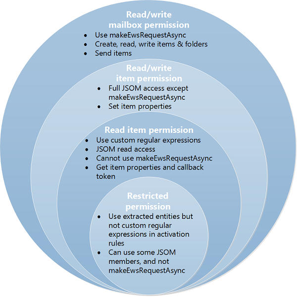

# Privacy, permissions, and security for Outlook add-ins

End users, developers, and administrators can use the tiered permission levels of the security model for Outlook add-ins to control privacy and performance.

This article describes the possible permissions that Outlook add-ins can request, and examines the security model from the following perspectives.

- **AppSource**: Add-in integrity

- **End-users**: Privacy and performance concerns

- **Developers**: Permissions choices and resource usage limits

- **Administrators**: Privileges to set performance thresholds

> [!NOTE]
> This article focuses on information about privacy, permissions, and security specific to Outlook add-ins. If you haven't already, we recommend you to first review [Privacy and security for Office Add-ins](../concepts/privacy-and-security.md), as its contents applies to all Office Add-ins.

## Permissions model

Because customers' perception of add-in security can affect add-in adoption, Outlook add-in security relies on a tiered permissions model. An Outlook add-in would disclose the level of permissions it needs, identifying the possible access and actions that the add-in can make on the customer's mailbox data.

There are four levels of permissions.

[!include[Table of Outlook permissions](../includes/outlook-permission-levels-table.md)]

The four levels of permissions are cumulative: the **read/write mailbox** permission includes the permissions of **read/write item**, **read item** and **restricted**, **read/write item** includes **read item** and **restricted**, and the **read item** permission includes **restricted**.

The following figure shows the four levels of permissions and describes the capabilities offered to the end user, developer, and administrator by each tier. For more information about these permissions, see [End users: privacy and performance concerns](#end-users-privacy-and-performance-concerns), [Developers: permission choices and resource usage limits](#developers-permission-choices-and-resource-usage-limits), and [Understanding Outlook add-in permissions](understanding-outlook-add-in-permissions.md).



## AppSource: Add-in integrity

[AppSource](https://appsource.microsoft.com) hosts add-ins that can be installed by end users and administrators. AppSource enforces the following measures to maintain the integrity of these Outlook add-ins.

- Requires the host server of an add-in to always use Secure Socket Layer (SSL) to communicate.

- Requires a developer to provide proof of identity, a contractual agreement, and a compliant privacy policy to submit add-ins.

- Archives add-ins in read-only mode.

- Supports a user-review system for available add-ins to promote a self-policing community.

## Optional connected experiences

End users and IT admins can turn off [optional connected experiences in Office](/deployoffice/privacy/optional-connected-experiences) desktop and mobile clients. For Outlook add-ins, the impact of disabling the **Optional connected experiences** setting depends on the client, but it usually means that user-installed add-ins and access to the AppSource aren't allowed. Add-ins deployed by an organization's IT admin through [Centralized Deployment](/microsoft-365/admin/manage/centralized-deployment-of-add-ins) will still be available.

|Client|Behavior when optional connected experiences is turned off|
|-----|-----|
|<ul><li>Web browser</li><li>[new Outlook on Windows (preview)](https://support.microsoft.com/office/656bb8d9-5a60-49b2-a98b-ba7822bc7627)</li></ul>|Availability of add-ins and access to AppSource are unaffected, so users can continue to [manage their add-ins](https://support.microsoft.com/office/1ee261f9-49bf-4ba6-b3e2-2ba7bcab64c8) including admin-deployed ones.|
|<ul><li>Windows (classic)<sup>1</sup></li><li>Mac</li></ul>|The **All Apps**<sup>2</sup> or **Get Add-ins** button isn't displayed, so users aren't able to manage their add-ins or access AppSource.|
|<ul><li>Android</li><li>iOS</li></ul>|The **Get Add-ins** dialog shows only admin-deployed add-ins.|

> [!NOTE]
> <sup>1</sup> On Windows, support for this experience is available from Version 2008 (Build 13127.20296). For more details on your client version, see the update history page for [Microsoft 365](/officeupdates/update-history-office365-proplus-by-date) and how to [find your Office client version and update channel](https://support.microsoft.com/office/932788b8-a3ce-44bf-bb09-e334518b8b19).<br>
>
> <sup>2</sup> Starting in Outlook on Windows Version 2303 (Build 16215.10000), the **All Apps** button is used to manage add-ins and access AppSource.

For general add-in behavior, see [Privacy and security for Office Add-ins](../concepts/privacy-and-security.md#optional-connected-experiences).

## End users: Privacy and performance concerns

The security model addresses security, privacy, and performance concerns of end users in the following ways.

- End user's messages that are protected by Outlook's Information Rights Management (IRM) won't interact with add-ins in the following instances.

  - When the IRM-protected message is accessed from Outlook on mobile devices.

  - When the IRM-protected message contains a sensitivity label with the **Allow programmatic access** custom policy option set to `false`.

  For more information on IRM support in add-ins, see [Mail items protected by IRM](outlook-add-ins-overview.md#mail-items-protected-by-irm).

- Before installing an add-in from AppSource, end users can see the access and actions that the add-in can make on their data and must explicitly confirm to proceed. No Outlook add-in is automatically pushed onto a client computer without manual validation by the user or administrator.

- Granting the **restricted** permission allows the Outlook add-in to have limited access on only the current item. Granting the **read item** permission allows the Outlook add-in to access personal identifiable information, such as sender and recipient names and email addresses, on only the current item.

- An end user can install an Outlook add-in for only himself or herself. Outlook add-ins that affect an organization are installed by an administrator.

- End users can install Outlook add-ins that enable context-sensitive scenarios that are compelling to users while minimizing the users' security risks.

- Manifest files of installed Outlook add-ins are secured in the user's email account.

- Data communicated with servers hosting Office Add-ins is always encrypted according to the Secure Socket Layer (SSL) protocol.

- Outlook on Windows and on Mac monitor the performance of installed Outlook add-ins, exercise governance control, and make add-ins unavailable when they exceed limits in the following areas.

  - Response time to activate

  - Number of failures to activate or reactivate

  - Memory usage

  - CPU usage  

  Governance deters denial-of-service attacks and maintains add-in performance at a reasonable level. The Business Bar alerts end users about add-ins that Outlook on Windows and on Mac have made unavailable based on such governance control.

- At any time, end users can verify the permissions requested by installed Outlook add-ins, and make any add-in available or unavailable in the Exchange Admin Center.

## Developers: Permission choices and resource usage limits

The security model provides developers granular levels of permissions to choose from, and strict performance guidelines to observe.

### Tiered permissions increases transparency

Developers should follow the tiered permissions model to provide transparency and alleviate users' concern about what add-ins can do to their data and mailbox, indirectly promoting add-in adoption.

- Developers request an appropriate level of permission for an Outlook add-in, based on how the Outlook add-in should be activated, and its need to read or write certain properties of an item, or to create and send an item.

- As noted above, developers request permission in the manifest.

  The following example requests the **read item** permission in the XML manifest.

  ```XML
  <Permissions>ReadItem</Permissions>
  ```

  The following example requests the **read item** permission in the unified manifest for Microsoft 365.

  ```json
  "authorization": {
    "permissions": {
      "resourceSpecific": [
        ...
        {
          "name": "MailboxItem.Read.User",
          "type": "Delegated"
        },
      ]
    }
  },
  ```

- Developers can request the **restricted** permission if the Outlook add-in activates on a specific type of Outlook item (appointment or message).

- Developers should request the **read item** permission if the Outlook add-in needs to:
  - Read properties of the current item.
  - Write custom properties set by the add-in on the current item, but doesn't require reading or writing to other items.
  - Create or send a message in the user's mailbox.

- Developers should request the **read/write item** permission if the Outlook add-in needs to write to properties of the composed item, such as recipient names, email addresses, body, and subject, or needs to add or remove item attachments.

- Developers request the **read/write mailbox** permission only if the Outlook add-in needs to do one or more of the following actions by using the [mailbox.makeEWSRequestAsync](/javascript/api/requirement-sets/outlook/preview-requirement-set/office.context.mailbox#methods) method.

  - Read or write to properties of items in the mailbox.
  - Create, read, write, or send items in the mailbox.
  - Create, read, or write to folders in the mailbox.

### Resource usage tuning

Developers should be aware of resource usage limits for activation, incorporate performance tuning in their development workflow, so as to reduce the chance of a poorly performing add-in denying service of the host. Developers should follow the guidelines in designing activation rules as described in [Limits for activation and JavaScript API for Outlook add-ins](limits-for-activation-and-javascript-api-for-outlook-add-ins.md). If an Outlook add-in is intended to run in Outlook on Windows or on the Mac, then developers should verify that the add-in performs within the resource usage limits.

### Other measures to promote user security

Developers should be aware of and plan for the following as well.

- Developers can't use ActiveX controls in add-ins because they're not supported.

- Developers should do the following when submitting an Outlook add-in to AppSource.

  - Produce an Extended Validation (EV) SSL certificate as a proof of identity.

  - Host the add-in they are submitting on a web server that supports SSL.

  - Produce a compliant privacy policy.

  - Be ready to sign a contractual agreement upon submitting the add-in.

## Administrators: Privileges

The security model provides the following rights and responsibilities to administrators.

- Can prevent end users from installing any Outlook add-in, including add-ins from AppSource.

- Can make any Outlook add-in available or unavailable through the Exchange Admin Center.

- Applicable to only Outlook on Windows: Can override performance threshold settings by GPO registry settings.

## See also

- [Privacy and security for Office Add-ins](../concepts/privacy-and-security.md)
- [Privacy controls for Microsoft 365 Apps](/deployoffice/privacy/overview-privacy-controls)
- [Outlook add-in APIs](apis.md)
- [Limits for activation and JavaScript API for Outlook add-ins](limits-for-activation-and-javascript-api-for-outlook-add-ins.md)
