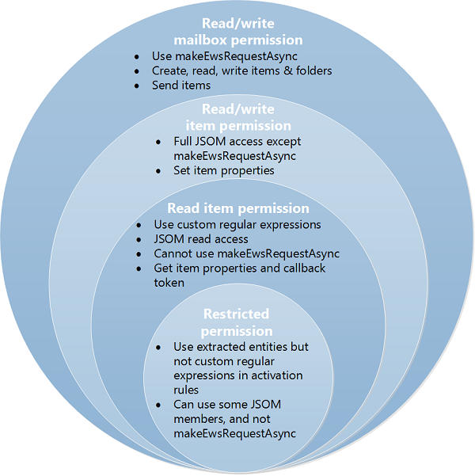

# Privacy, permissions, and security for Outlook add-ins
End users, developers, and administrators can use the tiered permission levels of the security model for Outlook add-ins to control privacy and performance.


This article describes the possible permissions that Outlook add-ins can request, and examines the security model from the following perspectives:

- Office Store - add-in integrity.
    
- End-users - privacy and performance concerns.
    
- Developers - permissions choices and resource usage limits.
    
- Administrators - privileges to set performance thresholds.
    

## Permissions model


Because customers' perception of add-in security can affect add-in adoption, Outlook add-in security relies on a tiered permissions model. An Outlook add-in would disclose the level of permissions it needs, identifying the possible access and actions that the add-in can make on the customer's mailbox data. 

Manifest schema version 1.1 includes four levels of permissions. 


**Table 1. Add-in permission levels**


|**Permission level**|**Value in Outlook add-in manifest**|
|:-----|:-----|
|Restricted|Restricted|
|Read item|ReadItem|
|Read/write item|ReadWriteItem|
|Read/write mailbox|ReadWriteMailbox|
The four levels of permissions are cumulative: the  **read/write mailbox** permission includes the permissions of **read/write item**,  **read item** and **restricted**,  **read/write item** includes **read item** and **restricted**, and the  **read item** permission includes **restricted**. Figure 1 shows the four levels of permissions and describes the capabilities offered to the end user, developer, and administrator by each tier. For more information about these permissions, see [End users: privacy and performance concerns](#olowa15conagave_privacy), [Developers: permission choices and resource usage limits](#olowa15conagave_choices), and [Understanding Outlook add-in permissions](../outlook/understanding-outlook-add-in-permissions.md). 


**Figure 1. Relating the four-tier permission model to the end user, developer, and administrator**




## Office Store: add-in integrity


The Office Store hosts add-ins that can be installed by end users and administrators. The Office Store enforces the following measures to maintain the integrity of these Outlook add-ins:


- Requires the host server of an add-in to always use Secure Socket Layer (SSL) to communicate.
    
- Requires a developer to provide proof of identity, a contractual agreement, and a compliant privacy policy to submit add-ins. 
    
- Archives add-ins in read-only mode.
    
- Supports a user-review system for available add-ins to promote a self-policing community.
    

## End users: privacy and performance concerns


The security model addresses security, privacy, and performance concerns of end users in the following ways:


- End user's messages that are protected by Outlook's Information Rights Management (IRM) do not interact with Outlook add-ins.
    
- Before installing an add-in from the Office Store, end users can see the access and actions that the add-in can make on their data and must explicitly confirm to proceed. No Outlook add-in is automatically pushed onto a client computer without manual validation by the user or administrator.
    
- Granting the  **restricted** permission allows the Outlook add-in to have limited access on only the current item. Granting the **read item** permission allows the Outlook add-in to access personal identifiable information, such as sender and recipient names and email addresses, on only the current item,.
    
- An end user can install an Outlook add-in for only himself or herself. Outlook add-ins that affect an organization are installed by an administrator.
    
- End users can install Outlook add-ins that enable context-sensitive scenarios that are compelling to users while minimizing the users' security risks.
    
- Manifest files of installed Outlook add-ins are secured in the user's email account.
    
- Data communicated with servers hosting Office Add-ins is always encrypted according to the Secure Socket Layer (SSL) protocol.
    
- Applicable to only the Outlook rich clients: The Outlook rich clients monitor the performance of installed Outlook add-ins, exercise governance control, and disable those Outlook add-ins that exceed limits in the following areas:
    
      - Response time to activate
    
  - Number of failures to activate or reactivate
    
  - Memory usage
    
  - CPU usage
    

    Governance deters denial-of-service attacks and maintains add-in performance at a reasonable level. The Business Bar alerts end users about Outlook add-ins that the Outlook rich client has disabled based on such governance control.
    
- At any time, end users can verify the permissions requested by installed Outlook add-ins, and disable or subsequently enable any Outlook add-in in the Exchange Admin Center.
    

## Developers: permission choices and resource usage limits


The security model provides developers granular levels of permissions to choose from, and strict performance guidelines to observe.


### Tiered permissions increases transparency

Developers should follow the tiered permissions model to provide transparency and alleviate users' concern about what add-ins can do to their data and mailbox, indirectly promoting add-in adoption:


- Developers request an appropriate level of permission for an Outlook add-in, based on how the Outlook add-in should be activated, and its need to read or write certain properties of an item, or to create and send an item.
    
- Developers request permission by using the [Permissions](http://msdn.microsoft.com/en-us/library/c20cdf29-74b0-564c-e178-b75d148b36d1%28Office.15%29.aspx) element in the manifest of the Outlook add-in, by assigning a value of **Restricted**,  **ReadItem**,  **ReadWriteItem** or **ReadWriteMailbox**, as appropriate. 
    
     >**Note**  Note that the  **ReadWriteItem** permission is available starting in manifest schema v1.1.

    The following example requests the  **read item** permission.
    


```XML
  <Permissions>ReadItem</Permissions>
```

- Developers can request the  **restricted** permission if the Outlook add-in activates on a specific type of Outlook items (appointment or message), or on specific extracted entities (phone number, address, URL) being present in the item's subject or body. For example, the following rule activates the Outlook add-in if one or more of three entities - phone number, postal address, or URL - are found in the subject or body of the current message.
    
```XML
  <Permissions>Restricted</Permissions>
    <Rule xsi:type="RuleCollection" Mode="And">
    <Rule xsi:type="ItemIs" FormType="Read" ItemType="Message" />
    <Rule xsi:type="RuleCollection" Mode="Or">
        <Rule xsi:type="ItemHasKnownEntity" EntityType="PhoneNumber" />
        <Rule xsi:type="ItemHasKnownEntity" EntityType="Address" />
        <Rule xsi:type="ItemHasKnownEntity" EntityType="Url" />
    </Rule>
</Rule>
```

- Developers should request the  **read item** permission if the Outlook add-in needs to read properties of the current item other than the default extracted entities, or write custom properties set by the add-in on the current item, but does not require reading or writing to other items, or creating or sending a message in the user's mailbox. For example, a developer should request **read item** permission if an Outlook add-in needs to look for an entity like a meeting suggestion, task suggestion, email address, or contact name in the item's subject or body, or uses a regular expression to activate.
    
- Developers should request the  **read/write item** permission if the Outlook add-in needs to write to properties of the composed item, such as recipient names, email addresses, body, and subject, or needs to add or remove item attachments.
    
- Developers request the  **read/write mailbox** permission only if the Outlook add-in needs to do one or more of the following actions by using the [mailbox.makeEWSRequestAsync](../../reference/outlook/Office.context.mailbox.md) method:
    
      - Read or write to properties of items in the mailbox.
    
  - Create, read, write, or send items in the mailbox.
    
  - Create, read, or write to folders in the mailbox.
    

### Resource usage tuning

Developers should be aware of resource usage limits for activation, incorporate performance tuning in their development workflow, so as to reduce the chance of a poorly performing add-in denying service of the host. Developers should follow the guidelines in designing activation rules as described in [Limits for activation and JavaScript API for Outlook add-ins](../outlook/limits-for-activation-and-javascript-api-for-outlook-add-ins.md). If an Outlook add-in is intended to run on an Outlook rich client, then developers should verify that the add-in performs within the resource usage limits.


### Other measures to promote user security

Developers should be aware of and plan for the following as well:


- Developers cannot use ActiveX controls in add-ins because they are not supported.
    
- Developers should do the following when submitting a Outlook add-in to the Office Store:
    
      - Produce an Extended Validation (EV) SSL certificate as a proof of identity.
    
  - Host the add-in they are submitting on a web server that supports SSL.
    
  - Produce a compliant privacy policy.
    
  - Be ready to sign a contractual agreement upon submitting the add-in.
    

## Administrators: privileges


The security model provides the following rights and responsibilities to administrators:


- Can prevent end users from installing any Outlook add-in, including add-ins on the Office Store.
    
- Can disable or enable any Outlook add-in on the Exchange Admin Center.
    
- Applicable to only Outlook for Windows: Can override performance threshold settings by GPO registry settings.
    


## Additional resources


- [Outlook add-ins](../outlook/outlook-add-ins.md)
    
- [Privacy and security for Office Add-ins](../../docs/develop/privacy-and-security.md)
    
- [Outlook add-in APIs](../outlook/apis.md)
    
- [Requesting permissions for API use in content and task pane add-ins](../../docs/develop/requesting-permissions-for-api-use-in-content-and-task-pane-add-ins.md)
    
- [Limits for activation and JavaScript API for Outlook add-ins](../outlook/limits-for-activation-and-javascript-api-for-outlook-add-ins.md)
    
