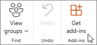
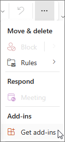
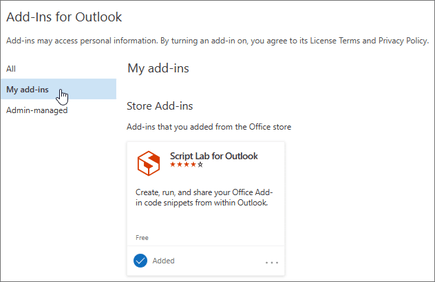
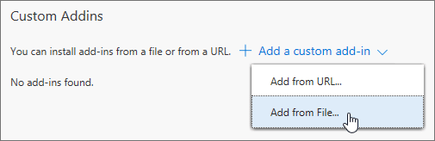
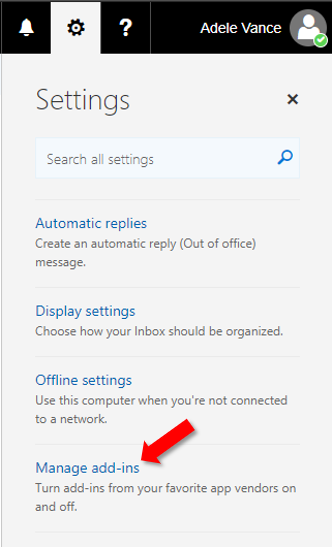
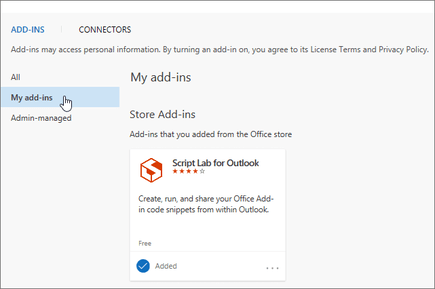
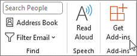
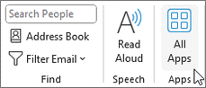
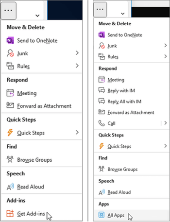
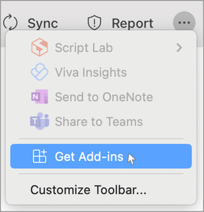

# Sideload Outlook add-ins for testing

Sideload your Outlook add-in for testing without having to first put it in an add-in catalog.

> [!IMPORTANT]
> If your Outlook add-in supports mobile, sideload the manifest using the instructions in this article for your Outlook client on the web, Windows, or Mac, then follow the guidance in the **Testing your add-ins on mobile** section of the [Add-ins for Outlook Mobile](outlook-mobile-addins.md#testing-your-add-ins-on-mobile) article.

## Sideload automatically

If you created your Outlook add-in using the [Yeoman generator for Office Add-ins](../develop/yeoman-generator-overview.md), sideloading is best done through the command line on Windows. This will take advantage of our tooling and sideload across all of your supported devices in one command.

1. On Windows, open a command prompt and navigate to the root directory of your Yeoman generated add-in project. Run the command `npm start`.

1. Your Outlook add-in will automatically sideload to Outlook on your desktop computer. You'll see a dialog appear, stating there is an attempt to sideload the add-in, listing the name and the location of the manifest file. Select **OK**, which will register the manifest.

    > [!IMPORTANT]
    > If the manifest contains an error or the path to the manifest is invalid, you'll receive an error message.

1. If your manifest contains no errors and the path is valid, your add-in will now be sideloaded and available on both your desktop and in Outlook on the web. It will also be installed across all your supported devices.

## Sideload manually

Though we strongly recommend sideloading automatically through the command line as covered in the previous section, you can also manually sideload an Outlook add-in based on the Outlook client.

### Outlook on the web

The process for sideloading an add-in in Outlook on the web depends upon whether you are using the new or classic version.

- If your mailbox toolbar looks like the following image, see [Sideload an add-in in the new Outlook on the web](#new-outlook-on-the-web).

    

- If your mailbox toolbar looks like the following image, see [Sideload an add-in in classic Outlook on the web](#classic-outlook-on-the-web).

    

> [!NOTE]
> If your organization has included its logo in the mailbox toolbar, you might see something slightly different than shown in the preceding images.

#### New Outlook on the web

1. Go to [Outlook on the web](https://outlook.office.com).

1. Select **Get add-ins** from the ribbon.

    

    > [!IMPORTANT]
    > If you don't see **Get add-ins** in the ribbon, you may have the simplified ribbon layout enabled. To manage your add-ins, select the ellipsis button (`...`) from the ribbon. Then, select **Get Add-ins**.
    >
    > 

1. In the **Add-Ins for Outlook** dialog box, select **My add-ins**.

    

1. Locate the **Custom add-ins** section at the bottom of the dialog box. Select the **Add a custom add-in** link, and then select **Add from File**.

    

1. Locate the manifest file for your custom add-in and install it. Accept all prompts during the installation.

#### Classic Outlook on the web

1. Go to [Outlook on the web](https://outlook.office.com).

1. Choose the gear icon in the top-right section of the toolbar and select **Manage add-ins**.

    

1. On the **Manage add-ins** page, select **Add-Ins**, and then select **My add-ins**.

    

1. Locate the **Custom add-ins** section at the bottom of the dialog box. Select the **Add a custom add-in** link, and then select **Add from File**.

    

1. Locate the manifest file for your custom add-in and install it. Accept all prompts during the installation.

### Outlook on the desktop

#### Outlook 2016 or later on Windows or Mac

1. Open Outlook 2016 or later on Windows or Mac.

1. Depending on your Outlook client and version, select **Get Add-ins** or **All Apps** from the ribbon.

    > [!NOTE]
    > Starting in Outlook on Windows Version 2302 (Build 16215.10000), the **All Apps** button is used to manage your add-ins and access AppSource.

    # [Windows](#tab/windows)

    

    

    # [Mac](#tab/mac)

    

    ---

    > [!IMPORTANT]
    > If you don't see **Get Add-ins** or **All Apps** in your version of Outlook, do one of the following:
    >
    > # [Windows](#tab/windows)
    >
    > - If you configured your ribbon layout to Simplified Ribbon, select the ellipsis button (`...`) from the ribbon. Then, depending on your Outlook version, select **Get Add-ins** or **All Apps**.
    >
    >   
    >
    > - Select **Store** from the ribbon, if available.
    >
    > - Select the **File** menu, then select **Manage Add-ins** from the **Info** tab to open the **Add-ins** dialog in Outlook on the web. To learn more about the web experience, see [Sideload an add-in in Outlook on the web](../outlook/sideload-outlook-add-ins-for-testing.md#outlook-on-the-web).
    >
    > # [Mac](#tab/mac)
    >
    > - Select the ellipsis button (`...`) from the ribbon, then select **Get Add-ins**.
    >
    >   
    >
    > - Select **Store** from the ribbon, if available.
    >
    > ---

1. If there are tabs near the top of the dialog, ensure that the **Add-ins** tab is selected. Then, choose **My add-ins**.

    

1. Locate the **Custom add-ins** section at the bottom of the dialog. Select the **Add a custom add-in** link, and then select **Add from File**.

    

1. Locate the manifest file for your custom add-in and install it. Accept all prompts during the installation.

#### Outlook 2013 on Windows

1. Open Outlook 2013 on Windows.

1. Select the **File** menu, then select **Manage Add-ins** from the **Info** tab. Outlook will open the web version in a browser.

1. Follow the steps in the [Sideload an add-in in Outlook on the web](#outlook-on-the-web) section according to your version of Outlook on the web.

## Remove a sideloaded add-in

On all versions of Outlook, the key to removing a sideloaded add-in is the **My Add-ins** dialog which lists your installed add-ins. Choose the ellipsis (`...`) for the add-in then select **Remove**.

To navigate to the **My Add-ins** dialog box for your Outlook client, use the last steps listed for [manual sideloading](#sideload-manually) in the previous sections of this article.

To remove a sideloaded add-in from Outlook, use the steps previously described in this article to find the add-in in the **Custom add-ins** section of the dialog box that lists your installed add-ins. Choose the ellipsis (`...`) for the add-in then choose **Remove** to remove that specific add-in. Close the dialog.

## See also

- [Add-ins for Outlook Mobile](outlook-mobile-addins.md)
