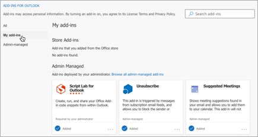
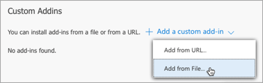

# Sideload Outlook add-ins for testing

Sideload your Outlook add-in for testing without having to first put it in an add-in catalog.

> [!IMPORTANT]
> If your Outlook add-in supports mobile, sideload the manifest using the instructions in this article for your Outlook client on the web, on Windows, or on Mac, then follow the guidance in [Testing your add-ins on mobile](outlook-mobile-addins.md#testing-your-add-ins-on-mobile).

## Sideload automatically

If you created your Outlook add-in using the [Yeoman generator for Office Add-ins](../develop/yeoman-generator-overview.md), sideloading is best done through the command line. This takes advantage of our tooling and allows you to sideload across all of your supported devices in one command.

1. Open a command prompt and navigate to the root directory of your Yeoman generated add-in project. Run the command `npm start`.

1. Your Outlook add-in will automatically sideload to Outlook on your desktop computer. You'll see a dialog appear, stating there is an attempt to sideload the add-in, listing the name and the location of the manifest file. Select **OK**, which will register the manifest.

    > [!IMPORTANT]
    > If the manifest contains an error or the path to the manifest is invalid, you'll receive an error message.

1. If your manifest contains no errors and the path is valid, your add-in will now be sideloaded and available on both your desktop and in Outlook on the web. It will also be installed across all your supported devices.

## Sideload manually

Though we strongly recommend sideloading automatically through the command line as covered in the previous section, you can also manually sideload an Outlook add-in based on the Outlook client. Select the tab for your preferred Outlook client.

# [Windows (classic and new) and Web](#tab/windows-web)

Add-ins are manually sideloaded through the **Add-Ins for Outlook** dialog. To sideload an add-in in Outlook on Windows, on the web, and on [new Outlook on Windows (preview)](https://support.microsoft.com/office/656bb8d9-5a60-49b2-a98b-ba7822bc7627), perform the following steps.

1. In your preferred browser, go to <https://aka.ms/olksideload>. Outlook on the web opens, then the **Add-Ins for Outlook** dialog appears after a few seconds.

    > [!TIP]
    >
    > - If your mailbox toolbar looks like the following image, you're using the classic version of Outlook on the web.
    >
    >   
    >
    >   To access the **Add-Ins for Outlook** dialog, open [Outlook on the web](https://outlook.office365.com). Then, select the gear icon from the top-right section of the toolbar and choose **Manage add-ins**.
    >
    >   
    >
    >   Note that your organization may include its own logo in the mailbox toolbar, so you might see something slightly different than shown in the preceding images.
    >
    > - In Outlook on Windows, you can also access the **Add-Ins for Outlook** dialog by selecting **File** > **Info** > **Manage Add-ins**. This opens Outlook on the web in your preferred browser, then loads the dialog.

1. In the **Add-Ins for Outlook** dialog box, select **My add-ins**.

    

1. Locate the **Custom add-ins** section at the bottom of the dialog box. Select the **Add a custom add-in** link, and then select **Add from File**.

    

    [!INCLUDE [outlook-sideloading-url](../includes/outlook-sideloading-url.md)]

1. Locate the manifest file for your custom add-in and install it. Accept all prompts during the installation.

    > [!NOTE]
    > In Outlook on Windows, it may take up to 24 hours for your manually sideloaded add-in to appear in the client. This is due to caching.

# [Mac](#tab/mac)

1. Open Outlook on Mac.

1. Select **Get Add-ins** from the ribbon.

    

    > [!TIP]
    > If you don't see **Get Add-ins** in your version of Outlook, select the ellipsis button (`...`) from the ribbon, then select **Get Add-ins**.
    >
    > 

1. In the dialog that appears, select **My add-ins**.

    

1. Locate the **Custom add-ins** section at the bottom of the dialog. Select the **Add a custom add-in** link, and then select **Add from File**.

    

    [!INCLUDE [outlook-sideloading-url](../includes/outlook-sideloading-url.md)]

1. Locate the manifest file for your custom add-in and install it. Accept all prompts during the installation.

---

## Locate a sideloaded add-in

To learn how to access a sideloaded add-in in your Outlook client, see [Use an Office Add-in in Outlook](https://support.microsoft.com/office/1ee261f9-49bf-4ba6-b3e2-2ba7bcab64c8).

## Remove a sideloaded add-in

On all versions of Outlook, the key to removing a sideloaded add-in is the **Add-Ins for Outlook** dialog, which lists your installed add-ins. To access the dialog on your Outlook client, use the steps listed for [manual sideloading](#sideload-manually) in the previous section of this article.

To remove a sideloaded add-in from Outlook, in the **Add-Ins for Outlook** dialog, navigate to the **Custom add-ins** section. Choose the ellipsis (`...`) for the add-in, then choose **Remove**.

## See also

- [Add-ins for Outlook on mobile devices](outlook-mobile-addins.md)
