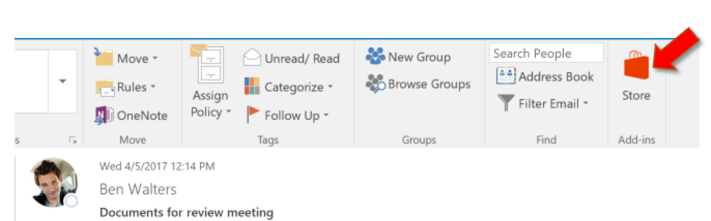

# Sideload Outlook add-ins for testing

You can use sideloading to install an Outlook add-in for testing without having to first put it in an add-in catalog.

## Sideload an add-in in Outlook in Office 365

1. Go to [Outlook in Office 365](https://outlook.office.com).

1. Choose the gear icon in the top-right section and select **Manage add-ins**.

    

1. On the **Manage add-ins** page, select **Add-Ins**, and then select **My add-ins**.

    

1. Locate the **Custom add-ins** section at the bottom of the dialog. Select the **Add a custom add-in** link, and then select **Add from file**.

    

1. Locate the manifest file for your custom add-in and install it. Accept all prompts during the installation.

## Sideload an add-in in Outlook on the desktop

1. Open Outlook 2016, Outlook 2013, or Outlook 2016 for Mac.

1. Select the **Store** button on the ribbon.

    

1. On the **Store** page, select **Add-Ins**, and then select **My add-ins**.

    

1. Locate the **Custom add-ins** section at the bottom of the dialog. Select the **Add a custom add-in** link, and then select **Add from file**.

    

1. Locate the manifest file for your custom add-in and install it. Accept all prompts during the installation.
