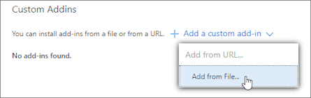
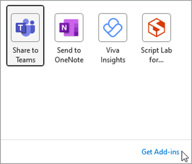
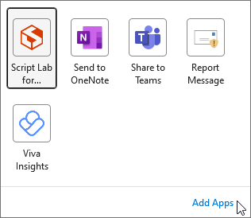
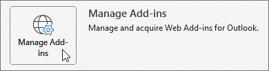

# Sideload Outlook add-ins for testing

Sideload your Outlook add-in for testing without having to first put it in an add-in catalog.

> [!IMPORTANT]
> If your Outlook add-in supports mobile, sideload the manifest using the instructions in this article for your Outlook client on the web, on Windows, or on Mac, then follow the guidance in [Testing your add-ins on mobile](outlook-mobile-addins.md#testing-your-add-ins-on-mobile).

## Sideload automatically

If you created your Outlook add-in using the [Yeoman generator for Office Add-ins](../develop/yeoman-generator-overview.md), sideloading is best done through the command line on Windows. This takes advantage of our tooling and allows you to sideload across all of your supported devices in one command.

1. On Windows, open a command prompt and navigate to the root directory of your Yeoman generated add-in project. Run the command `npm start`.

1. Your Outlook add-in will automatically sideload to Outlook on your desktop computer. You'll see a dialog appear, stating there is an attempt to sideload the add-in, listing the name and the location of the manifest file. Select **OK**, which will register the manifest.

    > [!IMPORTANT]
    > If the manifest contains an error or the path to the manifest is invalid, you'll receive an error message.

1. If your manifest contains no errors and the path is valid, your add-in will now be sideloaded and available on both your desktop and in Outlook on the web. It will also be installed across all your supported devices.

## Sideload manually

Though we strongly recommend sideloading automatically through the command line as covered in the previous section, you can also manually sideload an Outlook add-in based on the Outlook client. Select the tab for your preferred Outlook client.

# [Web](#tab/web)

The process for sideloading an add-in in Outlook on the web depends on whether you're using the new or classic version.

- If your mailbox toolbar looks like the following image, see [Sideload an add-in in the new Outlook on the web](#new-outlook-on-the-web).

    

- If your mailbox toolbar looks like the following image, see [Sideload an add-in in classic Outlook on the web](#classic-outlook-on-the-web).

    

> [!NOTE]
> If your organization has included its logo in the mailbox toolbar, you might see something slightly different than shown in the preceding images.

### New Outlook on the web

1. Go to [Outlook on the web](https://outlook.office365.com).

1. Select **Get add-ins** from the ribbon.

    

    > [!IMPORTANT]
    > If you don't see **Get add-ins** on the ribbon, you may have the simplified ribbon layout enabled. To manage your add-ins, select the ellipsis button (`...`) from the ribbon. Then, select **Get Add-ins**.
    >
    > 

1. In the **Add-Ins for Outlook** dialog box, select **My add-ins**.

    

1. Locate the **Custom add-ins** section at the bottom of the dialog box. Select the **Add a custom add-in** link, and then select **Add from File**.

    

1. Locate the manifest file for your custom add-in and install it. Accept all prompts during the installation.

### Classic Outlook on the web

1. Go to [Outlook on the web](https://outlook.office365.com).

1. Choose the gear icon in the top-right section of the toolbar and select **Manage add-ins**.

    

1. On the **Manage add-ins** page, select **Add-Ins**, and then select **My add-ins**.

    

1. Locate the **Custom add-ins** section at the bottom of the dialog box. Select the **Add a custom add-in** link, and then select **Add from File**.

    

1. Locate the manifest file for your custom add-in and install it. Accept all prompts during the installation.

# [Windows](#tab/windows)

### Outlook 2016 or later

1. Open Outlook 2016 or later on Windows.

1. Depending on your Outlook version, select **Get Add-ins** or **All Apps** from the ribbon.

    > [!NOTE]
    > Starting in Outlook on Windows Version 2302 (Build 16215.10000), the **All Apps** button is used to manage your add-ins and access AppSource.

    

    

    > [!IMPORTANT]
    > If you don't see **Get Add-ins** or **All Apps** in your version of Outlook, do one of the following:
    >
    > - If you configured your ribbon layout to Simplified Ribbon, select the ellipsis button (`...`) from the ribbon. Then, depending on your Outlook version, select **Get Add-ins** or **All Apps**.
    >
    >   
    >
    > - Select **Store** from the ribbon, if available.
    >
    > - Select **File** > **Info** > **Manage Add-ins**. This opens the **Add-Ins for Outlook** dialog in Outlook on the web. To learn more about the web experience, select the **Web** tab in [Sideload manually](#sideload-manually).

1. In the flyout that appears, select **Get Add-ins**.

    

    > [!IMPORTANT]
    > If you see the **Add Apps** option instead of **Get Add-ins** in your version of Outlook, you must manually sideload your add-in through Outlook on the web.
    >
    > 
    >
    > To access the **Add-Ins for Outlook** dialog in Outlook on the web, do one of the following:
    >
    > - In Outlook on Windows, select **File** > **Info** > **Manage Add-ins**.
    >
    > - Open the [Add-Ins for Outlook](https://outlook.office365.com/owa/?path=/options/manageapps) dialog.
    >
    > Outlook on the web opens in your preferred browser. When the **Add-Ins for Outlook** dialog appears, follow the succeeding steps to sideload your add-in.

1. If there are tabs near the top of the dialog that opens, ensure that the **Add-ins** tab is selected. Then, choose **My add-ins**.

    

1. Locate the **Custom add-ins** section at the bottom of the dialog. Select the **Add a custom add-in** link, and then select **Add from File**.

    

1. Locate the manifest file for your custom add-in and install it. Accept all prompts during the installation.

### Outlook 2013

1. Open Outlook 2013 on Windows.

1. Select **File** > **Info** > **Manage Add-ins**. Outlook will open the web version in a browser.

    

1. Depending on your version of Outlook on the web, follow the steps in the **Web** tab of [Sideload manually](#sideload-manually).

# [Mac](#tab/mac)

1. Open Outlook on Mac.

1. Select **Get Add-ins** from the ribbon.

    

    > [!IMPORTANT]
    > If you don't see **Get Add-ins** in your version of Outlook, do one of the following:
    >
    > - Select the ellipsis button (`...`) from the ribbon, then select **Get Add-ins**.
    >
    >   
    >
    > - Select **Store** from the ribbon, if available.

1. In the dialog that appears, select **My add-ins**.

    

1. Locate the **Custom add-ins** section at the bottom of the dialog. Select the **Add a custom add-in** link, and then select **Add from File**.

    

1. Locate the manifest file for your custom add-in and install it. Accept all prompts during the installation.

---

## Remove a sideloaded add-in

On all versions of Outlook, the key to removing a sideloaded add-in is the **Add-Ins for Outlook** dialog, which lists your installed add-ins. To access the dialog on your Outlook client, use the steps listed for [manual sideloading](#sideload-manually) in the previous section of this article.

To remove a sideloaded add-in from Outlook, in the **Add-Ins for Outlook** dialog, navigate to the **Custom add-ins** section. Choose the ellipsis (`...`) for the add-in, then choose **Remove**.

## See also

- [Add-ins for Outlook on mobile devices](outlook-mobile-addins.md)
