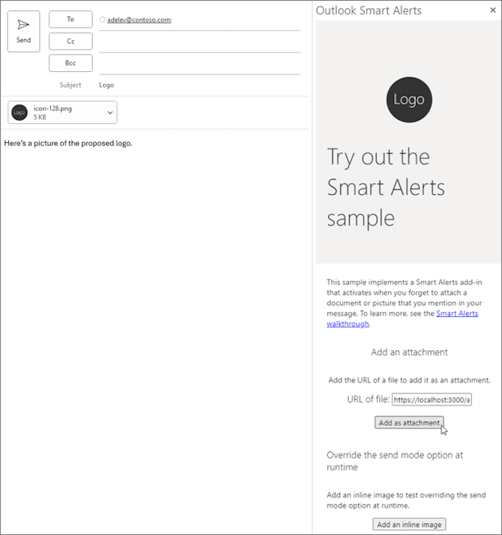

# Automatically check for an attachment before a message is sent

Never miss attaching an important document or photo to your message ever again. With an event-based add-in, your messages are automatically checked for attachments before they're sent, so that you can feel assured that you're always sending a complete version.

The following sections walk you through how to develop an event-based add-in that implements [Smart Alerts](onmessagesend-onappointmentsend-events.md) to handle the `OnMessageSend` event. By the end of this walkthrough, your add-in will automatically check for an attached document or picture mentioned in the message and alert you if it's missing before the message is sent.

> [!NOTE]
> The `OnMessageSend` and `OnAppointmentSend` events were introduced in [requirement set 1.12](/javascript/api/requirement-sets/outlook/requirement-set-1.12/outlook-requirement-set-1.12). Additional functionality and customization options were also added to subsequent requirement sets. To verify that your Outlook client supports these events and features, see [Supported clients and platforms](onmessagesend-onappointmentsend-events.md#supported-clients-and-platforms) and the specific sections that describe the features you want to implement.

## Set up your environment

Before you start the walkthrough, verify that your Outlook client supports the Smart Alerts feature. For guidance, see [Supported clients and platforms](onmessagesend-onappointmentsend-events.md#supported-clients-and-platforms).

Then, complete the [Outlook quick start](../quickstarts/outlook-quickstart-yo.md), which creates an add-in project with the [Yeoman generator for Office Add-ins](../develop/yeoman-generator-overview.md).

## Configure the manifest

To configure the manifest, select the tab for the type of manifest you are using.

# [Unified manifest for Microsoft 365](#tab/jsonmanifest)

[!INCLUDE [outlook-unified-manifest-mac](../includes/outlook-unified-manifest-mac.md)]

1. Open the **manifest.json** file.

1. Add the following object to the [`"extensions.runtimes"`](/microsoft-365/extensibility/schema/extension-runtimes-array?view=m365-app-prev&preserve-view=true) array. Note the following about this markup:

   - Although the `OnMessageSend` event was introduced in requirement set 1.12, the `"minVersion"` is set to `"1.15"`. This supports the use of Smart Alerts enhancements that were introduced in later requirement sets.
   - The `"id"` of the runtime is set to the descriptive name `"autorun_runtime"`.
   - The `"code"` property has a child `"page"` property that is set to an HTML file and a child `"script"` property that is set to a JavaScript file. You'll create or edit these files in later steps. Office uses one of these values or the other depending on the platform.
       - Classic Outlook on Windows executes the event handler in a JavaScript-only runtime, which loads a JavaScript file directly.
       - Outlook on the web, on Mac, and on [new Outlook on Windows](https://support.microsoft.com/office/656bb8d9-5a60-49b2-a98b-ba7822bc7627) execute the handler in a browser runtime, which loads an HTML file. That file, in turn, contains a `<script>` tag that loads the JavaScript file.
     For more information, see [Runtimes in Office Add-ins](../testing/runtimes.md).
   - The `"lifetime"` property is set to `"short"`, which means that the runtime starts up when the event is triggered and shuts down when the handler completes. (In certain rare cases, the runtime shuts down before the handler completes. See [Runtimes in Office Add-ins](../testing/runtimes.md).)
   - There is an action to run a handler for the `OnMessageSend` event. You'll create the handler function in a later step.

    ```json
     {
        "requirements": {
            "capabilities": [
                {
                    "name": "Mailbox",
                    "minVersion": "1.15"
                }
            ]
        },
        "id": "autorun_runtime",
        "type": "general",
        "code": {
            "page": "https://localhost:3000/commands.html",
            "script": "https://localhost:3000/launchevent.js"
        },
        "lifetime": "short",
        "actions": [
            {
                "id": "onMessageSendHandler",
                "type": "executeFunction"
            }
        ]
    }
    ```

1. Add the following [`"autoRunEvents"`](/microsoft-365/extensibility/schema/element-extensions#autorunevents) array as a property of the object in the [`"extensions"`](/microsoft-365/extensibility/schema/root#extensions) array.

    ```json
    "autoRunEvents": [
    
    ]
    ```

1. Add the following object to the `"autoRunEvents"` array. Note the following about this code:

   - The event object assigns a handler function to the `OnMessageSend` event (using the event's unified manifest name, `"messageSending"`, as described in the [supported events table](../develop/event-based-activation.md#supported-events)). The function name provided in `"actionId"` must match the name used in the `"id"` property of the object in the [`"actions"`](/microsoft-365/extensibility/schema/extension-runtimes-actions-item) array in an earlier step.
   - The `"sendMode"` option is set to `"softBlock"`. This means that if the message doesn't meet the conditions that the add-in sets for sending, the user must take action before they can send the message. However, if the add-in is unavailable at the time of sending, the item will be sent.

    ```json
      {
          "requirements": {
              "capabilities": [
                  {
                      "name": "Mailbox",
                      "minVersion": "1.15"
                  }
              ],
              "scopes": [
                  "mail"
              ]
          },
          "events": [
            {
                "type": "messageSending",
                "actionId": "onMessageSendHandler",
                "options": {
                    "sendMode": "softBlock"
                }
            }
          ]
      }
    ```

# [Add-in only manifest](#tab/xmlmanifest)

1. In your code editor, open the quick start project.

1. Open the **manifest.xml** file located at the root of your project.

1. Select the entire `<VersionOverrides>` node (including open and close tags) and replace it with the following XML.

    ```XML
    <VersionOverrides xmlns="http://schemas.microsoft.com/office/mailappversionoverrides" xsi:type="VersionOverridesV1_0">
      <VersionOverrides xmlns="http://schemas.microsoft.com/office/mailappversionoverrides/1.1" xsi:type="VersionOverridesV1_1">
        <Requirements>
          <bt:Sets DefaultMinVersion="1.15">
            <bt:Set Name="Mailbox" />
          </bt:Sets>
        </Requirements>
        <Hosts>
          <Host xsi:type="MailHost">
            <!-- Event-based activation happens in a lightweight runtime.-->
            <Runtimes>
              <!-- HTML file including reference to or inline JavaScript event handlers.
                   This is used by Outlook on the web and on Mac, and new Outlook on Windows. -->
              <Runtime resid="WebViewRuntime.Url">
                <!-- JavaScript file containing event handlers. This is used by classic Outlook on Windows. -->
                <Override type="javascript" resid="JSRuntime.Url"/>
              </Runtime>
            </Runtimes>
            <DesktopFormFactor>
              <!-- Configure other command surface extension points for add-in command support, if needed. -->
              <FunctionFile resid="Commands.Url" />
              <ExtensionPoint xsi:type="MessageComposeCommandSurface">
                <OfficeTab id="TabDefault">
                  <Group id="msgComposeGroup">
                    <Label resid="GroupLabel" />
                    <Control xsi:type="Button" id="msgComposeOpenPaneButton">
                      <Label resid="TaskpaneButton.Label" />
                      <Supertip>
                        <Title resid="TaskpaneButton.Label" />
                        <Description resid="TaskpaneButton.Tooltip" />
                      </Supertip>
                      <Icon>
                        <bt:Image size="16" resid="Icon.16x16" />
                        <bt:Image size="32" resid="Icon.32x32" />
                        <bt:Image size="80" resid="Icon.80x80" />
                      </Icon>
                      <Action xsi:type="ShowTaskpane">
                        <SourceLocation resid="Taskpane.Url" />
                      </Action>
                    </Control>
                    <Control xsi:type="Button" id="ActionButton">
                      <Label resid="ActionButton.Label"/>
                      <Supertip>
                        <Title resid="ActionButton.Label"/>
                        <Description resid="ActionButton.Tooltip"/>
                      </Supertip>
                      <Icon>
                        <bt:Image size="16" resid="Icon.16x16"/>
                        <bt:Image size="32" resid="Icon.32x32"/>
                        <bt:Image size="80" resid="Icon.80x80"/>
                      </Icon>
                      <Action xsi:type="ExecuteFunction">
                        <FunctionName>action</FunctionName>
                      </Action>
                    </Control>
                  </Group>
                </OfficeTab>
              </ExtensionPoint>
              <!-- Enable launching the add-in on the included event. -->
              <ExtensionPoint xsi:type="LaunchEvent">
                <LaunchEvents>
                  <LaunchEvent Type="OnMessageSend" FunctionName="onMessageSendHandler" SendMode="SoftBlock" />
                </LaunchEvents>
                <!-- Identify the runtime to be used (also referenced by the Runtime element). -->
                <SourceLocation resid="WebViewRuntime.Url"/>
              </ExtensionPoint>
            </DesktopFormFactor>
          </Host>
        </Hosts>
        <Resources>
          <bt:Images>
            <bt:Image id="Icon.16x16" DefaultValue="https://localhost:3000/assets/icon-16.png"/>
            <bt:Image id="Icon.32x32" DefaultValue="https://localhost:3000/assets/icon-32.png"/>
            <bt:Image id="Icon.80x80" DefaultValue="https://localhost:3000/assets/icon-80.png"/>
          </bt:Images>
          <bt:Urls>
            <bt:Url id="Commands.Url" DefaultValue="https://localhost:3000/commands.html" />
            <bt:Url id="Taskpane.Url" DefaultValue="https://localhost:3000/taskpane.html" />
            <bt:Url id="WebViewRuntime.Url" DefaultValue="https://localhost:3000/commands.html" />
            <!-- Entry needed for classic Outlook on Windows. -->
            <bt:Url id="JSRuntime.Url" DefaultValue="https://localhost:3000/launchevent.js" />
          </bt:Urls>
          <bt:ShortStrings>
            <bt:String id="GroupLabel" DefaultValue="Contoso Add-in"/>
            <bt:String id="TaskpaneButton.Label" DefaultValue="Show Taskpane"/>
            <bt:String id="ActionButton.Label" DefaultValue="Perform an action"/>
          </bt:ShortStrings>
          <bt:LongStrings>
            <bt:String id="TaskpaneButton.Tooltip" DefaultValue="Opens a pane to provide additional functionality or information."/>
            <bt:String id="ActionButton.Tooltip" DefaultValue="Perform an action when clicked."/>
          </bt:LongStrings>
        </Resources>
      </VersionOverrides>
    </VersionOverrides>
    ```

1. Save your changes.

---

> [!TIP]
>
> - For a list of send mode options available with the `OnMessageSend` and `OnAppointmentSend` events, see [Available send mode options](onmessagesend-onappointmentsend-events.md#available-send-mode-options).
> - To learn more about manifests for Outlook add-ins, see [Office Add-in manifests](../develop/add-in-manifests.md).

## Implement event handling

You have to implement handling for your selected event.

In this scenario, you'll add handling for sending a message. Your add-in will check for certain keywords in the message. If any of those keywords are found, it will then check for any attachments. If there are no attachments, your add-in will recommend to the user to add the possibly missing attachment.

1. From the same quick start project, create a new folder named **launchevent** under the **./src** directory.

1. In the **./src/launchevent** folder, create a new file named **launchevent.js**.

1. Open the file **./src/launchevent/launchevent.js** in your code editor and add the following JavaScript code.

    ```javascript
    /*
    * Copyright (c) Microsoft Corporation. All rights reserved. Licensed under the MIT license.
    * See LICENSE in the project root for license information.
    */

    function onMessageSendHandler(event) {
      Office.context.mailbox.item.body.getAsync(
        "text",
        { asyncContext: event },
        getBodyCallback
      );
    }

    function getBodyCallback(asyncResult){
      const event = asyncResult.asyncContext;
      let body = "";
      if (asyncResult.status !== Office.AsyncResultStatus.Failed && asyncResult.value !== undefined) {
        body = asyncResult.value;
      } else {
        const message = "Failed to get body text";
        console.error(message);
        event.completed({ allowEvent: false, errorMessage: message });
        return;
      }

      const matches = hasMatches(body);
      if (matches) {
        Office.context.mailbox.item.getAttachmentsAsync(
          { asyncContext: event },
          getAttachmentsCallback);
      } else {
        event.completed({ allowEvent: true });
      }
    }

    function hasMatches(body) {
      if (body == null || body == "") {
        return false;
      }

      const arrayOfTerms = ["send", "picture", "document", "attachment"];
      for (let index = 0; index < arrayOfTerms.length; index++) {
        const term = arrayOfTerms[index].trim();
        const regex = RegExp(term, 'i');
        if (regex.test(body)) {
          return true;
        }
      }

      return false;
    }

    function getAttachmentsCallback(asyncResult) {
      const event = asyncResult.asyncContext;
      if (asyncResult.value.length > 0) {
        for (let i = 0; i < asyncResult.value.length; i++) {
          if (asyncResult.value[i].isInline == false) {
            event.completed({ allowEvent: true });
            return;
          }
        }

        event.completed({
          allowEvent: false,
          errorMessage: "Looks like the body of your message includes an image or an inline file. Attach a copy to the message before sending.",
          // TIP: In addition to the formatted message, it's recommended to also set a
          // plain text message in the errorMessage property for compatibility on
          // older versions of Outlook clients.
          errorMessageMarkdown: "Looks like the body of your message includes an image or an inline file. Attach a copy to the message before sending.\n\n**Tip**: For guidance on how to attach a file, see [Attach files in Outlook](https://www.contoso.com/help/attach-files-in-outlook)."
        });
      } else {
        event.completed({
          allowEvent: false,
          errorMessage: "Looks like you're forgetting to include an attachment.",
          // TIP: In addition to the formatted message, it's recommended to also set a
          // plain text message in the errorMessage property for compatibility on
          // older versions of Outlook clients.
          errorMessageMarkdown: "Looks like you're forgetting to include an attachment.\n\n**Tip**: For guidance on how to attach a file, see [Attach files in Outlook](https://www.contoso.com/help/attach-files-in-outlook)."
        });
      }
    }

    // IMPORTANT: To ensure your add-in is supported in Outlook, remember to map the event handler name specified in the manifest to its JavaScript counterpart.
    Office.actions.associate("onMessageSendHandler", onMessageSendHandler);
    ```

> [!IMPORTANT]
>
> - In classic Outlook on Windows, imports aren't currently supported in the JavaScript file where you implement the handling for event-based activation.
> - To ensure your add-in runs as expected when an `OnMessageSend` or `OnAppointmentSend` event occurs, call `Office.actions.associate` in the JavaScript file where your handlers are implemented. This maps the event handler name specified in the manifest to its JavaScript counterpart. If this call isn't included in your JavaScript file and the send mode property of your manifest is set to **soft block** or isn't specified, your users will be blocked from sending messages or meetings. The location of the handler name in the manifest differs depending on the type of manifest your add-in uses.
>   - **Unified manifest for Microsoft 365**: The value specified in the [`"actionId"`](/microsoft-365/extensibility/schema/extension-auto-run-events-array-events#actionid) property of the applicable [`"autoRunEvents.events"`](/microsoft-365/extensibility/schema/extension-auto-run-events-array-events) object.
>   - **Add-in only manifest**: The function name specified in the applicable [LaunchEvent](/javascript/api/manifest/extensionpoint#launchevent) element.
> - In classic Outlook on Windows, when the JavaScript function specified in the manifest to handle an event runs, code in `Office.onReady()` and `Office.initialize` isn't run. We recommend adding any startup logic needed by event handlers, such as checking the user's Outlook version, to the event handlers instead.
> - The [errorMessageMarkdown](/javascript/api/outlook/office.smartalertseventcompletedoptions#outlook-office-smartalertseventcompletedoptions-errormessagemarkdown-member) property was introduced in [requirement set 1.15](/javascript/api/requirement-sets/outlook/requirement-set-1.15/outlook-requirement-set-1.15). Learn more about its [supported clients and platforms](/javascript/api/requirement-sets/outlook/outlook-api-requirement-sets#outlook-client-support).
> - The `errorMessageMarkdown` property is available for preview in Outlook on Mac starting in Version 16.103 (Build 25102433). To test the property, join the [Microsoft 365 Insider program](https://techcommunity.microsoft.com/kb/microsoft-365-insider-kb/join-the-microsoft-365-insider-program-on-macos/4401756) and select the **Beta Channel** option to access Office beta builds.

## Customize the text and functionality of a button in the dialog (optional)

> [!NOTE]
>
> Support to customize a button in the Smart Alerts dialog and program it to open a task pane was introduced in [requirement set 1.14](/javascript/api/requirement-sets/outlook/requirement-set-1.14/outlook-requirement-set-1.14). The ability to program a button to run a function was introduced in [requirement set 1.15](/javascript/api/requirement-sets/outlook/requirement-set-1.15/outlook-requirement-set-1.15). Learn more about its [supported clients and platforms](/javascript/api/requirement-sets/outlook/outlook-api-requirement-sets#outlook-client-support).

If a mail item doesn't meet the conditions of a Smart Alerts add-in, a dialog is shown to the user to alert them that additional actions may be needed before an item can be sent. To provide the user with further guidance on how to meet the conditions of your add-in, you can customize the text of a button in the dialog and program it to open a task pane or run a function.

The button you can customize depends on the Outlook client and version on which the add-in is running.

| Client | Customizable dialog button | Specifications |
| --- | --- | --- |
| **Windows (classic)**<br>[Supported Mailbox 1.14 versions](/javascript/api/requirement-sets/outlook/outlook-api-requirement-sets#version-support-for-requirement-sets-in-classic-outlook-on-windows) prior to Version 2412 (Build 18324.20000)<br><br>**Mac**<br>Version 16.100 (25072537) | **Don't Send** | The text and functionality of the **Don't Send** button can be customized. Customizable functionality includes opening a task pane or running a function.<br><br>The **Don't Send** button appears in the dialog no matter what send mode option you select. By default, selecting **Don't Send** cancels the send operation and closes the dialog.<br><br> |
| **Web browser**<br><br>**Windows (new)**<br><br>**Windows (classic)**<br>Version 2412 (Build 18324.20000) or later | **Take Action** | The text and functionality of the **Take Action** button can be customized. Customizable functionality includes opening a task pane or running a function.<br><br>The **Take Action** button only appears in the Smart Alerts dialog when you configure a task pane or function to run from the dialog. When the **Take Action** button is present, the **Don't Send** button is used to cancel the mail item being sent. The text and functionality of the **Don't Send** button can't be customized.<br><br> |

> [!NOTE]
> In classic Outlook on Windows, if you customized the text and functionality of the **Don't Send** button in your Smart Alerts add-in prior to Version 2412 (Build 18324.20000), no additional action is needed to implement the **Take Action** button in the latest supported versions. The default or customized **Take Action** button will automatically appear the next time a user receives a Smart Alerts dialog. Although no implementation changes are needed, we recommend notifying users of this updated experience.
>
> If you only customized the text of the **Don't Send** button in earlier supported versions, your custom text won't appear in the latest versions that support the **Take Action** implementation.

To modify the text of the dialog button or assign it a task pane or function, you must set additional options in the [event.completed](/javascript/api/outlook/office.mailboxevent#outlook-office-mailboxevent-completed-member(1)) method of your event handler.

- The [cancelLabel](/javascript/api/outlook/office.smartalertseventcompletedoptions#outlook-office-smartalertseventcompletedoptions-cancellabel-member) option customizes the text of the applicable button. Custom text must be a maximum of 20 characters.
- The [commandId](/javascript/api/outlook/office.smartalertseventcompletedoptions#outlook-office-smartalertseventcompletedoptions-commandid-member) option specifies the ID of the task pane or function that runs when the applicable button is selected. The value must match the task pane or function command ID in the manifest of your add-in. The markup depends on the type of manifest your add-in uses.
  - **Add-in only manifest**: The `id` attribute of the `<Control>` element representing the task pane or function command.
  - **Unified manifest for Microsoft 365**: The "id" property of the task pane or function command in the "controls" array.

  In supported Outlook clients and versions, when the `commandId` option is specified, the **Take Action** button appears in the Smart Alerts dialog.
- The [contextData](/javascript/api/outlook/office.smartalertseventcompletedoptions#outlook-office-smartalertseventcompletedoptions-contextdata-member) option specifies any JSON data you want to pass to the add-in when the applicable button is selected. If you include this option, you must also set the `commandId` option. Otherwise, the JSON data is ignored.

  > [!TIP]
  > When you configure a button in the Smart Alerts dialog to run a function, a button for the implemented add-in command is also added to the ribbon or action bar of the Outlook client. Use the `contextData` option to distinguish when a user runs the function from the Smart Alerts dialog.
  >
  > To retrieve the value of the `contextData` option, you must call [Office.context.mailbox.item.getInitializationContextAsync](/javascript/api/requirement-sets/outlook/preview-requirement-set/office.context.mailbox.item#methods) in the JavaScript implementation of your task pane or function command.

In this sample, the dialog button is modified to open a task pane.

1. Navigate to the **./src/launchevent** folder, then open **launchevent.js**.
1. Replace the **getAttachmentsCallback** function with the following code.

    ```javascript
    function getAttachmentsCallback(asyncResult) {
      const event = asyncResult.asyncContext;
      if (asyncResult.value.length > 0) {
        for (let i = 0; i < asyncResult.value.length; i++) {
          if (asyncResult.value[i].isInline == false) {
            event.completed({ allowEvent: true });
            return;
          }
        }

        event.completed({
          allowEvent: false,
          errorMessage: "Looks like the body of your message includes an image or an inline file. Attach a copy to the message before sending.",
          // TIP: In addition to the formatted message, it's recommended to also set a
          // plain text message in the errorMessage property for compatibility on
          // older versions of Outlook clients.
          errorMessageMarkdown: "Looks like the body of your message includes an image or an inline file. Attach a copy to the message before sending.\n\n**Tip**: For guidance on how to attach a file, see [Attach files in Outlook](https://www.contoso.com/help/attach-files-in-outlook).",
          cancelLabel: "Add an attachment",
          commandId: "msgComposeOpenPaneButton"
        });
      } else {
        event.completed({
          allowEvent: false,
          errorMessage: "Looks like you're forgetting to include an attachment.",
          // TIP: In addition to the formatted message, it's recommended to also set a
          // plain text message in the errorMessage property for compatibility on
          // older versions of Outlook clients.
          errorMessageMarkdown: "Looks like you're forgetting to include an attachment.\n\n**Tip**: For guidance on how to attach a file, see [Attach files in Outlook](https://www.contoso.com/help/attach-files-in-outlook).",
          cancelLabel: "Add an attachment",
          commandId: "msgComposeOpenPaneButton"
        });
      }
    }
    ```

1. Save your changes.

## Override the send mode option at runtime (optional)

> [!NOTE]
>
> Support to override the send mode option at runtime was introduced in [requirement set 1.14](/javascript/api/requirement-sets/outlook/requirement-set-1.14/outlook-requirement-set-1.14). Learn more about its [supported clients and platforms](/javascript/api/requirement-sets/outlook/outlook-api-requirement-sets#outlook-client-support).

There may be instances when you want your add-in to implement different send mode options. For example, you may want your add-in to enforce the **block** option on mail items that don't meet the information protection policies of your organization, but only have it apply the **prompt user** option to provide a recommendation if a user adds the incorrect recipient.

To override the send mode option at runtime, you must set the [sendModeOverride](/javascript/api/outlook/office.smartalertseventcompletedoptions#outlook-office-smartalertseventcompletedoptions-sendmodeoverride-member) option in the `event.completed` method of your event handler.

1. Navigate to the **./src/launchevent** folder, then open **launchevent.js**.
1. Replace the **getAttachmentsCallback** function with the following code.

    ```javascript
    function getAttachmentsCallback(asyncResult) {
      const event = asyncResult.asyncContext;
      if (asyncResult.value.length > 0) {
        for (let i = 0; i < asyncResult.value.length; i++) {
          if (asyncResult.value[i].isInline == false) {
            event.completed({ allowEvent: true });
            return;
          }
        }

        event.completed({
          allowEvent: false,
          errorMessage: "Looks like the body of your message includes an image or an inline file. Would you like to attach a copy of it to the message?",
          // TIP: In addition to the formatted message, it's recommended to also set a
          // plain text message in the errorMessage property for compatibility on
          // older versions of Outlook clients.
          errorMessageMarkdown: "Looks like the body of your message includes an image or an inline file. Would you like to attach a copy of it to the message?\n\n**Tip**: For guidance on how to attach a file, see [Attach files in Outlook](https://www.contoso.com/help/attach-files-in-outlook).",
          cancelLabel: "Attach a copy",
          commandId: "msgComposeOpenPaneButton",
          sendModeOverride: Office.MailboxEnums.SendModeOverride.PromptUser
        });
      } else {
        event.completed({
          allowEvent: false,
          errorMessage: "Looks like you're forgetting to include an attachment.",
          // TIP: In addition to the formatted message, it's recommended to also set a
          // plain text message in the errorMessage property for compatibility on
          // older versions of Outlook clients.
          errorMessageMarkdown: "Looks like you're forgetting to include an attachment.\n\n**Tip**: For guidance on how to attach a file, see [Attach files in Outlook](https://www.contoso.com/help/attach-files-in-outlook).",
          cancelLabel: "Add an attachment",
          commandId: "msgComposeOpenPaneButton"
        });
      }
    }
    ```

1. Save your changes.

## Configure the task pane (optional)

If you implemented the optional steps to customize a dialog button or override the send mode option in this walkthrough, you also need to configure the task pane.

> [!NOTE]
> In Outlook on the web, new Outlook on Windows, supported versions of classic Outlook on Windows prior to Version 2412 (Build 18324.20000), and Outlook on Mac, you can customize the text of the **Don't Send** button without implementing a task pane or function command. Although the task pane is needed in this sample, it isn't a requirement to be able to customize the button text or override the send mode option in these clients.
>
> In classic Outlook on Windows starting in Version 2412 (Build 18324.20000), you must implement a task pane or function command to customize the **Take Action** button. This is because the **Take Action** button only appears in the Smart Alerts dialog when a task pane or function command is implemented in the add-in.

1. Navigate to the **./src/taskpane** folder, then open **taskpane.html**.
1. Select the entire `<body>` node (including its open and close tags) and replace it with the following code.

    ```html
    <body class="ms-welcome ms-Fabric">
        <header class="ms-welcome__header ms-bgColor-neutralLighter">
            
            <h1 class="ms-font-su">Try out the Smart Alerts sample</h1>
        </header>
        <section id="sideload-msg" class="ms-welcome__main">
            <h2 class="ms-font-xl">Please <a href="https://learn.microsoft.com/office/dev/add-ins/testing/test-debug-office-add-ins#sideload-an-office-add-in-for-testing">sideload</a> your add-in to see app body.</h2>
        </section>
        <main id="app-body" class="ms-welcome__main" style="display: none;">
            <p>
                This sample implements a Smart Alerts add-in that activates when you forget to attach a document or picture that you mention in your message.
                To learn more, see the <a href="https://learn.microsoft.com/office/dev/add-ins/outlook/smart-alerts-onmessagesend-walkthrough">Smart Alerts walkthrough</a>.
            </p>
            <h3 class="ms-font-l">Add an attachment</h3>
            <p>Add the URL of a file to add it as an attachment.</p>
            <div class="ms-TextField">
                <label class="ms-Label ms-font-l">URL of file:</label>
                <input id="attachment-url" class="ms-TextField-field" type="text" value="https://localhost:3000/assets/icon-128.png" placeholder="">
            </div>
            <br/>
            <button class="ms-Button ms-Button--primary">
                <span id="add-attachment" class="ms-Button-label">Add as attachment</span>
            </button>
            <br/>
            <h3 class="ms-font-l">Override the send mode option at runtime</h3>
            <p>Add an inline image to test overriding the send mode option at runtime.</p>
            <button class="ms-Button ms-Button--primary">
                <span id="add-inline-image" class="ms-Button-label">Add an inline image</span>
            </button>
        </main>
    </body>
    ```

1. Save your changes.
1. In the same **./src/taskpane** folder, open **taskpane.js**.
1. Replace its contents with the following code.

    ```javascript
    /*
     * Copyright (c) Microsoft Corporation. All rights reserved. Licensed under the MIT license.
     * See LICENSE in the project root for license information.
     */

    Office.onReady((info) => {
      if (info.host === Office.HostType.Outlook) {
        document.getElementById("sideload-msg").style.display = "none";
        document.getElementById("app-body").style.display = "flex";
        document.getElementById("add-attachment").onclick = addAttachment;
        document.getElementById("add-inline-image").onclick = addInlineImage;
      }
    });

    // Adds the specified URL as an attachment to the message.
    export async function addAttachment() {
      const attachmentUrl = document.querySelector("#attachment-url").value;
      Office.context.mailbox.item.addFileAttachmentAsync(attachmentUrl, getFileName(attachmentUrl), (asyncResult) => {
        console.log("Added attachment.");
      });
    }

    // Gets the file name from a URL.
    function getFileName(url) {
      const lastIndex = url.lastIndexOf("/");
      if (lastIndex >= 0) {
        return url.substring(lastIndex + 1);
      }

      return url;
    }

    // Adds an inline image to the body of the message.
    export async function addInlineImage() {
      const mailItem = Office.context.mailbox.item;
      const base64String =
        "iVBORw0KGgoAAAANSUhEUgAAAGAAAABgCAMAAADVRocKAAAAAXNSR0IArs4c6QAAAARnQU1BAACxjwv8YQUAAAAnUExURQAAAAAAAAAAAAAAAAAAAAAAAAAAAAAAAAAAAAAAAAAAAAAAAAAAAN0S+bUAAAAMdFJOUwAQIDBAUI+fr7/P7yEupu8AAAAJcEhZcwAADsMAAA7DAcdvqGQAAAF8SURBVGhD7dfLdoMwDEVR6Cspzf9/b20QYOthS5Zn0Z2kVdY6O2WULrFYLBaLxd5ur4mDZD14b8ogWS/dtxV+dmx9ysA2QUj9TQRWv5D7HyKwuIW9n0vc8tkpHP0W4BOg3wQ8wtlvA+PC1e8Ao8Ld7wFjQtHvAiNC2e8DdqHqKwCrUPc1gE1AfRVgEXBfB+gF0lcCWoH2tYBOYPpqQCNwfT3QF9i+AegJfN8CtAWhbwJagtS3AbIg9o2AJMh9M5C+SVGBvx6zAfmT0r+Bv8JMwP4kyFPir+cswF5KL3WLv14zAFBCLf56Tw9cparFX4upgaJUtPhrOS1QlY5W+vWTXrGgBFB/b72ev3/0igUdQPppP/nfowfKUUEFcP207y/yxKmgAYQ+PywoAFOfCH3A2MdCFzD3kdADBvq10AGG+pXQBgb7pdAEhvuF0AIc/VtoAK7+JciAs38KIuDugyAC/v4hiMCE/i7IwLRBsh68N2WQjMVisVgs9i5bln8LGScNcCrONQAAAABJRU5ErkJggg==";

      // Get the current body of the message.
      mailItem.body.getAsync(Office.CoercionType.Html, (bodyResult) => {
        if (bodyResult.status === Office.AsyncResultStatus.Failed) {
          console.log(bodyResult.error.message);
          return;
        }

        // Insert the Base64-encoded image to the beginning of the body.
        const options = { isInline: true, asyncContext: bodyResult.value };
        mailItem.addFileAttachmentFromBase64Async(base64String, "sample.png", options, (attachResult) => {
          if (attachResult.status === Office.AsyncResultStatus.Failed) {
            console.log(attachResult.error.message);
            return;
          }

          let body = attachResult.asyncContext;
          body += '';
          mailItem.body.setAsync(body, { coercionType: Office.CoercionType.Html }, (setResult) => {
            if (setResult.status === Office.AsyncResultStatus.Failed) {
              console.log(setResult.error.message);
              return;
            }

            console.log("Inline image added to the body.");
          });
        });
      });
    }
    ```

1. Save your changes.

### Programmatically send the item from the task pane (optional)

> [!NOTE]
> The `sendAsync` method was introduced in [requirement set 1.15](/javascript/api/requirement-sets/outlook/requirement-set-1.15/outlook-requirement-set-1.15). Learn more about its supported clients and platforms.

To further streamline a user's experience when recommending changes to the mail items they're sending, call the [sendAsync](/javascript/api/requirement-sets/outlook/requirement-set-1.15/office.context.mailbox.item?view=outlook-js-1.15&preserve-view=true#methods) method in your task pane or function command code.

1. In **taskpane.js**, replace the `addAttachment` function with the following code.

    ```javascript
    // Adds the specified URL as an attachment to the message.
    // Then, programmatically sends the message.
    export async function addAttachment() {
      const attachmentUrl = document.querySelector("#attachment-url").value;
      Office.context.mailbox.item.addFileAttachmentAsync(attachmentUrl, getFileName(attachmentUrl), (asyncResult) => {
        console.log("Added attachment");

        // Programmatically send the item.
        Office.context.mailbox.item.sendAsync((sendResult) => {
            if (sendResult.status === Office.AsyncResultStatus.Failed) {
                console.log(`Unable to send the message: ${sendResult.error.message}`);
                return;
            }

            // Don't run additional operations here. Process them before the sendAsync call instead.
        });

        // Don't run additional operations after the sendAsync call. Process them before the sendAsync call instead.
      });
    }
    ````

    > [!TIP]
    > - Any code implemented to run when `asyncResult.status` is `Office.AsyncResultStatus.Success` or after the `sendAsync` method isn't guaranteed to be processed. This is because the item may have already been sent and the add-in has completed processing. We recommend processing other operations before calling `sendAsync`.
    > - The `sendAsync` implementation varies between a task pane and function command implementation. For guidance, see the [sendAsync](/javascript/api/requirement-sets/outlook/requirement-set-1.15/office.context.mailbox.item?view=outlook-js-1.15&preserve-view=true#methods) reference documentation.

1. Save your changes.
1. In **taskpane.html**, update the label of the `add-attachment` button.

    ```html
    <span id="add-attachment" class="ms-Button-label">Add and send</span>
    ```

    > [!TIP]
    > It's good practice to indicate to the user when your add-in programmatically sends the mail item they're composing. Depending on your implementation, you can indicate this in the label of a button or add a note to the task pane.

1. Save your changes.

## Update the commands HTML file

1. In the **./src/commands** folder, open **commands.html**.

1. Immediately before the closing **head** tag (`</head>`), add a script entry for the event-handling JavaScript code.

   ```javascript
   <script type="text/javascript" src="../launchevent/launchevent.js"></script> 
   ```

1. Save your changes.

## Update webpack config settings

1. Open the **webpack.config.js** file found in the root directory of the project and complete the following steps.

1. Locate the `plugins` array within the `config` object and add this new object to the beginning of the array.

    ```javascript
    new CopyWebpackPlugin({
      patterns: [
        {
          from: "./src/launchevent/launchevent.js",
          to: "launchevent.js",
        },
      ],
    }),
    ```

1. Save your changes.

## Try it out

1. Run the following commands in the root directory of your project. When you run `npm start`, the local web server will start (if it isn't already running) and your add-in will be sideloaded.

    ```command&nbsp;line
    npm run build
    ```

    ```command&nbsp;line
    npm start
    ```

    [!INCLUDE [outlook-manual-sideloading](../includes/outlook-manual-sideloading.md)]

1. In your preferred Outlook client, create a new message and set the subject. In the body, add some text. For example, "Here's a picture of the proposed logo."
1. Send the message. A dialog appears requesting you to add an attachment. Select **Don't Send**, **Take Action**, or **Add an attachment**. The options available to you depend on your Outlook client and whether you implemented the optional step to customize the dialog button.

    - Default **Don't Send** button.

        

    - Default **Take Action** button.

        

    - Customized **Add an attachment** button. Applies to Outlook on the web, new Outlook on Windows, and classic Outlook on Windows (starting in Version 2412 (Build 18324.20000)).

        

    - Customized **Add an attachment** button. Applies to classic Outlook on Windows prior to Version 2412 (Build 18324.20000).

        

    > [!NOTE]
    > In supported versions of classic Outlook on Windows prior to Version 2410 (Build 18031.15000), if you assign a task pane to the **Don't Send** button, closing the dialog also opens the specified task pane.

1. Add an attachment to your message. If you implemented the optional step to customize a dialog button, use the task pane to add an attachment.

    

1. Send the message. If you implemented the optional step to programmatically send the message from the task pane, the message will send when you select **Add and send**. There should be no alert this time.

1. [!include[Instructions to stop web server and uninstall dev add-in](../includes/stop-uninstall-outlook-dev-add-in.md)]

### Try out overriding the send mode option at runtime (optional)

If you implemented the optional step to override the send mode option at runtime, perform the following to try it out.

1. Run `npm start` in the root directory of your project. This starts the local web server (if it isn't already running) and sideloads your add-in.

    [!INCLUDE [outlook-manual-sideloading](../includes/outlook-manual-sideloading.md)]

1. In your preferred Outlook client, create a new message and set the subject. In the body, add some text. For example, "Here's a picture of the proposed logo."
1. From the ribbon, select **Contoso Add-in** > **Show Taskpane**.
1. In the task pane, select **Add an inline image**. An image is added to the body of your message.
1. Send the message. A dialog appears recommending to attach a copy of the image to the message.
1. Select **Send Anyway** to send the message as is, or select **Attach a copy** to include a copy before sending the message.

    - Applies to Outlook on the web, new Outlook on Windows, and classic Outlook on Windows (starting in Version 2412 (Build 18324.20000)).

        

    - Applies to classic Outlook on Windows prior to Version 2412 (Build 18324.20000).

        

> [!IMPORTANT]
> If a Smart Alerts add-in that implements the override feature can't complete processing an event due to an error or is unavailable when the event occurs, it uses the send mode option specified in the manifest.

## See also

- [Handle OnMessageSend and OnAppointmentSend events in your Outlook add-in with Smart Alerts](onmessagesend-onappointmentsend-events.md)
- [Activate add-ins with events](../develop/event-based-activation.md)
- [Office Add-in manifests](../develop/add-in-manifests.md)
- [Troubleshoot event-based and spam-reporting add-ins](../testing/troubleshoot-event-based-and-spam-reporting-add-ins.md)
- [Debug event-based and spam-reporting add-ins](../testing/debug-autolaunch.md)
- [Microsoft Marketplace listing options for your event-based add-in](../publish/autolaunch-store-options.md)
- [Office Add-ins code sample: Verify the color categories of a message or appointment before it's sent using Smart Alerts](https://github.com/OfficeDev/Office-Add-in-samples/tree/main/Samples/outlook-check-item-categories)
- [Office Add-ins code sample: Verify the sensitivity label of a message](https://github.com/OfficeDev/Office-Add-in-samples/tree/main/Samples/outlook-verify-sensitivity-label)
