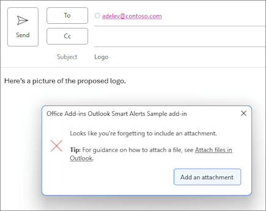
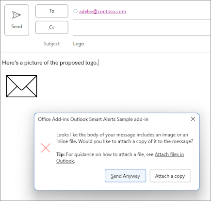
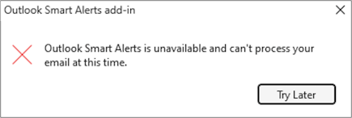
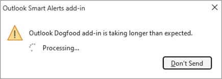
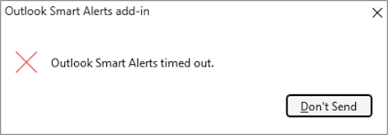

# Use Smart Alerts and the OnMessageSend and OnAppointmentSend events in your Outlook add-in

The `OnMessageSend` and `OnAppointmentSend` events take advantage of Smart Alerts, which allows you to run logic after a user selects **Send** in their Outlook message or appointment. Your event handler allows you to give your users the opportunity to improve their emails and meeting invites before they're sent.

The following walkthrough uses the `OnMessageSend` event. By the end of this walkthrough, you'll have an add-in that runs whenever a message is being sent and checks if the user forgot to add a document or picture they mentioned in their email.

> [!NOTE]
> The `OnMessageSend` and `OnAppointmentSend` events were introduced in [requirement set 1.12](/javascript/api/requirement-sets/outlook/requirement-set-1.12/outlook-requirement-set-1.12). See [clients and platforms](/javascript/api/requirement-sets/outlook/outlook-api-requirement-sets) that support this requirement set.

## Prerequisites

The `OnMessageSend` event is available through the event-based activation feature. To understand how to configure your add-in to use this feature, use other available events, debug your add-in, and more, see [Configure your Outlook add-in for event-based activation](autolaunch.md).

### Supported clients and platforms

The following table lists supported client-server combinations for the Smart Alerts feature, including the minimum required Exchange Server Cumulative Update where applicable. Excluded combinations aren't supported.

|Client|Exchange Online|Exchange 2019 on-premises (Cumulative Update 12 or later)|Exchange 2016 on-premises (Cumulative Update 22 or later) |
|-----|-----|-----|-----|
|**Windows**<br>Version 2206 (Build 15330.20196) or later|Yes|Yes|Yes|
|**Mac**<br>Version 16.65.827.0 or later|Yes|Not applicable|Not applicable|
|**Web browser (modern UI)**|Yes|Not applicable|Not applicable|
|**iOS**|Not applicable|Not applicable|Not applicable|
|**Android**|Not applicable|Not applicable|Not applicable|

## Set up your environment

Complete the [Outlook quick start](../quickstarts/outlook-quickstart.md?tabs=yeomangenerator), which creates an add-in project with the [Yeoman generator for Office Add-ins](../develop/yeoman-generator-overview.md).

## Configure the manifest

To configure the manifest, select the tab for the type of manifest you are using.

# [XML Manifest](#tab/xmlmanifest)

1. In your code editor, open the quick start project.

1. Open the **manifest.xml** file located at the root of your project.

1. Select the entire **\<VersionOverrides\>** node (including open and close tags) and replace it with the following XML.

    ```XML
    <VersionOverrides xmlns="http://schemas.microsoft.com/office/mailappversionoverrides" xsi:type="VersionOverridesV1_0">
      <VersionOverrides xmlns="http://schemas.microsoft.com/office/mailappversionoverrides/1.1" xsi:type="VersionOverridesV1_1">
        <Requirements>
          <bt:Sets DefaultMinVersion="1.12">
            <bt:Set Name="Mailbox" />
          </bt:Sets>
        </Requirements>
        <Hosts>
          <Host xsi:type="MailHost">
            <!-- Event-based activation happens in a lightweight runtime.-->
            <Runtimes>
              <!-- HTML file including reference to or inline JavaScript event handlers.
                   This is used by Outlook on the web and on the new Mac UI. -->
              <Runtime resid="WebViewRuntime.Url">
                <!-- JavaScript file containing event handlers. This is used by Outlook on Windows. -->
                <Override type="javascript" resid="JSRuntime.Url"/>
              </Runtime>
            </Runtimes>
            <DesktopFormFactor>
              <!-- Configure other command surface extension points for add-in command support, if needed. -->
              <FunctionFile resid="Commands.Url" />
              <ExtensionPoint xsi:type="MessageComposeCommandSurface">
                <OfficeTab id="TabDefault">
                  <Group id="msgComposeGroup">
                    <Label resid="GroupLabel" />
                    <Control xsi:type="Button" id="msgComposeOpenPaneButton">
                      <Label resid="TaskpaneButton.Label" />
                      <Supertip>
                        <Title resid="TaskpaneButton.Label" />
                        <Description resid="TaskpaneButton.Tooltip" />
                      </Supertip>
                      <Icon>
                        <bt:Image size="16" resid="Icon.16x16" />
                        <bt:Image size="32" resid="Icon.32x32" />
                        <bt:Image size="80" resid="Icon.80x80" />
                      </Icon>
                      <Action xsi:type="ShowTaskpane">
                        <SourceLocation resid="Taskpane.Url" />
                      </Action>
                    </Control>
                    <Control xsi:type="Button" id="ActionButton">
                      <Label resid="ActionButton.Label"/>
                      <Supertip>
                        <Title resid="ActionButton.Label"/>
                        <Description resid="ActionButton.Tooltip"/>
                      </Supertip>
                      <Icon>
                        <bt:Image size="16" resid="Icon.16x16"/>
                        <bt:Image size="32" resid="Icon.32x32"/>
                        <bt:Image size="80" resid="Icon.80x80"/>
                      </Icon>
                      <Action xsi:type="ExecuteFunction">
                        <FunctionName>action</FunctionName>
                      </Action>
                    </Control>
                  </Group>
                </OfficeTab>
              </ExtensionPoint>
              <!-- Enable launching the add-in on the included event. -->
              <ExtensionPoint xsi:type="LaunchEvent">
                <LaunchEvents>
                  <LaunchEvent Type="OnMessageSend" FunctionName="onMessageSendHandler" SendMode="Block" />
                </LaunchEvents>
                <!-- Identify the runtime to be used (also referenced by the Runtime element). -->
                <SourceLocation resid="WebViewRuntime.Url"/>
              </ExtensionPoint>
            </DesktopFormFactor>
          </Host>
        </Hosts>
        <Resources>
          <bt:Images>
            <bt:Image id="Icon.16x16" DefaultValue="https://localhost:3000/assets/icon-16.png"/>
            <bt:Image id="Icon.32x32" DefaultValue="https://localhost:3000/assets/icon-32.png"/>
            <bt:Image id="Icon.80x80" DefaultValue="https://localhost:3000/assets/icon-80.png"/>
          </bt:Images>
          <bt:Urls>
            <bt:Url id="Commands.Url" DefaultValue="https://localhost:3000/commands.html" />
            <bt:Url id="Taskpane.Url" DefaultValue="https://localhost:3000/taskpane.html" />
            <bt:Url id="WebViewRuntime.Url" DefaultValue="https://localhost:3000/commands.html" />
            <!-- Entry needed for Outlook on Windows. -->
            <bt:Url id="JSRuntime.Url" DefaultValue="https://localhost:3000/launchevent.js" />
          </bt:Urls>
          <bt:ShortStrings>
            <bt:String id="GroupLabel" DefaultValue="Contoso Add-in"/>
            <bt:String id="TaskpaneButton.Label" DefaultValue="Show Taskpane"/>
            <bt:String id="ActionButton.Label" DefaultValue="Perform an action"/>
          </bt:ShortStrings>
          <bt:LongStrings>
            <bt:String id="TaskpaneButton.Tooltip" DefaultValue="Opens a pane to provide additional functionality or information."/>
            <bt:String id="ActionButton.Tooltip" DefaultValue="Perform an action when clicked."/>
          </bt:LongStrings>
        </Resources>
      </VersionOverrides>
    </VersionOverrides>
    ```

1. Save your changes.

> [!TIP]
>
> - For a list of send mode options available with the `OnMessageSend` and `OnAppointmentSend` events, see [Available send mode options](#available-send-mode-options).
> - To learn more about manifests for Outlook add-ins, see [Office add-in manifests](../develop/add-in-manifests.md).

# [Unified manifest for Microsoft 365 (developer preview)](#tab/jsonmanifest)

1. Open the **manifest.json** file.

1. Add the following object to the "extensions.runtimes" array. Note the following about this markup:

   - The "minVersion" of the Mailbox requirement set is set to "1.12" because the [supported events table](autolaunch.md#supported-events) specifies that this is the lowest version of the requirement set that supports the `OnMessageSend` event.
   - The "id" of the runtime is set to the descriptive name "autorun_runtime".
   - The "code" property has a child "page" property that is set to an HTML file and a child "script" property that is set to a JavaScript file. You'll create or edit these files in later steps. Office uses one of these values or the other depending on the platform.
       - Office on Windows executes the event handler in a JavaScript-only runtime, which loads a JavaScript file directly.
       - Office on Mac and the web execute the handler in a browser runtime, which loads an HTML file. That file, in turn, contains a `<script>` tag that loads the JavaScript file.
     For more information, see [Runtimes in Office Add-ins](../testing/runtimes.md).
   - The "lifetime" property is set to "short", which means that the runtime starts up when the event is triggered and shuts down when the handler completes. (In certain rare cases, the runtime shuts down before the handler completes. See [Runtimes in Office Add-ins](../testing/runtimes.md).)
   - There is an action to run a handler for the `OnMessageSend` event. You'll create the handler function in a later step.

    ```json
     {
        "requirements": {
            "capabilities": [
                {
                    "name": "Mailbox",
                    "minVersion": "1.12"
                }
            ]
        },
        "id": "autorun_runtime",
        "type": "general",
        "code": {
            "page": "https://localhost:3000/commands.html",
            "script": "https://localhost:3000/launchevent.js"
        },
        "lifetime": "short",
        "actions": [
            {
                "id": "onMessageSendHandler",
                "type": "executeFunction",
                "displayName": "onMessageSendHandler"
            }
        ]
    }
    ```

1. Add the following "autoRunEvents" array as a property of the object in the "extensions" array.

    ```json
    "autoRunEvents": [
    
    ]
    ```

1. Add the following object to the "autoRunEvents" array. Note the following about this code:

   - The event object assigns a handler function to the `OnMessageSend` event (using the event's unified manifest name, "messageSending", as described in the [supported events table](autolaunch.md#supported-events)). The function name provided in "actionId" must match the name used in the "id" property of the object in the "actions" array in an earlier step.
   - The "sendMode" option is set to "block". This means that if the message doesn't meet the conditions that the add-in sets for sending, the user must take action before they can send the message.

    ```json
      {
          "requirements": {
              "capabilities": [
                  {
                      "name": "Mailbox",
                      "minVersion": "1.12"
                  }
              ],
              "scopes": [
                  "mail"
              ]
          },
          "events": [
            {
                "type": "messageSending",
                "actionId": "onMessageSendHandler",
                "options": {
                    "sendMode": "block"
                }
            }
          ]
      }
    ```

---

## Implement event handling

You have to implement handling for your selected event.

In this scenario, you'll add handling for sending a message. Your add-in will check for certain keywords in the message. If any of those keywords are found, it will then check if there are any attachments. If there are no attachments, your add-in will recommend to the user to add the possibly missing attachment.

1. From the same quick start project, create a new folder named **launchevent** under the **./src** directory.

1. In the **./src/launchevent** folder, create a new file named **launchevent.js**.

1. Open the file **./src/launchevent/launchevent.js** in your code editor and add the following JavaScript code.

    ```javascript
    /*
    * Copyright (c) Microsoft Corporation. All rights reserved. Licensed under the MIT license.
    * See LICENSE in the project root for license information.
    */

    function onMessageSendHandler(event) {
      Office.context.mailbox.item.body.getAsync(
        "text",
        { asyncContext: event },
        getBodyCallback
      );
    }

    function getBodyCallback(asyncResult){
      const event = asyncResult.asyncContext;
      let body = "";
      if (asyncResult.status !== Office.AsyncResultStatus.Failed && asyncResult.value !== undefined) {
        body = asyncResult.value;
      } else {
        const message = "Failed to get body text";
        console.error(message);
        event.completed({ allowEvent: false, errorMessage: message });
        return;
      }

      const matches = hasMatches(body);
      if (matches) {
        Office.context.mailbox.item.getAttachmentsAsync(
          { asyncContext: event },
          getAttachmentsCallback);
      } else {
        event.completed({ allowEvent: true });
      }
    }

    function hasMatches(body) {
      if (body == null || body == "") {
        return false;
      }

      const arrayOfTerms = ["send", "picture", "document", "attachment"];
      for (let index = 0; index < arrayOfTerms.length; index++) {
        const term = arrayOfTerms[index].trim();
        const regex = RegExp(term, 'i');
        if (regex.test(body)) {
          return true;
        }
      }

      return false;
    }

    function getAttachmentsCallback(asyncResult) {
      const event = asyncResult.asyncContext;
      if (asyncResult.value.length > 0) {
        for (let i = 0; i < asyncResult.value.length; i++) {
          if (asyncResult.value[i].isInline == false) {
            event.completed({ allowEvent: true });
            return;
          }
        }

        event.completed({
          allowEvent: false,
          errorMessage: "Looks like the body of your message includes an image or an inline file. Attach a copy to the message before sending."
        });
      } else {
        event.completed({
          allowEvent: false,
          errorMessage: "Looks like you're forgetting to include an attachment."
        });
      }
    }

    // IMPORTANT: To ensure your add-in is supported in the Outlook client on Windows, remember to map the event handler name specified in the manifest to its JavaScript counterpart.
    if (Office.context.platform === Office.PlatformType.PC || Office.context.platform == null) {
      Office.actions.associate("onMessageSendHandler", onMessageSendHandler);
    }
    ```

> [!IMPORTANT]
> When developing your Smart Alerts add-in to run in Outlook on Windows, keep the following in mind.
>
> - Imports aren't currently supported in the JavaScript file where you implement the handling for event-based activation.
> - To ensure your add-in runs as expected when an `OnMessageSend` or `OnAppointmentSend` event occurs in Outlook on Windows, call `Office.actions.associate` in the JavaScript file where your handlers are implemented. This maps the event handler name specified in the manifest to its JavaScript counterpart. If this call isn't included in your JavaScript file and the send mode property of your manifest is set to **soft block** or isn't specified, your users will be blocked from sending messages or meetings.

## Customize the Don't Send button (optional) (preview)

> [!NOTE]
> The **Don't Send** button customization feature is currently in preview in Outlook on Windows. Features in preview shouldn't be used in production add-ins. We invite you to try out this feature in test or development environments and welcome feedback on your experience through GitHub (see the **Feedback** section at the end of this page).

If a mail item doesn't meet the conditions of a Smart Alerts add-in, a dialog is shown to the user to alert them that additional actions may be needed before an item can be sent. The [send mode option](#available-send-mode-options) specified in the manifest determines the options that appear to the user in the dialog. **Don't Send** is an option that appears in the dialog no matter what send mode option you select. By default, selecting **Don't Send** cancels the send operation and closes the dialog. To guide the user on how to meet the conditions of your add-in, you can customize the text of this button and program it to open a task pane where you can provide additional information and functionality.

### Modify the Don't Send button text and functionality

To modify the text of the **Don't Send** button or assign it a task pane command, you must set additional options in the [event.completed](/javascript/api/office/office.addincommands.event#office-office-addincommands-event-completed-member(1)) method of your event handler.

- The [cancelLabel](/javascript/api/office/office.addincommands.eventcompletedoptions?view=outlook-js-preview&preserve-view=true#office-office-addincommands-eventcompletedoptions-cancelLabel-member) option sets the text of the **Don't Send** button. Custom text must be a maximum of 20 characters.
- The [commandId](/javascript/api/office/office.addincommands.eventcompletedoptions?view=outlook-js-preview&preserve-view=true#office-office-addincommands-eventcompletedoptions-commandId-member) option specifies the ID of the task pane that opens when the **Don't Send** button is selected. The value should match the ID assigned to the task pane in the manifest of your add-in. The markup depends on the type of manifest your add-in uses.
  - **XML manifest**: The `id` attribute of the **\<Control\>** element representing the task pane.
  - **Unified manifest for Microsoft 365 (preview)**: The "id" property of the task pane command in the "controls" array.
- The [contextData](/javascript/api/office/office.addincommands.eventcompletedoptions?view=outlook-js-preview&preserve-view=true#office-office-addincommands-eventcompletedoptions-contextData-member) option specifies any JSON data you want to pass to the add-in when the **Don't Send** button is selected. If you include this option, you must also set the `commandId` option. Otherwise, the JSON data will be ignored.

1. Navigate to the **./src/launchevent** folder, then open **launchevent.js**.
1. Replace the **getAttachmentsCallback** function with the following code.

    ```javascript
    function getAttachmentsCallback(asyncResult) {
      const event = asyncResult.asyncContext;
      if (asyncResult.value.length > 0) {
        for (let i = 0; i < asyncResult.value.length; i++) {
          if (asyncResult.value[i].isInline == false) {
            event.completed({ allowEvent: true });
            return;
          }
        }

        event.completed({
          allowEvent: false,
          errorMessage: "Looks like the body of your message includes an image or an inline file. Attach a copy to the message before sending.",
          cancelLabel: "Add an attachment",
          commandId: "msgComposeOpenPaneButton"
        });
      } else {
        event.completed({
          allowEvent: false,
          errorMessage: "Looks like you're forgetting to include an attachment.",
          cancelLabel: "Add an attachment",
          commandId: "msgComposeOpenPaneButton"
        });
      }
    }
    ```

1. Save your changes.

## Override the send mode option at runtime (optional) (preview)

> [!NOTE]
> The send mode option override feature is currently in preview in Outlook on Windows. Features in preview shouldn't be used in production add-ins. We invite you to try out this feature in test or development environments and welcome feedback on your experience through GitHub (see the **Feedback** section at the end of this page).

There may be instances when you want your add-in to implement different send mode options. For example, you may want your add-in to enforce the **block** option on mail items that don't meet the information protection policies of your organization, but only have it apply the **prompt user** option to provide a recommendation if a user adds the incorrect recipient.

To override the send mode option at runtime, you must set the [sendMode](/javascript/api/office/office.addincommands.eventcompletedoptions?view=outlook-js-preview&preserve-view=true#office-office-addincommands-eventcompletedoptions-sendMode-member) option in the [event.completed](/javascript/api/office/office.addincommands.event#office-office-addincommands-event-completed-member(1)) method of your event handler.

1. Navigate to the **./src/launchevent** folder, then open **launchevent.js**.
1. Replace the **getAttachmentsCallback** function with the following code.

    ```javascript
    function getAttachmentsCallback(asyncResult) {
      const event = asyncResult.asyncContext;
      if (asyncResult.value.length > 0) {
        for (let i = 0; i < asyncResult.value.length; i++) {
          if (asyncResult.value[i].isInline == false) {
            event.completed({ allowEvent: true });
            return;
          }
        }

        event.completed({
          allowEvent: false,
          errorMessage: "Looks like the body of your message includes an image or an inline file. Would you like to attach a copy of it to the message?",
          cancelLabel: "Attach a copy",
          commandId: "msgComposeOpenPaneButton",
          sendMode: Office.MailboxEnums.SendModeOverride.PromptUser
        });
      } else {
        event.completed({
          allowEvent: false,
          errorMessage: "Looks like you're forgetting to include an attachment.",
          cancelLabel: "Add an attachment",
          commandId: "msgComposeOpenPaneButton"
        });
      }
    }
    ```

1. Save your changes.

## Configure the task pane (optional)

If you implemented the optional steps to customize the **Don't Send** button or override the send mode option in this walkthrough, you also need to configure the task pane. Although the task pane is needed in this implementation, it isn't a requirement to customize the text of the **Don't Send** button or override the send mode option.

1. Navigate to the **./src/taskpane** folder, then open **taskpane.html**.
1. Select the entire **\<body\>** node (including its open and close tags) and replace it with the following code.

    ```html
    <body class="ms-welcome ms-Fabric">
        <header class="ms-welcome__header ms-bgColor-neutralLighter">
            
            <h1 class="ms-font-su">Try out the Smart Alerts sample</h1>
        </header>
        <section id="sideload-msg" class="ms-welcome__main">
            <h2 class="ms-font-xl">Please <a href="https://learn.microsoft.com/office/dev/add-ins/testing/test-debug-office-add-ins#sideload-an-office-add-in-for-testing">sideload</a> your add-in to see app body.</h2>
        </section>
        <main id="app-body" class="ms-welcome__main" style="display: none;">
            <p>
                This sample implements a Smart Alerts add-in that activates when you forget to attach a document or picture that you mention in your message.
                To learn more, see the <a href="https://learn.microsoft.com/office/dev/add-ins/outlook/smart-alerts-onmessagesend-walkthrough">Smart Alerts walkthrough</a>.
            </p>
            <h3 class="ms-font-l">Add an attachment</h3>
            <p>Add the URL of a file to add it as an attachment.</p>
            <div class="ms-TextField">
                <label class="ms-Label ms-font-l">URL of file:</label>
                <input id="attachment-url" class="ms-TextField-field" type="text" value="https://localhost:3000/assets/icon-128.png" placeholder="">
            </div>
            <br/>
            <button class="ms-Button ms-Button--primary">
                <span id="add-attachment" class="ms-Button-label">Add as attachment</span>
            </button>
            <br/>
            <h3 class="ms-font-l">Override the send mode option at runtime</h3>
            <p>Add an inline image to test overriding the send mode option at runtime.</p>
            <button class="ms-Button ms-Button--primary">
                <span id="add-inline-image" class="ms-Button-label">Add an inline image</span>
            </button>
        </main>
    </body>
    ```

1. Save your changes.
1. In the same **./src/taskpane** folder, open **taskpane.js**.
1. Replace its contents with the following code.

    ```javascript
    /*
     * Copyright (c) Microsoft Corporation. All rights reserved. Licensed under the MIT license.
     * See LICENSE in the project root for license information.
     */

    Office.onReady((info) => {
      if (info.host === Office.HostType.Outlook) {
        document.getElementById("sideload-msg").style.display = "none";
        document.getElementById("app-body").style.display = "flex";
        document.getElementById("add-attachment").onclick = addAttachment;
        document.getElementById("add-inline-image").onclick = addInlineImage;
      }
    });

    // Adds the specified URL as an attachment to the message.
    export async function addAttachment() {
      const attachmentUrl = document.querySelector("#attachment-url").value;
      Office.context.mailbox.item.addFileAttachmentAsync(attachmentUrl, getFileName(attachmentUrl), (asyncResult) => {
        console.log(asyncResult);
      });
    }

    // Gets the file name from a URL.
    function getFileName(url) {
      const lastIndex = url.lastIndexOf("/");
      if (lastIndex >= 0) {
        return url.substring(lastIndex + 1);
      }

      return url;
    }

    // Adds an inline image to the body of the message.
    export async function addInlineImage() {
      const mailItem = Office.context.mailbox.item;
      const base64String =
        "iVBORw0KGgoAAAANSUhEUgAAAGAAAABgCAMAAADVRocKAAAAAXNSR0IArs4c6QAAAARnQU1BAACxjwv8YQUAAAAnUExURQAAAAAAAAAAAAAAAAAAAAAAAAAAAAAAAAAAAAAAAAAAAAAAAAAAAN0S+bUAAAAMdFJOUwAQIDBAUI+fr7/P7yEupu8AAAAJcEhZcwAADsMAAA7DAcdvqGQAAAF8SURBVGhD7dfLdoMwDEVR6Cspzf9/b20QYOthS5Zn0Z2kVdY6O2WULrFYLBaLxd5ur4mDZD14b8ogWS/dtxV+dmx9ysA2QUj9TQRWv5D7HyKwuIW9n0vc8tkpHP0W4BOg3wQ8wtlvA+PC1e8Ao8Ld7wFjQtHvAiNC2e8DdqHqKwCrUPc1gE1AfRVgEXBfB+gF0lcCWoH2tYBOYPpqQCNwfT3QF9i+AegJfN8CtAWhbwJagtS3AbIg9o2AJMh9M5C+SVGBvx6zAfmT0r+Bv8JMwP4kyFPir+cswF5KL3WLv14zAFBCLf56Tw9cparFX4upgaJUtPhrOS1QlY5W+vWTXrGgBFB/b72ev3/0igUdQPppP/nfowfKUUEFcP207y/yxKmgAYQ+PywoAFOfCH3A2MdCFzD3kdADBvq10AGG+pXQBgb7pdAEhvuF0AIc/VtoAK7+JciAs38KIuDugyAC/v4hiMCE/i7IwLRBsh68N2WQjMVisVgs9i5bln8LGScNcCrONQAAAABJRU5ErkJggg==";

      // Gets the current body of the message.
      mailItem.body.getAsync(Office.CoercionType.Html, (bodyResult) => {
        if (bodyResult.status === Office.AsyncResultStatus.Failed) {
          console.log(bodyResult.error.message);
          return;
        }

        // Inserts the Base64 image to the beginning of the body.
        const options = { isInline: true, asyncContext: bodyResult.value };
        mailItem.addFileAttachmentFromBase64Async(base64String, "sample.png", options, (attachResult) => {
          if (attachResult.status === Office.AsyncResultStatus.Failed) {
            console.log(attachResult.error.message);
            return;
          }

          let body = attachResult.asyncContext;
          body = body.replace("<p class=MsoNormal>", `<p class=MsoNormal>`);
          mailItem.body.setAsync(body, { coercionType: Office.CoercionType.Html }, (setResult) => {
            if (setResult.status === Office.AsyncResultStatus.Failed) {
              console.log(setResult.error.message);
              return;
            }

            console.log("Inline image added to the body.");
          });
        });
      });
    }
    ```

1. Save your changes.

## Update the commands HTML file

1. In the **./src/commands** folder, open **commands.html**.

1. Immediately before the closing **head** tag (`</head>`), add a script entry for the event-handling JavaScript code.

   ```javascript
   <script type="text/javascript" src="../launchevent/launchevent.js"></script> 
   ```

  > [!IMPORTANT]
  > The **Don't Send** button customization and send mode option override features are currently in preview in Outlook on Windows. If you're testing these features in your add-in project, you must include a reference to the preview version of the Office JavaScript API in your **commands.html** file.
  >
  > ```html
  > <script type="text/javascript" src="https://appsforoffice.microsoft.com/lib/beta/hosted/office.js"></script>
  > <script type="text/javascript" src="../launchevent/launchevent.js"></script>
  > ```

1. Save your changes.

## Update webpack config settings

1. Open the **webpack.config.js** file found in the root directory of the project and complete the following steps.

1. Locate the `plugins` array within the `config` object and add this new object to the beginning of the array.

    ```javascript
    new CopyWebpackPlugin({
      patterns: [
        {
          from: "./src/launchevent/launchevent.js",
          to: "launchevent.js",
        },
      ],
    }),
    ```

1. Save your changes.

## Try it out

1. Run the following commands in the root directory of your project. When you run `npm start`, the local web server will start (if it isn't already running) and your add-in will be sideloaded.

    ```command&nbsp;line
    npm run build
    ```

    ```command&nbsp;line
    npm start
    ```

    > [!NOTE]
    > If your add-in wasn't automatically sideloaded, follow the instructions in [Sideload Outlook add-ins for testing](../outlook/sideload-outlook-add-ins-for-testing.md#sideload-manually) to manually sideload the add-in in Outlook.

1. In your preferred Outlook client, create a new message and set the subject. In the body, add some text. For example, "Here's a picture of the proposed logo."
1. Send the message. A dialog appears requesting you to add an attachment. Select **Don't Send** or **Add an attachment**. The option available to you depends on whether you implemented the optional step to customize the **Don't Send** button.

    

    

    > [!TIP]
    > If you assign a task pane to the **Don't Send** button, closing the dialog also opens the specified task pane.

1. Add an attachment to your message. If you implemented the optional step to customize the **Don't Send** button, use the task pane to add an attachment.

    

1. Send the message. There should be no alert this time.

### Override the send mode option at runtime (optional)

If you implemented the optional step to override the send mode option at runtime, perform the following to try it out.

1. Run `npm start` in the root directory of your project. This starts the local web server (if it isn't already running) and sideloads your add-in.

    > [!NOTE]
    > If your add-in wasn't automatically sideloaded, follow the instructions in [Sideload Outlook add-ins for testing](../outlook/sideload-outlook-add-ins-for-testing.md#sideload-manually) to manually sideload the add-in in Outlook.

1. In Outlook on Windows, create a new message and set the subject. In the body, add some text. For example, "Here's a picture of the proposed logo."
1. From the ribbon, select **Contoso Add-in** > **Show Taskpane**.
1. In the task pane, select **Add an inline image**. An image is added to the body of your message.
1. Send the message. A dialog appears recommending to attach a copy of the image to the message.
1. Select **Send Anyway** to send the message as-is, or select **Attach a copy** to include a copy before sending the message.

    

> [!IMPORTANT]
> If a Smart Alerts add-in that implements the override feature can't complete processing an event due to an error or is unavailable when the event occurs, it uses the send mode option specified in the manifest.

## Debug your add-in

For guidance on how to troubleshoot your Smart Alerts add-in, see the "Troubleshooting guide" section of [Configure your Outlook add-in for event-based activation](autolaunch.md#troubleshooting-guide).

## Deploy to users

Similar to other event-based add-ins, add-ins that use the Smart Alerts feature must be deployed by an organization's administrator. For guidance on how to deploy your add-in via the Microsoft 365 admin center, see the "Deploy to users" section in [Configure your Outlook add-in for event-based activation](autolaunch.md#deploy-to-users).

> [!IMPORTANT]
> Add-ins that use the Smart Alerts feature can only be published to AppSource if the manifest's [send mode property](#available-send-mode-options) is set to the **soft block** or **prompt user** option. If an add-in's send mode property is set to **block**, it can only be deployed by an organization's admin as it will fail AppSource validation. To learn more about publishing your event-based add-in to AppSource, see [AppSource listing options for your event-based Outlook add-in](autolaunch-store-options.md).

## Smart Alerts feature behavior and scenarios

The following sections include guidance on the send mode options and the behavior of the feature in certain scenarios.

### Available send mode options

When you configure your add-in to respond to the `OnMessageSend` or `OnAppointmentSend` event, you must include the send mode property in the manifest. Its markup varies depending on the type of manifest your add-in uses.

- **XML manifest**: Set the **SendMode** property of the [LaunchEvent](/javascript/api/manifest/launchevent) element.
- **Unified manifest for Microsoft 365 (preview)**: Set the "sendMode" option of the event object in the "autoRunEvents" array.

If the conditions implemented by your add-in aren't met or your add-in is unavailable when the event occurs, a dialog is shown to the user to alert them that additional actions may be needed before the mail item can be sent. The send mode property determines the options available to the user in the dialog.

The following table lists the available send mode options.

|Send mode option canonical name|XML manifest name|Unified manifest for Microsoft 365 name|
|-----|-----|-----|
|**prompt user**|`PromptUser`|promptUser|
|**soft block**|`SoftBlock`|softBlock|
|**block**|`Block`|block|

#### prompt user

If the item doesn't meet the add-in's conditions, the user can choose **Send Anyway** in the alert, or address the issue then try to send the item again. If the add-in is taking a long time to process the item, the user will be prompted with the option to stop running the add-in and choose **Send Anyway**. In the event the add-in is unavailable (for example, there's an error loading the add-in), the item will be sent.


Use the **prompt user** option in your add-in if one of the following applies.

- The condition checked by the add-in isn't mandatory, but is nice to have in the message or appointment being sent.
- You'd like to recommend an action and allow the user to decide whether they want to apply it to the message or appointment being sent.

Some scenarios where the **prompt user** option is applied include suggesting to tag the message or appointment as low or high importance and recommending to apply a color category to the item.

#### soft block

Default option if the send mode property of your manifest isn't configured. The user is alerted that the item they're sending doesn't meet the add-in's conditions and they must address the issue before trying to send the item again. However, if the add-in is unavailable (for example, there's an error loading the add-in), the item will be sent.


Use the **soft block** option in your add-in when you want a condition to be met before a message or appointment can be sent, but you don't want the user to be blocked from sending the item if the add-in is unavailable. Sample scenarios where the **soft block** option is used include prompting the user to set a message or appointment's importance level and checking that the appropriate signature is applied before the item is sent.

#### block

The item isn't sent if any of the following situations occur.

- The item doesn't meet the add-in's conditions.
- The add-in is unable to connect to the server.
- There's an error loading the add-in.


Use the **block** option if the add-in's conditions are mandatory, even if the add-in is unavailable. For example, the **block** option is ideal when users are required to apply a sensitivity label to a message or appointment before it can be sent.

### Add-in is unavailable

If the add-in is unavailable when a message or appointment is being sent (for example, an error occurs that prevents the add-in from loading), the user is alerted. The options available to the user differ depending on the send mode option applied to the add-in.

If the **prompt user** or **soft block** option is used, the user can choose **Send Anyway** to send the item without the add-in checking it, or **Try Later** to let the item be checked by the add-in when it becomes available again.


If the **block** option is used, the user can't send the item until the add-in becomes available.



### Long-running add-in operations

If the add-in runs for more than five seconds, but less than five minutes, the user is alerted that the add-in is taking longer than expected to process the message or appointment.

If the **prompt user** option is used, the user can choose **Send Anyway** to send the item without the add-in completing its check. Alternatively, the user can select **Don't Send** to stop the add-in from processing.


However, if the **soft block** or **block** option is used, the user will not be able to send the item until the add-in completes processing it.



`OnMessageSend` and `OnAppointmentSend` add-ins should be short-running and lightweight. To avoid the long-running operation dialog, use other events to process conditional checks before the `OnMessageSend` or `OnAppointmentSend` event is activated. For example, if the user is required to encrypt attachments for every message or appointment, consider using the `OnMessageAttachmentsChanged` or `OnAppointmentAttachmentsChanged` event to perform the check.

### Add-in timed out

If the add-in runs for five minutes or more, it will time out. If the **prompt user** option is used, the user can choose **Send Anyway** to send the item without the add-in completing its check. Alternatively, the user can choose **Don't Send**.


If the **soft block** or **block** option is  used, the user can't send the item until the add-in completes its check. The user must attempt to send the item again to reactivate the add-in.



## Limitations

Because the `OnMessageSend` and `OnAppointmentSend` events are supported through the event-based activation feature, the same feature limitations apply to add-ins that activate as a result of these events. For a description of these limitations, see [Event-based activation behavior and limitations](autolaunch.md#event-based-activation-behavior-and-limitations).

In addition to these constraints, only one instance each of the `OnMessageSend` and `OnAppointmentSend` event can be declared in the manifest. If you require multiple `OnMessageSend` or `OnAppointmentSend` events, you must declare each one in a separate add-in.

While you can change the Smart Alerts dialog message and **Don't Send** button to suit your add-in scenario through the `event.completed` method, the following can't be customized.

- The dialog's title bar. Your add-in's name is always displayed there.
- The message's format. For example, you can't change the text's font size and color or insert a bulleted list.
- Event-based activation processing and progress information dialogs. For example, the text and options that appear in the timeout and long-running operation dialogs can't be changed.

If you customize the **Don't Send** button in the dialog, you can only assign a task pane command to it. Function commands aren't supported. If you select a **Don't Send** button with an assigned function command, it will ignore the command and will proceed with cancelling the send operation and closing the dialog. When this occurs, no error is shown or logged. For guidance on the types of add-in commands, see [Types of add-in commands](../design/add-in-commands.md#types-of-add-in-commands).

## Differences between Smart Alerts and the on-send feature

While Smart Alerts and the [on-send feature](outlook-on-send-addins.md) provide your users the opportunity to improve their messages and meeting invites before they're sent, Smart Alerts is a newer feature that offers you more flexibility with how you prompt your users for further action. Key differences between the two features are outlined in the following table.

|Attribute|Smart Alerts|On-send|
|-----|-----|-----|
|**Minimum supported requirement set**|[Mailbox 1.12](/javascript/api/requirement-sets/outlook/requirement-set-1.12/outlook-requirement-set-1.12)|[Mailbox 1.8](/javascript/api/requirement-sets/outlook/requirement-set-1.8/outlook-requirement-set-1.8)|
|**Supported Outlook clients**|- Windows<br>- Web browser (modern UI)<br>- Mac (new UI)|- Windows<br>- Web browser (classic and modern UI)<br>- Mac (classic and new UI) |
|**Supported events**|**XML manifest**<br>- `OnMessageSend`<br>- `OnAppointmentSend`<br><br>**Unified manifest for Microsoft 365 (preview)**<br>- "messageSending"<br>- "appointmentSending"|**XML manifest**<br>- `ItemSend`<br><br>**Unified manifest for Microsoft 365 (preview)**<br>- Not supported|
|**Manifest extension property**|**XML manifest**<br>- `LaunchEvent`<br><br>**Unified manifest for Microsoft 365 (preview)**<br>- "autoRunEvents"|**XML manifest**<br>- `Events`<br><br>**Unified manifest for Microsoft 365 (preview)**<br>- Not supported|
|**Supported send mode options**|- prompt user<br>- soft block<br>- block<br><br>To learn more about each option, see [Available send mode options](#available-send-mode-options).|Block|
|**Maximum number of supported events in an add-in**|One `OnMessageSend` and one `OnAppointmentSend` event.|One `ItemSend` event.|
|**Add-in deployment**|Add-in can be published to AppSource if its send mode property is set to the **soft block** or **prompt user** option. Otherwise, the add-in must be deployed by an organization's administrator.|Add-in can't be published to AppSource. It must be deployed by an organization's administrator.|
|**Additional configuration for add-in installation**|No additional configuration is needed once the manifest is uploaded to the Microsoft 365 admin center.|Depending on the organization's compliance standards and the Outlook client used, certain mailbox policies must be configured to install the add-in.|

## See also

- [Office add-in manifests](../develop/add-in-manifests.md)
- [Configure your Outlook add-in for event-based activation](autolaunch.md)
- [Event-based activation troubleshooting guide](autolaunch.md#troubleshooting-guide)
- [How to debug event-based add-ins](debug-autolaunch.md)
- [AppSource listing options for your event-based Outlook add-in](autolaunch-store-options.md)
- [Office Add-ins code sample: Use Outlook Smart Alerts](https://github.com/OfficeDev/Office-Add-in-samples/tree/main/Samples/outlook-check-item-categories)
- [Office Add-ins code sample: Verify the sensitivity label of a message](https://github.com/OfficeDev/Office-Add-in-samples/tree/main/Samples/outlook-verify-sensitivity-label)
