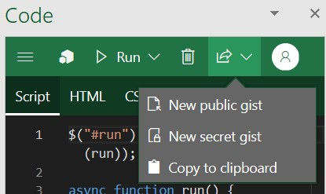
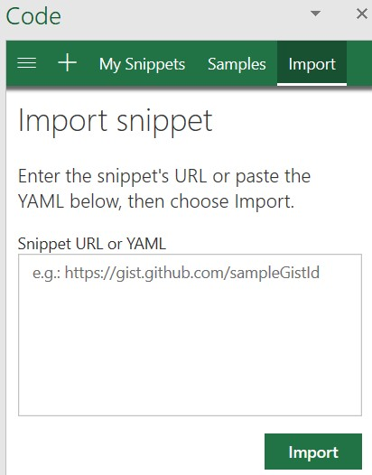

# Explore Office JavaScript API using Script Lab

Script Lab is a free tool for anyone to learn how to develop Office Add-ins. Script Lab lets you to code and run the Office JavaScript APIs alongside your document in Excel, Outlook, PowerPoint, and Word. Use this convenient tool to prototype and verify the functionality you want in your own add-in.

> [!div class="nextstepaction"]
> [Get Script Lab for Excel, PowerPoint, and Word](https://appsource.microsoft.com/product/office/WA104380862)

> [!div class="nextstepaction"]
> [Get Script Lab for Outlook](https://appsource.microsoft.com/product/office/WA200001603)

See Script Lab in action in this one-minute YouTube video.

## What is Script Lab?

Script Lab is an add-in for prototyping add-ins. It uses the Office JavaScript API in Excel, Outlook, Word, and PowerPoint and sits in a task pane inside your document, spreadsheet, or email. It has an IntelliSense-enabled code editor, built on the [same framework used by Visual Studio Code](https://microsoft.github.io/monaco-editor/). Through Script Lab, you can access a library of samples to quickly try out features or use those samples as the starting point for your own code. You can even try upcoming APIs in Script Lab that are still in developer preview.

## Key features

Script Lab offers a number of features to help you explore the Office JavaScript API and prototype add-in functionality.

### Explore samples

Get started quickly with a collection of built-in sample snippets that show how to complete tasks with the API. You can run the samples to instantly see the result in the task pane or document, examine the samples to learn how the API works, and even use samples to prototype your own add-in.

### Code and style

In addition to JavaScript or TypeScript code that calls the Office JS API, each snippet also contains HTML markup that defines content of the task pane and CSS that defines the appearance of the task pane. You can customize the HTML markup and CSS to experiment with element placement and styling as you prototype task pane design for your own add-in.

> [!TIP]
> To call preview APIs within a snippet, you'll need to update the snippet's libraries to use the beta content delivery network (CDN) (`https://appsforoffice.microsoft.com/lib/beta/hosted/office.js`) and the preview type definitions `@types/office-js-preview`. Additionally, some preview APIs are only accessible if you've signed up for the [Microsoft 365 Insider program](https://insider.microsoft365.com) and are running an Insider build of Office.

### Save and share snippets

By default, snippets that you open in Script Lab will be saved to your browser cache. To save a snippet permanently, you can export it to a [GitHub gist](https://gist.github.com). Create a secret gist to save a snippet exclusively for your own use, or create a public gist if you plan to share it with others.

### Import snippets

You can import a snippet into Script Lab either by specifying the URL to the public [GitHub gist](https://gist.github.com) where the snippet YAML is stored or by pasting in the complete YAML for the snippet. This feature may be useful in scenarios where someone else has shared their snippet with you by either publishing it to a GitHub gist or providing their snippet's YAML.

## Supported clients

Script Lab is supported for Excel, Word, and PowerPoint on the following clients.

- Office on Windows\*
- Office on Mac
- Office on the web

Script Lab for Outlook is available on the following clients.

- Outlook on Windows\*
- Outlook on Mac
- Outlook on the web when using Chrome, Microsoft Edge, or Safari browsers

    [!INCLUDE [script-lab-outlook-web](../includes/script-lab-outlook-web.md)]

For more details on Script Lab for Outlook, see the related [blog post](https://devblogs.microsoft.com/microsoft365dev/script-lab-now-supports-outlook/).

> [!IMPORTANT]
> \* Script Lab no longer works with combinations of platform and Office version that use the Trident (Internet Explorer) webview to host add-ins. This includes perpetual versions of Office through Office 2019. For more information, see [Browsers and webview controls used by Office Add-ins](../concepts/browsers-used-by-office-web-add-ins.md).

## Next steps

> [!div class="nextstepaction"]
> [Get Script Lab for Excel, PowerPoint, and Word](https://appsource.microsoft.com/product/office/WA104380862)

> [!div class="nextstepaction"]
> [Get Script Lab for Outlook](https://appsource.microsoft.com/product/office/WA200001603)

Once you've prototyped your code in Script Lab, turn it into a real add-in with the steps in [Create a standalone Office Add-in from your Script Lab code](./create-an-office-add-in-from-script-lab.md).

## See also

- [Script Lab sample GitHub repository](https://github.com/OfficeDev/office-js-snippets#office-js-snippets)
- [Developing Office Add-ins](../develop/develop-overview.md)
