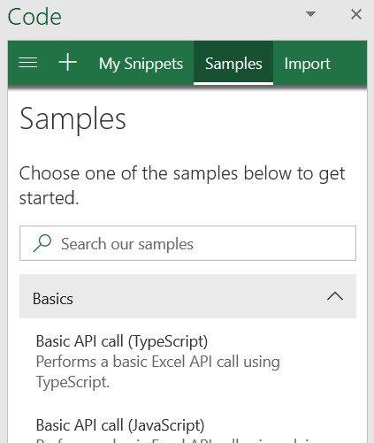

---
title: Explore Office JavaScript API using Script Lab
description: Use Script Lab to explore the Office JS API and to prototype functionality.
ms.date: 03/21/2025
ms.topic: concept-article
ms.custom: scenarios:getting-started
ms.localizationpriority: high
---

# Explore Office JavaScript API using Script Lab

Script Lab is a free tool for anyone to learn how to develop Office Add-ins. Script Lab lets you to code and run the Office JavaScript APIs alongside your document in Excel, Outlook, PowerPoint, and Word. Use this convenient tool to prototype and verify the functionality you want in your own add-in.

> [!div class="nextstepaction"]
> [Get Script Lab for Excel, PowerPoint, and Word](https://appsource.microsoft.com/product/office/WA104380862)

> [!div class="nextstepaction"]
> [Get Script Lab for Outlook](https://appsource.microsoft.com/product/office/wa200001603)

See Script Lab in action in this one-minute YouTube video.

## What is Script Lab?

Script Lab is an add-in for prototyping add-ins. It uses the Office JavaScript API in Excel, Outlook, PowerPoint, Word and sits in a task pane inside your document, spreadsheet, or email. It has an IntelliSense-enabled code editor, built on the [same framework used by Visual Studio Code](https://microsoft.github.io/monaco-editor/). Through Script Lab, you have access to a library of samples. Quickly try out features or use these samples as the starting point for your own code. You can even try upcoming APIs in Script Lab that are still in preview.

> [!NOTE]
> **Script Lab** is unrelated to **Office Scripts**. [Office Scripts](/office/dev/scripts) is a tool for end-user automation in Excel. Use Office Scripts if you want quick, reusable solutions that don't need integrations with web services.

## Key features

Script Lab offers a number of features to help you prototype add-in functionality and explore the Office JavaScript API.

### Explore samples

Get started quickly with a collection of built-in sample snippets that show how to complete tasks with the API. Run the samples to instantly see the result in the task pane or document, examine the samples to learn how the API works, and even use samples to prototype your own add-in.

### Code and style

In addition to JavaScript or TypeScript code that calls the Office JS API, each snippet also contains HTML markup that defines content of the task pane and CSS that defines the appearance of the task pane. Customize the HTML markup and CSS to experiment with element placement and styling as you prototype task pane design for your own add-in.

#### Preview APIs

To call preview APIs within a snippet, you need to update the snippet's libraries to use the beta content delivery network (CDN) (`https://appsforoffice.microsoft.com/lib/beta/hosted/office.js`) and the preview type definitions `@types/office-js-preview`. Additionally, some preview APIs are only accessible if you've signed up for the [Microsoft 365 Insider program](https://aka.ms/MSFT365InsiderProgram) and are running an Insider build of Office.

### Save and share snippets

By default, snippets that you open in Script Lab are saved to your browser cache or local storage. To save a snippet permanently, select **Copy** and paste the resulting clipboard content into a new .yml file. Use this to share snippets with colleagues or provide code for community sites, such as Stack Overflow.

To import a snippet into Script Lab, select **Import** from the menu and paste in the complete YAML for the snippet. If you've saved the YAML as a [GitHub gist](https://gist.github.com/), you can paste a link to the gist instead.

## Supported clients

Script Lab is supported for Excel, Word, and PowerPoint on the following clients.

- Office on the web
- Office on Windows\*
- Office on Mac

Script Lab for Outlook is available on the following clients.

- Outlook on the web when using Chrome, Microsoft Edge, or Safari browsers
- Outlook on Windows\*
- Outlook on Mac

> [!IMPORTANT]
> \* Script Lab no longer works with combinations of platform and Office version that use the Trident (Internet Explorer) webview to host add-ins. This includes perpetual versions of Office through Office 2019. For more information, see [Browsers and webview controls used by Office Add-ins](../concepts/browsers-used-by-office-web-add-ins.md).

## Limitations

Script Lab is designed for you to play with small code samples. Generally, a snippet should be at most a few hundred lines and a few thousand characters.

Your snippet can use hard-coded data. A small amount of data (say, a few hundred characters) is OK to hard code in Script Lab. However, for larger pieces of data, we recommend that you store those externally then load them at runtime with a command like `fetch`.

Keep your snippets and hard-coded data small since storing several large snippets could exceed Script Lab's storage and cause issues when loading Script Lab.

## Next steps

> [!div class="nextstepaction"]
> [Get Script Lab for Excel, PowerPoint, and Word](https://appsource.microsoft.com/product/office/WA104380862)

> [!div class="nextstepaction"]
> [Get Script Lab for Outlook](https://appsource.microsoft.com/product/office/wa200001603)

Once you've prototyped your code in Script Lab, turn it into a real add-in with the steps in [Create a standalone Office Add-in from your Script Lab code](create-an-office-add-in-from-script-lab.md).

## Issues

If you find an issue or have feedback for us, let us know!

- Issue in this article? See the "Office Add-ins feedback" section at the end of this article.
- Problem with a Script Lab code sample? Open a new issue in the [office-js-snippets GitHub repository](https://github.com/OfficeDev/office-js-snippets/issues).
- Feedback or issue with the Script Lab tool? Open a new issue in the [office-js GitHub repository](https://aka.ms/script-lab-issues).

## See also

- [Script Lab samples GitHub repository](https://github.com/OfficeDev/office-js-snippets#office-js-snippets)
- [Developing Office Add-ins](../develop/develop-overview.md)
