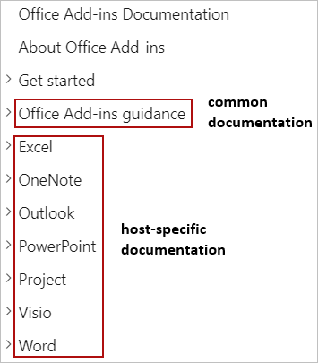

# Building Office Add-ins

Office Add-ins extend the UI and functionality of Office applications and interact with content in Office documents. You'll use familiar web technologies to create Office Add-ins that extend and interact with Word, Excel, PowerPoint, OneNote, Project, or Outlook. The add-ins you build can run in Office across multiple platforms, including Windows, Mac, iPad, and in a browser. This article provides an introduction to developing Office Add-ins.

> [!TIP]
> Please review [Office Add-ins platform overview](office-add-ins.md) before reading this article.

## Creating an Office Add-in 

You can create an Office Add-in by using the Yeoman generator for Office Add-ins or Visual Studio.

### Yeoman generator for Office Add-ins

The [Yeoman generator for Office Add-ins](https://github.com/officedev/generator-office) can be used to create a Node.js Office Add-in project that can be managed with Visual Studio Code or any other editor. The generator can create Office Add-ins for any of the following:

- Excel
- OneNote
- Outlook
- PowerPoint
- Project
- Word
- Excel custom functions

You can choose to create the project using HTML, CSS and JavaScript, or using Angular or React. For whichever framework you choose, you can choose between JavaScript and Typescript as well. Each [5-minute quick start](../index.md) contains step-by-step instructions that describe how to create an Office Add-in using the Yeoman generator.

### Visual Studio

Visual Studio can be used to create Office Add-ins for Excel, Word, PowerPoint, or Outlook. An Office Add-in project gets created as part of a Visual Studio solution and uses HTML, CSS, and JavaScript. The [5-minute quick starts](../index.md) for Excel, Word, PowerPoint, and Outlook contain step-by-step instructions that describe how to create an Office Add-in using Visual Studio. 

[!include[Yeoman vs Visual Studio comparision](../includes/yeoman-generator-recommendation.md)]

## Exploring APIs with Script Lab

Script Lab is an add-in that enables you to explore the Office JavaScript API and run code snippets while you're working in an Office program such as Excel or Word. It's available for free via [AppSource](https://appsource.microsoft.com/product/office/WA104380862) and is a useful tool to include in your development toolkit as you prototype and verify the functionality you want in your add-in. In Script Lab, you can access a library of built-in samples to quickly try out APIs or even use a sample as the starting point for your own code. 

The following one-minute video shows Script Lab in action.

[](https://aka.ms/scriptlabvideo)

For more information about Script Lab, see [Explore Office JavaScript APIs using Script Lab](../overview/explore-with-script-lab.md).

## Extending the Office UI

An Office Add-in can extend the Office UI by using add-in commands and HTML containers such as task panes, content add-ins, or dialog boxes.

- [Add-in commands](../design/add-in-commands.md) can be used to add custom tabs, buttons, and menus to the default ribbon in Office, or to extend the default context menu that appears when users right-click text in an Office document or an object in Excel. When users select an add-in command, they initiate the task that the add-in command specifies, such as running JavaScript code, opening a task pane, or launching a dialog box.

- HTML containers like [task panes](../design/task-pane-add-ins.md), [content add-ins](../design/content-add-ins.md), and [dialog boxes](../design/dialog-boxes.md) can be used to display custom UI and expose additional functionality within an Office application. The content and functionality of each task pane, content add-in, or dialog box derives from a web page that you specify. Those web pages can use the Office JavaScript API to interact with content in the Office document where the add-in is running, and can also do other things that web pages typically do, like call external web services, facilitate user authentication, and more.

The following image shows an add-in command in the ribbon, a task pane to the right of the document, and a dialog box or content add-in over the document.


For more information about extending the Office UI, see [Office UI elements for Office Add-ins](../design/interface-elements.md).

## Core development concepts 

An Office Add-in consists of two parts:

- The add-in manifest (an XML file) that defines the settings and capabilities of the add-in.

- The web application that defines the UI and functionality of add-in components such as task panes, content add-ins, and dialog boxes.

The web application uses the Office JavaScript API to interact with content in the Office document where the add-in is running. Your add-in can also do other things that web applications typically do, like call external web services, facilitate user authentication, and more.

### Defining an add-in's settings and capabilities

An Office Add-in's manifest (an XML file) defines the settings and capabilities of the add-in. You'll configure the manifest to specify things such as:

- Metadata that describes the add-in (for example, ID, version, description, display name, default locale).
- Office applications where the add-in will run.
- Permissions that the add-in requires.
- How the add-in integrates with Office, including any custom UI that the add-in creates (for example, custom tabs, ribbon buttons).
- Location of images that the add-in uses for branding and command iconography.
- Dimensions of the add-in (for example, dimensions for content add-ins, requested height for Outlook add-ins).
- Rules that specify when the add-in activates in the context of a message or appointment (for Outlook add-ins only).

For detailed information about the manifest, see [Office Add-ins XML manifest](add-in-manifests.md).

### Interacting with content in an Office document

An Office Add-in can use the Office JavaScript APIs to interact with content in the Office document where the add-in is running. 

#### Accessing the Office JavaScript library

The Office JavaScript library can be accessed via the Office JS content delivery network (CDN) at: `https://appsforoffice.microsoft.com/lib/1/hosted/Office.js`. To use Office JavaScript APIs within any of your add-in's web pages, you must reference the CDN in a `<script>` tag in the `<head>` tag of the page.

```html
<head>
    ...
    <script src="https://appsforoffice.microsoft.com/lib/1/hosted/Office.js" type="text/javascript"></script>
</head>
```

> [!NOTE]
> To use preview APIs, reference the preview version of the Office JavaScript library on the CDN: https://appsforoffice.microsoft.com/lib/beta/hosted/office.js.

For more information about accessing the Office JavaScript library, including how to get IntelliSense, see [Referencing the JavaScript API for Office library from its content delivery network (CDN)](../develop/referencing-the-javascript-api-for-office-library-from-its-cdn.md).

#### API models

The Office JavaScript APIs include two distinct models:

- **Host-specific** APIs provide strongly-typed objects that can be used to interact with objects that are native to a specific Office application. For example, you can use the Excel JavaScript APIs to access worksheets, ranges, tables, charts, and more. Host-specific APIs are currently available for [Excel](../reference/overview/excel-add-ins-reference-overview.md), [Word](../reference/overview/word-add-ins-reference-overview.md), and [OneNote](../reference/overview/onenote-add-ins-javascript-reference.md). This API model uses [promises](https://developer.mozilla.org/docs/Web/JavaScript/Reference/Global_Objects/Promise) and allows you to specify multiple operations in each request you send to the Office host. Batching operations in this manner can significantly improve add-in performance in Office on the web applications. Host-specific APIs were introduced with Office 2016 and cannot be used to interact with Office 2013.

- **Common** APIs can be used to access features such as UI, dialogs, and client settings that are common across multiple types of Office applications. This API model uses [callbacks](https://developer.mozilla.org/docs/Glossary/Callback_function), where you can only specify one operation in each request you send to the Office host. Common APIs were introduced with Office 2013 and can be used to interact with Office 2013 or later. For details about the Common API object model, which includes APIs for interacting with Outlook and PowerPoint, see [Office JavaScript API object model](../develop/office-javascript-api-object-model.md).

> [!NOTE]
> Excel Custom functions run within a unique runtime that prioritizes execution of calculations, and therefore uses a slightly different programming model. For details, see [Custom functions architecture](../excel/custom-functions-architecture.md).

For additional information about the Office JavaScript APIs, see [Understanding the JavaScript API for Office](../develop/understanding-the-javascript-api-for-office.md).

#### API requirement sets

[Requirement sets](../develop/office-versions-and-requirement-sets.md) are named groups of API members. Requirement sets can be specific to Office hosts, such as the `ExcelApi 1.7` requirement set (a set of APIs that can only be used in Excel), or common to multiple hosts, such as the `DialogApi 1.1` requirement set (a set of APIs that can be used in any Office application that supports the Dialog API).

Your add-in can use requirement sets to determine whether the Office host supports the API members that it needs to use. For more information about this, see [Specify Office hosts and API requirements](../develop/specify-office-hosts-and-api-requirements.md).

Requirement set support varies by Office host, version, and platform. For detailed information about the platforms, requirement sets, and Common APIs that each Office application supports, see [Office Add-in host and platform availability](office-add-in-availability.md).

## Testing and debugging an Office Add-in

As you develop your add-in, you can test it locally by using a technique known as _sideloading_. The procedure for sideloading an add-in varies by platform, and in some cases, by product as well. Likewise, the procedure for debugging an add-in can also vary by platform and product. For more information about testing and debugging, see [Test and debug Office Add-ins](../testing/test-debug-office-add-ins.md).

## Publishing an Office Add-in

When you're ready to share your add-in with others, you'll do so by using the deployment method that best meets your objectives. For example, to deploy an add-in to users within your organization, you might use centralized deployment or publish the add-in to a SharePoint app catalog. If you want to share your add-in publicly for anyone to obtain, you can publish the add-in to AppSource. For more information about publishing, see [Deploy and publish Office Add-ins](../publish/publish.md).

## Next steps

This article has outlined the different ways to create Office Add-ins, introduced Script Lab as a valuable tool for exploring Office JavaScript APIs and prototyping add-in functionality, and described important Office Add-ins development, testing, and publishing concepts. Now that you've explored this introductory information, consider continuing your Office Add-ins journey along the following paths.

### Create an Office add-in

You can quickly create a basic add-in for Excel, OneNote, Outlook, PowerPoint, Project, or Word by completing a [5-minute quick start](../index.md). If you've previously completed a quick start and want to create a slightly more complex add-in, you should try the [tutorial](../index.md).

### Explore the APIs with Script Lab

Explore the library of built-in samples in [Script Lab](explore-with-script-lab.md) to get a sense for the capabilities of the Office JavaScript APIs.

### Learn more about developing, testing, and publishing Office Add-ins

> [!TIP]
> For any type of add-in that you build, you'll use information in the [Office Add-ins guidance](common-guidance.md) section of this documentation, along with information in the host-specific section that corresponds to the type of add-in you're building (for example, [Excel add-ins](../excel/index.md)).
>
> 

## See also 

- [Office Add-ins platform overview](office-add-ins.md)
- [Common guidance for Office Add-ins](../overview/common-guidance.md)
- [Develop Office Add-ins](../develop/develop-overview.md)
- [Design Office Add-ins](../design/add-in-design.md)
- [Test and debug Office Add-ins](../testing/test-debug-office-add-ins.md)
- [Publish Office Add-ins](../publish/publish.md)