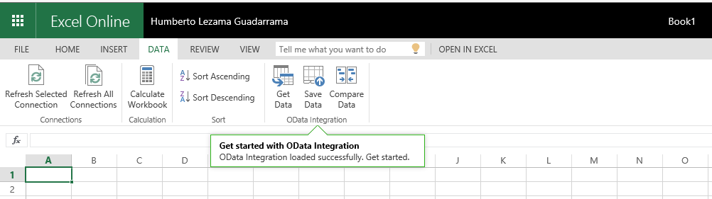

# Office Add-ins platform overview

Office Add-ins enable you to extend Office clients such as Word, Excel, PowerPoint, and Outlook using web technologies like HTML, CSS and JavaScript. 

You can use Office Add-ins to: 

-  **Add new functionality to Office clients** - For example, augment Word, Excel, PowerPoint, and Outlook by interacting with Office documents and mail items, bringing external data into Office, processing Office documents, exposing third-party functionality into Office clients, and much more. 
    
-  **Create new rich, interactive objects that can be embedded into Office documents** - For example, maps, charts, and interactive visualizations that users can add to their own Excel spreadsheets and PowerPoint presentations.
    
**Office Add-ins run across multiple versions of Office** including Office for Windows Desktop, Office Online, Office for the Mac, and Office for the iPad.

>**Note:** For a high-level view of where Office Add-ins are currently supported, see the [Office Add-in host and platform availability](http://dev.office.com/add-in-availability) page. 

## What can an Office Add-in do?

An Office Add-in can do almost anything a webpage can do inside the browser, such as the following:

- Extend Office native UI by creating custom ribbon buttons and tabs.

- Provide an interactive UI and custom logic through HTML and JavaScript.
    
- Use JavaScript frameworks such as jQuery, Angular, and many others.
    
- Connect to REST endpoints and web services via HTTP and AJAX.
    
- Run server-side code or logic, if the page is implemented using a server-side scripting language such as ASP or PHP.
    

In addition, Office Add-ins can interact with the Office application and an add-in user's content through a [JavaScript API](../../docs/develop/understanding-the-javascript-api-for-office.md) that the Office Add-ins infrastructure provides. 

## Types of Office Add-ins

You can create the following types of Office Add-ins:
 
- Word, Excel, and PowerPoint add-ins that extend functionality
- Excel and PowerPoint add-ins that create new objects
- Outlook add-ins that extend functionality

### Word, Excel, and PowerPoint Add-ins that extend functionality 
You can **add new functionality** to Word, Excel, or PowerPoint by registering your add-in using a [task pane add-in manifest](../design/add-in-commands.md). This manifest supports **two integration modes**:

- Add-in commands
- Insertable task panes

####Add-in commands
Use add-in commands to extend the UI of Office for Windows Desktop and Office Online. For example, you can add **buttons for your add-ins on the ribbon** or selected contextual menus, allowing users to easily access their add-ins within Office. Command buttons can launch the different actions such as **showing a pane (or multiple panes) with a custom HTML** or **executing a JavaScript function**. We recommend that you [watch this Channel9 video](https://channel9.msdn.com/events/Build/2016/P551) for a deeper overview of this feature.

**Add-in with commands running in Excel Desktop**

**Add-in with commands running in Excel Online**

You can define your commands in your add-in manifest by using **VersionOverrides**. The Office platform takes care of interpreting them into native UI. To get started, check out these [samples on GitHub](https://github.com/OfficeDev/Office-Add-in-Commands-Samples/), and see [Add-in commands for Excel, Word, and PowerPoint](../design/add-in-commands.md)

####Insertable Taskpanes
Clients that do not support add-in commands yet (Office 2013, Office for Mac, and Office for iPad) will run your add-in as a **Task pane** using the **DefaultUrl** provided in the manifest. The add-in can then be launched via the **My Add-ins** menu from the Insert tab. 

>**Important:** A single manifest can have both a task pane add-in that runs in clients that do not support commands and a version that runs with commands. This allows you to have a single add-in that works across all clients that support Office Add-ins.
 
###Excel and PowerPoint add-ins that create new objects 

Use a content add-in manifest to integrate **web-based objects that can be embedded inside documents**. Content add-ins let you integrate rich, web-based data visualizations, embedded media (such as a YouTube video player or a picture gallery), and other external content.

**Content add-in**

To try out a content add-in in Excel 2013 or Excel Online, install the [Bing Maps](https://store.office.com/bing-maps-WA102957661.aspx?assetid=WA102957661) add-in.

### Outlook add-ins that extend functionality

Outlook add-ins can extend the Office ribbon and also display contextually next to an Outlook item when you're viewing or composing it. They can work with an email message, meeting request, meeting response, meeting cancellation, or appointment in a read scenario - the user viewing a received item - or in a compose scenario - the user replying or creating a new item. 

Outlook add-ins can access contextual information from the item, such as address or tracking ID, and then use that data to access additional information on the server and from web services to create compelling user experiences. In most cases, an Outlook add-in runs without modification on the various supporting host applications, including Outlook, Outlook for Mac, Outlook Web App, and OWA for Devices, to provide a seamless experience on the desktop, web, and tablet and mobile devices.

To learn more, see [Outlook add-ins](../outlook/outlook-add-ins.md).

 >**Note**  Outlook add-ins require a minimum version of Exchange 2013 or Exchange Online to host the user's mailbox. POP and IMAP email accounts aren't supported.

**Outlook add-in with command buttons on the ribbon**

**Contextual Outlook add-in**

To try out an Outlook add-in in Outlook, Outlook for Mac, or Outlook Web App, install the [Package Tracker](https://store.office.com/package-tracker-WA104162083.aspx?assetid=WA104162083) add-in.

## Anatomy of an Office Add-in

The basic components of an Office Add-in are an XML manifest file and your own web application. The manifest defines various settings, including how your add-in integrates with Office clients. Your web application needs to be hosted on a web server, or web hosting service, such as [Microsoft Azure](../publish/host-an-office-add-in-on-microsoft-azure.md).

**Manifest + webpage = an Office Add-in**

###Manifest

The manifest specifies settings and capabilities of the add-in, such as the following:
    
- The add-in's display name, description, ID, version, and default locale.
    
- How the add-in integrates with Office: 
      - For add-ins that extend Word/Excel/PowerPoint/Outlook: The native extension points the add-in uses to expose functionality, such as buttons on the ribbon. 
      - For add-ins that create new embeddable objects: The URL of the default page that is loaded for the object.
       
    
- The permission level and data access requirements for the add-in.
    
For more information, see [Office Add-ins XML manifest](../../docs/overview/add-in-manifests.md).

###Web app

The minimal version of a compliant web app is a static HTML webpage. The page can be hosted on any web server, or web hosting service, such as [Microsoft Azure](../publish/host-an-office-add-in-on-microsoft-azure.md). You can host your web app on the service that you choose.  

The most basic Office Add-in consists of a static HTML page that is displayed inside an Office application, but doesn't interact with either the Office document or any other Internet resource. However, because it is a web application, you can use any technologies, both client and server side, that your hosting provider supports (such as ASP.net, PHP, or Node.js). To interact with Office clients and documents, you can use the office.js [JavaScript API](../../docs/develop/understanding-the-javascript-api-for-office.md) that we provide. 

**Components of a Hello World Office Add-in**

### JavaScript APIs

The Word and Excel JavaScript APIs provide host-specific object models that you can use in an Office Add-in. These APIs provide access to well-known objects such as paragraphs and workbooks, which makes it easier to create an add-in for Word or Excel. To learn more about these APIs, see [Word add-ins](../word/word-add-ins-programming-overview.md) and [Excel add-ins](../excel/excel-add-ins-javascript-programming-overview.md).

The JavaScript API for Office contains objects and members for building add-ins and interacting with Office content and web services.

For more information about the JavaScript API for Office, see [Understanding the JavaScript API for Office](../../docs/develop/understanding-the-javascript-api-for-office.md) and the [JavaScript API for Office](../../reference/javascript-api-for-office.md) reference.
    
## Additional resources

- [Design guidelines for Office Add-ins](../../docs/design/add-in-design.md)
    
- [API Reference](../../docs/develop/understanding-the-javascript-api-for-office.md)
    
