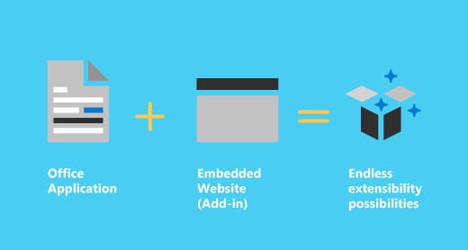

---
title: Office Add-ins platform overview
description:  Use familiar web technologies such as HTML, CSS, and JavaScript to extend and interact with Word, Excel, PowerPoint, OneNote, Project, and Outlook.
ms.date: 12/10/2025
ms.topic: overview
ms.custom: scenarios:getting-started
ms.localizationpriority: high
---

# Office Add-ins platform overview

You can use the Office Add-ins platform to build apps and agents that extend Office applications and interact with content in Office documents. With Office Add-ins, you can use familiar web technologies such as HTML, CSS, and JavaScript to extend and interact with Outlook, Excel, Word, PowerPoint, OneNote, and Project. Your solution can run in Office across multiple platforms, including Windows, Mac, iPad, and in a browser. When you build an add-in, you're also building an app for Microsoft 365, that is, an extensions of Microsoft 365. Apps for Microsoft 365 share a common manifest schema and packaging format, and unified distribution and management processes and tools. This system enables add-ins to be combined with other kinds of apps for Microsoft 365 in a single package that's installable as a unit.

> [!IMPORTANT]
> An add-in can have either of two types of manifests. This article is written on the assumption that the add-in is using the type that recommended for most scenarios: the unified manifest for Microsoft 365. For more information about the two types, see [Office Add-ins manifest](../develop/add-in-manifests.md).

Use the Office Add-ins platform to:

- **Add new functionality to Office clients** - Bring external data into Office, automate Office documents, expose functionality from Microsoft and others in Office clients, and more. For example, use Microsoft Graph API to connect to data that drives productivity.

- **Create custom Copilot agents that that read and write to documents open in Office applications. (preview)** - Enable your users to use natural language to access your add-in's functionality. 

- **Create new rich, interactive objects that can be embedded in Office documents** - Embed maps, charts, and interactive visualizations that users can add to their own Excel spreadsheets and PowerPoint presentations.

## Components of an Office Add-in

An Office Add-in includes two basic components: an app package and your own web application. The package includes a manifest defines various settings, including how your add-in integrates with Office clients. Your web application needs to be hosted on a web server, or web hosting service, such as Microsoft Azure.

### App package

The app package of an app for Microsoft 365 is a zip file that contains a manifest file, two app icons, and possibly additional configuration or localization files. Your app logic and data storage are hosted elsewhere and accessed by the Microsoft 365 host application via HTTPS. You'll submit the app package to your admin to publish to your organization or to Partner Center to publish to Microsoft Marketplace.

For a detailed overview of the app package, see [App package for Microsoft 365](app-package-for-microsoft-365.md)

#### Manifest

The manifest specifies settings and capabilities of the add-in, such as:

- The add-in's display name, description, ID, version, and default locale.

- How the add-in integrates with Office.  

- The permission level and data access requirements for the add-in.

For a detailed overview of the manifest, see [Office Add-ins with the unified app manifest for Microsoft 365](../develop/unified-manifest-overview.md).

### Web app

The most basic Office Add-in consists of a static HTML page that is displayed inside an Office application, but that doesn't interact with either the Office document or any other Internet resource. However, to create an experience that interacts with Office documents or allows the user to interact with online resources from an Office client application, you can use any technologies, both client and server side, that your hosting provider supports (such as ASP.NET, PHP, or Node.js). To interact with Office clients and documents, you use the Office.js JavaScript APIs.

## Extending and interacting with Office clients

Office Add-ins can do the following within an Office client application.

- Extend functionality

- Carry out natural language instructions from Copilot (preview)

- Create new objects (Excel or PowerPoint only)

### Extend Office functionality

You can add new functionality to Office applications via the following:  

- Custom ribbon buttons and menu commands (collectively called "add-in commands").

- Insertable task panes with a webview control that can do almost anything a webpage can do inside a browser. 

- Event handlers that respond to events in the Office document or Office application.

Custom UI, task panes, and event handlers are specified in the add-in manifest.  

#### Custom buttons and menu commands  

You can add custom ribbon buttons and menu items to the ribbon in Office on the web and on Windows. This makes it easy for users to access your add-in directly from their Office application. Custom buttons and menu items can launch different actions such as showing a task pane with custom HTML or executing a JavaScript function.  

#### Task panes  

You can use task panes in addition to add-in commands to enable users to interact with your solution. In Excel, Word, and PowerPoint, users launch task pane add-ins via the **Home** > **Add-ins** button. In Outlook, users launch task pane add-ins via the add-in button or via the **All Apps** button on the ribbon.

### Extend Outlook functionality

Users can run Outlook add-ins when they view, reply, or create emails, meeting requests, meeting responses, meeting cancellations, or appointments. Outlook add-ins can do the following:

- Extend the Office app ribbon.
- Display contextually next to an Outlook item when you're viewing or composing it.
- Perform a task when a specific event occurs, such as when a user creates a new message.

> [!NOTE]
> [!INCLUDE [Calendar add-ins not available in Teams](../includes/calendar-availability.md)]

For an overview of Outlook add-ins, see [Outlook add-ins overview](../outlook/outlook-add-ins-overview.md).

### Carry out Copilot instructions (preview)

You can create custom Copilot agents that enable your users to read and write to Office documents with natural language instructions entered in Copilot chat. For more information, see [Combine Copilot Agents with Office Add-ins (preview)](../design/agent-and-add-in-overview.md). 

### Create new objects in Office documents

You can embed web-based objects, called content add-ins, within Excel and PowerPoint documents. With content add-ins, you can integrate rich, web-based data visualizations, media (such as a YouTube video player or a picture gallery), and other external content.

## Office JavaScript APIs

The Office JavaScript APIs contain objects and members for building add-ins and interacting with Office content and web services. There's a common object model that's shared by Excel, Outlook, Word, PowerPoint, OneNote, and Project. There are also more extensive application-specific object models for Excel, OneNote, PowerPoint, and Word. These APIs provide access to well-known objects such as paragraphs and workbooks, which makes it easier to create an add-in for a specific application.

## Code samples

Learn how to build the simplest Office Add-in with only a manifest, HTML web page, and a logo. The following samples will help you get started in the Office application you're interested in.

- [Excel "Hello world" add-in](https://github.com/OfficeDev/Office-Add-in-samples/tree/main/Samples/hello-world/excel-hello-world)
- [Outlook "Hello world" add-in](https://github.com/OfficeDev/Office-Add-in-samples/tree/main/Samples/hello-world/outlook-hello-world)
- [PowerPoint "Hello world" add-in](https://github.com/OfficeDev/Office-Add-in-samples/tree/main/Samples/hello-world/powerpoint-hello-world)
- [Word "Hello world" add-in](https://github.com/OfficeDev/Office-Add-in-samples/tree/main/Samples/hello-world/word-hello-world)
- [Create data analysis charts in Excel with a Copilot agent](https://github.com/OfficeDev/Office-Add-in-samples/tree/main/Samples/excel-copilot-agent)

## How are Office Add-ins different from COM and VSTO add-ins?

COM and VSTO add-ins are earlier Office integration solutions that run only in Office on Windows. Unlike COM and VSTO add-ins, Office Add-ins are web add-ins: the application (for example, Excel), reads the add-in manifest and connects the add-in's custom ribbon buttons and menu commands in the UI. When needed, it loads the add-in's JavaScript and HTML code, which runs in the context of a browser or webview control in a sandbox.

Office Add-ins provide the following advantages over add-ins built using VBA, COM, or VSTO.

- Cross-platform support: Office Add-ins run in Office on the web, Windows, Mac, and iPad.

- Apps for Microsoft 365 support: Office Add-ins can be packaged with other Microsoft 365 extensions, such as Teams apps and Copilot agents for deployment as a single unit.

- Centralized deployment and distribution: Admins can deploy Office Add-ins centrally across an organization.

- Easy access via Microsoft Marketplace: You can make your solution available to a broad audience by submitting it to Microsoft Marketplace.

- Based on standard web technology: You can use any library you like to build Office Add-ins.

[!INCLUDE [new-outlook-vsto-com-support](../includes/new-outlook-vsto-com-support.md)]

## Next steps

For a more detailed introduction to developing Office Add-ins, see [Develop Office Add-ins](../develop/develop-overview.md).

## See also

- [Core concepts for Office Add-ins](../overview/core-concepts-office-add-ins.md)
- [Develop Office Add-ins](../develop/develop-overview.md)
- [Design Office Add-ins](../design/add-in-design.md)
- [Test and debug Office Add-ins](../testing/test-debug-office-add-ins.md)
- [Publish Office Add-ins](../publish/publish.md)
- [Learn about the Microsoft 365 Developer Program](https://aka.ms/m365devprogram)
