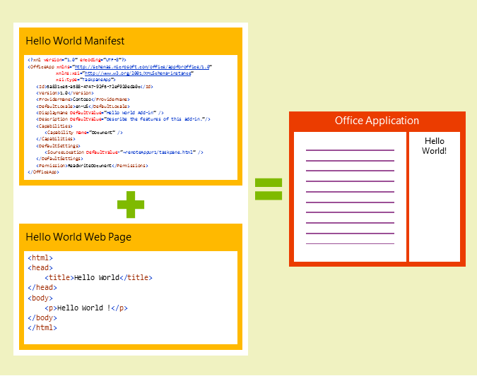
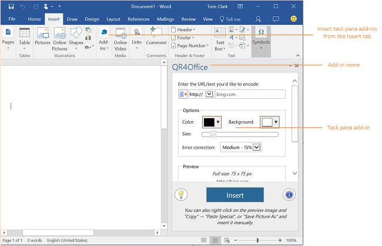
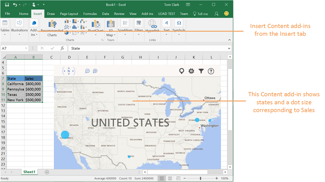

# Office Add-ins platform overview

With Office Add-ins, you can make your solution a native part of any platform that Office supports. Using the power of the web and standard web technologies like HTML5, XML, CSS3, JavaScript, and REST APIs, you can create add-ins that interact with data in Excel, Word, PowerPoint, Outlook, Project, and Access Web Apps for SharePoint.

An Office Add-in is a web application hosted in a web browser control or iframe running in the context of an Office host application that can interact with a user's documents or mail items. You can use Office Add-ins to extend and interact with: 

-  **Documents or data -** Word documents, Excel spreadsheets, PowerPoint presentations, Access browser-based databases, and Project schedules and views.
    
-  **Outlook mailbox items -** Email messages, meeting requests, or appointments.
    
Add-ins can run in multiple environments, including Office desktop applications, Office Online in both desktop and mobile browsers, and a growing number of Office tablet and phone add-ins. When you publish your add-ins to the Office Store or to an on-premises add-in catalog, your add-ins will be available to consumers from their Office applications.
To try out some add-ins, you can install the following add-ins from the Office Store.

|**Office product**|**Add-in**|
|:-----|:-----|
|Excel|[Bing Maps](https://store.office.com/bing-maps-WA102957661.aspx?assetid=WA102957661)|
|Outlook|[Package Tracker](https://store.office.com/package-tracker-WA104162083.aspx?assetid=WA104162083)|
|PowerPoint|[Khan Content from Microsoft](https://store.office.com/khan-content-from-microsoft-WA104320031.aspx?assetid=WA104320031)|
|Word|[Translator](https://store.office.com/translator-WA104124372.aspx?assetid=WA104124372)|

## Anatomy of an Office Add-in

The basic components of an Office Add-in are an XML manifest file and the default webpage of your add-in. The manifest defines various settings including the URL of the webpage that implements the add-in's UI and custom logic. When your add-in is ready for your customers, you upload your add-in's manifest to an on-premises add-in catalog or submit it to the Office Store. The webpage (and any .js or other files required by its implementation) needs to be hosted on a web server, or web hosting service, such as [Microsoft Azure](../publish/host-an-office-add-in-on-microsoft-azure.md).

**Manifest + webpage = an Office Add-in**

The manifest specifies settings and capabilities of the add-in, such as the following:

- The URL of the webpage that implements the add-in's UI and programming logic.
    
- The add-in's display name, description, ID, version, and default locale.
    
- How the add-in activates and displays: 
    
      - For add-ins that interact with documents: as a task pane, or in line with document content.
    
  - For add-ins that interact with mail items (messages or appointments): when reading or composing the item.
    
- The permission level and data access requirements for the add-in.
    
For more information, see [Office Add-ins XML manifest](../../docs/overview/add-in-manifests.md).

### Basic components of an Office Add-in

To create an Office Add-in, at minimum, a developer must create an HTML webpage and a manifest file. The HTML page can be published to any web server, or web hosting service, such as [Microsoft Azure](../publish/host-an-office-add-in-on-microsoft-azure.md). The manifest file must point to the location of the webpage and be published to any of the following locations: the public Office Store, an internal SharePoint list, or a shared network location.

The most basic Office Add-in consists of a static HTML page that is hosted inside an Office application, but doesn't interact with either the Office document or any other Internet resource. 

**Components of a Hello World Office Add-in**

### Creating an Office Add-in with Visual Studio

The most powerful way to build an Office Add-in is to use the  **Add-in for Office** project template in Visual Studio. Visual Studio creates a complete solution that contains all of the files that you need to begin testing your add-in in Office immediately. Visual Studio provides a full range of features to make it easy for you to develop and test Office Add-ins. [Get started with Office Add-ins](https://dev.office.com/getting-started/addins).

### Creating an Office Add-in with a text editor

If want to use your favorite text editor to create an Office Add-in, see these topics for information about how to get started:

    
- [Get Started with Outlook add-ins for Outlook.com (Preview)](https://dev.outlook.com/MailAppsGettingStarted/GetStarted/outlook-dot-com.aspx)
    

### JavaScript API for Office

The JavaScript API for Office contains objects and members for building add-ins and interacting with Office content and web services.

For more information about the JavaScript API for Office, see [Understanding the JavaScript API for Office](../../docs/develop/understanding-the-javascript-api-for-office.md) and the [JavaScript API for Office](../../reference/javascript-api-for-office.md) reference.
    

The Word and Excel JavaScript APIs provide host-specific object models that you can use in an Office add-in. You get access to well known objects such as paragraphs and workbooks which makes creating an Office add-in for Word and Excel easier to do. Learn more about these APIs by taking a look at the [Word add-ins](../word/word-add-ins.md) and [Excel add-ins](https://msdn.microsoft.com/EN-US/library/office/mt616485.aspx) overview topics.

## Types of Office Add-ins

This section provides a quick look at the three types of Office Add-ins: task pane, content, and Outlook. 

### App Commands

### Task pane add-ins

Task pane add-ins work side-by-side with an Office document, and let you supply contextual information and functionality to enhance the document viewing and authoring experience. For example, a task pane add-in can look up and retrieve product information from a web service based on the product name or part number selected in the document.

**Task pane add-in**

To try out a task pane add-in in Excel 2013, Excel Online, or Word 2013, install the [Wikipedia](https://store.office.com/wikipedia-WA104099688.aspx?assetid=WA104099688) add-in.

### Content add-ins

Content add-ins integrate web-based features as content that shown in line with the body of a document. Content add-ins let you integrate rich, web-based data visualizations, embedded media (such as a YouTube video player or a picture gallery), as well as other external content.

**Content add-in**

To try out a content add-in in Excel 2013 or Excel Online, install the [Bing Maps](https://store.office.com/bing-maps-WA102957661.aspx?assetid=WA102957661) add-in.

### Outlook add-ins

Outlook add-ins display next to an Outlook item when you're viewing or composing it. They can work with an email message, meeting request, meeting response, meeting cancellation, or appointment in a read scenario - the user viewing a received item - or in a compose scenario - the user replying or creating a new item. Outlook add-ins can access contextual information from the item, such as address or tracking ID, and then use that data to access additional information on the server and from web services to create compelling user experiences. In most cases, an Outlook add-in runs without modification on the various supporting host applications, including Outlook, Outlook for Mac, Outlook Web App and OWA for Devices, to provide a seamless experience on the desktop, web, and tablet and mobile devices.

 >**Note**  Outlook add-ins require a minimum version of Exchange 2013 or Exchange Online to host the user's mailbox. POP and IMAP email accounts aren't supported.

**Outlook add-in in a read scenario**

To try out an Outlook add-in in Outlook, Outlook for Mac, or Outlook Web App, install the [Package Tracker](https://store.office.com/package-tracker-WA104162083.aspx?assetid=WA104162083) add-in.

## Office applications that support Office Add-ins

Office Add-ins are supported on a growing number of Office host applications running on the desktop, tablets, mobile devices, and in Office Online in the browser. In many cases, this means you can develop a single add-in that runs on different operating systems and Office host applications. And, your customers will have a consistent experience using your add-in across the desktop, their devices, or web browsers.

For task pane add-ins, this means you can develop a single add-in that runs with Excel, PowerPoint, and Word on the Windows desktop, or with Excel Online, PowerPoint Online, Word Online running in a web browser. For Outlook add-ins, this means you can develop a single add-in that runs with Outlook and Outlook for Mac on the desktop, with OWA for Devices on tablet and mobile devices, or with Outlook Web App in a web browser.

This table shows the Office host applications (including desktop, tablet, mobile, and web clients) that can run Office Add-ins, and the types of add-ins supported by each host.

**Supported add-in types**

|**Office application**|**Content add-ins**|**Outlook add-ins**|**Task pane add-ins**|
|:-----|:-----|:-----|:-----|
|Access web apps|Y||Y|
|Excel 2013 or later|Y||Y|
|Excel Online|Y||Y|
|Outlook 2013 or later||Y||
|Outlook for Mac||Y||
|Outlook Web App||Y||
|OWA for Devices||Y||
|PowerPoint 2013 or later|Y||Y|
|PowerPoint Online|Y||Y|
|Project 2013 or later|||Y|
|Word 2013 or later|||Y|
|Word Online|||Y|

For more details, see [Requirements for running Office Add-ins](../../docs/overview/requirements-for-running-office-add-ins.md).

## What can an Office Add-in do?

An Office Add-in can do pretty much anything a webpage can do inside the browser, such as the following:

- Provide an interactive UI and custom logic through JavaScript.
    
- Use JavaScript frameworks such as jQuery.
    
- Connect to REST endpoints and web services via HTTP and AJAX.
    
- Run server-side code or logic, if the page is implemented using a server-side scripting language such as ASP or PHP.
    
And, like webpages, Office Add-ins are subject to the same restrictions imposed by browsers, such as the same-origin policy for domain isolation, and security zones. 

In addition to the regular capabilities of a webpage, Office Add-ins can interact with the Office application and an add-in user's content through a JavaScript library that the Office Add-ins infrastructure provides. How your add-ins can interact with Office and content depends on the type of add-in: 

- For task pane and content add-ins, the API lets your add-in read and write to documents, as well as handle key application and user events, such as when the active selection changes.
    
- For Outlook add-ins, the API lets your add-in access email message, meeting request, and appointment item properties, and user profile information. The API also provides access to some Exchange Web Services operations. For more information about Outlook add-ins, see [Outlook add-ins](../outlook/outlook-add-ins.md). For a summary of top features of Outlook add-ins, see [Overview of Outlook add-ins architecture and features](../outlook/overview.md).
    

## Additional resources

- [Design guidelines for Office Add-ins](../../docs/design/add-in-design.md)
    
- [Publish your Office Add-in](../publish/publish.md)
    
- [Office Add-ins API and schema references](../../reference/reference.md)
    
