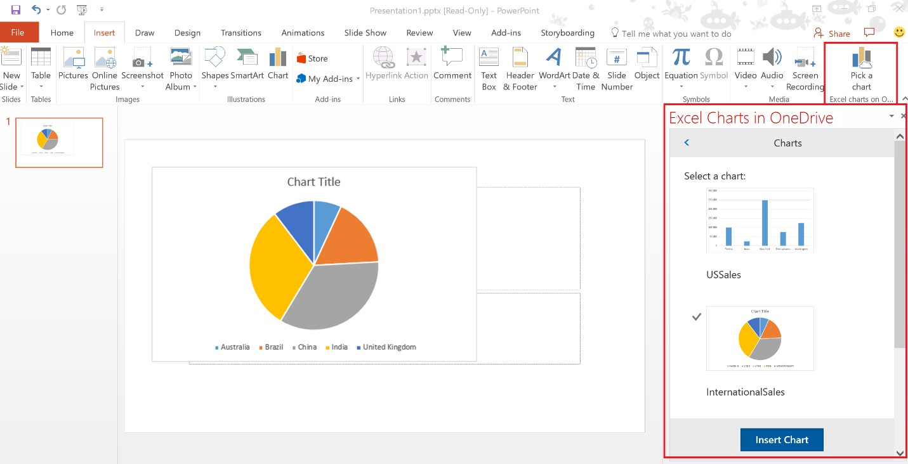

# Office Add-ins platform overview

You can use the Office Add-ins platform to build solutions that extend Office applications and interact with content in Office documents. With Office Add-ins, you can use familiar web technologies such as HTML, CSS, and JavaScript to extend and interact with Word, Excel, PowerPoint, OneNote, Project, and Outlook. Your solution can run in Office across multiple platforms, including Office for Windows, Office Online, Office for the Mac, and Office for the iPad.

Office Add-ins can do almost anything a webpage can do inside a browser. Use the Office Add-ins platform to:

-  **Add new functionality to Office clients** - Bring external data into Office, automate Office documents, expose third-party functionality in Office clients, and more.  For example, use Microsoft Graph API to connect to data that drives productivity. 
    
-  **Create new rich, interactive objects that can be embedded in Office documents** - Embed maps, charts, and interactive visualizations that users can add to their own Excel spreadsheets and PowerPoint presentations. 
    
## How are Office Add-ins different than COM and VSTO add-ins? 

COM or VSTO add-ins are earlier Office integration solutions that run only on Office for Windows. Unlike COM add-ins, Office Add-ins don't involve code that runs on the user's device or in the Office client. For an Office Add-in, the host application, for example Excel, reads the add-in manifest and hooks up the add-in’s custom ribbon buttons and menu commands in the UI, then loads the JavaScript and HTML. This all executes in the context of a browser in a sandbox. 

Office Add-ins provide the following advantages over add-ins built using VBA, COM or VSTO: 

- Cross-platform support. Office Add-ins run in Office for Windows, Mac, iOS, and Office Online. 

- Single sign on (SSO). Office Add-ins integrate easily with users' Office 365 accounts. 

- Centralized deployment and distribution. Admins can deploy Office Add-ins centrally across an organization. 

- Easy access via the Office Store. You can make your solution available to a broad audience by submitting it to the Office Store. 

- Based on standard web technology. You can use any library you like to build Office Add-ins. 

## Components of an Office Add-in 

An Office Add-in includes two basic components: an XML manifest file, and your own web application. The manifest defines various settings, including how your add-in integrates with Office clients. Your web application needs to be hosted on a web server, or web hosting service, such as Microsoft Azure.

​**Manifest + webpage = an Office Add-in**

### Manifest 

The manifest is an XML file that specifies settings and capabilities of the add-in, such as: 

- The add-in's display name, description, ID, version, and default locale. 

- How the add-in integrates with Office.  

- The permission level and data access requirements for the add-in. 

### Web app 

The most basic Office Add-in consists of a static HTML page that is displayed inside an Office application, but doesn't interact with either the Office document or any other Internet resource. However, to create an experience that interacts with Office documents or allows the user to interact with online resources from an Office host application, you can use any technologies, both client and server side, that your hosting provider supports (such as ASP.NET, PHP, or Node.js). To interact with Office clients and documents, you use the Office.js JavaScript APIs. 

**Components of a Hello World Office Add-in**

## Extending and interacting with Office clients 

Office Add-ins can do the following within an Office host application: 

-  Extend functionality (any Office application) 

-  Create new objects (Excel or PowerPoint) 
 
### Extend Office functionality 

You can add new functionality to Office applications via the following:  

-  Custom ribbon buttons and menu commands (collectively called “add-in commands”) 

-  Insertable task panes 

Custom UI and task panes are specified in the add-in manifest.  

#### Custom buttons and menu commands  

You can add custom ribbon buttons and menu items to the ribbon in Office for Windows Desktop and Office Online. This makes it easy for users to access your add-in directly from their Office application. Command buttons can launch different actions such as showing a task pane with custom HTML or executing a JavaScript function.  

We recommend that you [watch this Channel9 video](https://channel9.msdn.com/events/Build/2016/P551) for a deeper overview of this feature. 

**Add-in commands running in Excel Desktop**

#### Task panes  

You can use task panes in addition to add-in commands to enable users to interact with your solution. Clients that do not support add-in commands (Office 2013 and Office for iPad) will run your add-in as a task pane. Users launch task pane add-ins via the **My Add-ins** button on the Insert tab. 

**Task pane**

### Create new objects in Office documents 

You can embed web-based objects within Excel and PowerPoint documents – called content add-ins. With content add-ins, you can integrate rich, web-based data visualizations, media (such as a YouTube video player or a picture gallery), and other external content.

**Content add-in**

## Outlook add-ins that extend functionality 

Outlook add-ins can extend the Office ribbon and also display contextually next to an Outlook item when you're viewing or composing it. They can work with an email message, meeting request, meeting response, meeting cancellation, or appointment when a user is viewing a received item or replying or creating a new item. 

Outlook add-ins can access contextual information from the item, such as address or tracking ID, and then use that data to access additional information on the server and from web services to create compelling user experiences. In most cases, an Outlook add-in runs without modification on the various supporting host applications, including Outlook, Outlook for Mac, Outlook Web App, and Outlook Web App for devices, to provide a seamless experience on the desktop, web, and tablet and mobile devices. 

For an overview of Outlook add-ins, see [Outlook add-ins overview](https://docs.microsoft.com/en-us/outlook/add-ins/). 

**Contextual Outlook add-in**

## Office JavaScript APIs 

The Office JavaScript APIs contain objects and members for building add-ins and interacting with Office content and web services. The Excel, Outlook, Word, PowerPoint, OneNote and Project JavaScript APIs provide host-specific object models that you can use in an Office Add-in. These APIs provide access to well-known objects such as paragraphs and workbooks, which makes it easier to create an add-in for a specific host.  

To learn more about these APIs, see [Understanding the JavaScript API for Office](../../docs/develop/understanding-the-javascript-api-for-office.md) and the [JavaScript API for Office](../../reference/javascript-api-for-office.md) reference.

## Next steps 

To learn more about how to start building your Office Add-in, try out [Get started](https://dev.office.com/getting-started/addins) experience. You can start building add-ins right away using [Visual Studio](../../docs/get-started/create-and-debug-office-add-ins-in-visual-studio.md) or [your own tools](../../docs/get-started/create-an-office-add-in-using-any-editor). 

To start planning solutions that create effective and compelling user experiences, get familiar with the [design guidelines](../../docs/design/add-in-design) and [best practices](../../docs/add-ins/overview/add-in-development-best-practices) for Office Add-ins.    
   
## Additional resources

- [Office Add-in samples](https://dev.office.com/code-samples)
    
- [API Reference](../../docs/develop/understanding-the-javascript-api-for-office.md)

- [Office Add-in host and platform availability](https://dev.office.com/add-in-availability)

    
