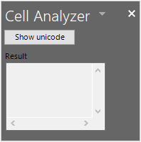

# Tutorial: Share code between both a VSTO Add-in and an Office web add-in with a shared code library

Visual Studio Tools for Office (VSTO) Add-ins are great for extending Office to provide solutions for your business or others. They've been around for a long time and there are thousands of solutions built with VSTO. However, they only run on Office on Windows. You can't run VSTO Add-ins on Mac, online, or mobile platforms.

Office web add-ins use HTML, JavaScript, and additional web technologies to build Office solutions on all platforms. Migrating your existing VSTO Add-in to an Office web add-in is a great way to make your solution available across all platforms.

You may want to maintain both your VSTO Add-in and a new Office web add-in that both have the same functionality. This enables you to continue servicing your customers that use the VSTO Add-in on Office on Windows. This also enables you to provide the same functionality in an Office web add-in for customers across all platforms. You can also [Make your Office web add-in compatible with the existing VSTO Add-in](../develop/make-office-add-in-compatible-with-existing-com-add-in.md).

However it is best to avoid rewriting all the code from your VSTO Add-in for the Office web add-in. This tutorial shows how to avoid rewriting code by using a shared code library for both add-ins.

## Shared code library

This tutorial will walk you through the steps of identifying and sharing common code between your VSTO Add-in and a modern Office web add-in. It uses a very simple VSTO Add-in example for the steps so that you can focus on the skills and techniques you will need for working with your own VSTO Add-ins.

The following diagram shows how the shared code library works for migration. Common code is refactored into a new shared code library. The code can remain written in its original language, such as C# or VB. This means you can continue using the code in the existing VSTO Add-in by creating a project reference. When you create the Office web add-in, it will also use the shared code library by calling into it through REST APIs.


Skills and techniques in this tutorial:

- Create a shared class library by refactoring code into a .NET class library.
- Create a REST API wrapper using ASP.NET Core for the shared class library.
- Call the REST API from the Office web add-in to access shared code.

## Prerequisites

To set up your development environment:

1. Install [Visual Studio 2019](https://visualstudio.microsoft.com/downloads/).
2. Install the following workloads:
    - ASP.NET and web development
    - .NET Core cross-platform development. **Note:** You need at least .NET Core version 2.2 or later to run the completed sample.
    - Office/SharePoint development
    - Visual Studio Tools for Office (VSTO). **Note:** This is an **Individual** component.

You also need the following:

- An Office 365 account. You can join the [Office 365 Developer Program](https://aka.ms/devprogramsignup) that includes a free 1 year subscription to Office 365.
- A Microsoft Azure Tenant. A trial subscription can be acquired here: [Microsoft Azure](https://account.windowsazure.com/SignUp).

## The Cell analyzer VSTO Add-in

This tutorial uses the [VSTO Add-in shared library for Office web add-in](https://github.com/OfficeDev/PnP-OfficeAddins/tree/vstoshared/Samples/VSTO-shared-code-start) PnP solution. The **/start** folder contains the VSTO Add-in solution that you will migrate. Your goal is to migrate the VSTO Add-in to a modern Office web add-in by sharing code when possible.

> [!NOTE]
> The sample uses C# but you can apply the techniques in this tutorial to a VSTO Add-in written in any .NET language.

1. Download the [VSTO Add-in shared library for Office web add-in](https://github.com/OfficeDev/PnP-OfficeAddins/tree/vstoshared/Samples/VSTO-shared-code-start) PnP solution to a working folder on your computer.
2. Start Visual Studio 2019 and open the **/start/Cell-Analyzer.sln** solution.
3. On the **Debug** menu, choose **Start Debugging**.

The add-in is a custom task pane for Excel. You can select any cell with text, and then choose the **Show Unicode** button. The add-in will display a list of each character in the text along with its corresponding Unicode number.



## Analyze types of code in the VSTO Add-in

The first technique to apply is to analyze the add-in for which parts of code can be shared. In general, project will break down into three types of code.

### UI code

UI code interacts with the user. In VSTO UI code works through Windows Forms. Office web add-ins use HTML, CSS, and JavaScript for UI. Because of these differences you cannot share UI code to the Office web add-in. UI will need to be recreated in JavaScript.

### Document code

In VSTO code interacts with the document through .NET objects such as `Microsoft.Office.Interop.Excel.Range`. But Office web add-ins use the Office.js library. Although these are similar, they are not exactly the same. So again, you cannot share document interaction code to the Office web add-in.

### Logic code

Business logic, algorithms, helper functions, and similar code often make up the heart of a VSTO Add-in. This code works independently of the UI and document code to perform analysis, connect to backend services, run calculations, and more. This is the code that can be shared so that you don't have to rewrite it in JavaScript.

Let's examine the VSTO Add-in. In the following code, each section is identified as DOCUMENT, UI, or ALGORITHM code.

```csharp
// *** UI CODE ***
private void btnUnicode_Click(object sender, EventArgs e)
{
    // *** DOCUMENT CODE ***
    Microsoft.Office.Interop.Excel.Range rangeCell;
    rangeCell = Globals.ThisAddIn.Application.ActiveCell;

    string cellValue = "";

    if (null != rangeCell.Value)
    {
        cellValue = rangeCell.Value.ToString();
    }

    // *** ALGORITHM CODE ***
    //convert string to Unicode listing
    string result = "";
    foreach (char c in cellValue)
    {
        int unicode = c;

        result += $"{c}: {unicode}\r\n";
    }
    
    // *** UI CODE ***
    //Output the result
    txtResult.Text = result;
}
```

Using this approach you can see that one section of code can be shared to the Office web add-in. The following code will need to be refactored into a separate class library.

```csharp
// *** ALGORITHM CODE ***
//convert string to Unicode listing
string result = "";
foreach (char c in cellValue)
{
    int unicode = c;

    result += $"{c}: {unicode}\r\n";
}
```

## Create a shared class library

VSTO Add-ins are created in Visual Studio as .NET projects, so we'll reuse .NET as much as possible to keep things simple. Our next technique is to create a class library and refactor shared code into that class library.

1. If you haven't already, start Visual Studio 2019 and open the **\start\Cell-Analyzer.sln** solution.
2. Right-click the solution in **Solution Explorer** and choose **Add > New Project**.
3. In the **Add a new project dialog**, choose **Class Library (.NET Framework)**, and choose **Next**.
    > [!NOTE]
    > Don't use the .NET Core class library because it will not work with your VSTO project.
5. In the **Configure your new project** dialog, set the following fields.
    - Set the  **Project name** to **CellAnalyzerSharedLibrary**.
    - Leave the **Location** at it's default value.
    - Set the **Framework** to **4.7.2**.
6. Choose **Create**.
7. After the project is created, rename the **Class1.cs** file to **CellOperations.cs**. A prompt to rename the class appears. Rename the class name so that it matches the file name.
8. Add the following code to the `CellOperations` class to create a method named `GetUnicodeFromText`.

```csharp
public class CellOperations
{
    static public string GetUnicodeFromText(string value)
    {
        string result = "";
        foreach (char c in value)
        {
            int unicode = c;

            result += $"{c}: {unicode}\r\n";
        }
        return result;
    }
}
```

### Use the shared class library in the VSTO Add-in

Now you need to update the VSTO Add-in to use the class library. This is important that both the VSTO Add-in and Office web add-in use the same shared class library so that future bug fixes or features are made in one location.

1. In **Solution Explorer** expand the **Cell-Analyzer** project, right-click the **CellAnalyzerPane.cs** file, and choose **View Code**.
2. In the `btnUnicode_Click` method, delete the following lines of code.

```csharp
//Convert to Unicode listing
    string result = "";
    foreach (char c in cellValue)
    {
        int unicode = c;
        result += $"{c}: {unicode}\r\n";
    }
```

3. Update the line of code under the `//Output the result` comment to read as follows:

```csharp
//Output the result
txtResult.Text = CellAnalyzerSharedLibrary.CellOperations.GetUnicodeFromText(cellValue);
```

6. On the **Debug** menu, choose **Start Debugging**. The custom task pane should work as expected. Enter some text in a cell, and then test that you can convert it to a Unicode list with the add-in.

## Create a REST API wrapper

The VSTO Add-in can use the shared class library directly since they are both .NET projects. However the Office web add-in won't be able to use .NET since it uses JavaScript. Next you will need to create a REST API wrapper. This enables the Office web add-in to call a REST API, which then passes the call along to the shared class library.

1. If you haven't already, start Visual Studio 2019, and open the **\start\Cell-Analyzer.sln** solution.
2. Right-click the solution in **Solution Explorer** and choose **Add > New Project**.
3. In the **Add a new project dialog**, choose **ASP.NET Core Web Application**, and choose **Next**.
4. In the **Configure your new project** dialog, set the following fields:
    - Set the **Project name** to **CellAnalyzerRESTAPI**.
    - In the **Location** field, leave the default value.
5. Choose **Create**.
6. After the project is created, expand the **CellAnalyzerRESTAPI** project in **Solution Explorer**.
7. Right-click **Dependencies**, and choose **Add Reference**.
8. Select **CellAnalyzerSharedLibrary**, and choose **OK**.
9. Right-click the **Controllers** folder, and choose **Add > Controller**.
10. In the **Add New Scaffolded Item** dialog, choose **API Controller - Empty** and then **Add**.
11. In the **Add Empty API Controller** dialog, name the controller **AnalyzeUnicodeController**, and then choose **Add**.
12. Open the **AnalyzeUnicodeController.cs** file and add the following code as a method to the `AnalyzeUnicodeController` class.

```csharp
[HttpGet]
public ActionResult<string> AnalyzeUnicode(string value)
{
    if (value == null)
    {
        return BadRequest();
    }
    return CellAnalyzerSharedLibrary.CellOperations.GetUnicodeFromText(value);
}
```

11. Right-click the **CellAnalyzerRESTAPI** project, and choose **Set as Startup Project**.
12. On the **Debug** menu, choose **Start Debugging**.
13. A browser will launch. Enter the following URL to test that the REST API is working: **https://localhost:44323/api/analyzeunicode?value=test**. You should see a string returned with Unicode values for each character.

## Create the Office web add-in

When you create the Office web add-in, it will make a call to the REST API. But first, you need to get the port number of the REST API server and save it for later.

### Save the SSL port number

1. If you haven't already, start Visual Studio 2019, and open the **\start\Cell-Analyzer.sln** solution.
2. In the **CellAnalyzerRESTAPI** project, expand **Properties**, and open the **launchSettings.json** file.
3. Find the line of code with the **sslPort** value, copy the port number, and save it somewhere.

### Add the Office web add-in project

To keep things simple, keep all the code in one solution. Add the Office web add-in project to the existing Visual Studio solution. However, if you are familiar with the [Yeoman generator for Office Add-ins](https://github.com/OfficeDev/generator-office) and Visual Studio Code you can also run `yo office` to build the project. The steps are very similar.

1. If you haven't already, start Visual Studio 2019, and open the **\start\Cell-Analyzer.sln** solution.
2. Right-click the solution in **Solution Explorer** and choose **Add > New Project**.
3. In the **Add a new project dialog**, choose **Excel Web Add-in**, and choose **Next**.
5. In the **Configure your new project** dialog, set the following fields:
    - Set the **Project name** to **CellAnalyzerWebAddin**.
    - Leave the **Location** at it's default value.
    - Set the **Framework** to **4.7.2** or later.
2. Choose **Create**.
3. In the **Choose the add-in type** dialog, select **Add new functionalities to Excel**, and choose **Finish**.

### Add UI and functionality to the Office web add-in

1. Open the **Home.html** file, and replace the `<body>` contents with the following HTML.

```html
<button id="btnShowUnicode" onclick="showUnicode()">Show Unicode</button>
<p>Result:</p>
<div id="txtResult"></div>
```

2. Open the **Home.js** file, and replace the entire contents with the following code. Substitute the **sslPort** number you saved previously from the **launchSettings.json** file.

```js
(function () {
    "use strict";
    // The initialize function must be run each time a new page is loaded.
    Office.initialize = function (reason) {
        $(document).ready(function () {
        });
    };
})();

function showUnicode() {
    Excel.run(function (ctx) {
        const range = ctx.workbook.getSelectedRange();
        range.load("values");
        return ctx.sync(range).then(function (range) {
            const url = "https://localhost:<ssl port number>/api/analyzeunicode?value=" + range.values[0][0];
            $.ajax({
                type: "GET",
                url: url,
                success: function (data) {
                    let htmlData = data.replace(/\r\n/g, '<br>');
                    $("#txtResult").html(htmlData);
                }
            });
        });
    });
}
```

It's worth noting that in the previous code the returned string will be processed to replace carriage return line feeds with `<br>` HTML tags. You may occasionally run into situations where a return value that works perfectly fine for .NET in the VSTO Add-in will need to be adjusted on the Office web add-in side to work as expected. In this case the REST API and shared class library are only concerned with returning the string. The `showUnicode()` method is responsible for formatting return values correctly for presentation.

### Allow CORS from the Office web add-in

The Office.js library requires CORS on outgoing calls, such as the one made from the `ajax` call to the REST API server. Use the following steps to allow calls from the Office web add-in to the REST API.

1. In **Solution Explorer**, select the **CellAnalyzerWebAddinWeb** project.
2. From the **View** menu, choose **Properties Window** (if the window is not already displayed).
3. In the properties window, copy the value of the **SSL URL**, and save it somewhere. This is the URL that you need to allow through CORS.
4. In the **CellAnalyzerRESTAPI** project, open the **Startup.cs** file.
5. Add the following code to the top of the `ConfigureServices` method. Be sure to substitute the URL SSL you copied previously for the `builder.WithOrigins` call.

```csharp
services.AddCors(options =>
    {
        options.AddPolicy(MyAllowSpecificOrigins,
        builder =>
        {
            builder.WithOrigins("<your URL SSL>")
            .AllowAnyMethod()
            .AllowAnyHeader()
            .AllowCredentials();
        });
    });
```

6. Add the following field to the `Startup` class:

```csharp
readonly string MyAllowSpecificOrigins = "_myAllowSpecificOrigins";
```

7. Add the following code to the `configure` method.

```csharp
app.UseCors(MyAllowSpecificOrigins);
```

When done, your `Startup` class should look similar to the following code:

```csharp
 public class Startup
{
    public Startup(IConfiguration configuration)
    {
        Configuration = configuration;
    }
    readonly string MyAllowSpecificOrigins = "_myAllowSpecificOrigins";
    public IConfiguration Configuration { get; }

    // This method gets called by the runtime. Use this method to add services to the container.
    public void ConfigureServices(IServiceCollection services)
    {
        services.AddCors(options =>
        {
            options.AddPolicy(MyAllowSpecificOrigins,
            builder =>
            {
                builder.WithOrigins("https://localhost:44397")
                .AllowAnyMethod()
                .AllowAnyHeader()
                .AllowCredentials();
            });
        });
        services.AddMvc().SetCompatibilityVersion(CompatibilityVersion.Version_2_2);
    }

    // This method gets called by the runtime. Use this method to configure the HTTP request pipeline.
    public void Configure(IApplicationBuilder app, IHostingEnvironment env)
    {
        if (env.IsDevelopment())
        {
            app.UseDeveloperExceptionPage();
        }
        else
        {
            // The default HSTS value is 30 days. You may want to change this for production scenarios, see https://aka.ms/aspnetcore-hsts.
            app.UseHsts();
        }

        app.UseCors(MyAllowSpecificOrigins);
        app.UseHttpsRedirection();
        app.UseMvc();
    }
}
```

### Run the add-in

1. In **Solution Explorer**, right-click the top node **Solution 'Cell-Analyzer'**, and choose **Set Startup Projects**.
2. In the **Solution 'Cell-Analyzer' Property Pages** dialog, select **Multiple startup projects**.
3. Set the **Action** property to **Start** for each of the following projects.
    - CellAnalyzerRESTAPI
    - CellAnalyzerWebAddinWeb
    - CellAnalyzerWebAddin
1. Choose **OK**.
2. From the **Debug** menu, choose **Start Debugging**.

Excel will run and sideload the Office web add-in. You can test that the localhost REST API service is working correctly by entering a text value into a cell, and choosing the **Show Unicode** button in the Office web add-in. It should call the REST API and display the unicode values for the text characters.


## Publish to an Azure App Service

You eventually want to publish the REST API project to the cloud. In the following steps you'll see how to publish the **CellAnalyzerRESTAPI** project to a Microsoft Azure App Service. See [Prerequisites](#prerequisites) for information on how to get an Azure account.

1. In **Solution Explorer**, right-click the **CellAnalyzerRESTAPI** project, and choose **Publish**.
2. In the **Pick a publish target** dialog, select **Create New**, and choose **Create Profile**.
3. In the **App Service** dialog, select the correct account, if it is not already selected.
4. The fields for the **App Service** dialog will be set to defaults for your account. Generally the defaults work fine, but you can change them if you prefer different settings.
5. In the **App Service** dialog, choose **Create**.
6. The new profile will be displayed in a **Publish** page. Choose **Publish** to build and deploy the code to the App Service.

You can now test the service. Open a browser and enter a URL that goes directly to the new service. For example, use `https://<myappservice>.azurewebsites.net/api/analyzeunicode?value=test` where *myappservice* is the unique name you created for the new App Service.

### Use the Azure App Service from the Office web add-in

The final step is to update the code in the Office web add-in to use the Azure App Service instead of localhost.

1. In **Solution Explorer**, expand the **CellAnalyzerWebAddinWeb** project, and open the **Home.js** file.
2. Change the `url` constant to use the URL for your Azure App Service as shown in the following line of code. Replace `<myappservice>` with the unique name you created for the new App Service.
    ```JavaScript
    const url = "https://<myappservice>.azurewebsites.net/api/analyzeunicode?value=" + range.values[0][0];
    ```
3. In **Solution Explorer**, right-click the top node **Solution 'Cell-Analyzer'**, and choose **Set Startup Projects**.
4. In the **Solution 'Cell-Analyzer' Property Pages** dialog, select **Multiple startup projects**.
5. Enable the **Start** action for each of the following projects:
    - CellAnalyzerWebAddinWeb
    - CellAnalyzerWebAddin
6. Choose **OK**.
7. From the **Debug** menu, choose **Start Debugging**.

Excel will run and sideload the Office web add-in. To test that the App Service is working correctly, enter a text value into a cell, and choose **Show Unicode** in the Office web add-in. It should call the service and display the unicode values for the text characters.

## Conclusion

In this tutorial you learned how to create an Office web add-in that uses shared code with the original VSTO add-in. You learned how to maintain both VSTO code for Office on Windows, and an Office web add-in for Office on other platforms. You refactored VSTO C# code into a shared library and deployed it to an Azure App Service. You created an Office web add-in that uses the shared library so that you don't have to rewrite the code in JavaScript.
