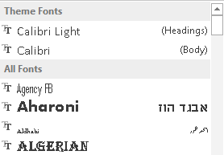
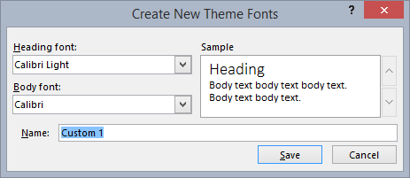
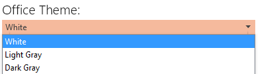
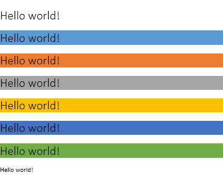
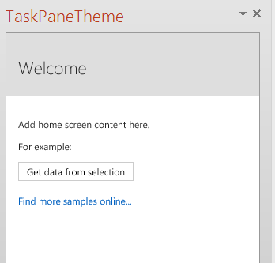
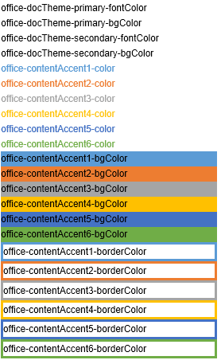

# Use document themes in your PowerPoint add-ins


An [Office theme](https://support.office.com/en-US/Article/What-is-a-theme--7528ccc2-4327-4692-8bf5-9b5a3f2a5ef5) consists, in part, of a visually coordinated set of fonts and colors that you can apply to presentations, documents, worksheets, and emails. To apply or customize the theme of a presentation in PowerPoint, you use the **Themes** and **Variants** groups on **Design** tab of the ribbon. PowerPoint assigns a new blank presentation with the default **Office Theme**, but you can choose other themes available on the  **Design** tab, download additional themes from Office.com, or create and customize your own theme.

Using OfficeThemes.css, helps you design add-ins that are coordinated with PowerPoint in two ways:


-  **In content add-ins for PowerPoint** Use the document theme classes of OfficeThemes.css to specify fonts and colors that match the theme of the presentation your content add-in is inserted into - and those fonts and colors will dynamically update if a user changes or customizes the presentation's theme.
    
-  **In task pane add-ins for PowerPoint** Use the Office UI theme classes of OfficeThemes.css to specify the same fonts and background colors used in the UI so that your task pane add-ins will match the colors of built-in task panes - and those colors will dynamically update if a user changes the Office UI theme.
    

### Document theme colors

Every Office document theme defines 12 colors. Ten of these colors are available when you set font, background, and other color settings in a presentation with the color picker:


To view or customize the full set of 12 theme colors in PowerPoint, in the  **Variants** group on the **Design** tab, click the **More** drop-down - then point to **Color**, and click  **Customize Colors** to display the **Create New Theme Colors** dialog box:


The first four colors are for text and backgrounds. Text that is created with the light colors will always be legible over the dark colors, and text that is created with dark colors will always be legible over the light colors. The next six are accent colors that are always visible over the four potential background colors. The last two colors are for hyperlinks and followed hyperlinks.


### Document theme fonts

Every Office document theme also defines two fonts -- one for headings and one for body text. PowerPoint uses these fonts to construct automatic text styles. In addition,  **Quick Styles** galleries for text and **WordArt** use these same theme fonts. These two fonts are available as the first two selections when you select fonts with the font picker:




To view or customize theme fonts in PowerPoint, in the  **Variants** group on the **Design** tab, click the **More** drop-down - then point to **Fonts**, and click  **Customize Fonts** to display the **Create New Theme Fonts** dialog box.





### Office UI theme fonts and colors

Office also lets you choose between several predefined themes that specify some of the colors and fonts used in the UI of all Office applications. To do that, you use the  **File** > **Account** > **Office Theme** drop-down (from any Office application).




OfficeThemes.css includes classes that you can use in your task pane add-ins for PowerPoint so they will use these same fonts and colors. This lets you design your task pane add-ins that match the appearance of built-in task panes.


## Using OfficeThemes.css

Using the OfficeThemes.css file with your content add-ins for PowerPoint lets you coordinate the appearance of your add-in with the theme applied to the presentation it's running with. Using the OfficeThemes.css file with your task pane add-ins for PowerPoint lets you coordinate the appearance of your add-in with the fonts and colors of the Office UI.


### Adding the OfficeThemes.css file to your project

Use the following steps to add and reference the OfficeThemes.css file to your add-in project.


### To add OfficeThemes.css to your Visual Studio project


1. In the  **Solution Explorer**, right-click the  **Content** folder in the _**project_name**_**Web** project, point to **Add**, and then click  **Style Sheet**.
    
2. Name the new style sheet OfficeThemes.
    
     >**Important**  The style sheet must be named OfficeThemes or the feature that dynamically updates add-in fonts and colors when a user changes the theme won't work.
3. Delete the default  **body** class ( `body {}`) in the file, and copy and paste the following CSS code into the file.
    
```
  /* The following classes describe the common theme information for office documents */ /* Basic Font and Background Colors for text */ .office-docTheme-primary-fontColor { color:#000000; } .office-docTheme-primary-bgColor { background-color:#ffffff; } .office-docTheme-secondary-fontColor { color: #000000; } .office-docTheme-secondary-bgColor { background-color: #ffffff; } /* Accent color definitions for fonts */ .office-contentAccent1-color { color:#5b9bd5; } .office-contentAccent2-color { color:#ed7d31; } .office-contentAccent3-color { color:#a5a5a5; } .office-contentAccent4-color { color:#ffc000; } .office-contentAccent5-color { color:#4472c4; } .office-contentAccent6-color { color:#70ad47; } /* Accent color for backgrounds */ .office-contentAccent1-bgColor { background-color:#5b9bd5; } .office-contentAccent2-bgColor { background-color:#ed7d31; } .office-contentAccent3-bgColor { background-color:#a5a5a5; } .office-contentAccent4-bgColor { background-color:#ffc000; } .office-contentAccent5-bgColor { background-color:#4472c4; } .office-contentAccent6-bgColor { background-color:#70ad47; } /* Accent color for borders */ .office-contentAccent1-borderColor { border-color:#5b9bd5; } .office-contentAccent2-borderColor { border-color:#ed7d31; } .office-contentAccent3-borderColor { border-color:#a5a5a5; } .office-contentAccent4-borderColor { border-color:#ffc000; } .office-contentAccent5-borderColor { border-color:#4472c4; } .office-contentAccent6-borderColor { border-color:#70ad47; } /* links */ .office-a { color: #0563c1; } .office-a:visited { color: #954f72; } /* Body Fonts */ .office-bodyFont-eastAsian { } /* East Asian name of the Font */ .office-bodyFont-latin { font-family:"Calibri"; } /* Latin name of the Font */ .office-bodyFont-script { } /* Script name of the Font */ .office-bodyFont-localized { font-family:"Calibri"; } /* Localized name of the Font. Corresponds to the default font of the culture currently used in Office.*/ /* Headers Font */ .office-headerFont-eastAsian { } .office-headerFont-latin { font-family:"Calibri Light"; } .office-headerFont-script { } .office-headerFont-localized { font-family:"Calibri Light"; } /* The following classes define font and background colors for Office UI themes. These classes should only be used in task pane add-ins */ /* Basic Font and Background Colors for PPT */ .office-officeTheme-primary-fontColor { color:#b83b1d; } .office-officeTheme-primary-bgColor { background-color:#dedede; } .office-officeTheme-secondary-fontColor { color:#262626; } .office-officeTheme-secondary-bgColor { background-color:#ffffff; } 
```

4. If you are using a tool other than Visual Studio to create your add-in, copy the CSS code from step 3 into a text file, making sure to save the file as OfficeThemes.css.
    

### Referencing OfficeThemes.css in your add-in's HTML pages

To use the OfficeThemes.css file in your add-in project, add a  `<link>` tag that references the OfficeThemes.css file inside the `<head>` tag of the web pages (such as an .html, .aspx, or .php file) that implement the UI of your add-in in this format:


```HTML
<link href="<local_path_to_OfficeThemes.css> " rel="stylesheet" type="text/css" />
```

To do this in Visual Studio, follow these steps.


### To reference OfficeThemes.css in your add-in for PowerPoint


1. In Visual Studio 2015, open or create a new  **Office Add-in** project.
    
2. In the HTML pages that implement the UI of your add-in, such as Home.html in the default template, add the following  `<link>` tag inside the `<head>` tag that references the OfficeThemes.css file:
    
```HTML
  <link href="../../Content/OfficeThemes.css" rel="stylesheet" type="text/css" />
```

If you are creating your add-in with a tool other than Visual Studio, add a  `<link>` tag with the same format specifying a relative path to the copy of OfficeThemes.css that will be deployed with your add-in.


### Using OfficeThemes.css document theme classes in your content add-in's HTML page

The following shows a simple example of HTML in a content add-in that uses the OfficeTheme.css document theme classes. For details about the OfficeThemes.css classes that correspond to the 12 colors and 2 fonts used in a document theme, see [Theme classes for content add-ins](#officeCSS_Classes_Content).


```HTML
<body> <div id="themeSample" class="office-docTheme-primary-fontColor "> <h1 class="office-headerFont-latin">Hello world!</h1> <h1 class="office-headerFont-latin office-contentAccent1-bgColor">Hello world!</h1> <h1 class="office-headerFont-latin office-contentAccent2-bgColor">Hello world!</h1> <h1 class="office-headerFont-latin office-contentAccent3-bgColor">Hello world!</h1> <h1 class="office-headerFont-latin office-contentAccent4-bgColor">Hello world!</h1> <h1 class="office-headerFont-latin office-contentAccent5-bgColor">Hello world!</h1> <h1 class="office-headerFont-latin office-contentAccent6-bgColor">Hello world!</h1> <p class="office-bodyFont-latin office-docTheme-secondary-fontColor">Hello world!</p> </div> </body>
```

At runtime, when inserted into a presentation that uses the default  **Office Theme**, the content add-in is rendered like this:




If you change the presentation to use another theme or customize the presentation's theme, the fonts and colors specified with OfficeThemes.css classes will dynamically update to correspond to the fonts and colors of the presentation's theme. Using the same HTML example as above, if the presentation the add-in is inserted into uses the  **Facet** theme, the add-in rendering will look like this:


### Using OfficeThemes.css Office UI theme classes in your task pane add-in's HTML page

In addition to the document theme, users can customize the color scheme of the Office user interface for all Office applications using the  **File** > **Account** > **Office Theme** drop-down box.

The following shows a simple example of HTML in a task pane add-in that uses OfficeTheme.css classes to specify font color and background color. For details about the OfficeThemes.css classes that correspond to fonts and colors of the Office UI theme, see [Theme classes for task pane add-ins](#officeCSS_Classes_TaskPane).


```HTML
<body> <div id="content-header" class="office-officeTheme-primary-fontColor office-officeTheme-primary-bgColor"> <div class="padding"> <h1>Welcome</h1> </div> </div> <div id="content-main" class="office-officeTheme-secondary-fontColor office-officeTheme-secondary-bgColor"> <div class="padding"> <p>Add home screen content here.</p> <p>For example:</p> <button id="get-data-from-selection">Get data from selection</button> <p> <a target="_blank" class="office-a" href="https://go.microsoft.com/fwlink/?LinkId=276812"> Find more samples online... </a> </p> </div> </div> </body> 
```

When running in PowerPoint with  **File** > **Account** > **Office Theme** set to **White**, the task pane add-in is rendered like this:


If you change  **OfficeTheme** to **Dark Gray**, the fonts and colors specified with OfficeThemes.css classes will dynamically update to render like this:





## OfficeTheme.css classes


The OfficeThemes.css file contains two sets of classes you can use with your content and task pane add-ins for PowerPoint.


### Theme classes for content add-ins


The OfficeThemes.css file provides classes that correspond to the 2 fonts and 12 colors used in a document theme. These classes are appropriate to use with content add-ins for PowerPoint so that your add-in's fonts and colors will be coordinated with the presentation it's inserted into.


**Theme fonts for content add-ins**


|**Class**|**Description**|
|:-----|:-----|
| `office-bodyFont-eastAsian`|East Asian name of the body font.|
| `office-bodyFont-latin`|Latin name of the body font. Default "Calabri"|
| `office-bodyFont-script`|Script name of the body font.|
| `office-bodyFont-localized`|Localized name of the body font. Specifies the default font name according to the culture currently used in Office.|
| `office-headerFont-eastAsian`|East Asian name of the headers font.|
| `office-headerFont-latin`|Latin name of the headers font. Default "Calabri Light"|
| `office-headerFont-script`|Script name of the headers font.|
| `office-headerFont-localized`|Localized name of the headers font. Specifies the default font name according to the culture currently used in Office.|

**Theme colors for content add-ins**


|**Class**|**Description**|
|:-----|:-----|
| `office-docTheme-primary-fontColor`|Primary font color. Default #000000|
| `office-docTheme-primary-bgColor`|Primary font background color. Default #FFFFFF|
| `office-docTheme-secondary-fontColor`|Secondary font color. Default #000000|
| `office-docTheme-secondary-bgColor`|Secondary font background color. Default #FFFFFF|
| `office-contentAccent1-color`|Font accent color 1. Default #5B9BD5|
| `office-contentAccent2-color`|Font accent color 2. Default #ED7D31|
| `office-contentAccent3-color`|Font accent color 3. Default #A5A5A5|
| `office-contentAccent4-color`|Font accent color 4. Default #FFC000|
| `office-contentAccent5-color`|Font accent color 5. Default #4472C4|
| `office-contentAccent6-color`|Font accent color 6. Default #70AD47|
| `office-contentAccent1-bgColor`|Background accent color 1. Default #5B9BD5|
| `office-contentAccent2-bgColor`|Background accent color 2. Default #ED7D31|
| `office-contentAccent3-bgColor`|Background accent color 3. Default #A5A5A5|
| `office-contentAccent4-bgColor`|Background accent color 4. Default #FFC000|
| `office-contentAccent5-bgColor`|Background accent color 5. Default #4472C4|
| `office-contentAccent6-bgColor`|Background accent color 6. Default #70AD47|
| `office-contentAccent1-borderColor`|Border accent color 1. Default #5B9BD5|
| `office-contentAccent2-borderColor`|Border accent color 2. Default #ED7D31|
| `office-contentAccent3-borderColor`|Border accent color 3. Default #A5A5A5|
| `office-contentAccent4-borderColor`|Border accent color 4. Default #FFC000|
| `office-contentAccent5-borderColor`|Border accent color 5. Default #4472C4|
| `office-contentAccent6-borderColor`|Border accent color 6. Default #70AD47|
| `office-a`|Hyperlink color. Default #0563C1|
| `office-a:visited`|Followed hyperlink color. Default #954F72|
The following screenshot shows examples of all of the theme color classes (except for the two hyperlink colors) assigned to add-in text when using the default Office theme.





### Theme classes for task pane add-ins


The OfficeThemes.css file provides classes that correspond to the 4 colors assigned to fonts and backgrounds used by the Office application UI theme. These classes are appropriate to use with task add-ins for PowerPoint so that your add-in's colors will be coordinated with the other built-in task panes in Office.


**Theme font and background colors for task pane add-ins**


|**Class**|**Description**|
|:-----|:-----|
| `office-officeTheme-primary-fontColor`|Primary font color. Default: #B83B1D|
| `office-officeTheme-primary-bgColor`|Primary background color. Default #DEDEDE|
| `office-officeTheme-secondary-fontColor`|Secondary font color. Default #262626|
| `office-officeTheme-secondary-bgColor`|Secondary background color. Default #FFFFFF|

## Additional resources

- [Create content and task pane add-ins for PowerPoint](../powerpoint/powerpoint-add-ins.md)
